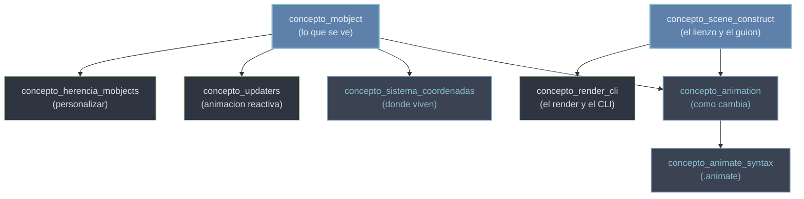

# conceptos transversales — el modelo mental de Manim

Esta carpeta es el **modelo mental** de Manim: lo que tienes que entender *antes* de tocar las clases concretas (`Circle`, `Transform`, `Axes`...). Manim no es una colección de funciones sueltas, sino una librería gobernada por una **tríada de roles** —`Scene`, `Mobject`, `Animation`— que se mueven sobre un espacio de coordenadas propio. Si interiorizas que la `Scene` es el lienzo y el guion, que un `Mobject` es *lo que se ve*, que una `Animation` es *cómo cambia en el tiempo*, y dónde viven todos ellos, el resto de la librería deja de ser un catálogo que memorizar y pasa a ser un conjunto de piezas que encajan. Estas notas son transversales porque aplican a *cualquier* escena que escribas, sea de geometría, de texto o de gráficos.

## En accion

Una escena mínima que toca los conceptos centrales a la vez: un `Mobject`, una `Animation` con `self.play`, la sintaxis `.animate` para animar un cambio, y una constante de dirección del sistema de coordenadas.

```python
from manim import *

class ModeloMental(Scene):
    def construct(self):
        c = Circle(color=BLUE)            # un Mobject (que se ve)
        self.play(Create(c))              # una Animation con self.play (como cambia)
        self.play(c.animate.shift(RIGHT*2))  # .animate: anima un cambio; RIGHT = direccion
        self.wait()                       # pausa en el ultimo fotograma
```

```bash
manim -pql archivo.py ModeloMental   # -p reproduce, -ql = calidad baja (rapido)
```

## El grafo de conceptos

Las notas de esta carpeta no son independientes: unas son base y otras se construyen encima. Este grafo muestra el orden de dependencias —qué entender antes de qué—; `concepto_render_cli` queda aparte porque no es parte del modelo de objetos, sino el flujo de salida que convierte todo en un vídeo:



## Los conceptos

Las ocho notas de esta carpeta, con la idea que captura cada una:

| # | Concepto | Idea |
|---|----------|------|
| 1 | [[concepto_scene_construct]] | subclaseas `Scene` y escribes el guion en `construct()`: orden de líneas = orden temporal |
| 2 | [[concepto_mobject]] | el objeto dibujable base; todo lo que se ve hereda de `Mobject`/`VMobject` |
| 3 | [[concepto_animation]] | `self.play(...)` reproduce una transformación en el tiempo (`run_time`, `rate_func`) |
| 4 | [[concepto_animate_syntax]] | la sintaxis `.animate` anima un cambio de estado dentro de `play` |
| 5 | [[concepto_sistema_coordenadas]] | el espacio y las constantes de dirección (`ORIGIN`, `UP`, `RIGHT`...) |
| 6 | [[concepto_updaters]] | animación continua y reactiva: funciones que se ejecutan cada fotograma |
| 7 | [[concepto_herencia_mobjects]] | personalizar subclaseando `VMobject` (geometría propia en `__init__`) |
| 8 | [[concepto_render_cli]] | el comando `manim ...` convierte el `construct` en un `.mp4` |

### Orden de lectura sugerido

Lee de los cimientos hacia arriba: primero **scene_construct** y **mobject** (la base), luego **animation** y su atajo **animate_syntax**, después **sistema_coordenadas** para colocar objetos con soltura. Los dos avanzados —**updaters** y **herencia_mobjects**— se entienden mejor cuando ya tienes escenas funcionando. Y **render_cli** puedes leerlo en cualquier momento: lo necesitas en cuanto quieras *ver* tu primera escena.

## Una escena que usa todo

Una escena algo más larga, comentada línea a línea, donde cada paso ilustra un concepto de la carpeta. Léela como un repaso: si entiendes por qué cada comentario es lo que es, tienes el modelo mental completo. A la derecha de cada línea va el concepto que ejemplifica.

```python
from manim import *

class UsaTodo(Scene):                     # [scene_construct] subclaseas Scene...
    def construct(self):                  # [scene_construct] ...y escribes el guion en construct(self)
        titulo = Text("Modelo mental").to_edge(UP)   # [mobject] un Mobject de texto; [coordenadas] UP lo lleva al borde
        c = Circle(color=BLUE).shift(LEFT * 2)       # [mobject] otro Mobject; [coordenadas] LEFT = direccion

        self.play(Write(titulo))          # [animation] self.play reproduce una Animation en el tiempo
        self.play(Create(c))              # [animation] Create dibuja el circulo animadamente

        # [animate] .animate convierte un cambio en animacion; sin el, el cambio seria instantaneo
        self.play(c.animate.shift(RIGHT * 4).set_color(YELLOW))  # [coordenadas] RIGHT mueve a la derecha

        cuadro = Square(color=GREEN)      # [mobject] un tercer Mobject
        self.play(Transform(c, cuadro))   # [animation] Transform interpola un Mobject hacia otro

        self.wait()                       # [scene_construct] wait pausa en el ultimo fotograma
```

```bash
manim -pql archivo.py UsaTodo   # -p reproduce, -ql = calidad baja (rapido)
```

Lo que esta escena resume: **subclaseas `Scene` y el orden de las líneas es el orden del vídeo** (`concepto_scene_construct`); **`Circle`, `Text` y `Square` son Mobjects**, lo que se ve (`concepto_mobject`); **`Write`, `Create` y `Transform` son Animations** que `self.play` reproduce (`concepto_animation`); **`.animate` anima un cambio de estado** que de otro modo sería instantáneo (`concepto_animate_syntax`); y **`UP`, `LEFT`, `RIGHT` son las constantes de dirección** del espacio donde todo se coloca (`concepto_sistema_coordenadas`). Cinco conceptos en una sola escena ejecutable.

## Notas relacionadas

- [[Manim/index|Manim]] — el índice raíz de la librería y la tríada Scene/Mobject/Animation.
- [[concepto_scene_construct]] — el punto de entrada del modelo mental.
- [[concepto_render_cli]] — cómo sacar el vídeo de todo lo anterior.
