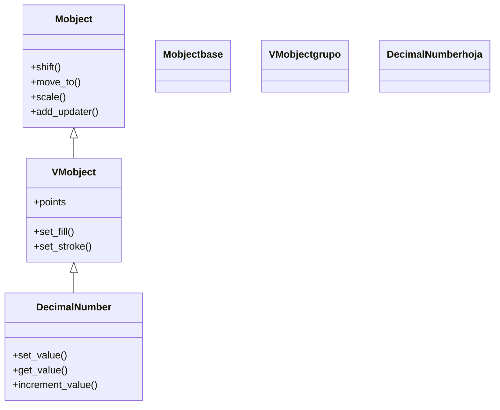

# DecimalNumber — un número renderizado que cambia de valor en vivo

`DecimalNumber` es el Mobject que **dibuja un número en pantalla** y, a diferencia de un [[Text]] cualquiera, está pensado para que ese número **cambie de valor** durante la animación: un contador que sube, una medida que se actualiza en vivo, la coordenada de un punto que se mueve. Por dentro es un [[VMobject]] compuesto por los glifos de cada dígito; su gracia es el método `set_value`, que **re-renderiza los dígitos** para mostrar un número nuevo sin que tengas que reconstruir el objeto a mano. Es la pieza *visible* del cuarteto reactivo de [[concepto_updaters]]: mientras [[ValueTracker]] **lleva** el valor animable (invisible) y [[add_updater]] lo propaga, `DecimalNumber` es lo que el espectador **ve**. El patrón canónico —y la razón de existir de esta clase— es engancharlo a un `ValueTracker` con un updater para que copie su valor cada fotograma.

## Importacion

```python
from manim import DecimalNumber
# o, como es habitual en Manim:
from manim import *
```

## Herencia

### La jerarquia

`DecimalNumber` es un [[VMobject]]: como cualquier figura vectorizada hereda color, posición y trazo, pero su geometría son los **glifos de los dígitos** que componen el número. La cadena es `Mobject` -> `VMobject` -> `DecimalNumber`. (Internamente es un `VMobject` que agrupa los caracteres del número como submobjects; lo relevante para el usuario es que se posiciona y colorea como cualquier VMobject.)



### Que hereda

De [[Mobject]] saca la posición y la escala; de [[VMobject]] el color, el relleno y el trazo. Lo **propio** de `DecimalNumber` es saber renderizar un número con un formato dado y volver a hacerlo cuando el valor cambia.

| Capacidad | Método típico | Definido en |
|-----------|---------------|-------------|
| Posición y escala | `move_to`, `to_corner`, `scale` | [[Mobject]] |
| Llevar un updater (seguir a un tracker) | `add_updater` | [[Mobject]] |
| Color y trazo de los dígitos | `set_color`, `set_fill` | [[VMobject]] |
| Cambiar el número mostrado | `set_value` | `DecimalNumber` |

Como es un VMobject, `DecimalNumber(...).set_color(YELLOW)` tiñe los dígitos igual que teñiría cualquier figura; el formato del número (decimales, signo, unidad) lo controlan en cambio los parámetros del constructor.

## Constructor

```python
DecimalNumber(
    number=0,
    num_decimal_places=2,
    include_sign=False,
    unit=None,
    font_size=48,
    **kwargs,
)
```

### Parametros

| Parametro | Tipo | Defecto | Controla |
|-----------|------|---------|----------|
| `number` | `float` | `0` | el valor numérico inicial que se muestra |
| `num_decimal_places` | `int` | `2` | cuántos decimales se dibujan (`0` = entero, sin punto) |
| `include_sign` | `bool` | `False` | si se muestra el signo `+` también en los positivos |
| `unit` | `str \| None` | `None` | un sufijo de unidad pegado al número (p. ej. `"^\\circ"`, `" m"`) |
| `font_size` | `float` | `48` | tamaño de los glifos (como en [[Text]]/[[MathTex]]) |
| `**kwargs` | — | — | se pasan a [[VMobject]]: `color`, `fill_opacity`, `stroke_width`... |

#### num_decimal_places: el parámetro que más se nota

Determina la precisión visible y **fija el ancho** del número. Si animas un contador con muchos decimales el texto "tiembla" al cambiar de ancho; con `num_decimal_places=0` obtienes un contador entero limpio (aunque para eso conviene más el pariente `Integer`, ver abajo).

```python
DecimalNumber(3.14159, num_decimal_places=2)   # muestra 3.14
DecimalNumber(3.14159, num_decimal_places=4)   # muestra 3.1416
```

### Que construye

Devuelve un `DecimalNumber` (un VMobject) cuyos submobjects son los glifos del número formateado según los parámetros. Es **dibujable y estático** hasta que lo añades (`self.add`) o lo animas; su valor lo cambias luego con `set_value`, normalmente desde un updater.

## Metodos clave

La API que de verdad usarás gira alrededor de **un** método: `set_value`. Los otros dos completan la pareja leer/incrementar, idéntica en espíritu a la de [[ValueTracker]].

### Cambiar el número

| Metodo | Firma | Que hace |
|--------|-------|----------|
| `set_value` | `numero.set_value(number)` | **re-renderiza** los dígitos para mostrar `number`; conserva formato, posición y color |
| `get_value` | `numero.get_value()` | devuelve el valor numérico que muestra ahora mismo |
| `increment_value` | `numero.increment_value(d_value)` | suma `d_value` al valor mostrado y re-renderiza |

`set_value` es el que hace de `DecimalNumber` un número *vivo*: cada llamada vuelve a dibujar los glifos manteniendo la posición y el estilo, por eso encaja perfecto dentro de un updater que se ejecuta cada fotograma.

```python
# el patron canonico: el numero copia el valor de un tracker cada frame
numero.add_updater(lambda m: m.set_value(tracker.get_value()))
```

## Ejemplo

### Version minima

Un número que aparece en pantalla y luego salta a otro valor con `set_value` (sin animar, para ver el método "en crudo").

```python
from manim import *

class DecimalMinimo(Scene):
    def construct(self):
        n = DecimalNumber(0, num_decimal_places=2).scale(2)
        self.add(n)
        self.wait()
        n.set_value(42.5)     # re-renderiza al instante: ahora muestra 42.50
        self.wait()
```

```bash
manim -pql archivo.py DecimalMinimo      # -p reproduce, -ql = calidad baja (rapido)
```

### Version completa

El contador animado canónico: un [[ValueTracker]] lleva el valor de 0 a 100, un updater hace que el `DecimalNumber` lo siga cada fotograma, y se aprovechan `unit` e `include_sign` para darle formato de porcentaje.

```python
from manim import *

class ContadorCompleto(Scene):
    def construct(self):
        tracker = ValueTracker(0)

        # un DecimalNumber con formato de porcentaje, en grande
        contador = DecimalNumber(
            0,
            num_decimal_places=1,
            unit=r"\%",
            include_sign=False,
        ).scale(2.5)

        # cada frame, el contador copia el valor actual del tracker
        contador.add_updater(lambda m: m.set_value(tracker.get_value()))

        etiqueta = Text("progreso").next_to(contador, DOWN)

        self.add(contador, etiqueta)
        self.play(tracker.animate.set_value(100), run_time=4)  # animamos el TRACKER
        self.wait()
```

```bash
manim -pqh archivo.py ContadorCompleto     # -qh = calidad alta para el render final
```

### Variaciones

Tres formatos del mismo número, para ver el efecto de los parámetros del constructor de un vistazo.

```python
from manim import *

class FormatosDecimal(Scene):
    def construct(self):
        a = DecimalNumber(7, num_decimal_places=0)                 # entero: 7
        b = DecimalNumber(7, num_decimal_places=2, include_sign=True)  # +7.00
        c = DecimalNumber(7, num_decimal_places=1, unit=r"^\circ")  # 7.0 grados

        fila = VGroup(a, b, c).arrange(DOWN, buff=0.8)
        self.add(fila)
        self.wait()
```

```bash
manim -pql archivo.py FormatosDecimal
```

## Animarla

Un `DecimalNumber` casi nunca se anima **directamente** con `self.play(numero.animate...)`: animar el texto glifo a glifo se ve mal. La forma correcta es la del cuarteto reactivo de [[concepto_updaters]]: **animas un [[ValueTracker]]** y dejas que un updater traduzca su valor al número.

### El patrón canónico: tracker + updater

```python
from manim import *

class NumeroAnimado(Scene):
    def construct(self):
        tracker = ValueTracker(0)
        numero = DecimalNumber(0, num_decimal_places=2).scale(2)
        numero.add_updater(lambda m: m.set_value(tracker.get_value()))

        self.add(numero)
        self.play(tracker.animate.set_value(10), run_time=3)  # sube suave de 0 a 10
        self.wait()
```

```bash
manim -pql archivo.py NumeroAnimado
```

No animamos el `DecimalNumber`: animamos el **tracker**, y el updater hace que el texto siga el valor. Cambiar `run_time` o pasar un `rate_func` cambia *cómo* sube el contador (con aceleración, con rebote) sin tocar el updater.

### Alternativa sin updater: ChangeDecimalToValue

Para un cambio puntual existe la animación dedicada `ChangeDecimalToValue(numero, valor_final)`, que interpola el número mostrado sin necesidad de un tracker ni un updater. Es más cómoda para un único contador aislado; el patrón tracker + updater gana cuando el mismo valor alimenta además a *otros* objetos.

```python
self.play(ChangeDecimalToValue(numero, 50), run_time=2)
```

## Parientes

`DecimalNumber` encabeza una pequeña familia de números renderizados; elige según el formato que necesites.

| Clase | Para que | Diferencia |
|-------|----------|------------|
| `DecimalNumber` | un número con decimales que cambia en vivo | el caso general |
| `Integer` | un contador **entero** (sin punto decimal) | es `DecimalNumber` con `num_decimal_places=0`; redondea al mostrar |
| `Variable` | una **etiqueta = valor** (`x = 3.14`) | combina un nombre (un `Tex`) con un `DecimalNumber` ligado; el valor vive en un `ValueTracker` interno (`.tracker`) |

`Variable` es especialmente cómodo para mostrar "nombre = número" siguiendo un valor animado, porque ya trae su propio `ValueTracker` accesible como `variable.tracker`.

## Errores comunes

| Error | Causa | Solución |
|-------|-------|----------|
| El número no cambia al animar el tracker | falta el updater que enlaza ambos | `numero.add_updater(lambda m: m.set_value(tracker.get_value()))` |
| El contador "tiembla" o se descentra al subir | el ancho del texto cambia al variar los dígitos | fija `num_decimal_places`, recoloca en el updater (`.move_to(...)`) o usa `Integer` |
| `self.play(numero.animate.set_value(x))` se ve feo | animar el VMobject del texto interpola los glifos, no el número | usa `ChangeDecimalToValue` o el patrón tracker + updater |
| La unidad sale como texto plano y no como símbolo | `unit` se renderiza con LaTeX; pasaste algo sin escapar | usa una cadena LaTeX cruda: `unit=r"\%"`, `unit=r"^\circ"` |
| El número mostrado se queda en el valor inicial | leíste/copiaste el valor una sola vez, no por fotograma | pon el `set_value(tracker.get_value())` **dentro** del updater |
| `NameError: name 'DecimalNumber' is not defined` | faltó el import | `from manim import *` al inicio |

## Notas relacionadas

- [[concepto_updaters]] — el modelo mental de la animación reactiva donde encaja `DecimalNumber`
- [[ValueTracker]] — el valor animable invisible que un `DecimalNumber` suele reflejar
- [[add_updater]] — el método que engancha el número al tracker cada fotograma
- [[VMobject]] — la clase padre; `DecimalNumber` es un VMobject de glifos
- [[Text]] — texto estático que no está pensado para cambiar de valor
- [[Manim/dinamico/index | dinamico]] — la carpeta de la animación reactiva y continua
