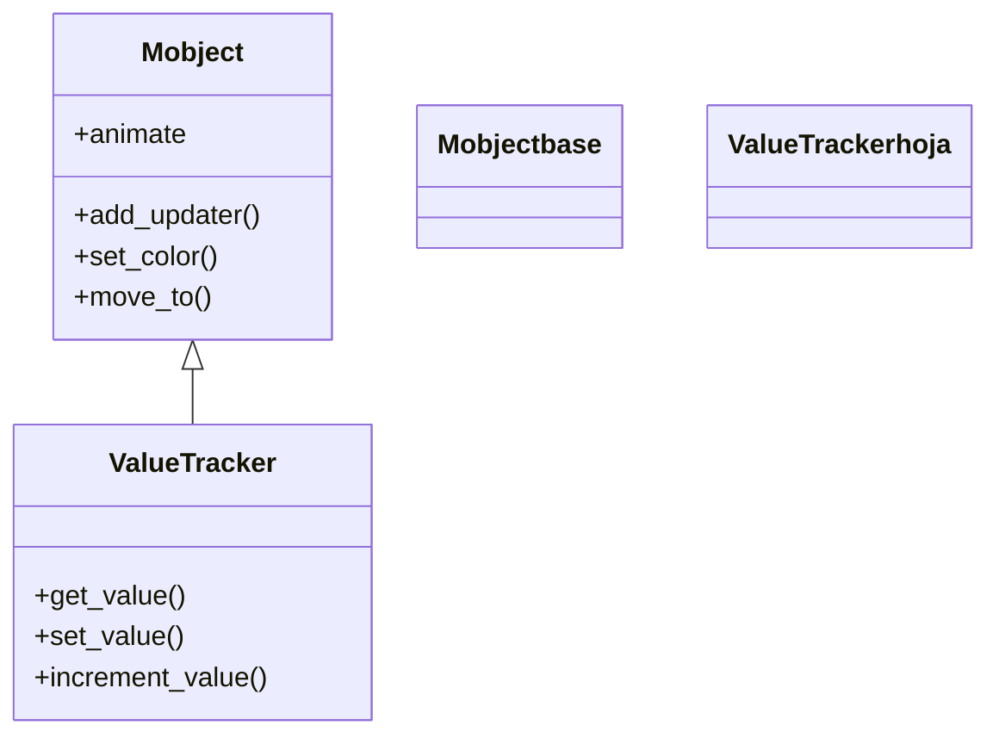

# ValueTracker — el número animable que mueve toda la escena

`ValueTracker` es un Mobject **invisible** cuyo único contenido es **un número**. No dibuja nada en pantalla; su razón de ser es servir de **fuente de verdad animable** para la animación reactiva: guarda un valor que puedes **animar** con `self.play(tracker.animate.set_value(x))` y que los [[concepto_updaters|updaters]] **leen cada fotograma** con `tracker.get_value()`. Es la pieza que resuelve un problema concreto: `self.play(...)` sabe animar la *posición* o el *color* de un objeto, pero no un **parámetro numérico abstracto** —un ángulo, una coordenada $x$, un contador, el parámetro $t$ de una curva—. El `ValueTracker` envuelve ese número en un objeto que Manim **sí** sabe interpolar en el tiempo, y entonces basta con que varios updaters lo consulten para que, animando *un solo valor*, todo lo que depende de él se mueva en consecuencia. Es el motor del cuarteto reactivo descrito en [[concepto_updaters]]: `ValueTracker` lleva el valor, [[add_updater]] o [[always_redraw]] lo propagan, y [[DecimalNumber]] lo muestra.

## Importacion

```python
from manim import ValueTracker
# o, como es habitual en Manim:
from manim import *
```

## Herencia

### La jerarquia

`ValueTracker` cuelga **directamente** de [[Mobject]]. No pasa por [[VMobject]] porque **no tiene geometría**: no hay relleno, ni trazo, ni puntos de Bézier que dibujar. Hereda de `Mobject` toda la maquinaria que lo hace un ciudadano de pleno derecho de la escena —puede entrar en el árbol de objetos, recibir updaters y, sobre todo, ser **interpolado por una animación**—, pero su "estado" no es una forma sino un número guardado internamente.



### Que hereda

Lo importante que hereda `ValueTracker` de [[Mobject]] no es la posición ni el color (que nunca se ven), sino el ser **animable**: la propiedad `animate` y la capacidad de que `self.play` interpole su estado entre dos fotogramas. Eso es justo lo que convierte un número en un número *animable*.

| Capacidad | Cómo se usa | Definido en |
|-----------|-------------|-------------|
| Ser interpolado por una animación | `self.play(tracker.animate.set_value(10))` | [[Mobject]] |
| Llevar updaters propios | `tracker.add_updater(lambda m, dt: m.increment_value(dt))` | [[Mobject]] |
| Entrar en el árbol de la escena | `self.add(tracker)` (rara vez necesario: es invisible) | [[Mobject]] |

A diferencia de un [[VMobject]], `ValueTracker` **no** tiene `set_fill`, `set_stroke` ni `points`: no hay nada que estilizar. Su "valor" no es una posición en la escena, sino un número que guardas y consultas con los tres métodos de abajo.

## Constructor

```python
ValueTracker(value=0)
```

### Parametros

| Parametro | Tipo | Defecto | Controla |
|-----------|------|---------|----------|
| `value` | `float` | `0` | el valor numérico inicial que guarda el tracker |

El valor puede ser cualquier número real. Internamente se almacena como un punto, lo que permite a Manim interpolarlo con la misma maquinaria que interpola posiciones; por eso un `ValueTracker` se anima de forma tan natural.

### Que construye

Devuelve un `ValueTracker` que arranca con el número `value`. Es un Mobject **sin representación visual**: añadirlo con `self.add(tracker)` no dibuja nada (aunque suele añadirse igual, o dejarse implícito, para que viva en la escena). Su utilidad aparece cuando otro objeto **lee** su valor en un updater.

## Metodos clave

Toda la API útil de `ValueTracker` son tres métodos: uno para **leer**, uno para **fijar** y uno para **incrementar**. Los dos primeros son el par que usarás constantemente: `set_value` (o su versión animada) **escribe**, `get_value` **lee** desde un updater.

### Leer el valor

| Metodo | Firma | Que hace |
|--------|-------|----------|
| `get_value` | `tracker.get_value()` | devuelve el número actual (un `float`); es lo que llaman los updaters cada fotograma |

`get_value()` es el corazón del patrón reactivo: dentro de un updater, lees el valor *de este fotograma* y reposicionas o recreas algo en función de él.

```python
# dentro de un updater: leer el valor vigente y usarlo
numero.add_updater(lambda m: m.set_value(tracker.get_value()))
```

### Escribir el valor

| Metodo | Firma | Que hace |
|--------|-------|----------|
| `set_value` | `tracker.set_value(value)` | fija el valor **al instante** (sin animar) y devuelve `self` |
| `increment_value` | `tracker.increment_value(d_value)` | **suma** `d_value` al valor actual; cómodo en un updater con `dt` |

`set_value` aplicado directamente cambia el número de golpe (útil para un estado inicial). Para **animar** la transición se usa `tracker.animate.set_value(...)` (ver `## Animarla`). `increment_value` brilla dentro de un updater de tiempo: `tracker.add_updater(lambda m, dt: m.increment_value(dt))` hace que el valor avance a razón de 1 unidad por segundo.

```python
tracker.set_value(5)           # de golpe: ahora vale 5
tracker.increment_value(0.5)   # ahora vale 5.5
```

## Ejemplo

### Version minima

Un `ValueTracker` que controla la coordenada $x$ de un punto: el punto se redibuja cada fotograma en la posición que marca el tracker, y solo animamos el tracker.

```python
from manim import *

class TrackerMinimo(Scene):
    def construct(self):
        t = ValueTracker(-3)
        punto = always_redraw(lambda: Dot([t.get_value(), 0, 0], color=YELLOW))

        self.add(punto)
        self.play(t.animate.set_value(3), run_time=2)  # animamos el VALOR, no el punto
        self.wait()
```

```bash
manim -pql archivo.py TrackerMinimo      # -p reproduce, -ql = calidad baja (rapido)
```

### Version completa

El patrón estrella: **un solo** `ValueTracker` que es la coordenada $x$ sobre una parábola. Un punto, una recta vertical hasta el eje y un [[DecimalNumber]] que muestra el valor se actualizan todos a la vez, porque todos leen el mismo `get_value()`.

```python
from manim import *

class UnaFuenteDeVerdad(Scene):
    def construct(self):
        ejes = Axes(x_range=[-3, 3], y_range=[0, 9])
        curva = ejes.plot(lambda x: x**2, color=BLUE)
        t = ValueTracker(-2.5)

        # 1. el punto sobre la curva, recreado cada frame
        punto = always_redraw(
            lambda: Dot(ejes.c2p(t.get_value(), t.get_value()**2), color=YELLOW)
        )
        # 2. una recta vertical del punto al eje x
        recta = always_redraw(
            lambda: ejes.get_vertical_line(
                ejes.c2p(t.get_value(), t.get_value()**2), color=GREEN
            )
        )
        # 3. una etiqueta numerica que sigue el valor de t
        valor = DecimalNumber(0, num_decimal_places=2).to_corner(UR)
        valor.add_updater(lambda m: m.set_value(t.get_value()))

        self.add(ejes, curva, punto, recta, valor)
        self.play(t.animate.set_value(2.5), run_time=4)  # mueves UN numero; todo le sigue
        self.wait()
```

```bash
manim -pqh archivo.py UnaFuenteDeVerdad     # -qh = calidad alta para el render final
```

### Variaciones

Un `ValueTracker` que avanza **solo** con el tiempo, sin animarlo con `play`: un updater con `dt` lo incrementa cada fotograma, convirtiéndolo en un cronómetro.

```python
from manim import *

class TrackerComoReloj(Scene):
    def construct(self):
        t = ValueTracker(0)
        t.add_updater(lambda m, dt: m.increment_value(dt))   # +1 por segundo

        reloj = always_redraw(
            lambda: DecimalNumber(t.get_value(), num_decimal_places=1).scale(2)
        )
        self.add(t, reloj)        # hay que ANADIR el tracker para que su updater corra
        self.wait(5)              # 5 segundos: el numero llega cerca de 5.0
```

```bash
manim -pql archivo.py TrackerComoReloj
```

Aquí el tracker **debe** añadirse a la escena (`self.add(t, ...)`): sus updaters solo corren si el mobject está en la escena. Cuando se anima con `play` esto no hace falta porque la animación ya lo gestiona.

## Animarla

`ValueTracker` se "anima" animando su **valor**, no su posición. La forma canónica es `tracker.animate.set_value(destino)`: Manim interpola el número desde su valor actual hasta `destino` a lo largo del `run_time`, y en cada fotograma intermedio `get_value()` devuelve el valor interpolado de ese instante.

### Interpolar el valor con .animate

```python
self.play(tracker.animate.set_value(10), run_time=3)
```

Esto NO mueve nada por sí solo: lo que produce el efecto visible es que **algún updater lea `get_value()`**. El patrón completo es siempre el mismo dúo: un updater (con [[add_updater]]) o un [[always_redraw]] que consulta el tracker, y un `play` que anima el tracker.

```python
from manim import *

class AnimarElValor(Scene):
    def construct(self):
        t = ValueTracker(0)
        barra = always_redraw(
            lambda: Line(LEFT * 3, LEFT * 3 + RIGHT * t.get_value(), color=BLUE, stroke_width=12)
        )
        self.add(barra)
        self.play(t.animate.set_value(6), run_time=2)   # la barra crece de 0 a 6 de ancho
        self.wait()
```

```bash
manim -pql archivo.py AnimarElValor
```

### run_time y rate_func cambian cómo sube

Como cualquier animación, `tracker.animate.set_value(...)` admite `run_time` y `rate_func`: cambian **cómo** evoluciona el valor (más lento, con aceleración, con rebote) sin tocar los updaters que lo leen. El updater siempre traduce el valor *del fotograma actual*, sea cual sea la curva temporal.

### El pariente: ComplexValueTracker

Cuando lo que necesitas animar es un **número complejo** (mover un punto en el plano complejo, animar una fase $e^{i\theta}$), existe `ComplexValueTracker`: misma idea, pero `get_value()` devuelve un `complex` en vez de un `float`. Su valor inicial se da como `ComplexValueTracker(2 + 1j)` y se anima igual con `.animate.set_value(...)`.

## Errores comunes

| Error | Causa | Solución |
|-------|-------|----------|
| Animo el tracker pero no se mueve nada | ningún updater lee `get_value()`: el tracker es invisible por sí mismo | añade un `add_updater` o un `always_redraw` que consulte `tracker.get_value()` |
| El tracker con updater de `dt` no avanza | no lo añadiste a la escena, así que su updater no corre | `self.add(tracker)` (los updaters solo corren si el mobject está en la escena) |
| Veo el número del tracker en pantalla y no lo quiero | confundiste `ValueTracker` (invisible) con [[DecimalNumber]] (visible) | usa `ValueTracker` para el valor y `DecimalNumber` solo para *mostrarlo* |
| `tracker.animate.set_value(x)` salta de golpe | usaste `tracker.set_value(x)` (sin `.animate`), que es instantáneo | envuélvelo: `self.play(tracker.animate.set_value(x))` |
| `get_value()` devuelve siempre el valor inicial | leíste el valor *una vez* fuera de un updater, no por fotograma | lee `get_value()` **dentro** del updater/lambda, que se reevalúa cada frame |
| `NameError: name 'ValueTracker' is not defined` | faltó el import | `from manim import *` al inicio |

## Notas relacionadas

- [[concepto_updaters]] — el modelo mental de la animación reactiva; `ValueTracker` es su motor
- [[add_updater]] — el método que instala la función que lee `get_value()` cada fotograma
- [[always_redraw]] — recrear un mobject por fotograma a partir del valor del tracker
- [[DecimalNumber]] — el número *visible* que suele reflejar el valor de un `ValueTracker`
- [[Mobject]] — la clase base de la que hereda el ser animable (sin ser visual)
- [[Manim/dinamico/index | dinamico]] — la carpeta de la animación reactiva y continua
