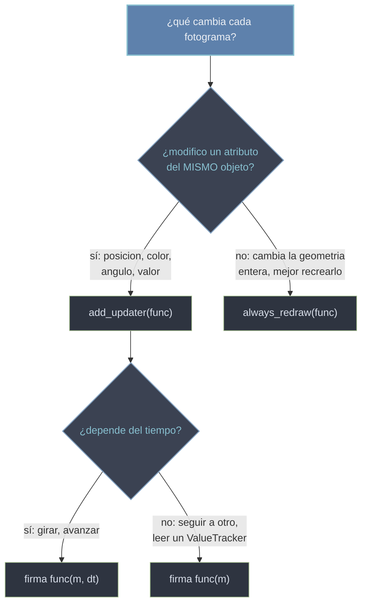

# Mobject.add_updater() — registrar una función por fotograma

`mob.add_updater(func)` cuelga una función del mobject para que Manim la **ejecute en cada fotograma** mientras siga registrada, dotándolo de comportamiento **reactivo o continuo**. Es el método concreto que materializa el modelo de los [[concepto_updaters|updaters]]: en vez de describir un cambio con principio y fin (eso lo hace [[Scene.play|self.play]]), declaras una **relación que se mantiene viva** —"colócate siempre encima de aquel punto", "gira sin parar", "muestra siempre el valor de este número"— y el motor la recalcula fotograma a fotograma. La función que registras puede tener **dos firmas** según dependa de otros objetos (`func(mob)`) o del paso del tiempo (`func(mob, dt)`); esa distinción es el corazón de la nota. Para que el updater se vea actuar, después de instalarlo tiene que **pasar tiempo de vídeo**: un `self.wait(...)` o un `self.play(...)`; si no se renderiza ningún fotograma, el updater no corre.

## Firma

```python
def add_updater(
    self,
    update_function: Callable[[Mobject], None] | Callable[[Mobject, float], None],
    index: int | None = None,        # posicion en la lista de updaters (None = al final)
    call_updater: bool = False,      # si True, ejecuta el updater una vez YA, al registrarlo
) -> Mobject:                        # devuelve self (encadenable)
    ...
```

`add_updater` se llama sobre el mobject que quieres animar, no sobre `self`. Devuelve el propio mobject, así que se puede encadenar (`Dot().add_updater(...)`), pero lo habitual es llamarlo en su propia línea por claridad.

### Parametros

#### `update_function` — la función por fotograma (sus DOS firmas)

Es el argumento central y admite **dos formas**, según cuántos parámetros acepte. Manim inspecciona la aridad de tu función para decidir cómo la llama:

| Firma | Manim la llama con | Cuándo se usa |
|-------|--------------------|----------------|
| `func(mob)` | solo el mobject | la posición o forma depende de **otros objetos** o de un [[ValueTracker]]; se recalcula respecto a algo, sin mirar el reloj |
| `func(mob, dt)` | el mobject y el delta de tiempo | la animación depende del **tiempo**: girar, avanzar un reloj, desplazarse a velocidad constante |

`dt` es el **tiempo en segundos transcurrido desde el fotograma anterior** (a 60 FPS, $dt \approx 0{,}0167$ s). Multiplicar por `dt` hace el movimiento **independiente de los FPS**: `m.rotate(2 * dt)` gira a 2 rad/s salga el vídeo a la calidad que salga; en cambio `m.rotate(0.1)` gira "0.1 por fotograma", lo que va más rápido cuanto mayor sea la calidad. Regla mnemónica: **si dependes del tiempo, pide `dt`; si dependes de otra cosa, no**.

```python
# func(mob): se recalcula respecto a OTRO objeto, sin tiempo
etiqueta.add_updater(lambda m: m.next_to(punto, UP))

# func(mob, dt): depende del TIEMPO (gira a velocidad constante)
cuadro.add_updater(lambda m, dt: m.rotate(0.8 * dt))
```

#### `index` — dónde se inserta en la lista de updaters

Un mobject puede tener **varios** updaters; se guardan en una lista y se ejecutan en orden cada fotograma. Por defecto (`None`) el nuevo updater se añade **al final**. Pasa un entero para insertarlo en una posición concreta cuando el **orden importe** (p. ej. un updater que coloca el objeto debe correr antes que otro que lo lee). Rara vez se toca.

#### `call_updater` — ejecutarlo una vez al registrar

Booleano. Con `call_updater=True`, Manim **ejecuta el updater una vez de inmediato**, en el momento de registrarlo, sin esperar al primer fotograma. Útil cuando quieres que el objeto aparezca **ya colocado/actualizado** desde el instante en que se añade (si no, hasta el primer frame renderizado podría verse un fotograma en su posición "vieja"). Por defecto `False`.

### Valor de retorno

Devuelve `self`, es decir, el **mismo mobject** sobre el que lo llamaste, para permitir encadenar. El efecto real no es el valor devuelto sino el **side effect**: a partir de esa llamada, `update_function` queda en la lista de updaters del mobject y se invocará en cada fotograma que se renderice mientras no se quite. No devuelve la función ni un identificador; para desinstalar después necesitas conservar tú la referencia a la función (ver [[#Metodos relacionados de updaters]]).

## Ejemplos

### Un objeto que sigue a otro (firma `func(mob)`)

El caso más común: un punto (o etiqueta) que se mantiene siempre pegado a otro que se mueve. La relación se declara una vez; el movimiento del objeto de referencia arrastra al que tiene el updater.

```python
from manim import *

class Seguir(Scene):
    def construct(self):
        ref = Dot(color=YELLOW)                 # el que mandaremos mover
        seguidor = Dot(color=RED)
        # "colocate SIEMPRE a la derecha de ref": relacion sin tiempo -> func(m)
        seguidor.add_updater(lambda m: m.next_to(ref, RIGHT, buff=0.3))

        self.add(ref, seguidor)
        self.play(ref.animate.shift(UP * 2 + RIGHT))   # el seguidor lo persigue solo
        self.play(ref.animate.shift(DOWN * 3))
        self.wait()
```

```bash
manim -pql archivo.py Seguir      # -p reproduce, -ql = calidad baja (rapido)
```

El `seguidor` nunca se anima directamente: solo declara dónde colocarse respecto a `ref`, y Manim lo reubica cada fotograma.

### Girar con el tiempo (firma `func(mob, dt)`)

Cuando el efecto depende del reloj y no de otro objeto, se usa la segunda firma con `dt`. Aquí no hace falta ningún `play`: basta con que **el tiempo avance** durante un `wait`.

```python
from manim import *

class Girar(Scene):
    def construct(self):
        cuadro = Square(color=BLUE)
        # 0.8 rad por segundo, constante e independiente de los FPS gracias a dt
        cuadro.add_updater(lambda m, dt: m.rotate(0.8 * dt))

        self.add(cuadro)
        self.wait(4)                 # SIN este wait no se renderizan fotogramas: no giraria
        cuadro.clear_updaters()      # dejar de girar
        self.wait()
```

```bash
manim -pql archivo.py Girar
```

El giro ocurre durante el `self.wait(4)`. Si quitas ese `wait`, `construct` termina sin renderizar fotogramas y el cuadro nunca llega a girar.

### Un número que sigue a un ValueTracker (firma `func(mob)`)

El patrón reactivo estrella: un [[ValueTracker]] guarda un valor animable y un [[DecimalNumber]] lo refleja cada fotograma. Animamos el **tracker**, no el número; el updater traduce el valor.

```python
from manim import *

class Contador(Scene):
    def construct(self):
        tracker = ValueTracker(0)
        numero = DecimalNumber(0, num_decimal_places=2).scale(2)
        # cada fotograma, el numero copia el valor actual del tracker
        numero.add_updater(lambda m: m.set_value(tracker.get_value()))

        self.add(numero)
        self.play(tracker.animate.set_value(10), run_time=3)   # animar el VALOR
        self.wait()
```

```bash
manim -pql archivo.py Contador
```

No animamos el `DecimalNumber`: animamos `tracker`, y el updater hace que el texto siga su valor. Cambiar `run_time` o el `rate_func` del `play` cambia *cómo* sube el contador sin tocar el updater.

## Metodos relacionados de updaters

`add_updater` instala; estos métodos hermanos gestionan el ciclo de vida del updater. Todos se llaman sobre el mobject.

| Método | Qué hace |
|--------|----------|
| `mob.remove_updater(func)` | quita **esa** función concreta de la lista de updaters; requiere pasar **la misma** referencia que registraste |
| `mob.clear_updaters()` | quita **todos** los updaters del mobject de golpe (el atajo cuando no guardaste la referencia) |
| `mob.suspend_updating()` | **pausa** todos los updaters sin desinstalarlos: dejan de ejecutarse pero siguen registrados |
| `mob.resume_updating()` | **reanuda** los updaters que `suspend_updating` había pausado |
| `mob.get_updaters()` | devuelve la lista de updaters registrados (para inspeccionar) |

La diferencia clave es **quitar vs. pausar**: `remove_updater`/`clear_updaters` desinstalan (para volver, hay que registrar de nuevo); `suspend_updating`/`resume_updating` solo congelan temporalmente y conservan las funciones. Para poder usar `remove_updater` debes **guardar la función en una variable** —cada `lambda` es un objeto distinto, así que una lambda escrita de nuevo no coincide con la registrada—; si no la guardaste, usa `clear_updaters()`.

```python
from manim import *

class Pausar(Scene):
    def construct(self):
        cuadro = Square(color=GREEN)

        def girar(m, dt):                      # guardada en variable: removible luego
            m.rotate(dt)

        cuadro.add_updater(girar)
        self.add(cuadro)
        self.wait(2)                           # gira
        cuadro.suspend_updating()              # se queda quieto, sin perder el updater
        self.wait(1)
        cuadro.resume_updating()               # vuelve a girar
        self.wait(2)
        cuadro.remove_updater(girar)           # desinstala esa funcion concreta
        self.wait()
```

```bash
manim -pql archivo.py Pausar
```

## Cuando add_updater vs. always_redraw



Cuando solo ajustas un atributo del mismo objeto, `add_updater`; cuando es más fácil **reconstruir** el mobject entero desde cero (su geometría completa depende de otros que se mueven), [[always_redraw]].

## Errores comunes

| Error | Causa | Solución |
|-------|-------|----------|
| El updater no hace nada visible | tras `add_updater` no hubo `self.wait()` ni `self.play(...)`: no se renderizó ningún fotograma | añade un `self.wait()` o una animación después de instalarlo |
| El movimiento va más rápido/lento según la calidad | usaste un paso fijo (`m.rotate(0.1)`) en vez de escalar por `dt` | pide `dt` y multiplica: `m.rotate(velocidad * dt)` |
| `lambda m, dt:` da error o `dt` se ignora | mezclaste las firmas: pasaste `dt` donde la función solo acepta `m` (o al revés) | usa `func(m)` si dependes de otros objetos; `func(m, dt)` si dependes del tiempo |
| El objeto sigue moviéndose cuando ya no debería | nunca quitaste el updater; sigue activo y consumiendo | `mob.remove_updater(func)` o `mob.clear_updaters()` al terminar |
| `remove_updater` no quita nada | pasaste una `lambda` distinta de la registrada (cada lambda es un objeto nuevo) | guarda la función en una variable y pásala, o usa `clear_updaters()` |
| El updater no afecta a un objeto que se ve en pantalla | el mobject no está realmente en la escena (`self.add` / dentro de un grupo añadido) | asegúrate de que el objeto esté añadido a la `Scene` |
| Esperaba verlo ya colocado en el frame inicial | el updater corre desde el **primer fotograma**, no antes | pasa `call_updater=True` para ejecutarlo una vez al registrar |

## Notas relacionadas

- [[concepto_updaters]] — el concepto base: el modelo "una función por fotograma", las dos firmas y la API completa.
- [[always_redraw]] — el atajo que **recrea** el mobject entero por fotograma en vez de modificarlo.
- [[ValueTracker]] — el número animable que un updater `func(m)` lee con `get_value()` para mover toda la escena.
- [[DecimalNumber]] — el mobject de texto numérico que más se actualiza con un updater.
- [[Scene.play]] — el contraste: cambios con principio y fin; a menudo se anima un `ValueTracker` con `play` y un updater traduce el valor.
- [[concepto_mobject]] — `add_updater` es un método que todos los mobjects heredan.
