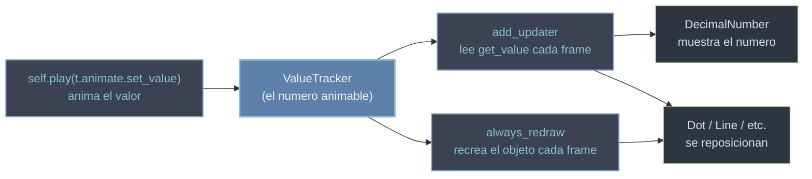

# dinamico — la animación reactiva y continua

Esta carpeta reúne las piezas con las que Manim deja de *guionizar* cambios y empieza a **mantener relaciones vivas**. En vez de describir un cambio con principio y fin —como hacen [[concepto_animation|las animaciones]] (`self.play(Create(c))` dura 2 segundos y termina)—, aquí se describe una **relación que se recalcula cada fotograma**: "este número muestra siempre el valor de aquel", "esta recta une siempre estos dos puntos", "este punto está siempre sobre la curva en la $x$ actual". El modelo mental completo —el qué y el porqué— vive en [[concepto_updaters]]; esta carpeta es su **referencia de API**: las clases y los métodos concretos que lo implementan. Todo gira en torno a un **cuarteto**: un [[ValueTracker]] que guarda un número **animable**, [[add_updater]] que ejecuta una función cada fotograma, [[always_redraw]] que recrea un objeto cada fotograma, y [[DecimalNumber]] que **muestra** un número que cambia. La idea que lo unifica: **animas una sola cosa (el valor del tracker) y todo lo que depende de ella se actualiza solo.**

## En accion

La receta estrella en una escena: un [[ValueTracker]] es la fuente de verdad, y *a la vez* mueve una figura por la pantalla y hace subir un número. Solo se anima el tracker; el punto y el contador lo siguen porque ambos leen `get_value()` cada fotograma.

```python
from manim import *

class Reactivo(Scene):
    def construct(self):
        t = ValueTracker(0)

        # 1. un punto cuya x es el valor del tracker (se RECREA cada frame)
        punto = always_redraw(lambda: Dot([t.get_value(), 0, 0], color=YELLOW))

        # 2. un numero que MUESTRA el valor del tracker (lo SIGUE con un updater)
        contador = DecimalNumber(0, num_decimal_places=2).to_edge(UP)
        contador.add_updater(lambda m: m.set_value(t.get_value()))

        self.add(punto, contador)
        self.play(t.animate.set_value(4), run_time=3)   # animas UN valor; dos cosas reaccionan
        self.play(t.animate.set_value(-2), run_time=2)
        self.wait()
```

```bash
manim -pql archivo.py Reactivo      # -p reproduce, -ql = calidad baja (rapido)
```

## Las piezas

Las cuatro clases y métodos de la carpeta, con su tipo y su papel en el cuarteto. Cada uno tiene su propia nota.

| Pieza | Tipo | Para que |
|-------|------|----------|
| [[ValueTracker]] | clase ([[Mobject]] invisible) | guardar **un número animable**: la fuente de verdad que se anima con `.animate.set_value(...)` |
| [[add_updater]] | método de [[Mobject]] | instalar una función que **se ejecuta cada fotograma** sobre un objeto (leer el tracker, reposicionar) |
| [[always_redraw]] | función auxiliar | **recrear** un mobject entero cada fotograma a partir de objetos/valores que cambian |
| [[DecimalNumber]] | clase ([[VMobject]]) | **mostrar** en pantalla un número que cambia de valor (un contador, una medida en vivo) |

## Como encajan

El reparto de papeles es nítido y siempre el mismo. El [[ValueTracker]] es la **fuente de verdad animable**: el único objeto que `self.play` toca. Los **updaters** ([[add_updater]]) leen su valor cada fotograma y ajustan un atributo (posición, color, el número de un [[DecimalNumber]]). [[always_redraw]] es el caso especial en que, en vez de *modificar* un objeto, conviene **recrearlo entero** porque su geometría completa depende del valor. Y [[DecimalNumber]] es la salida *visible* cuando lo que quieres es enseñar el número en sí.



La regla para elegir entre las dos formas de propagar: usa [[add_updater]] cuando solo **ajustas un atributo** del mismo objeto (su posición, su color, su valor); usa [[always_redraw]] cuando **cambia la geometría completa** y recrear es más limpio que recalcular a mano. El [[ValueTracker]] alimenta a ambos por igual.

## Patrones y recetas

Tres recetas mínimas que cubren el 90% de los usos de la carpeta.

### Un contador animado (DecimalNumber + ValueTracker)

El uso más directo: mostrar un número que sube de forma animada. El tracker lleva el valor, el [[DecimalNumber]] lo refleja cada fotograma con un updater.

```python
from manim import *

class Contador(Scene):
    def construct(self):
        t = ValueTracker(0)
        numero = DecimalNumber(0, num_decimal_places=2).scale(2)
        numero.add_updater(lambda m: m.set_value(t.get_value()))

        self.add(numero)
        self.play(t.animate.set_value(50), run_time=3)   # sube suave de 0 a 50
        self.wait()
```

```bash
manim -pql archivo.py Contador
```

### Un objeto que sigue a otro (add_updater)

Sin tracker: un updater puede leer **otro mobject** directamente. La etiqueta declara "colócate siempre encima del punto" y el movimiento del punto la arrastra.

```python
from manim import *

class Seguir(Scene):
    def construct(self):
        punto = Dot(color=YELLOW)
        etiqueta = Text("aqui").scale(0.6)
        etiqueta.add_updater(lambda m: m.next_to(punto, UP, buff=0.2))

        self.add(punto, etiqueta)
        self.play(punto.animate.shift(RIGHT * 3 + UP))   # la etiqueta lo persigue sola
        self.wait()
```

```bash
manim -pql archivo.py Seguir
```

### Una recta que se redibuja (always_redraw)

Cuando la geometría entera cambia —los dos extremos se mueven— recrear es más limpio que recalcular. `always_redraw` regenera la `Line` cada fotograma con las posiciones actuales.

```python
from manim import *

class RectaViva(Scene):
    def construct(self):
        a = Dot(LEFT * 3, color=RED)
        b = Dot(RIGHT * 3, color=GREEN)
        linea = always_redraw(lambda: Line(a.get_center(), b.get_center(), color=YELLOW))

        self.add(a, b, linea)
        self.play(a.animate.shift(UP * 2), b.animate.shift(DOWN * 2))  # la linea se reajusta
        self.wait()
```

```bash
manim -pql archivo.py RectaViva
```

## Notas relacionadas

- [[concepto_updaters]] — el modelo mental completo de la animación reactiva (el porqué); esta carpeta es su API
- [[concepto_animation]] — el otro modo: animaciones con principio y fin (`self.play`), del que esto es el complemento continuo
- [[ValueTracker]] — el número animable, motor del cuarteto
- [[DecimalNumber]] — el número visible que cambia de valor
- [[add_updater]] — la función por fotograma
- [[always_redraw]] — recrear un mobject por fotograma
- [[Manim/index | Manim]] — el índice raíz con el `classDiagram` global
