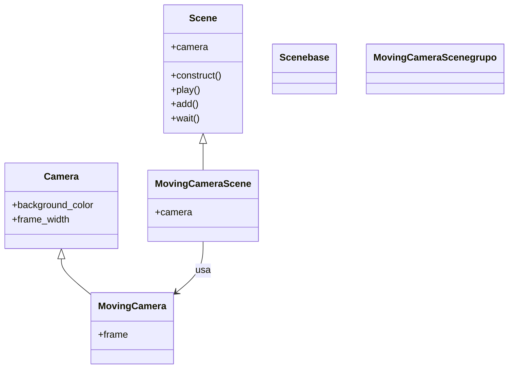

# MovingCameraScene — mover y hacer zoom con la cámara

`MovingCameraScene` es la variante de [[concepto_scene_construct|Scene]] que convierte la **cámara en un objeto animable**: en una `Scene` normal la cámara es fija y siempre muestra el mismo rectángulo del plano, pero aquí el encuadre (`self.camera.frame`) es un `Mobject` más, así que puedes desplazarlo, escalarlo y rotarlo con `self.play(...)` exactamente igual que harías con un círculo. La idea clave es esa: **no mueves los objetos para acercarte a ellos, mueves la cámara**. Se usa siempre que quieras un travelling (seguir un objeto), un zoom-in sobre un detalle, o recorrer una escena grande que no cabe entera en pantalla. Es la primera variante que eliges cuando sabes que el encuadre va a cambiar durante el vídeo.

## Importacion

```python
from manim import MovingCameraScene
# o, como es habitual en Manim:
from manim import *
```

## Herencia

### La jerarquia

`MovingCameraScene` hereda directamente de `Scene`; lo único que cambia es la cámara que monta por dentro (una `MovingCamera`, cuyo `frame` es un `Mobject`).



### Que aporta respecto a Scene

Hereda **todo** de `Scene` (`self.play`, `self.add`, `self.wait`, `self.remove`, `self.mobjects`...): un `construct` de `MovingCameraScene` se escribe igual que cualquier otro. Lo único que añade es que `self.camera` ya no es una `Camera` fija sino una `MovingCamera`, y por tanto expone **`self.camera.frame`**, un `Mobject` rectangular que representa el encuadre y que puedes animar. Mover o escalar ese frame es lo que produce el efecto de cámara.

## Lo que anade

Todo gira en torno a un único atributo nuevo, `self.camera.frame`, y a su patrón de guardar/restaurar.

| Elemento | Tipo | Qué es / qué hace |
|----------|------|-------------------|
| `self.camera.frame` | `Mobject` (rectángulo del encuadre) | el objeto animable que representa lo que se ve; moverlo y escalarlo es mover y hacer zoom con la cámara |
| `self.camera.frame.animate` | proxy de animación | igual que en cualquier Mobject: `self.play(self.camera.frame.animate.scale(0.5))` anima el cambio de encuadre |
| `self.camera.frame.save_state()` | `-> Mobject` | guarda la posición/escala actual del encuadre para poder volver a ella |
| `self.camera.frame.restore()` | `-> Mobject` | devuelve el encuadre al último estado guardado (se suele animar con `.animate.restore()` o con `Restore(frame)`) |

### El encuadre como Mobject

`self.camera.frame` responde a los mismos métodos que cualquier Mobject. Los más útiles para la cámara:

| Llamada (dentro de `self.play(...)`) | Efecto en cámara |
|--------------------------------------|------------------|
| `self.camera.frame.animate.move_to(obj)` | desplaza el encuadre hasta centrarlo en `obj` (travelling) |
| `self.camera.frame.animate.scale(0.5)` | encoge el encuadre a la mitad: **zoom-in** (ver menos plano, más grande) |
| `self.camera.frame.animate.scale(2)` | agranda el encuadre: **zoom-out** (ver más plano) |
| `self.camera.frame.animate.set(width=4)` | fija el ancho del encuadre en unidades del plano (zoom por tamaño absoluto) |
| `self.camera.frame.animate.rotate(angle)` | gira la cámara (dutch angle) |

> [!tip] Zoom-in = frame más pequeño
> Es contraintuitivo: para **acercarte** a un detalle, **encoges** el frame (`scale(0.5)`). El frame es la ventana; cuanto más pequeña la ventana sobre el plano, más ampliado se ve su contenido en pantalla.

### Guardar y restaurar el encuadre

Antes de mover la cámara conviene guardar el encuadre inicial con `save_state()`; así, tras enseñar un detalle, vuelves a la vista general con una sola animación. Funciona como en cualquier Mobject (mismo par `save_state` / `restore`).

```python
self.camera.frame.save_state()                       # guarda la vista general
self.play(self.camera.frame.animate.scale(0.4).move_to(detalle))   # zoom al detalle
self.wait()
self.play(Restore(self.camera.frame))                # vuelve a la vista general
```

`Restore(self.camera.frame)` y `self.camera.frame.animate.restore()` hacen lo mismo; el primero es una `Animation` y el segundo el proxy `.animate`.

## Ejemplo

### Version minima

Acercarse a un cuadrado y volver. Lo mínimo para ver el efecto de cámara.

```python
from manim import *

class ZoomMinimo(MovingCameraScene):
    def construct(self):
        cuadro = Square(color=BLUE)
        self.add(cuadro)
        self.camera.frame.save_state()                 # guarda la vista inicial

        # acercarse: encoger el frame y centrarlo en el cuadrado
        self.play(self.camera.frame.animate.scale(0.5).move_to(cuadro))
        self.wait()
        self.play(Restore(self.camera.frame))          # volver a la vista general
        self.wait()
```

```bash
manim -pql archivo.py ZoomMinimo      # -p reproduce, -ql = calidad baja (rapido)
```

### Version completa

Varias figuras repartidas por el plano; la cámara hace un recorrido (travelling + zoom) visitando cada una y al final se aleja para verlas todas.

```python
from manim import *

class RecorridoCamara(MovingCameraScene):
    def construct(self):
        # tres figuras separadas en el plano
        circulo = Circle(color=RED).shift(LEFT * 4)
        cuadro = Square(color=GREEN).shift(RIGHT * 4 + UP * 2)
        triangulo = Triangle(color=YELLOW).shift(DOWN * 3)
        etiqueta = Text("detalle", font_size=24).next_to(circulo, DOWN)

        figuras = VGroup(circulo, cuadro, triangulo)
        self.add(figuras, etiqueta)

        frame = self.camera.frame
        frame.save_state()                              # guarda el encuadre completo

        # 1. travelling + zoom al circulo (frame pequeño = mas zoom)
        self.play(frame.animate.scale(0.4).move_to(circulo), run_time=2)
        self.wait(0.5)

        # 2. desplazarse al cuadrado manteniendo el zoom
        self.play(frame.animate.move_to(cuadro), run_time=2)
        self.wait(0.5)

        # 3. bajar al triangulo y ampliar un poco mas
        self.play(frame.animate.scale(0.7).move_to(triangulo), run_time=2)
        self.wait(0.5)

        # 4. alejarse del todo para verlas las tres a la vez
        self.play(Restore(frame), run_time=2)
        self.wait()

        # zoom por tamaño absoluto: fijar el ancho del encuadre en 6 unidades
        self.play(frame.animate.set(width=6).move_to(ORIGIN))
        self.wait()
```

```bash
manim -pqh archivo.py RecorridoCamara      # -qh = alta calidad para el render final
```

## Errores comunes

| Error / síntoma | Causa | Solución |
|-----------------|-------|----------|
| `AttributeError: 'Camera' object has no attribute 'frame'` | la escena hereda de `Scene`, no de `MovingCameraScene`: la cámara fija no tiene `frame` | cambia la clase base a `class X(MovingCameraScene)` |
| El zoom-in aleja en vez de acercar | usaste `scale(2)` esperando acercarte | para acercarte **encoge** el frame: `scale(0.5)` |
| La cámara "salta" sin animarse | hiciste `self.camera.frame.scale(0.5)` fuera de `play` | mete el cambio en `self.play(self.camera.frame.animate.scale(0.5))` |
| `Restore` no vuelve a ningún sitio | olvidaste `self.camera.frame.save_state()` antes de mover | guarda el estado al principio del `construct` |
| Quería 3D y no funciona el `frame` para girar en perspectiva | `MovingCameraScene` es 2D; mueve la cámara en el plano, no en el espacio | usa [[ThreeDScene]] para 3D real |

## Notas relacionadas

- [[concepto_scene_construct]] — la `Scene` base y el método `construct` del que esto hereda.
- [[ThreeDScene]] — la variante para mover la cámara en el espacio 3D.
- [[ZoomedScene]] — subclase de `MovingCameraScene` que añade un recuadro-lupa ampliado.
- [[concepto_animate_syntax]] — la sintaxis `.animate` con la que se anima el encuadre.
