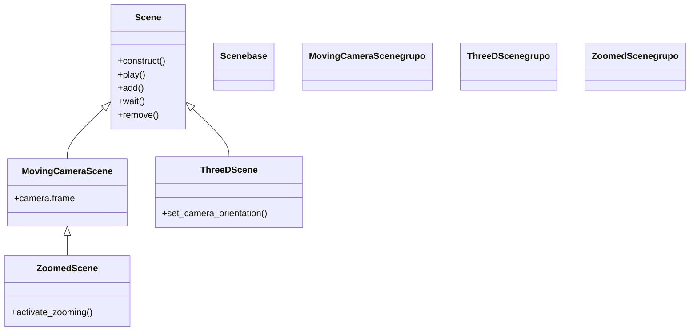

# Scene — el lienzo y el director (la clase base de toda animacion)

`Scene` es la clase raíz de toda animación en Manim: nunca se usa "tal cual", sino que **se subclasea** y se **sobreescribe su método `construct()`**, donde escribes el guion completo de lo que ocurre. Es a la vez las dos cosas que necesita una animación: el **espacio** (el lienzo donde viven los Mobjects, con su cámara y su reloj) y el **guion** (el orden en que se añaden objetos y se reproducen animaciones). Manim instancia tu subclase por ti, llama a `construct()` una sola vez y convierte cada `self.play(...)` en un trozo del vídeo final. Por eso entender `Scene` es entender el armazón sobre el que se monta absolutamente todo lo demás: cualquier ejemplo de esta librería empieza por `class Algo(Scene): def construct(self): ...`. El detalle conceptual del ciclo de vida está en [[concepto_scene_construct]]; aquí se documenta la clase, su jerarquía, sus métodos y sus atributos.

## Importacion

```python
from manim import Scene
# o, como es habitual en todo ejemplo de Manim:
from manim import *
```

`from manim import *` trae `Scene` junto con todos los Mobjects (`Circle`, `Text`…), las Animations (`Create`, `Write`…) y las constantes (`UP`, `BLUE`, `ORIGIN`…). En la práctica casi siempre se usa el import estrella.

## Herencia

### La jerarquia

`Scene` es la **base** de la familia de escenas. Las variantes no añaden objetos nuevos: amplían lo que `self` puede hacer (mover la cámara, trabajar en 3D, abrir un recuadro de zoom). Todas heredan, en última instancia, de `Scene`, así que todas tienen `play`, `add`, `wait` y `construct`.



`ZoomedScene` hereda de `MovingCameraScene` (no directamente de `Scene`): el recuadro de zoom es una extensión del control de cámara. Las cuatro clases viven en este mismo directorio [[Manim/escena/index | escena]].

### Como se usa

`Scene` **no se instancia a mano**. No escribes `s = Scene(); s.construct()`. El patrón es siempre subclasear y dejar que Manim haga el resto:

1. Defines `class MiEscena(Scene):` y sobreescribes `construct(self)`.
2. Lanzas `manim -pql archivo.py MiEscena`.
3. Manim **instancia** `MiEscena()` por ti, **llama** a `construct()` una sola vez y **renderiza** cada animación a fotogramas.

Es el mismo patrón de gancho (*hook*) que `paintEvent` en una GUI: tú describes el contenido, el motor lo invoca y lo dibuja.

## El metodo construct

`construct` es el único método que **tienes** que sobreescribir: es el gancho donde escribes el guion entero de la animación.

```python
def construct(self) -> None:
    ...   # crear Mobjects, self.add(...), self.play(...), self.wait(...)
```

- Recibe solo `self` (la propia Scene); por eso un `def construct():` sin `self` revienta con `takes 1 positional argument but 2 were given`.
- Manim lo llama **una vez** y no espera valor de retorno (`-> None`): no se hace `return` de nada útil.
- El **orden de las líneas** dentro de `construct` **es** el orden temporal del vídeo: lo que escribes antes, se ve antes.
- Nunca lo llamas tú (`self.construct()` a mano no se hace); lo invoca el motor de render.

## Metodos clave

Casi todo `construct` se escribe combinando métodos de `self`. Cada uno tiene su propia nota con firma completa, parámetros y ejemplos.

### Reproducir y mostrar

Los verbos centrales: `play` es lo único que **dura y se anima**; `add` y `remove` son **instantáneos**; `wait` mantiene el último fotograma.

| Metodo | Firma | Que hace |
|--------|-------|----------|
| `play` | `self.play(*animations, run_time=1.0, rate_func=smooth, **kwargs) -> None` | reproduce una o varias Animations a la vez; es lo único que se ve animarse ([[Scene.play]]) |
| `add` | `self.add(*mobjects: Mobject) -> Self` | pone Mobjects en pantalla **al instante**, sin animación ([[Scene.add]]) |
| `wait` | `self.wait(duration=1.0, stop_condition=None, frozen_frame=None) -> None` | pausa `duration` segundos manteniendo el último fotograma ([[Scene.wait]]) |
| `remove` | `self.remove(*mobjects: Mobject) -> Self` | quita Mobjects al instante, sin animación de salida ([[Scene.remove]]) |

### Orden y limpieza

El z-order (qué objeto tapa a cuál) y el borrado de la escena.

| Metodo | Firma | Que hace |
|--------|-------|----------|
| `bring_to_front` | `self.bring_to_front(*mobjects: Mobject) -> Self` | mueve esos Mobjects al frente del z-order (se dibujan encima) ([[Scene.bring_to_front]]) |
| `bring_to_back` | `self.bring_to_back(*mobjects: Mobject) -> Self` | los manda al fondo (se dibujan detrás de todo) |
| `clear` | `self.clear() -> Self` | quita **todos** los Mobjects de la escena de golpe |

### Otros

Sonido y división del vídeo en tramos.

| Metodo | Firma | Que hace |
|--------|-------|----------|
| `add_sound` | `self.add_sound(sound_file, time_offset=0, gain=None) -> None` | añade una pista de audio al vídeo en el instante actual |
| `next_section` | `self.next_section(name="unnamed", type=PRESENTATION.NORMAL, skip_animations=False) -> None` | cierra el tramo actual y abre otro; permite exportar el vídeo por secciones |

## Atributos de self

Dentro de `construct`, `self` no es solo el dueño de los métodos: también expone el estado vivo de la escena.

| Atributo | Tipo | Que es |
|----------|------|--------|
| `self.mobjects` | `list[Mobject]` | la lista de todos los Mobjects actualmente en pantalla (en orden de z) |
| `self.camera` | `Camera` | la cámara que renderiza; su `background_color`, y en las variantes su `frame` animable |
| `self.renderer` | `Renderer` | el motor de render; rara vez se toca a mano |
| `self.time` | `float` | el tiempo transcurrido en la escena, en segundos |

## Ejemplo

### Version minima

La animación más corta posible: una Scene de cuatro líneas que crea un círculo y espera.

```python
from manim import *

class Minima(Scene):
    def construct(self):
        self.play(Create(Circle()))
        self.wait()
```

```bash
manim -pql archivo.py Minima      # -p reproduce, -ql = calidad baja (rapido)
```

### Version completa

Una escena realista: un título arriba, una figura y varias animaciones encadenadas (escribir, crear, transformar, desvanecer). El orden de los `self.play` es el orden del vídeo.

```python
from manim import *

class Demostracion(Scene):
    def construct(self):
        # 1. Mobjects: un titulo y un cuadrado
        titulo = Text("Del cuadrado al circulo").to_edge(UP)
        cuadro = Square(color=BLUE, fill_opacity=0.5)

        # 2. el guion: cada self.play es un paso del video
        self.play(Write(titulo))                       # escribe el titulo
        self.play(Create(cuadro))                      # dibuja el cuadrado
        self.wait(0.5)
        self.play(cuadro.animate.rotate(PI / 4))       # lo gira 45 grados (.animate)
        self.play(Transform(cuadro, Circle(color=YELLOW, fill_opacity=0.5)))  # lo morfa a circulo
        self.wait(0.5)
        self.play(FadeOut(titulo, cuadro))             # todo se desvanece
        self.wait()
```

```bash
manim -pqh archivo.py Demostracion     # -qh = calidad alta para el render final
```

## Personalizar (el patron normal)

A diferencia de un Mobject o una Animation —que se subclasean solo cuando necesitas algo propio— **subclasear `Scene` no es un caso avanzado: es el modo normal de usarla**. Toda animación que escribes ES una subclase de `Scene`. El esqueleto siempre es el mismo:

```python
from manim import *

class MiAnimacion(Scene):       # 1. hereda de Scene (o de una variante)
    def construct(self):        # 2. sobreescribe construct(self) -> el gancho
        # 3. crea tus Mobjects
        obj = Circle(color=GREEN)
        # 4. escribe el guion: add / play / wait en el orden temporal deseado
        self.play(Create(obj))
        self.wait()
        # 5. NO escribas return ni instancies la Scene a mano
```

> [!regla] La regla de oro
> Siempre `def construct(self):` (con `self`), y **nunca** `MiAnimacion().construct()` a mano: Manim instancia tu clase y llama a `construct()` por ti cuando ejecutas `manim -pql archivo.py MiAnimacion`. Si necesitas mover la cámara o trabajar en 3D, no cambias el patrón: solo cambias la **clase base** por una variante ([[MovingCameraScene]], [[ThreeDScene]], [[ZoomedScene]]).

## Errores comunes

| Error | Causa | Solución |
|-------|-------|----------|
| `construct() takes 1 positional argument but 2 were given` | escribiste `def construct():` sin `self` | siempre `def construct(self):` |
| Vídeo vacío / no se ve nada | ningún Mobject entró a la escena (faltó `self.add` o `self.play`) | añade o reproduce el mobject |
| El vídeo dura 0 segundos | solo usaste `add`/`remove` (instantáneos) y ningún `play`/`wait` | añade al menos un `self.wait()` o una animación con `play` |
| Todo aparece de golpe | usaste `self.add` esperando que se animara | usa `self.play(Create(...))` o `.animate` |
| `Scene` no produce salida / `construct` no se ejecuta | instanciaste la Scene a mano en vez de lanzarla por CLI | ejecuta `manim -pql archivo.py MiEscena`, no llames `construct()` tú |
| Falta `self.camera.frame` o `set_camera_orientation` | usaste `Scene` en vez de la variante que aporta esa capacidad | hereda de [[MovingCameraScene]] (cámara) o [[ThreeDScene]] (3D) |
| `NameError: name 'Circle' is not defined` | faltó el import | `from manim import *` al inicio |

## Notas relacionadas

- [[concepto_scene_construct]] — el ciclo de vida de la Scene y el método `construct` en detalle
- [[Manim/escena/index | escena]] — la carpeta de Scene y sus variantes
- [[MovingCameraScene]] — variante con cámara móvil/zoom
- [[ThreeDScene]] — variante para escenas 3D
- [[ZoomedScene]] — variante con recuadro de zoom
- [[Scene.play]] · [[Scene.add]] · [[Scene.wait]] · [[Scene.remove]] · [[Scene.bring_to_front]] — los métodos clave
- [[concepto_mobject]] — los objetos que se añaden a la Scene
- [[concepto_animation]] — lo que `self.play` reproduce
