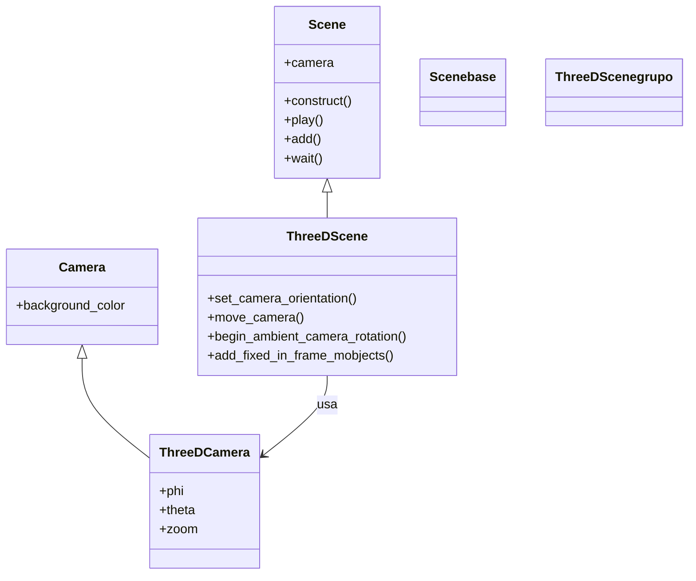

# ThreeDScene — escenas en tres dimensiones

`ThreeDScene` es la variante de [[concepto_scene_construct|Scene]] para trabajar en **3D**: añade un eje Z real y, sobre todo, una cámara que se orienta en el espacio mediante **ángulos esféricos**. En una `Scene` normal todo vive en el plano XY y la cámara mira siempre de frente; aquí, en cambio, defines desde qué ángulo se observa la escena (la inclinación `phi` y el giro `theta`), puedes mover esa cámara durante la animación e incluso dejarla girando sola. Se usa para superficies, sólidos, ejes tridimensionales y cualquier gráfico que necesite profundidad. La cámara no es un Mobject animable como en [[MovingCameraScene]]: se controla con métodos propios (`set_camera_orientation`, `move_camera`, la rotación ambiental).

## Importacion

```python
from manim import ThreeDScene
# normalmente, con todo el namespace:
from manim import *
```

## Herencia

### La jerarquia

`ThreeDScene` hereda de `Scene`; internamente monta una `ThreeDCamera` (una cámara que entiende los ángulos esféricos) en lugar de la cámara plana.



### Que aporta respecto a Scene

Hereda todo el guion de `Scene` (`self.play`, `self.add`, `self.wait`, `self.mobjects`...), de modo que las animaciones se escriben igual. Lo que suma es el **control de la cámara 3D**: métodos para orientarla por ángulos, para volar de un ángulo a otro durante la animación, para hacerla orbitar sola y para fijar elementos (texto, HUD) que no deben girar con la escena. Pasa de pensar "qué objetos hay" a también "desde dónde se miran".

## Lo que anade

Los ángulos de cámara son **esféricos**: `phi` es la inclinación respecto al eje Z (0 = mirando desde arriba, en picado; 90° = a la altura del plano XY), `theta` es el giro alrededor del eje Z (acimut), y `gamma` la rotación sobre el propio eje de visión. Casi siempre se dan en radianes, por eso se multiplica por `DEGREES` (`70 * DEGREES`).

| Método | Firma (tipos) | Para qué |
|--------|---------------|----------|
| `set_camera_orientation` | `set_camera_orientation(phi: float = None, theta: float = None, gamma: float = None, zoom: float = None, focal_distance: float = None, frame_center: Mobject \| np.ndarray = None) -> None` | coloca la cámara en un ángulo de golpe (sin animar); úsalo al inicio del `construct` |
| `move_camera` | `move_camera(phi: float = None, theta: float = None, gamma: float = None, zoom: float = None, focal_distance: float = None, frame_center=None, added_anims: list = [], **kwargs) -> None` | **anima** el viaje de la cámara hasta un nuevo ángulo; acepta `run_time` y animaciones extra en `added_anims` |
| `begin_ambient_camera_rotation` | `begin_ambient_camera_rotation(rate: float = 0.02, about: str = "theta") -> None` | arranca una rotación continua y automática de la cámara (orbita); `about` puede ser `"theta"`, `"phi"` o `"gamma"` |
| `stop_ambient_camera_rotation` | `stop_ambient_camera_rotation(about: str = "theta") -> None` | detiene la rotación ambiental iniciada antes |
| `add_fixed_in_frame_mobjects` | `add_fixed_in_frame_mobjects(*mobjects: Mobject) -> None` | "pega" mobjects a la pantalla (HUD, títulos): no rotan ni se mueven con la cámara 3D |
| `add_fixed_orientation_mobjects` | `add_fixed_orientation_mobjects(*mobjects: Mobject) -> None` | los mobjects siguen en su posición 3D pero **siempre encaran** a la cámara (etiquetas legibles) |

### Orientar la cámara (set_camera_orientation)

Es lo primero que se hace: define el punto de vista inicial. Un ángulo típico para ver un sólido "en perspectiva" es `phi=70*DEGREES, theta=-45*DEGREES`.

```python
self.set_camera_orientation(phi=70 * DEGREES, theta=-45 * DEGREES, zoom=0.8)
```

`zoom` mayor que 1 acerca; `frame_center` reencuadra sobre un punto u objeto.

### Volar de un ángulo a otro (move_camera)

Igual que `set_camera_orientation` pero **animado**: Manim interpola los ángulos. Acepta `run_time`, y con `added_anims` puedes reproducir otras animaciones a la vez que se mueve la cámara.

```python
self.move_camera(phi=30 * DEGREES, theta=60 * DEGREES, run_time=3)
```

### Rotación ambiental (orbita automática)

`begin_ambient_camera_rotation` hace girar la cámara sola mientras transcurre el tiempo; entre el `begin` y el `stop` debes meter `self.wait(...)` para que pase tiempo y se vea girar. `rate` es la velocidad angular (radianes por segundo).

```python
self.begin_ambient_camera_rotation(rate=0.2, about="theta")
self.wait(5)                       # durante estos 5 s la camara orbita
self.stop_ambient_camera_rotation()
```

### Fijar elementos a la pantalla (HUD)

En 3D, un `Text` colocado normalmente rotaría y se deformaría con la cámara. `add_fixed_in_frame_mobjects` lo clava a la pantalla (como un subtítulo) ignorando la cámara 3D.

```python
titulo = Text("Una superficie").to_corner(UL)
self.add_fixed_in_frame_mobjects(titulo)   # se queda fijo aunque la camara gire
```

## Ejemplo

### Version minima

Unos ejes 3D y una esfera vistos en perspectiva. Lo mínimo para entender `set_camera_orientation`.

```python
from manim import *

class Escena3DMinima(ThreeDScene):
    def construct(self):
        self.set_camera_orientation(phi=70 * DEGREES, theta=-45 * DEGREES)
        ejes = ThreeDAxes()
        esfera = Sphere(radius=1, color=BLUE)
        self.add(ejes, esfera)
        self.wait()
```

```bash
manim -pql archivo.py Escena3DMinima      # -p reproduce, -ql = calidad baja (rapido)
```

### Version completa

Una superficie 3D paramétrica con ejes, un título fijo a la pantalla (HUD), un vuelo de cámara y una órbita automática al final.

```python
from manim import *

class SuperficieEnPerspectiva(ThreeDScene):
    def construct(self):
        # 1. punto de vista inicial en perspectiva
        self.set_camera_orientation(phi=70 * DEGREES, theta=-45 * DEGREES, zoom=0.9)

        ejes = ThreeDAxes()

        # una superficie z = f(x, y) como Surface parametrica
        superficie = Surface(
            lambda u, v: np.array([u, v, 0.4 * np.sin(u) * np.cos(v)]),
            u_range=[-3, 3],
            v_range=[-3, 3],
            resolution=(24, 24),
            fill_opacity=0.8,
            checkerboard_colors=[BLUE_D, BLUE_E],
        )

        # 2. titulo FIJO a la pantalla: no rota con la camara
        titulo = Text("z = 0.4 sin(x) cos(y)", font_size=28).to_corner(UL)
        self.add_fixed_in_frame_mobjects(titulo)

        # 3. construir la escena
        self.play(Create(ejes))
        self.play(Create(superficie), run_time=3)
        self.wait()

        # 4. volar a otro angulo mientras la superficie sigue ahi
        self.move_camera(phi=45 * DEGREES, theta=30 * DEGREES, run_time=3)
        self.wait()

        # 5. dejar la camara orbitando sola unos segundos
        self.begin_ambient_camera_rotation(rate=0.3, about="theta")
        self.wait(6)
        self.stop_ambient_camera_rotation()
        self.wait()
```

```bash
manim -pqh archivo.py SuperficieEnPerspectiva      # -qh = alta calidad
```

## Errores comunes

| Error / síntoma | Causa | Solución |
|-----------------|-------|----------|
| Todo se ve plano, sin profundidad | no llamaste a `set_camera_orientation`: la cámara mira de frente (`phi=0`) | inclina la cámara, p. ej. `set_camera_orientation(phi=70*DEGREES, theta=-45*DEGREES)` |
| Los ángulos giran demasiado / casi nada | pasaste grados como si fueran radianes (`phi=70`) | multiplica por `DEGREES`: `phi=70*DEGREES` |
| El texto se deforma o rota con la escena | lo añadiste con `self.add` normal en 3D | usa `add_fixed_in_frame_mobjects(texto)` para clavarlo a la pantalla |
| La cámara no orbita aunque llamé `begin_ambient_camera_rotation` | no dejaste pasar tiempo entre el `begin` y el `stop` | mete un `self.wait(...)` en medio; la rotación necesita que transcurra tiempo |
| `AttributeError`/comportamiento raro con `self.camera.frame` | confundiste la API con `MovingCameraScene` | en 3D usa los métodos `set_camera_orientation` / `move_camera`, no `self.camera.frame` |
| La superficie se ve negra/sin volumen | `fill_opacity` a 0 o sin colores | ajusta `fill_opacity` y usa `checkerboard_colors` o `fill_color` |

## Notas relacionadas

- [[concepto_scene_construct]] — la `Scene` base y el método `construct` del que esto hereda.
- [[MovingCameraScene]] — mover la cámara, pero en el plano 2D (su `frame` es un Mobject).
- [[ZoomedScene]] — la otra variante de cámara: un recuadro-lupa ampliado.
- [[concepto_sistema_coordenadas]] — los ejes y direcciones (`OUT`, `IN`, eje Z) del espacio 3D.
