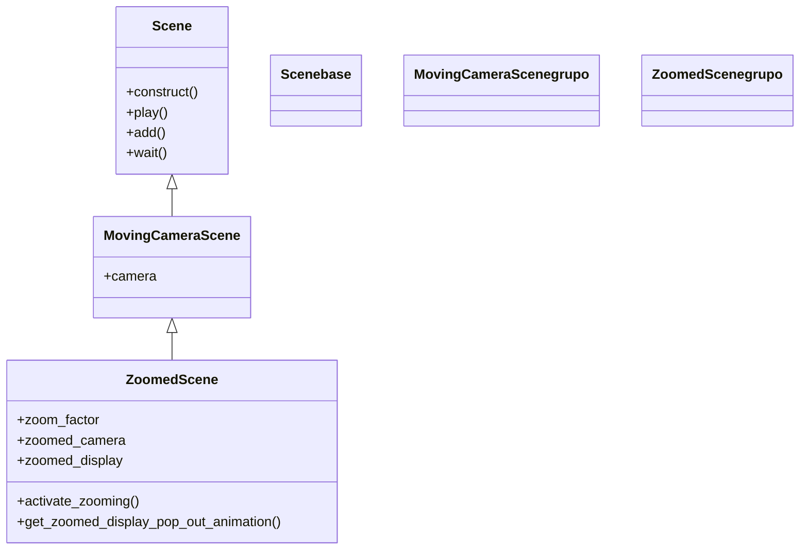

# ZoomedScene — un recuadro-lupa con la zona ampliada

`ZoomedScene` es la variante más nicho del trío de cámaras: muestra **dos vistas a la vez**. Sobre la escena normal aparece un **recuadro** (como una lupa o un picture-in-picture) que enseña, muy ampliada, una pequeña región del plano. Hay por tanto dos cámaras: la principal (la de siempre) y una **mini-cámara de zoom** que captura un cuadradito de la escena y lo proyecta agrandado en un display de la esquina. Se usa para señalar un detalle minúsculo sin perder de vista el conjunto: el espectador ve el todo y, en el recuadro, el detalle ampliado. Hereda de [[MovingCameraScene]], así que además puedes mover la cámara principal; pero su valor propio es esa lupa. Si solo quieres acercarte, [[MovingCameraScene]] basta; `ZoomedScene` es para mostrar las **dos escalas simultáneamente**.

## Importacion

```python
from manim import ZoomedScene
# habitualmente:
from manim import *
```

## Herencia

### La jerarquia

`ZoomedScene` hereda de `MovingCameraScene` (que a su vez hereda de `Scene`): por eso dispone también de `self.camera.frame` para mover la cámara principal, y encima añade su segunda cámara.



### Que aporta respecto a Scene

De `Scene` hereda el guion (`play`, `add`, `wait`) y de `MovingCameraScene` el encuadre animable `self.camera.frame`. Lo propio de `ZoomedScene` es la **segunda cámara**: un sistema de zoom configurable desde el constructor que captura una región pequeña (la "zoomed camera") y la pinta ampliada en un recuadro fijo de la pantalla (el "zoomed display"). Nada de esto existe en las otras variantes.

## Lo que anade

Como buena parte de la configuración va en el **constructor**, en `ZoomedScene` es habitual sobreescribir `__init__` para pasar los parámetros (o llamar a `ZoomedScene.__init__(self, ...)`). Después, dentro de `construct`, se activa el zoom y se manipulan las dos sub-piezas.

### Parametros del constructor

| Parámetro | Tipo | Defecto | Controla |
|-----------|------|---------|----------|
| `zoom_factor` | `float` | `0.3` | tamaño de la región capturada respecto a la pantalla; **más pequeño = más aumento** |
| `zoomed_display_height` | `float` | `3` | alto del recuadro-lupa (el display ampliado) en unidades del plano |
| `zoomed_display_width` | `float` | `3` | ancho del recuadro-lupa |
| `zoomed_display_center` | `np.ndarray` | `None` | centro del recuadro en pantalla (si no, va a una esquina) |
| `zoomed_display_corner` | `np.ndarray` | `UR` | esquina donde se ancla el recuadro (`UR`, `UL`, `DR`, `DL`) |
| `zoomed_display_corner_buff` | `float` | `DEFAULT_MOBJECT_TO_EDGE_BUFFER` | margen entre el recuadro y el borde |
| `zoomed_camera_config` | `dict` | `{"default_frame_stroke_width": 2, ...}` | configuración de la mini-cámara (grosor del marco, etc.) |
| `zoomed_camera_frame_starting_position` | `np.ndarray` | `ORIGIN` | dónde empieza la mini-cámara dentro del plano |
| `image_frame_stroke_width` | `float` | `3` | grosor del borde del recuadro-lupa |

Firma resumida:

```python
def __init__(
    self,
    zoom_factor: float = 0.3,
    zoomed_display_height: float = 3,
    zoomed_display_width: float = 3,
    zoomed_display_center: np.ndarray = None,
    zoomed_display_corner: np.ndarray = UR,
    zoomed_display_corner_buff: float = DEFAULT_MOBJECT_TO_EDGE_BUFFER,
    zoomed_camera_config: dict = {"default_frame_stroke_width": 2, "background_opacity": 1},
    zoomed_camera_frame_starting_position: np.ndarray = ORIGIN,
    image_frame_stroke_width: float = 3,
    **kwargs,
):
    ...
```

### Atributos y metodos

| Elemento | Tipo / firma | Qué es / hace |
|----------|--------------|---------------|
| `self.zoomed_camera` | `MovingCamera` | la **mini-cámara** que captura la región a ampliar; su `.frame` es el cuadradito que mueves sobre el detalle |
| `self.zoomed_camera.frame` | `Mobject` | el recuadro fuente: muévelo (`move_to`, `shift`, `.animate...`) para apuntar la lupa a un sitio |
| `self.zoomed_display` | `Mobject` (display) | el **recuadro-lupa** donde se ve el resultado ampliado; su `.display_frame` es su marco |
| `activate_zooming` | `activate_zooming(animate: bool = False) -> None` | enciende el zoom: añade a la escena el frame fuente y el display; con `animate=True` lo crea animadamente |
| `get_zoomed_display_pop_out_animation` | `get_zoomed_display_pop_out_animation() -> Animation` | la animación de "salida" del recuadro-lupa desde la mini-cámara hasta su posición (efecto pop-out) |

> [!tip] Dos frames, no confundirlos
> `self.zoomed_camera.frame` es **qué** se amplía (el cuadradito fuente sobre el plano); `self.zoomed_display` es **dónde** se ve ampliado (el recuadro de la esquina). Mover la lupa = mover `self.zoomed_camera.frame`.

## Ejemplo

### Version minima

Encender la lupa sobre el centro de la escena. Lo mínimo para ver las dos vistas.

```python
from manim import *

class LupaMinima(ZoomedScene):
    def construct(self):
        # algo de detalle fino en el centro
        contenido = VGroup(*[Dot(radius=0.04).shift(0.15 * i * RIGHT) for i in range(-3, 4)])
        etiqueta = Text("detalle", font_size=20).next_to(contenido, DOWN)
        self.add(contenido, etiqueta)

        # apuntar la mini-camara al detalle y encender el zoom
        self.zoomed_camera.frame.move_to(contenido)
        self.activate_zooming(animate=True)
        self.wait(2)
```

```bash
manim -pql archivo.py LupaMinima      # -p reproduce, -ql = calidad baja (rapido)
```

### Version completa

Una figura con un detalle pequeño; se enciende la lupa con el efecto pop-out y luego se **mueve la mini-cámara** sobre distintas zonas del detalle. Configuramos el zoom desde `__init__`.

```python
from manim import *

class LupaSobreDetalle(ZoomedScene):
    def __init__(self, **kwargs):
        ZoomedScene.__init__(
            self,
            zoom_factor=0.25,                 # cuadradito pequeño = mucho aumento
            zoomed_display_height=3,
            zoomed_display_width=3,
            zoomed_display_corner=UR,
            image_frame_stroke_width=4,
            zoomed_camera_config={"default_frame_stroke_width": 3},
            **kwargs,
        )

    def construct(self):
        # escena base: una cuadricula fina con un punto rojo diminuto
        rejilla = NumberPlane(x_range=[-5, 5, 0.5], y_range=[-3, 3, 0.5])
        punto = Dot(point=LEFT * 2 + UP, radius=0.05, color=RED)
        nota = Text("aqui hay un punto", font_size=22).next_to(punto, UP, buff=0.1)
        self.add(rejilla, punto, nota)

        # la mini-camara y su frame fuente
        frame_fuente = self.zoomed_camera.frame
        frame_fuente.move_to(punto)            # apuntar la lupa al punto
        frame_fuente.set_color(YELLOW)         # marcar el cuadradito fuente

        # marcar tambien el borde del recuadro-lupa
        self.zoomed_display.display_frame.set_color(YELLOW)

        # 1. encender el zoom con el efecto pop-out
        self.activate_zooming(animate=True)
        self.play(self.get_zoomed_display_pop_out_animation())
        self.wait()

        # 2. pasear la lupa: mover la mini-camara sobre otras zonas
        self.play(frame_fuente.animate.move_to(RIGHT * 2 + DOWN), run_time=2)
        self.wait()
        self.play(frame_fuente.animate.move_to(ORIGIN), run_time=2)
        self.wait()

        # 3. ampliar un poco la region capturada (menos aumento)
        self.play(frame_fuente.animate.scale(1.6))
        self.wait(2)
```

```bash
manim -pqh archivo.py LupaSobreDetalle      # -qh = alta calidad
```

## Errores comunes

| Error / síntoma | Causa | Solución |
|-----------------|-------|----------|
| No aparece ningún recuadro-lupa | olvidaste `self.activate_zooming()` | llama a `self.activate_zooming(animate=True)` en el `construct` |
| La lupa amplía el sitio equivocado | no moviste la mini-cámara al detalle | `self.zoomed_camera.frame.move_to(objetivo)` antes de activar |
| Cambié `zoom_factor` en `construct` y no hace efecto | es un parámetro del **constructor**, no se cambia luego | pásalo en `__init__` (`ZoomedScene.__init__(self, zoom_factor=...)`) |
| Confundo qué frame mover | `zoomed_camera.frame` = fuente; `zoomed_display` = recuadro destino | mueve siempre `self.zoomed_camera.frame` para reapuntar la lupa |
| Casi todo se ve igual de pequeño, sin aumento real | `zoom_factor` demasiado grande | bájalo (p. ej. `0.2`–`0.3`): cuanto menor, más aumento |
| Solo quería acercarme, esto es excesivo | `ZoomedScene` es para ver dos escalas a la vez | si basta con acercar el encuadre, usa [[MovingCameraScene]] |

## Notas relacionadas

- [[MovingCameraScene]] — la clase padre directa; aporta el `self.camera.frame` de la cámara principal.
- [[concepto_scene_construct]] — la `Scene` base y el método `construct`.
- [[ThreeDScene]] — la otra variante de cámara, para escenas en 3D.
- [[concepto_animate_syntax]] — la sintaxis `.animate` con la que se pasea la mini-cámara.
