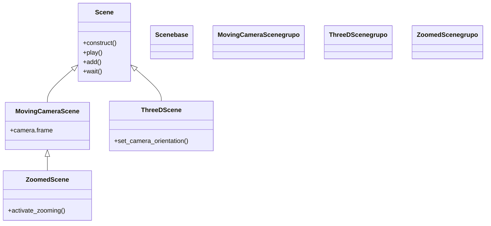

# escena — la Scene y sus variantes (donde ocurre todo)

Esta carpeta documenta la `Scene` y sus variantes: la clase que sirve de **lienzo y director** de toda animación. Todo lo que hace Manim ocurre dentro de una `Scene` que subclaseas y cuyo método `construct()` sobreescribes; por eso esta es la carpeta del armazón sobre el que se monta el resto de la librería. La clase base [[Scene]] cubre la animación 2D normal, y de ella cuelgan tres variantes que no añaden objetos nuevos sino **capacidades nuevas** a `self`: mover la cámara, trabajar en 3D o abrir un recuadro de zoom. Lo primero que decides al escribir una animación es de cuál de estas cuatro clases heredar, porque eso fija lo que `self` podrá hacer dentro de `construct`. El modelo mental detrás de todo esto vive en [[concepto_scene_construct]].

## En accion

Una escena ejecutable usando la clase base y su guion: un título, una figura y animaciones encadenadas. Cambiar la clase base por una variante es lo único que hace falta para mover la cámara o pasar a 3D.

```python
from manim import *

class Lienzo(Scene):
    def construct(self):
        titulo = Text("La escena es el guion").to_edge(UP)
        c = Circle(color=BLUE, fill_opacity=0.4)

        self.play(Write(titulo))                  # 1. escribe el titulo
        self.play(Create(c))                      # 2. dibuja el circulo
        self.play(c.animate.shift(RIGHT * 2))     # 3. lo mueve (.animate)
        self.wait()
```

```bash
manim -pql archivo.py Lienzo      # -p reproduce, -ql = calidad baja (rapido)
```

## Herencia

`Scene` es la base; las variantes la especializan. `ZoomedScene` hereda de `MovingCameraScene` porque el zoom es una extensión del control de cámara, no algo independiente.



## Clases que aporta

| Clase | Hereda de | Para que |
|-------|-----------|----------|
| [[Scene]] | — (clase raíz) | animación 2D normal: el lienzo y el guion (`play`, `add`, `wait`) |
| [[MovingCameraScene]] | `Scene` | mover la cámara o hacer zoom animando `self.camera.frame` |
| [[ThreeDScene]] | `Scene` | escenas 3D: orientar la cámara con `set_camera_orientation(phi, theta)` |
| [[ZoomedScene]] | `MovingCameraScene` | mostrar un recuadro ampliado (una mini-cámara de zoom) |

## Como elegir

La clase base es lo primero que se decide: marca lo que `self` puede hacer dentro de `construct`.

| Quiero… | Clase base |
|---------|-----------|
| Una animación 2D normal (la mayoría de los casos) | `Scene` |
| Mover, seguir o hacer zoom con la cámara sobre la escena 2D | `MovingCameraScene` |
| Trabajar en 3D (rotar la cámara, superficies, ejes 3D) | `ThreeDScene` |
| Abrir un recuadro que muestra una zona ampliada del lienzo | `ZoomedScene` |

## Notas relacionadas

- [[concepto_scene_construct]] — el modelo mental: la Scene y `construct()`
- [[Scene]] — la clase base de toda animación
- [[MovingCameraScene]] · [[ThreeDScene]] · [[ZoomedScene]] — las tres variantes
- [[Manim/index | Manim]] — el índice raíz con el `classDiagram` global
- [[Manim/conceptos_transversales/index | conceptos_transversales]] — el modelo mental completo
