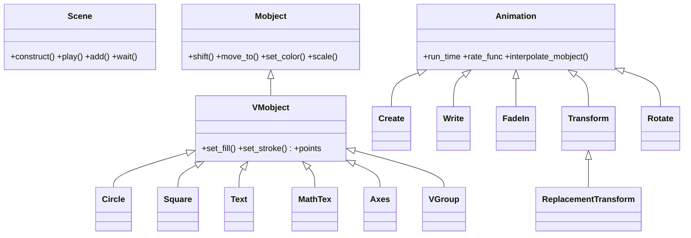

# Manim — animacion matematica orientada a objetos

Manim (Mathematical Animation Engine) es la libreria que genera las animaciones matematicas al
estilo de 3blue1brown: figuras, formulas y graficos que aparecen, se transforman y se mueven
fotograma a fotograma. Documentamos la **Community Edition** (`pip install manim`), la version
mantenida por la comunidad. A diferencia de NumPy o Matplotlib —donde llamas funciones sobre datos—
en Manim **subclaseas una `Scene` y escribes un guion** dentro de su metodo `construct()`: ahi vas
anadiendo objetos y reproduciendo animaciones en orden. Es, como PyQt6, una libreria intensamente
**orientada a objetos**: casi todo lo dibujable hereda de `Mobject` y casi toda transformacion
hereda de `Animation`.

## La triada: Scene, Mobject, Animation

Todo en Manim cae en uno de tres roles. No confundirlos es la clave de la libreria:

| Rol | Que es | Pregunta que responde |
|-----|--------|------------------------|
| **Scene** | el lienzo y el guion (`construct`) donde ocurre todo | *donde* |
| **Mobject** | un objeto matematico dibujable (un circulo, una formula) | *que se ve* |
| **Animation** | una transformacion en el tiempo (aparecer, morfar, moverse) | *como cambia* |

Un `Circle` **no es** una animacion: es un Mobject. `Create(Circle())` si lo es. Dentro de la Scene
se **anaden** los mobjects (`self.add`) o se **animan** (`self.play(Create(...))`).

## En accion

```python
from manim import *

class Hola(Scene):
    def construct(self):
        c = Circle(color=BLUE)              # 1. un Mobject
        texto = Text("Hola Manim")          # 2. otro Mobject
        texto.next_to(c, DOWN)              # 3. posicionar (sistema de coordenadas)

        self.play(Create(c))                # 4. una Animation
        self.play(Write(texto))             # 5. otra Animation
        self.play(c.animate.shift(RIGHT*2)) # 6. .animate: animar un cambio
        self.wait()                         # 7. pausa
```

```bash
manim -pql hola.py Hola      # -p reproduce, -ql = calidad baja (rapido)
```

## El modelo de objetos

Las dos grandes jerarquias —lo que se dibuja y lo que lo anima— cuelgan de `Mobject` y `Animation`;
la `Scene` las orquesta:



> [!tip] La clave de la herencia
> Como **todo Mobject** hereda de `Mobject`/`VMobject`, todo objeto se puede posicionar (`shift`,
> `next_to`), colorear (`set_color`) y escalar sin importar si es un circulo o una formula. Como
> **toda animacion** hereda de `Animation`, todas aceptan `run_time` y `rate_func`. Saber que hereda
> una clase es saber que puede hacer sin abrir su documentacion.

## Los tres pilares

| Pilar | Idea | Concepto |
|-------|------|----------|
| **La Scene y `construct`** | subclaseas `Scene` y escribes el guion en `construct()` | [[concepto_scene_construct]] |
| **El Mobject** | el arbol de objetos dibujables; se anaden y se transforman | [[concepto_mobject]] |
| **La Animation** | `self.play(...)` reproduce una transformacion en el tiempo | [[concepto_animation]] |

## Como navegar el vault

| Quiero... | Ir a |
|-----------|------|
| El modelo mental (Scene, Mobject, Animation, coordenadas) | [[Manim/conceptos_transversales/index\|conceptos_transversales]] |
| El lienzo y su guion (Scene, play, add, wait) | [[Manim/escena/index\|escena]] |
| Los objetos dibujables (geometria, texto, graficos) | [[Manim/mobjects/index\|mobjects]] |
| Las animaciones (crear, transformar, mover, indicar) | [[Manim/animaciones/index\|animaciones]] |
| Colocar y componer objetos | [[Manim/posicionamiento/index\|posicionamiento]] |
| Animacion continua y reactiva (updaters, ValueTracker) | [[Manim/dinamico/index\|dinamico]] |
| Color, estilo y el comando de render | [[Manim/estilo/index\|estilo]] |
| Crear objetos o animaciones propios | [[Manim/patrones/index\|patrones]] |

## Notas relacionadas

- [[concepto_scene_construct]] — la Scene y el metodo `construct`
- [[concepto_mobject]] — el objeto dibujable base
- [[concepto_animation]] — que es una animacion y como se reproduce
