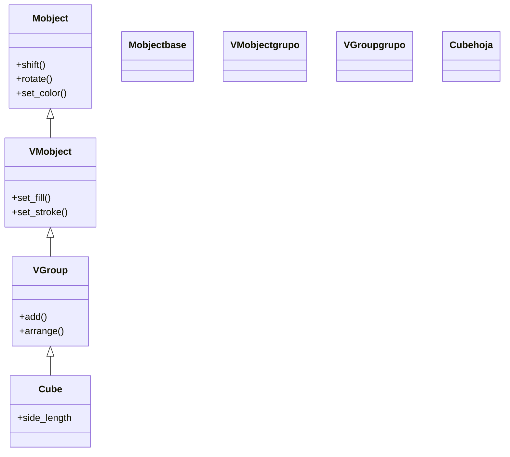

# Cube — cubo (seis caras cuadradas en 3D)

`Cube` es el Mobject que dibuja un **cubo** en el espacio tridimensional: un sólido formado por **seis caras cuadradas** (cada una un `Square` colocado y orientado en 3D), agrupadas en un único objeto. A diferencia de [[Sphere]], no es una superficie de revolución sino un [[VGroup]] de polígonos planos: el cubo es literalmente "seis cuadrados pegados", por eso hereda directamente de `VGroup` y no de [[Surface]]. Se usa para representar cajas, dados, bloques o cualquier sólido recto en una escena con profundidad. Su pariente cercano es `Prism`, una caja de lados distintos (no cúbica); de hecho `Cube` se puede ver como el `Prism` con las tres dimensiones iguales. Como cualquier [[concepto_mobject|Mobject]], se crea y luego se **añade** (`self.add`) o se **anima** (`self.play(Create(...))`).

> [!important] Los objetos 3D solo se ven bien en una [[ThreeDScene]]
> Un `Cube` añadido a una [[Scene]] normal se ve como un cuadrado plano (la cámara mira de frente). Para apreciar sus caras y su volumen hay que estar en una [[ThreeDScene]] y orientar la cámara con `self.set_camera_orientation(phi, theta)`.

## Importacion

```python
from manim import Cube
# o, como es habitual en Manim:
from manim import *
```

## Herencia

### La jerarquia

`Cube` cuelga directamente de [[VGroup]]: es un grupo de seis `Square` dispuestos como caras. No pasa por [[Surface]] (esa rama es para superficies paramétricas curvas como la [[Sphere]]); un cubo son polígonos planos, así que su tronco es el del contenedor vectorizado.



### Que hereda

`Cube` define su geometría (las seis caras) en su `__init__`, pero todo lo demás lo hereda: como es un [[VGroup]], transformar el cubo arrastra a sus seis caras a la vez.

| Capacidad | Método típico | Definido en |
|-----------|---------------|-------------|
| Agrupar las seis caras y moverlas juntas | `add`, `get_family` | [[VGroup]] |
| Relleno y trazo de las caras | `set_fill`, `set_stroke` | [[VMobject]] |
| Posición, escala y giro | `shift`, `move_to`, `scale`, `rotate` | [[Mobject]] |
| Color global | `set_color`, `set_opacity` | [[Mobject]] |

## Constructor

```python
Cube(
    side_length=2,          # longitud de la arista
    fill_opacity=0.75,      # opacidad de las caras (por defecto YA es solido)
    fill_color=BLUE,        # color de relleno de las caras
    stroke_width=0,         # grosor del borde (0 = sin aristas marcadas)
    **kwargs,               # se reenvian a VGroup / VMobject
)
```

### Parametros principales

| Parametro | Tipo | Defecto | Controla |
|-----------|------|---------|----------|
| `side_length` | `float` | `2` | la longitud de la arista (todas iguales: es un cubo) |
| `fill_opacity` | `float` | `0.75` | opacidad de las caras; a diferencia de las figuras 2D, **ya viene relleno** |
| `fill_color` | `ManimColor` | `BLUE` | color del relleno de las seis caras |
| `stroke_width` | `float` | `0` | grosor de las aristas; `0` deja las caras sin borde dibujado |
| `**kwargs` | — | — | se pasan a [[VGroup]]/[[VMobject]] (`stroke_color`, `color`...) |

#### side_length y la familia Prism

`Cube` fuerza las tres dimensiones iguales. Si necesitas una caja no cúbica (un ladrillo, con largo, ancho y alto distintos) usa su clase hermana `Prism(dimensions=[x, y, z])`. El cubo equivale al prisma con las tres medidas iguales.

```python
cubo  = Cube(side_length=2)                 # 2 x 2 x 2
caja  = Prism(dimensions=[3, 1, 2])         # caja no cubica (largo, ancho, alto)
```

### Parametros de estilo

A diferencia de un [[Square]] 2D (que nace hueco), el `Cube` **viene relleno** por defecto (`fill_opacity=0.75`) y **sin aristas** (`stroke_width=0`). Para marcar las aristas sube `stroke_width` y elige `stroke_color`; para verlo translúcido baja `fill_opacity`.

### Que construye

Devuelve un `Cube` (un [[VGroup]] de seis `Square`) centrado en el `ORIGIN`, estático hasta que se añade o se anima. Para verlo como sólido hay que mirarlo desde una [[ThreeDScene]] con la cámara orientada.

## Metodos clave

`Cube` no aporta métodos propios: mover, girar, escalar y colorear son todos heredados. Como es un [[VGroup]], puedes además acceder a sus caras individuales por índice (`cubo[0]`, `cubo[1]`...).

### Transformar y estilizar

| Metodo | Firma | Que hace |
|--------|-------|----------|
| `rotate` | `cubo.rotate(PI / 4, axis=UP)` | gira el cubo alrededor de un eje 3D (heredado de [[Mobject]]) |
| `set_color` | `cubo.set_color(RED)` | tiñe las seis caras (heredado de [[Mobject]]) |
| `set_opacity` | `cubo.set_opacity(0.5)` | lo vuelve translúcido (heredado de [[Mobject]]) |
| indexar | `cubo[0].set_color(GREEN)` | accede a una cara concreta (porque es un [[VGroup]]) |

## Ejemplo

### Version minima

Un cubo visto en perspectiva. Como en todo objeto 3D, lo imprescindible es estar en una [[ThreeDScene]] y orientar la cámara.

```python
from manim import *

class CuboMinimo(ThreeDScene):
    def construct(self):
        self.set_camera_orientation(phi=70 * DEGREES, theta=-45 * DEGREES)
        cubo = Cube(side_length=2, fill_color=BLUE)
        self.add(cubo)
        self.wait()
```

```bash
manim -pql archivo.py CuboMinimo      # -p reproduce, -ql = calidad baja (rapido)
```

### Version completa

Un cubo que se crea sobre unos [[ThreeDAxes]] y **gira** sobre un eje con `Rotate`, mientras un título queda fijo a la pantalla (HUD). El giro es lo que revela que es un sólido y no un cuadrado.

```python
from manim import *

class CuboGirando(ThreeDScene):
    def construct(self):
        self.set_camera_orientation(phi=70 * DEGREES, theta=-45 * DEGREES, zoom=0.9)
        ejes = ThreeDAxes()

        cubo = Cube(side_length=2, fill_color=BLUE, fill_opacity=0.8, stroke_width=2)

        titulo = Text("Un cubo girando", font_size=28).to_corner(UL)
        self.add_fixed_in_frame_mobjects(titulo)   # no rota con la escena

        self.play(Create(ejes))
        self.play(FadeIn(cubo))
        self.wait()

        # girar el cubo sobre el eje vertical: aqui se ve que es 3D
        self.play(Rotate(cubo, angle=2 * PI, axis=UP), run_time=4)
        self.wait()
```

```bash
manim -pqh archivo.py CuboGirando     # -qh = calidad alta para el render final
```

### Variaciones

Un cubo de alambre (solo aristas, caras transparentes) y una de sus caras teñida aparte aprovechando que es un [[VGroup]].

```python
from manim import *

class CuboVariaciones(ThreeDScene):
    def construct(self):
        self.set_camera_orientation(phi=70 * DEGREES, theta=-45 * DEGREES)

        alambre = Cube(side_length=2, fill_opacity=0, stroke_width=3, stroke_color=WHITE)
        alambre.shift(LEFT * 2.5)                 # solo aristas

        solido = Cube(side_length=2, fill_color=BLUE, fill_opacity=0.8)
        solido.shift(RIGHT * 2.5)
        solido[0].set_color(RED)                  # una cara distinta (es un VGroup)

        self.add(alambre, solido)
        self.wait()
```

```bash
manim -pql archivo.py CuboVariaciones
```

## Animarla

### Crear y transformar

`Cube` responde a `FadeIn`, `Create` y `Transform`. Lo más característico en 3D es animarlo con `Rotate(cubo, axis=...)`: a diferencia de `.animate.rotate`, `Rotate` es la animación dedicada al giro y deja claro el eje. Con `.animate` se animan también los métodos heredados (`scale`, `shift`, `set_color`).

```python
self.play(Rotate(cubo, angle=PI, axis=RIGHT))   # vuelca hacia adelante
self.play(cubo.animate.scale(1.5))              # crece animandose
```

### Mostrar el volumen con la camara

Además de girar el cubo, puedes dejar la **cámara orbitando** (`begin_ambient_camera_rotation`) para verlo desde todos los ángulos sin tocar el objeto.

## Errores comunes

| Error | Causa | Solución |
|-------|-------|----------|
| El cubo se ve como un cuadrado plano | lo añadiste a una [[Scene]] normal o no orientaste la cámara | usa [[ThreeDScene]] y `set_camera_orientation(phi=70*DEGREES, theta=-45*DEGREES)` |
| No se ven las aristas | `stroke_width` es `0` por defecto | súbelo: `Cube(stroke_width=2, stroke_color=WHITE)` |
| Querías una caja no cúbica | `Cube` fuerza lados iguales | usa `Prism(dimensions=[x, y, z])` |
| El cubo "salta" en vez de girar | usaste `cubo.rotate(...)` fuera de `self.play` (es instantáneo) | envuélvelo en `Rotate(cubo, axis=UP)` o `self.play(cubo.animate.rotate(...))` |
| `NameError: name 'Cube' is not defined` | faltó el import | `from manim import *` al inicio |

## Notas relacionadas

- [[Sphere]] — el otro sólido básico de la carpeta (una superficie de revolución, no un poliedro)
- [[Square]] — la cara 2D de la que está hecho el cubo (seis de ellas)
- [[VGroup]] — el contenedor del que hereda; explica por qué `cubo[0]` accede a una cara
- [[ThreeDScene]] — la escena 3D imprescindible para ver el cubo con volumen
- [[ThreeDAxes]] — los ejes 3D que dan referencia espacial al cubo
- [[concepto_mobject]] — qué es un Mobject y los métodos que todos comparten
- [[Manim/mobjects/3d/index | 3d]] — la carpeta de objetos tridimensionales
