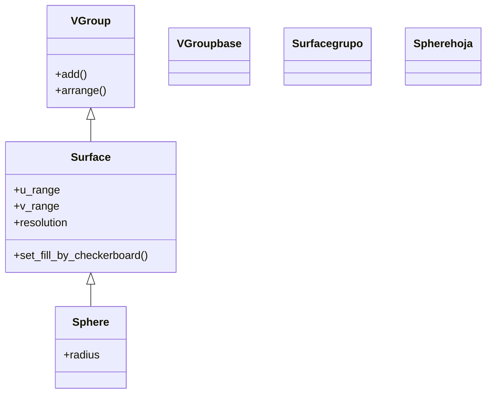

# Sphere — esfera (superficie 3D de revolucion)

`Sphere` es el Mobject que dibuja una **esfera** en el espacio tridimensional: una bola de radio `radius` centrada en `center`, mallada en una rejilla de cuadrículas que aproximan su superficie curva. No es una figura plana sino un caso particular de [[Surface]], la superficie paramétrica genérica de Manim: internamente se define como la superficie barrida por los ángulos esféricos `u` (longitud, de 0 a `TAU`) y `v` (latitud, de 0 a `PI`), de modo que hereda de `Surface` toda la maquinaria de relleno, sombreado y resolución. Se usa para representar bolas, planetas, dominios esféricos o cualquier sólido redondo en una escena con profundidad. Como cualquier [[concepto_mobject|Mobject]], se crea y luego se **añade** (`self.add`) o se **anima** (`self.play(Create(...))`); no se "reproduce" por sí solo.

> [!important] Los objetos 3D solo se ven bien en una [[ThreeDScene]]
> Una `Sphere` añadida a una [[Scene]] normal se ve plana (la cámara mira de frente). Para apreciar su volumen hay que estar en una [[ThreeDScene]] y orientar la cámara con `self.set_camera_orientation(phi, theta)`.

## Importacion

```python
from manim import Sphere
# o, como es habitual en Manim:
from manim import *
```

## Herencia

### La jerarquia

`Sphere` cuelga de [[Surface]], la superficie paramétrica genérica, que a su vez es un [[VGroup]] de pequeños cuadriláteros (las caras de la malla). Por eso una esfera no es un objeto "monolítico" sino un grupo de parches; su suavidad depende de cuántos parches tenga (el parámetro `resolution`).



### Que hereda

`Sphere` casi no define geometría propia más allá de la fórmula esférica: el relleno, el sombreado, la malla y la posición vienen de arriba.

| Capacidad | Método / parámetro típico | Definido en |
|-----------|---------------------------|-------------|
| Malla paramétrica y resolución | `resolution`, `u_range`, `v_range` | [[Surface]] |
| Relleno y damero de colores | `fill_opacity`, `checkerboard_colors`, `set_fill` | [[Surface]] / [[VMobject]] |
| Agrupar los parches de la malla | `add`, `get_family` | [[VGroup]] |
| Posición, escala y giro | `shift`, `move_to`, `scale`, `rotate` | [[Mobject]] |
| Color global | `set_color`, `set_opacity` | [[Mobject]] |

## Constructor

```python
Sphere(
    center=ORIGIN,            # centro de la esfera (punto 3D)
    radius=1,                 # radio
    resolution=(101, 51),     # (n_u, n_v): cuantos parches en cada angulo -> suavidad
    u_range=(0, TAU),         # rango de la longitud (vuelta completa)
    v_range=(0, PI),          # rango de la latitud (de polo a polo)
    **kwargs,                 # se reenvian a Surface / VMobject (color, fill_opacity...)
)
```

### Parametros principales

| Parametro | Tipo | Defecto | Controla |
|-----------|------|---------|----------|
| `center` | `np.ndarray` | `ORIGIN` | el centro de la esfera en el espacio 3D |
| `radius` | `float` | `1` | el radio (mitad del diámetro) |
| `resolution` | `tuple[int, int]` | `(101, 51)` | número de parches en longitud y latitud; a más, más suave (y más lento) |
| `u_range` | `tuple[float, float]` | `(0, TAU)` | el ángulo de longitud barrido; menos de `TAU` deja la esfera "abierta" |
| `v_range` | `tuple[float, float]` | `(0, PI)` | el ángulo de latitud barrido (de polo norte a polo sur) |
| `**kwargs` | — | — | se pasan a [[Surface]]/[[VMobject]]: `fill_opacity`, `checkerboard_colors`, `color`... |

#### resolution: la suavidad de la esfera

`resolution=(n_u, n_v)` es el número de parches de la malla en cada ángulo. Valores altos dan una esfera muy lisa pero pesada de renderizar; valores bajos la dejan facetada, como una bola de discoteca. Para pruebas rápidas baja la resolución.

```python
lisa  = Sphere(radius=1, resolution=(50, 25))   # suave
basta = Sphere(radius=1, resolution=(12, 6))    # facetada, render rapido
```

### Parametros de estilo

El color y la transparencia llegan por `**kwargs` y los procesa [[Surface]]/[[VMobject]]. Lo más habitual: `fill_opacity` para que se vea sólida y `checkerboard_colors` (o `set_color`) para teñirla. Una esfera con `fill_opacity` bajo se ve translúcida; con `checkerboard_colors=[BLUE_D, BLUE_E]` toma el aspecto de globo a cuadros.

### Que construye

Devuelve una `Sphere` (un [[Surface]], y por tanto un [[VGroup]] de parches) centrada en `center`, estática hasta que se añade o se anima. Para verla con volumen hay que mirarla desde una [[ThreeDScene]] con la cámara orientada.

## Metodos clave

`Sphere` no aporta métodos propios: posicionar, escalar, girar, colorear y consultar son todos heredados. Remitir a [[posicionamiento]] y [[estilo]] para los transversales.

### Estilizar y transformar

| Metodo | Firma | Que hace |
|--------|-------|----------|
| `set_color` | `esfera.set_color(RED)` | tiñe toda la esfera de un color (heredado de [[Mobject]]) |
| `set_opacity` | `esfera.set_opacity(0.5)` | la vuelve translúcida (heredado de [[Mobject]]) |
| `scale` | `esfera.scale(2)` | cambia su tamaño (heredado de [[Mobject]]) |
| `move_to` | `esfera.move_to([1, 0, 2])` | la lleva a un punto 3D (heredado de [[Mobject]]) |

## Ejemplo

### Version minima

Una esfera azul vista en perspectiva. Lo mínimo es estar en una [[ThreeDScene]] y orientar la cámara: sin `set_camera_orientation` se vería como un disco plano.

```python
from manim import *

class EsferaMinima(ThreeDScene):
    def construct(self):
        self.set_camera_orientation(phi=70 * DEGREES, theta=-45 * DEGREES)
        esfera = Sphere(radius=1.5, color=BLUE)
        self.add(esfera)
        self.wait()
```

```bash
manim -pql archivo.py EsferaMinima      # -p reproduce, -ql = calidad baja (rapido)
```

### Version completa

Unos [[ThreeDAxes]] y una esfera translúcida a cuadros que se crea, cambia de color y de opacidad, mientras la cámara orbita sola para mostrar su volumen.

```python
from manim import *

class EsferaEnAccion(ThreeDScene):
    def construct(self):
        self.set_camera_orientation(phi=70 * DEGREES, theta=-45 * DEGREES, zoom=0.9)
        ejes = ThreeDAxes()

        esfera = Sphere(
            center=ORIGIN,
            radius=2,
            resolution=(40, 20),               # malla suave pero ligera
            checkerboard_colors=[BLUE_D, BLUE_E],
            fill_opacity=0.85,
        )

        self.play(Create(ejes))
        self.play(Create(esfera), run_time=3)
        self.wait()

        # cambiar color y opacidad con .animate
        self.play(esfera.animate.set_color(RED).set_opacity(0.5))

        # dejar la camara orbitando para apreciar el volumen
        self.begin_ambient_camera_rotation(rate=0.3, about="theta")
        self.wait(5)
        self.stop_ambient_camera_rotation()
        self.wait()
```

```bash
manim -pqh archivo.py EsferaEnAccion     # -qh = calidad alta para el render final
```

### Variaciones

Una media esfera (cúpula) recortando el rango de latitud, y una esfera facetada bajando la resolución.

```python
from manim import *

class EsferaVariaciones(ThreeDScene):
    def construct(self):
        self.set_camera_orientation(phi=70 * DEGREES, theta=-45 * DEGREES)

        cupula = Sphere(radius=1, v_range=(0, PI / 2), color=GREEN, fill_opacity=0.8)
        cupula.shift(LEFT * 3)               # solo el hemisferio norte

        facetada = Sphere(radius=1, resolution=(10, 5), color=YELLOW, fill_opacity=0.8)
        facetada.shift(RIGHT * 3)            # malla basta -> aspecto de bola de discoteca

        self.add(cupula, facetada)
        self.wait()
```

```bash
manim -pql archivo.py EsferaVariaciones
```

## Animarla

### Crear y transformar

`Create(esfera)` traza la malla parche a parche; también responde a `FadeIn` y a `Transform`. Con `.animate` se animan los métodos heredados (`scale`, `shift`, `set_color`), igual que en cualquier Mobject (ver [[concepto_animate_syntax]]).

```python
self.play(Create(esfera))
self.play(esfera.animate.scale(1.5))      # crece animandose
```

### Mostrar el volumen con la camara

Una esfera quieta apenas se distingue de un círculo; lo que delata su tridimensionalidad es **mover la cámara** a su alrededor. Combina `begin_ambient_camera_rotation` (órbita automática) o `move_camera` con la esfera ya en escena.

## Errores comunes

| Error | Causa | Solución |
|-------|-------|----------|
| La esfera se ve como un disco plano | la añadiste a una [[Scene]] normal o no orientaste la cámara | usa [[ThreeDScene]] y `set_camera_orientation(phi=70*DEGREES, theta=-45*DEGREES)` |
| Render lentísimo | `resolution` por defecto `(101, 51)` es muy fina | baja la resolución, p. ej. `resolution=(30, 15)` para pruebas |
| Se ve hueca o casi invisible | `fill_opacity` bajo o sin colores | sube `fill_opacity` y usa `checkerboard_colors` o `color` |
| Sale media esfera o "abierta" | recortaste `u_range`/`v_range` sin querer | déjalos por defecto `(0, TAU)` y `(0, PI)` para la bola completa |
| `NameError: name 'Sphere' is not defined` | faltó el import | `from manim import *` al inicio |

## Notas relacionadas

- [[Surface]] — la clase padre; la superficie paramétrica genérica de la que `Sphere` es un caso
- [[Cube]] — el otro sólido básico de esta carpeta (un poliedro, no una superficie de revolución)
- [[ThreeDScene]] — la escena 3D imprescindible para ver la esfera con volumen
- [[ThreeDAxes]] — los ejes 3D que dan referencia espacial a la esfera
- [[concepto_mobject]] — qué es un Mobject y los métodos que todos comparten
- [[Manim/mobjects/3d/index | 3d]] — la carpeta de objetos tridimensionales
