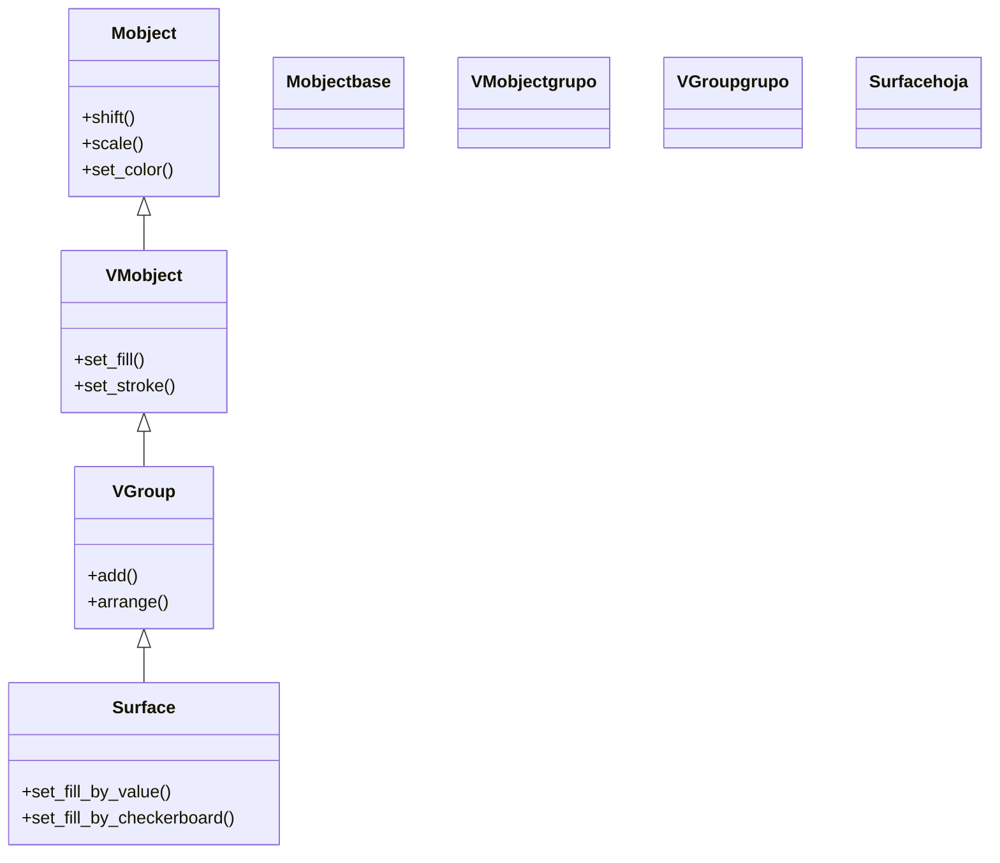

# Surface — superficie paramétrica (el análogo 3D de ParametricFunction)

`Surface` dibuja una **superficie paramétrica**: el análogo tridimensional de [[ParametricFunction]]. Donde una curva paramétrica recorre **un** parámetro `t` y devuelve un punto, una superficie recorre **dos** parámetros (`u`, `v`) y, para cada pareja, su función `func(u, v)` devuelve un **punto 3D** `np.array([x, y, z])`. Manim muestrea una rejilla de valores `(u, v)` —tantos como diga `resolution`—, evalúa la función en cada nodo y cose los puntos en una malla de cuadritos coloreados que forman la superficie. Es la herramienta general para todo lo que tenga volumen y se pueda escribir como `(x, y, z) = func(u, v)`: paraboloides, sillas de montar, conos, toros, esferas deformadas y, sobre todo, las superficies `z = f(x, y)` graficadas sobre unos [[ThreeDAxes]]. Conceptualmente es "una sábana parametrizada por `(u, v)` que se dobla en el espacio". Como todo [[concepto_mobject|Mobject]], se crea, posiciona, colorea y anima con el repertorio común.

> [!important] Los objetos 3D solo se ven bien dentro de una ThreeDScene
> Una `Surface` (y todo lo 3D) solo se ve con volumen dentro de una [[ThreeDScene]] —o una escena con cámara 3D— orientando la cámara con `self.set_camera_orientation(phi, theta)`. En una `Scene` normal la cámara mira siempre de frente (`phi=0`) y la superficie se ve plana, de frente, como si fuera un dibujo 2D. Un punto de vista típico para verla en perspectiva es `phi=70 * DEGREES, theta=-45 * DEGREES`.

## Importacion

```python
from manim import Surface
# o, como es habitual en todo ejemplo de Manim:
from manim import *
import numpy as np   # la func casi siempre construye el punto con numpy
```

La función que pasas suele construir el punto con numpy (`np.array([...])`, `np.cos`, `np.sin`), así que `import numpy as np` acompaña casi siempre a esta clase.

## Herencia

### La cadena

`Surface` hereda de [[VGroup]] (vía `VMobject`/`Mobject`): por dentro es un **grupo de muchos cuadritos** (los parches de la malla), cada uno un VMobject pequeño con su relleno; por eso se mueve, escala y anima como un todo. De `VMobject` saca el relleno y el trazo; de `Mobject`, todo lo universal (posición, color, animación). Lo que añade es el **muestreo doble**: recorrer la rejilla `u_range × v_range` y generar la malla de parches a partir de `func(u, v)`.



### Que aporta cada ancestro

| Viene de | Qué aporta a la superficie |
|----------|----------------------------|
| `Mobject` | posición, escala, giro, color y la capacidad de animarse |
| `VMobject` | el **relleno** (`fill_opacity`, `fill_color`) y el **trazo** (`stroke_width`) de cada parche |
| `VGroup` | comportarse como **grupo** de los muchos cuadritos de la malla (mover la superficie los mueve todos) |
| `Surface` (propio) | el **muestreo doble** de `func` sobre la rejilla `u_range × v_range` y la malla resultante |

`Surface` es el análogo 3D de [[ParametricFunction]]: donde aquella muestrea un parámetro, esta muestrea dos.

## Constructor

```python
Surface(
    func,                                   # (u, v) -> np.array([x, y, z])   (la superficie)
    u_range: Sequence[float] = [0, 1],      # [u_min, u_max] del primer parametro
    v_range: Sequence[float] = [0, 1],      # [v_min, v_max] del segundo parametro
    resolution: Sequence[int] = (32, 32),   # (n_u, n_v): cuadros de la malla en cada eje
    fill_opacity: float = 1.0,              # opacidad del relleno de cada parche
    checkerboard_colors: list = [BLUE_D, BLUE_E],  # los dos colores del damero
    stroke_width: float = 0.5,              # grosor del borde de cada cuadro
    stroke_color: ManimColor = LIGHT_GREY,  # color del borde
    should_make_jagged: bool = False,       # parches planos (sin suavizar normales)
    **kwargs,                               # -> a VGroup/VMobject
) -> Surface
```

### Parametros principales

| Parametro | Tipo | Defecto | Controla |
|-----------|------|---------|----------|
| `func` | `callable` | — (obligatorio) | la función `(u, v) -> punto`; **debe devolver** `np.array([x, y, z])` |
| `u_range` | `Sequence[float]` | `[0, 1]` | el rango del primer parámetro `u` como `[u_min, u_max]` |
| `v_range` | `Sequence[float]` | `[0, 1]` | el rango del segundo parámetro `v` como `[v_min, v_max]` |
| `resolution` | `Sequence[int]` | `(32, 32)` | número de cuadros de la malla `(n_u, n_v)`: más = más suave y más lento |

#### func: dos parametros, devuelve un punto 3D

El error clásico, hermano del de [[ParametricFunction]]. `func(u, v)` recibe **dos** parámetros y debe devolver un **punto entero** `np.array([x, y, z])`, no un escalar. Para una superficie `z = f(x, y)`, los dos parámetros **son** las coordenadas `x` e `y`, y la función las pasa tal cual rellenando la altura:

```python
# una silla de montar z = x^2 - y^2 (u hace de x, v hace de y)
lambda u, v: np.array([u, v, u**2 - v**2])
```

Para graficarla **sobre** unos [[ThreeDAxes]] respetando su escala, se envuelve el punto en `axes.c2p` (ver la versión completa):

```python
lambda u, v: axes.c2p(u, v, f(u, v))
```

#### resolution: el dial suavidad/velocidad

`resolution` es `(n_u, n_v)`, el número de subdivisiones de la malla en cada parámetro. Es el dial entre **calidad** y **tiempo de render**: `(8, 8)` se ve facetada pero renderiza al instante; `(64, 64)` queda muy suave pero pesa cuatro veces más que `(32, 32)`. Para iterar conviene empezar bajo (p. ej. `(16, 16)`) y subir solo para el render final.

```python
Surface(func, resolution=(8, 8))     # rapida, facetada (para probar)
Surface(func, resolution=(48, 48))   # suave, lenta (para el render final)
```

### Parametros de estilo

El aspecto de la superficie: cómo se rellena y qué borde tienen los cuadros.

| Parametro | Tipo | Defecto | Para que |
|-----------|------|---------|----------|
| `fill_opacity` | `float` | `1.0` | opacidad del relleno; bájala (`0.7`) para ver lo que la superficie tapa |
| `checkerboard_colors` | `list` | `[BLUE_D, BLUE_E]` | los **dos** colores que se alternan en damero; pon `False` para color liso |
| `stroke_width` | `float` | `0.5` | grosor del borde de cada parche (la malla); `0` lo oculta |
| `stroke_color` | `ManimColor` | `LIGHT_GREY` | color de esos bordes |

### Que construye

Devuelve un `Surface`: un [[VGroup]] de muchos parches (los cuadritos de la malla) que juntos forman la sábana 3D. Es un objeto **dibujable y estático**: hay que añadirlo (`self.add(sup)`) o animarlo (`self.play(Create(sup))`), y siempre dentro de una [[ThreeDScene]] para que se vea con volumen. Se anima entero con `Create(sup)` (se va dibujando) o `FadeIn`, y se transforma como cualquier Mobject.

## Metodos clave

Buena parte de lo que harás son métodos heredados de [[VMobject]]/[[Mobject]] (`set_fill`, `set_color`, `shift`, `rotate`). Los propios y más útiles colorean la superficie según una regla.

### Colorear

Lo distintivo de `Surface`: pintarla según la altura u otro criterio, en vez de un color plano.

| Metodo | Firma | Que hace |
|--------|-------|----------|
| `set_fill_by_value` | `sup.set_fill_by_value(axes, colorscale, axis=2) -> Self` | colorea cada punto según su **valor** sobre un eje (por defecto la altura z); `colorscale` es una lista de colores o pares `(color, valor)` |
| `set_fill_by_checkerboard` | `sup.set_fill_by_checkerboard(*colors, opacity=None) -> Self` | aplica el patrón de **damero** con los colores dados (lo mismo que `checkerboard_colors` pero a posteriori) |
| `set_style` | `sup.set_style(fill_opacity=..., stroke_width=...) -> Self` | ajusta relleno y trazo de toda la malla de golpe |

```python
# colorear la superficie por altura, de azul (bajo) a rojo (alto)
superficie.set_fill_by_value(axes=ejes, colorscale=[(BLUE, -2), (GREEN, 0), (RED, 2)])
```

## Ejemplo

### Version minima

Un paraboloide `z = x^2 + y^2` visto en perspectiva. Lo mínimo: una `func(u, v)` que devuelve el punto 3D y la cámara orientada.

```python
from manim import *
import numpy as np

class ParaboloideMinimo(ThreeDScene):
    def construct(self):
        # sin esta orientacion la superficie se veria plana, de frente
        self.set_camera_orientation(phi=70 * DEGREES, theta=-45 * DEGREES)

        superficie = Surface(
            lambda u, v: np.array([u, v, 0.3 * (u**2 + v**2)]),
            u_range=[-2, 2],
            v_range=[-2, 2],
            resolution=(20, 20),
        )

        self.play(Create(superficie), run_time=3)
        self.wait()
```

```bash
manim -pql archivo.py ParaboloideMinimo      # -p reproduce, -ql = calidad baja (rapido)
```

### Version completa

El caso realista y el más típico: una **silla de montar** `z = x^2 - y^2` graficada **sobre** unos [[ThreeDAxes]] traduciendo cada punto con `c2p` (así respeta la escala de los ejes), coloreada por altura con `set_fill_by_value`, con un título fijo a la pantalla (HUD) y una órbita de cámara final. Nótese el patrón `lambda u, v: ejes.c2p(u, v, f(u, v))`: es el puente entre la superficie y el sistema de ejes.

```python
from manim import *
import numpy as np

class SillaDeMontar(ThreeDScene):
    def construct(self):
        # 1. punto de vista en perspectiva
        self.set_camera_orientation(phi=70 * DEGREES, theta=-45 * DEGREES, zoom=0.9)

        ejes = ThreeDAxes(x_range=[-3, 3, 1], y_range=[-3, 3, 1], z_range=[-4, 4, 1])
        etiquetas = ejes.get_axis_labels(x_label="x", y_label="y", z_label="z")

        # 2. z = x^2 - y^2, graficada SOBRE los ejes via c2p
        def f(x, y):
            return 0.5 * (x**2 - y**2)

        superficie = Surface(
            lambda u, v: ejes.c2p(u, v, f(u, v)),
            u_range=[-3, 3],
            v_range=[-3, 3],
            resolution=(28, 28),
            fill_opacity=0.85,
        )
        # 3. colorear por altura, de azul (valles) a rojo (crestas)
        superficie.set_fill_by_value(
            axes=ejes, colorscale=[(BLUE, -4), (GREEN, 0), (RED, 4)]
        )

        # 4. titulo FIJO a la pantalla: no rota con la camara 3D
        titulo = Text("z = 0.5 (x^2 - y^2)", font_size=28).to_corner(UL)
        self.add_fixed_in_frame_mobjects(titulo)

        # 5. construir la escena
        self.play(Create(ejes), Write(etiquetas))
        self.play(Create(superficie), run_time=3)
        self.wait()

        # 6. orbitar para apreciar el volumen
        self.begin_ambient_camera_rotation(rate=0.3, about="theta")
        self.wait(6)
        self.stop_ambient_camera_rotation()
        self.wait()
```

```bash
manim -pqh archivo.py SillaDeMontar     # -qh = calidad alta para el render final
```

### Variaciones

Una superficie de revolución cerrada (un **toro**) parametrizada con dos ángulos, para ver que `u` y `v` no tienen por qué ser `x` e `y`: aquí son los dos ángulos del toro.

```python
from manim import *
import numpy as np

class Toro(ThreeDScene):
    def construct(self):
        self.set_camera_orientation(phi=70 * DEGREES, theta=-45 * DEGREES)

        R, r = 2, 0.7    # radio mayor y menor del toro
        toro = Surface(
            lambda u, v: np.array([
                (R + r * np.cos(v)) * np.cos(u),
                (R + r * np.cos(v)) * np.sin(u),
                r * np.sin(v),
            ]),
            u_range=[0, TAU],
            v_range=[0, TAU],
            resolution=(40, 20),
            checkerboard_colors=[TEAL_D, TEAL_E],
            fill_opacity=1.0,
        )

        self.play(Create(toro), run_time=3)
        self.wait()
```

```bash
manim -pql archivo.py Toro
```

## Errores comunes

| Error | Causa | Solución |
|-------|-------|----------|
| La superficie se ve plana, de frente | usaste una `Scene` normal o no llamaste `set_camera_orientation` | hereda de [[ThreeDScene]] y orienta la cámara: `set_camera_orientation(phi=70*DEGREES, theta=-45*DEGREES)` |
| `could not broadcast` / forma rara | `func` devuelve un número, no `np.array([x, y, z])` | devuelve un **punto 3D**; recuerda que `func` recibe dos parámetros `(u, v)` |
| `func() missing 1 required positional argument` | definiste `func(u)` con un solo parámetro | una superficie necesita **dos**: `func(u, v)` |
| La superficie no encaja con los ejes / cae fuera | la graficaste con coordenadas a pelo, sin traducir | usa `lambda u, v: axes.c2p(u, v, f(u, v))` para respetar la escala de [[ThreeDAxes]] |
| Se ve facetada, con caras grandes | `resolution` demasiado baja | súbela, p. ej. `resolution=(32, 32)` o más (a costa de tiempo de render) |
| Tarda muchísimo en renderizar | `resolution` enorme | bájala para iterar; sube solo para el render final |
| `NameError: name 'np' is not defined` | faltó `import numpy as np` | añádelo junto a `from manim import *` |

## Notas relacionadas

- [[ParametricFunction]] — su análogo 2D: una curva muestreando **un** parámetro en vez de dos
- [[ThreeDAxes]] — los ejes sobre los que se grafica una superficie `z = f(x, y)` via `c2p`
- [[ThreeDScene]] — la escena que hace falta para ver la superficie con volumen y orientar la cámara
- [[VGroup]] — la clase padre: por qué la superficie se comporta como un grupo de parches
- [[concepto_sistema_coordenadas]] — coordenadas de escena vs matemáticas y el porqué de `c2p`
- [[concepto_mobject]] — el modelo de objeto dibujable que se crea, anima y transforma
- [[Manim/mobjects/3d/index | 3d]] — la carpeta de los Mobjects tridimensionales
