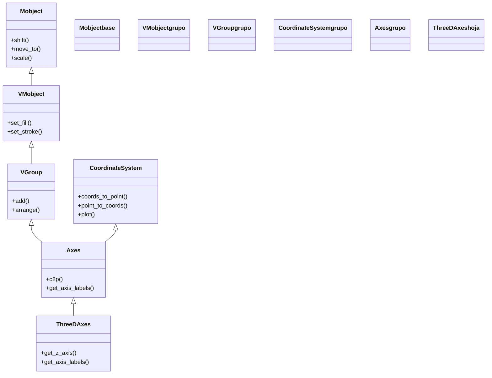

# ThreeDAxes — sistema de ejes cartesianos en tres dimensiones

`ThreeDAxes` es el Mobject que dibuja un **sistema de ejes 3D** (un eje x, un eje y y un eje z) y, con ellos, abre un sistema de coordenadas matemático tridimensional sobre la escena: el sitio donde colocas puntos por sus coordenadas `(x, y, z)`, dibujas curvas en el espacio y, sobre todo, grafica superficies con [[Surface]]. Es el análogo 3D de [[Axes]] —de hecho **hereda de él**— así que arrastra toda su maquinaria de coordenadas (`c2p`, `plot`, etiquetas) pero ahora con un eje más. La idea que **no** puedes saltarte es la misma que en 2D, elevada a tres dimensiones: el punto matemático `(2, 3, 4)` **no** está en la coordenada de escena `(2, 3, 4)`, porque los ejes viven escalados y posicionados; para pasar del mundo matemático al de la escena se usa `axes.c2p(2, 3, 4)`, que ahora recibe **tres** coordenadas. Esa conversión es el corazón de la clase y el puente por el que pasa todo lo que dibujes sobre los ejes 3D, igual que en [[Axes]].

> [!important] Los objetos 3D solo se ven bien dentro de una ThreeDScene
> Unos `ThreeDAxes` (y todo lo 3D) solo se ven con volumen dentro de una [[ThreeDScene]] —o una escena con cámara 3D— orientando la cámara con `self.set_camera_orientation(phi, theta)`. En una `Scene` normal la cámara mira siempre de frente (`phi=0`) y los ejes se ven planos, de canto: el eje z apenas se distingue. Un punto de vista típico para verlos en perspectiva es `phi=70 * DEGREES, theta=-45 * DEGREES`.

## Importacion

```python
from manim import ThreeDAxes
# o, como es habitual en todo ejemplo de Manim:
from manim import *
import numpy as np   # casi siempre hace falta np para construir puntos 3D
```

## Herencia

### La cadena

`ThreeDAxes` hereda **directamente** de [[Axes]], que a su vez es un [[VGroup]] (un contenedor de sus tres ejes, por eso se mueve y se anima como un todo) y mezcla el mixin `CoordinateSystem` (de donde salen `c2p`, `plot`, `get_axis_labels`). Lo único que `ThreeDAxes` añade sobre `Axes` es el **tercer eje (z)** y las etiquetas y configuración asociadas: toda la aritmética de coordenadas ya venía de arriba, solo que ahora trabaja con tres dimensiones.



### Que hereda

Casi todo lo importante de `ThreeDAxes` es heredado de [[Axes]]; lo propio se reduce al tercer eje. La tabla deja claro de dónde sale cada capacidad.

| Capacidad | Método típico | Definido en |
|-----------|---------------|-------------|
| Posición y escala en la escena | `shift`, `move_to`, `scale` | [[Mobject]] |
| Comportarse como grupo de sus ejes | `add`, indexar `axes[0]`/`axes[1]`/`axes[2]` (x/y/z) | [[VGroup]] |
| Convertir coordenadas matemáticas ↔ escena | `c2p` / `coords_to_point` (ahora con 3 coords), `p2c` | `CoordinateSystem` (vía [[Axes]]) |
| Graficar curvas respetando la escala | `plot`, `plot_parametric_curve` | `CoordinateSystem` (vía [[Axes]]) |
| El **tercer eje z** y sus etiquetas | `get_axis_labels(x, y, z)`, `get_z_axis` | `ThreeDAxes` |

## Constructor

```python
ThreeDAxes(
    x_range: Sequence[float] = [-6, 6, 1],   # [min, max, step] del eje x (coords MATEMATICAS)
    y_range: Sequence[float] = [-5, 5, 1],   # [min, max, step] del eje y
    z_range: Sequence[float] = [-4, 4, 1],   # [min, max, step] del eje z (la dimension nueva)
    x_length: float | None = 10.5,           # largo del eje x en unidades de ESCENA
    y_length: float | None = 10.5,           # largo del eje y en unidades de escena
    z_length: float | None = 6.5,            # largo del eje z en unidades de escena
    z_axis_config: dict = {},                # estilo solo del eje z
    z_normal: np.ndarray = [-1, 0, 0],       # direccion normal del plano del eje z
    axis_config: dict = {},                  # estilo comun a los tres ejes
    **kwargs,                                # -> a Axes (tips, x_axis_config, y_axis_config...)
) -> ThreeDAxes
```

### Parametros principales

| Parametro | Tipo | Defecto | Controla |
|-----------|------|---------|----------|
| `x_range` | `Sequence[float]` | `[-6, 6, 1]` | rango del eje x como `[min, max, step]`: empieza en `min`, llega a `max`, una marca cada `step` |
| `y_range` | `Sequence[float]` | `[-5, 5, 1]` | lo mismo para el eje y |
| `z_range` | `Sequence[float]` | `[-4, 4, 1]` | lo mismo para el eje z, la dimensión que `Axes` no tenía |
| `x_length` | `float \| None` | `10.5` | largo **físico** del eje x en unidades de escena; `None` deja que Manim lo ajuste |
| `y_length` | `float \| None` | `10.5` | largo físico del eje y en unidades de escena |
| `z_length` | `float \| None` | `6.5` | largo físico del eje z en unidades de escena |

#### Los tres rangos son [min, max, step] (la misma trampa que en Axes)

Igual que en [[Axes]], cada `*_range` **no** es `[min, max]`: es `[min, max, step]`, donde el tercer número es el **paso entre marcas**. La diferencia entre el rango **matemático** (`z_range`, en unidades del gráfico) y el largo **físico** (`z_length`, en unidades de escena) es justo lo que hace que el punto matemático `(2, 3, 4)` no caiga en la coordenada de escena `(2, 3, 4)`: los ejes están escalados, y por eso todo pasa por `c2p`.

```python
ThreeDAxes(z_range=[0, 8, 2])              # z va de 0 a 8, una marca cada 2 unidades
ThreeDAxes(z_range=[-4, 4, 1], z_length=5) # z matematico de -4 a 4, midiendo 5 de alto en escena
```

### Parametros de estilo

El aspecto de los ejes se controla con los diccionarios `*_config`, que se reenvían a los [[NumberLine]] internos de cada eje.

| Parametro | Tipo | Para que |
|-----------|------|----------|
| `axis_config` | `dict` | estilo **común** a los tres ejes: `{"color": GREY, "stroke_width": 2}` |
| `z_axis_config` | `dict` | sobreescribe solo el eje z (p. ej. `{"include_numbers": True}`) |
| `z_normal` | `np.ndarray` | la dirección normal del plano sobre el que se dibuja el eje z; rara vez se toca |

### Que construye

Devuelve un `ThreeDAxes`: un [[VGroup]] cuyos tres hijos son los ejes (`axes[0]` el x, `axes[1]` el y, `axes[2]` el z), ya escalados y centrados. Es un objeto **dibujable y estático**: hay que añadirlo (`self.add(ejes)`) o animarlo (`self.play(Create(ejes))`), y todo ello dentro de una [[ThreeDScene]] para que se vea con volumen. Lo importante, idéntico a `Axes`: a partir de tenerlo, **todo dato del gráfico se coloca a través de `axes.c2p(x, y, z)`**.

## c2p en 3D — el puente entre el grafico y la escena (lo mas importante)

> [!important] Todo lo que pongas sobre los ejes pasa por c2p, ahora con 3 coordenadas
> Los ejes viven **escalados y posicionados** dentro de la escena, así que el punto matemático `(2, 3, 4)` **NO** está en la coordenada de escena `(2, 3, 4)`. Heredado de [[Axes]], `c2p` (alias de `coords_to_point`) traduce **coordenadas del gráfico → punto de la escena**, pero en `ThreeDAxes` recibe **tres** argumentos: `axes.c2p(x, y, z)`. Un `Dot3D`, una etiqueta, una curva o —sobre todo— una [[Surface]] se posicionan con `c2p`, nunca con coordenadas a pelo.

```python
from manim import *

class PuntoEn3D(ThreeDScene):
    def construct(self):
        self.set_camera_orientation(phi=70 * DEGREES, theta=-45 * DEGREES)
        ejes = ThreeDAxes()

        # MAL: Dot3D([2, 3, 4]) usaria coordenadas de ESCENA -> cae fuera de los ejes
        # BIEN: traducir el punto matematico (2, 3, 4) con c2p (tres coords):
        punto = Dot3D(ejes.c2p(2, 3, 4), color=YELLOW)

        self.add(ejes, punto)
        self.wait()
```

```bash
manim -pql archivo.py PuntoEn3D      # -p reproduce, -ql = calidad baja (rapido)
```

## Metodos clave

Como `ThreeDAxes` hereda de [[Axes]], casi todos sus métodos útiles vienen de allí (del mixin `CoordinateSystem`). Lo propio es la versión 3D de las etiquetas y el acceso al eje z.

### Convertir coordenadas

El puente entre los dos mundos, ahora en tres dimensiones.

| Metodo | Firma | Que hace |
|--------|-------|----------|
| `c2p` | `axes.c2p(x, y, z) -> np.ndarray` | **coords → punto**: convierte `(x, y, z)` matemáticos al punto de la escena (alias de `coords_to_point`) |
| `p2c` | `axes.p2c(point) -> np.ndarray` | **punto → coords**: el inverso, de un punto de escena a las coordenadas del gráfico |

### Anotar

Las etiquetas de los **tres** ejes; es la diferencia visible respecto a `Axes`, que solo etiqueta dos.

| Metodo | Firma | Que hace |
|--------|-------|----------|
| `get_axis_labels` | `axes.get_axis_labels(x_label="x", y_label="y", z_label="z") -> VGroup` | crea las etiquetas de los tres ejes (acepta texto o `MathTex`) |
| `get_z_axis` | `axes.get_z_axis() -> NumberLine` | devuelve el eje z como objeto, para estilizarlo aparte |
| `add_coordinates` | `axes.add_coordinates(*values) -> Self` | escribe los números en las marcas de los ejes |

### Graficar sobre los ejes

Heredados de [[Axes]], dibujan respetando la escala de los ejes. En 3D, la pieza estrella para graficar es combinar `c2p` con una [[Surface]].

| Metodo | Firma | Que hace |
|--------|-------|----------|
| `plot_parametric_curve` | `axes.plot_parametric_curve(function, t_range=..., **kwargs)` | dibuja una curva 3D `(x(t), y(t), z(t))` respetando la escala |
| `plot` | `axes.plot(function, x_range=None, **kwargs)` | la curva `y = f(x)` (queda en el plano z=0); para volumen usa [[Surface]] |

## Ejemplo

### Version minima

Unos ejes 3D etiquetados, vistos en perspectiva. Lo mínimo para entender que sin `set_camera_orientation` se verían planos.

```python
from manim import *

class EjesMinimos3D(ThreeDScene):
    def construct(self):
        # sin esta orientacion la camara mira de frente y los ejes se ven planos
        self.set_camera_orientation(phi=70 * DEGREES, theta=-45 * DEGREES)

        ejes = ThreeDAxes()
        etiquetas = ejes.get_axis_labels(x_label="x", y_label="y", z_label="z")

        self.play(Create(ejes), Write(etiquetas))
        self.wait()
```

```bash
manim -pql archivo.py EjesMinimos3D      # -p reproduce, -ql = calidad baja (rapido)
```

### Version completa

El caso realista: ejes 3D etiquetados, un **punto anclado** en el espacio con `c2p` (tres coordenadas), una **curva 3D** (una hélice) dibujada con `c2p` punto a punto, un título fijo a la pantalla (HUD) y una órbita de cámara para apreciar la profundidad. Nótese cómo cada punto de la hélice pasa por `ejes.c2p(...)`: a pelo caería en el sitio equivocado.

```python
from manim import *
import numpy as np

class EjesCompletos3D(ThreeDScene):
    def construct(self):
        # 1. punto de vista en perspectiva
        self.set_camera_orientation(phi=70 * DEGREES, theta=-45 * DEGREES, zoom=0.9)

        ejes = ThreeDAxes(x_range=[-5, 5, 1], y_range=[-5, 5, 1], z_range=[0, 6, 1])
        etiquetas = ejes.get_axis_labels(x_label="x", y_label="y", z_label="z")

        # 2. un punto ANCLADO en el espacio: (2, 3, 4) matematico, via c2p con 3 coords
        punto = Dot3D(ejes.c2p(2, 3, 4), color=RED)

        # 3. una helice: cada punto (cos t, sin t, t) traducido con c2p
        helice = ParametricFunction(
            lambda t: ejes.c2p(2 * np.cos(t), 2 * np.sin(t), 0.4 * t),
            t_range=[0, 4 * PI, 0.05],
            color=YELLOW,
        )

        # 4. titulo FIJO a la pantalla: no rota con la camara 3D
        titulo = Text("Ejes 3D + helice via c2p", font_size=28).to_corner(UL)
        self.add_fixed_in_frame_mobjects(titulo)

        # 5. construir la escena
        self.play(Create(ejes), Write(etiquetas))
        self.play(FadeIn(punto), Create(helice), run_time=3)
        self.wait()

        # 6. orbitar para apreciar la profundidad
        self.begin_ambient_camera_rotation(rate=0.3, about="theta")
        self.wait(6)
        self.stop_ambient_camera_rotation()
        self.wait()
```

```bash
manim -pqh archivo.py EjesCompletos3D     # -qh = calidad alta para el render final
```

### Variaciones

Combinar los ejes con una [[Surface]]: el uso más típico de `ThreeDAxes`. La superficie se grafica **sobre** los ejes traduciendo cada punto con `c2p`.

```python
from manim import *
import numpy as np

class EjesConSuperficie(ThreeDScene):
    def construct(self):
        self.set_camera_orientation(phi=70 * DEGREES, theta=-45 * DEGREES)
        ejes = ThreeDAxes(x_range=[-3, 3, 1], y_range=[-3, 3, 1], z_range=[-2, 2, 1])

        # z = f(x, y) graficado sobre los ejes via c2p (ver la nota de Surface)
        superficie = Surface(
            lambda u, v: ejes.c2p(u, v, 0.3 * (u**2 - v**2)),
            u_range=[-3, 3],
            v_range=[-3, 3],
            resolution=(24, 24),
            fill_opacity=0.8,
        )

        self.play(Create(ejes))
        self.play(Create(superficie), run_time=3)
        self.wait()
```

```bash
manim -pql archivo.py EjesConSuperficie
```

## Errores comunes

| Error | Causa | Solución |
|-------|-------|----------|
| Los ejes se ven planos, el eje z no se distingue | usaste una `Scene` normal o no llamaste `set_camera_orientation` | hereda de [[ThreeDScene]] y orienta la cámara: `set_camera_orientation(phi=70*DEGREES, theta=-45*DEGREES)` |
| El `Dot3D`/curva cae fuera de los ejes o en mal sitio | lo colocaste con coordenadas de escena, sin traducir | usa `ejes.c2p(x, y, z)` con las **tres** coordenadas |
| `c2p` ignora la tercera coordenada o da error | le pasaste solo `(x, y)` esperando 2D | en `ThreeDAxes`, `c2p` recibe tres argumentos: `c2p(x, y, z)` |
| Las marcas salen espaciadas raro | confundiste `z_range=[min, max]` con `[min, max, step]` | el tercer número es el paso entre marcas: `z_range=[0, 8, 2]` |
| Los ángulos de cámara apenas giran o giran de más | pasaste grados como radianes (`phi=70`) | multiplica por `DEGREES`: `phi=70*DEGREES` |
| `NameError: name 'ThreeDAxes' is not defined` | faltó el import | `from manim import *` al inicio |

## Notas relacionadas

- [[Axes]] — la clase padre 2D: de ahí salen `c2p`, `plot` y toda la maquinaria de coordenadas
- [[Surface]] — el otro pilar 3D: superficies paramétricas que se grafican **sobre** estos ejes via `c2p`
- [[ThreeDScene]] — la escena que hace falta para ver estos ejes con volumen y orientar la cámara
- [[NumberLine]] — el eje individual del que `ThreeDAxes` construye sus tres ejes
- [[concepto_sistema_coordenadas]] — coordenadas de escena vs matemáticas y el porqué de `c2p`
- [[VGroup]] — la clase abuela: por qué los ejes se comportan como un grupo
- [[Manim/mobjects/3d/index | 3d]] — la carpeta de los Mobjects tridimensionales
