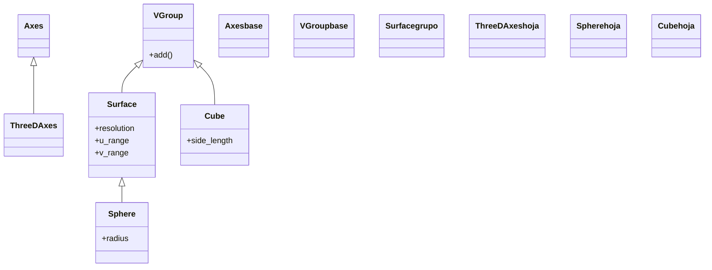

# 3d — los objetos tridimensionales (ejes, superficies, sólidos)

Esta carpeta reúne los Mobjects que viven en el **espacio tridimensional**: los ejes 3D ([[ThreeDAxes]]), las superficies paramétricas ([[Surface]] y su caso particular [[Sphere]]) y los sólidos rectos ([[Cube]]). A diferencia de las figuras planas, estos objetos tienen profundidad real en el eje Z, y eso impone una condición que gobierna toda la carpeta: **solo se ven bien en una [[ThreeDScene]] con la cámara orientada**. Mientras una [[Scene]] normal mira siempre de frente —y aplastaría una esfera contra el plano—, la `ThreeDScene` permite inclinar y girar el punto de vista con `set_camera_orientation(phi, theta)`, que es lo que delata el volumen. Por eso, antes de elegir qué objeto 3D usar, lo primero es heredar de la escena correcta y colocar la cámara.

> [!important] Los objetos 3D solo se ven bien en una [[ThreeDScene]]
> Cualquier objeto de esta carpeta añadido a una [[Scene]] normal se ve plano. Hay que estar en una [[ThreeDScene]] y orientar la cámara con `self.set_camera_orientation(phi, theta)` para apreciar la profundidad.

## En accion

Una escena 3D ejecutable que combina los elementos típicos de la carpeta: unos ejes tridimensionales y una esfera, vistos en perspectiva gracias a `set_camera_orientation`. Cambiar `phi`/`theta` cambia el ángulo desde el que se observa todo.

```python
from manim import *

class Escena3D(ThreeDScene):
    def construct(self):
        self.set_camera_orientation(phi=70 * DEGREES, theta=-45 * DEGREES)

        ejes = ThreeDAxes()
        esfera = Sphere(radius=1.5, checkerboard_colors=[BLUE_D, BLUE_E], fill_opacity=0.8)

        self.play(Create(ejes))
        self.play(Create(esfera), run_time=3)
        self.wait()
```

```bash
manim -pql archivo.py Escena3D      # -p reproduce, -ql = calidad baja (rapido)
```

## Herencia

Los objetos 3D no forman una sola rama: los ejes cuelgan de [[Axes]], las superficies (incluida la esfera) son [[VGroup]] de parches vía [[Surface]], y el cubo es directamente un [[VGroup]] de seis caras. Lo que comparten no es el árbol de clases sino el requisito de la cámara 3D.



## Clases que aporta

Las cuatro clases de la carpeta, con su padre directo y su uso. Las que ya tienen nota se enlazan.

| Clase | Hereda de | Para que |
|-------|-----------|----------|
| [[ThreeDAxes]] | `Axes` | un sistema de ejes X, Y, Z para situar y graficar en 3D |
| [[Surface]] | `VGroup` | una superficie paramétrica genérica `z = f(x, y)` o `(x, y, z) = f(u, v)` |
| [[Sphere]] | `Surface` | una esfera (caso particular de superficie de revolución) |
| [[Cube]] | `VGroup` | un cubo (sólido de seis caras cuadradas); su hermano `Prism` da cajas no cúbicas |

## Como verlo en 3D

El objeto 3D es solo la mitad: la otra mitad es **desde dónde se mira**. El flujo siempre es el mismo.

1. **Hereda de [[ThreeDScene]]**, no de [[Scene]]: es lo que aporta la cámara que entiende ángulos esféricos.
2. **Orienta la cámara** al inicio del `construct` con `set_camera_orientation(phi, theta)`. Los ángulos son esféricos:
   - `phi` (inclinación / elevación): el ángulo respecto al eje Z. `phi=0` mira en picado desde arriba (todo se ve plano); `phi=90°` mira de canto, a la altura del plano XY. Un valor "en perspectiva" típico es `70 * DEGREES`.
   - `theta` (azimut): el giro alrededor del eje Z, es decir, hacia qué lado rodea la cámara la escena. `-45 * DEGREES` es un clásico de tres cuartos.
3. **(Opcional) deja la cámara orbitando** con `begin_ambient_camera_rotation(rate, about="theta")` y un `self.wait(...)` en medio, para ver el objeto desde todos los lados sin tocarlo; ciérrala con `stop_ambient_camera_rotation`.

> [!tip] Por qué `DEGREES`
> Manim trabaja en **radianes**. `DEGREES` es la constante que convierte grados a radianes (`70 * DEGREES`), para escribir ángulos legibles. Si pones `phi=70` a secas, son 70 radianes (más de 11 vueltas) y el resultado es absurdo.

## Patrones y recetas

Dos recetas que se repiten al trabajar con esta carpeta: graficar una superficie sobre los ejes, y mostrar un sólido con la cámara en movimiento.

### Graficar una superficie z = f(x, y) sobre ThreeDAxes

Una [[Surface]] paramétrica representa una función de dos variables; usando `c2p` (coordinates-to-point) de los [[ThreeDAxes]] la superficie queda **anclada al sistema de ejes**, no al espacio absoluto, de modo que respeta la escala de los ejes.

```python
from manim import *

class GraficarSuperficie(ThreeDScene):
    def construct(self):
        self.set_camera_orientation(phi=70 * DEGREES, theta=-45 * DEGREES, zoom=0.9)
        ejes = ThreeDAxes(x_range=[-3, 3], y_range=[-3, 3], z_range=[-2, 2])

        superficie = Surface(
            lambda u, v: ejes.c2p(u, v, 0.4 * np.sin(u) * np.cos(v)),  # anclada a los ejes
            u_range=[-3, 3],
            v_range=[-3, 3],
            resolution=(24, 24),
            fill_opacity=0.8,
            checkerboard_colors=[BLUE_D, BLUE_E],
        )

        self.play(Create(ejes))
        self.play(Create(superficie), run_time=3)
        self.wait()
```

```bash
manim -pql archivo.py GraficarSuperficie
```

### Un solido girando con la camara orbitando

Para lucir un [[Cube]] o una [[Sphere]] como sólido se combinan dos movimientos: el objeto puede girar (`Rotate`) y la cámara orbitar a su alrededor (`begin_ambient_camera_rotation`). Cualquiera de los dos revela el volumen; juntos, aún más.

```python
from manim import *

class SolidoOrbitando(ThreeDScene):
    def construct(self):
        self.set_camera_orientation(phi=70 * DEGREES, theta=-45 * DEGREES)

        cubo = Cube(side_length=2, fill_color=BLUE, fill_opacity=0.8, stroke_width=2)
        self.play(FadeIn(cubo))

        # la camara orbita mientras el cubo gira sobre si mismo
        self.begin_ambient_camera_rotation(rate=0.3, about="theta")
        self.play(Rotate(cubo, angle=2 * PI, axis=UP), run_time=5)
        self.stop_ambient_camera_rotation()
        self.wait()
```

```bash
manim -pqh archivo.py SolidoOrbitando     # -qh = alta calidad para el render final
```

## Notas relacionadas

- [[ThreeDScene]] — la escena 3D imprescindible: aporta `set_camera_orientation`, `move_camera` y la órbita ambiental
- [[Sphere]] · [[Cube]] — los sólidos básicos de la carpeta
- [[Surface]] · [[ThreeDAxes]] — la superficie paramétrica genérica y los ejes 3D
- [[concepto_sistema_coordenadas]] — el espacio 3D, el eje Z y las direcciones (`OUT`, `IN`)
- [[concepto_mobject]] — qué es un Mobject y los métodos que todos comparten
- [[Manim/mobjects/index | mobjects]] — la carpeta padre con todos los objetos dibujables
- [[Manim/escena/index | escena]] — la `Scene` y sus variantes, entre ellas la `ThreeDScene`
- [[Manim/index | Manim]] — el índice raíz con el `classDiagram` global
