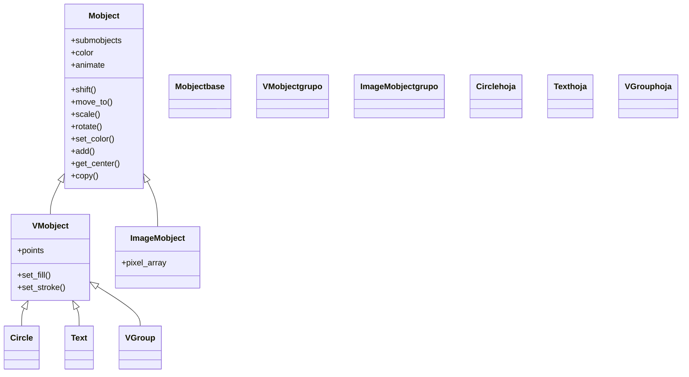

# Mobject — la clase base de todo lo dibujable

`Mobject` (de *Mathematical Object*) es la **clase raíz de todo lo que aparece en pantalla** en Manim: un círculo, un texto, una fórmula, un eje o un grupo de objetos son, en última instancia, Mobjects. No define **cómo se dibuja** una figura concreta —eso lo aportan las subclases—, sino el **comportamiento común** que todo objeto dibujable comparte: su **posición** en el espacio, su **árbol de submobjects** (los hijos que cuelgan de él) y la maquinaria que permite **animarlo**. Esta nota es la **referencia universal** a la que delegan todas las demás clases de mobject ([[Circle]], [[Text]], [[Axes]]…): cuando una de ellas documenta `shift`, `scale`, `move_to`, `set_color`, `get_center` o `.animate`, está usando lo que se hereda de aquí. En la práctica **casi nunca instanciarás `Mobject` directamente**: el objeto base útil del día a día es su subclase vectorizada [[VMobject]], que añade relleno y trazo. El modelo conceptual (points, submobjects, el árbol) vive en [[concepto_mobject]]; aquí se documenta la clase, su jerarquía, su constructor, sus métodos universales y sus atributos.

## Importacion

```python
from manim import Mobject
# en la practica, casi siempre se usa el import estrella:
from manim import *
```

`from manim import *` trae `Mobject` junto con todas sus subclases (`Circle`, `Text`, `MathTex`, `VGroup`…), las Animations y las constantes (`UP`, `BLUE`, `ORIGIN`…). Rara vez se escribe `Mobject(...)` a mano: es una **clase base** y el objeto práctico que se subclasea o se usa como contenedor genérico es [[VMobject]] (vectorizado, con `fill` y `stroke`). Importas `Mobject` directamente sobre todo para **anotar tipos** (`def colocar(m: Mobject) -> None`) o para comprobar con `isinstance(obj, Mobject)`.

## Herencia

### La jerarquia

`Mobject` es la **base de toda la familia de objetos dibujables**. Su subclase central es [[VMobject]] (objeto vectorizado con curvas de Bézier), y de `VMobject` cuelga la inmensa mayoría de lo que usarás: la geometría (`Circle`, `Square`), el texto (`Text`, `MathTex`), los gráficos (`Axes`) y los contenedores (`VGroup`). Hay también ramas que heredan de `Mobject` **sin pasar por `VMobject`** (por ejemplo `ImageMobject`, una imagen ráster), y por eso no aceptan `set_stroke` ni `set_fill`.



`Circle` y `Text` son aquí solo **ejemplos** de descendientes: la lista real es larga (todo el directorio [[Manim/mobjects/geometria/index | geometria]], [[Manim/mobjects/texto/index | texto]] y [[Manim/mobjects/graficos/index | graficos]] cuelga de `VMobject`). La cadena completa de una figura concreta se muestra en su propia nota; lo que importa aquí es que **todas terminan en `Mobject`**.

### Que es (y que NO es)

`Mobject` **define tres cosas** y deja una fuera a propósito:

| Aporta | Qué significa |
|--------|---------------|
| **Posición** | dónde está el objeto en el espacio (`shift`, `move_to`, `get_center`), usando las constantes del [[concepto_sistema_coordenadas\|sistema de coordenadas]] |
| **El árbol de submobjects** | la lista de hijos (`add`, `remove`, `get_family`); transformar al padre arrastra a toda la familia |
| **La capacidad de animarse** | la propiedad `.animate` y la compatibilidad con `Create`, `Transform`, `FadeIn`… |
| **NO: el dibujo concreto** | la **geometría** (qué forma tiene, qué puntos ocupa) la define **cada subclase** en su `__init__` |

Esta separación es la idea central: `Mobject` es un objeto **sin forma propia** que sabe posicionarse, anidar hijos y animarse; un `Circle` es un `Mobject` que además **sabe dibujar una circunferencia**. Por eso "aprender a mover y colorear un Mobject" es, literalmente, aprender a mover y colorear *cualquier* objeto de Manim (ver [[concepto_mobject]]). El detalle de **points vs submobjects** y del árbol vive en esa nota conceptual.

## Constructor

```python
Mobject(
    color: ManimColor = WHITE,   # color base del objeto
    name: str | None = None,     # nombre legible (por defecto, el de la clase)
    dim: int = 3,                # dimension del espacio de puntos (casi siempre 3: x, y, z)
    **kwargs,                    # se reenvian a la maquinaria interna
) -> Mobject
```

### Parametros

| Parametro | Tipo | Defecto | Controla |
|-----------|------|---------|----------|
| `color` | `ManimColor` | `WHITE` | el color base del objeto (constantes en MAYÚSCULAS: `RED`, `BLUE`…) |
| `name` | `str \| None` | `None` | un nombre legible para depurar; si es `None`, toma el nombre de la clase |
| `dim` | `int` | `3` | la dimensión del espacio de puntos; Manim trabaja en 3D (x, y, z) aunque la escena sea 2D |
| `**kwargs` | — | — | parámetros extra que las subclases (y `VMobject`) interpretan: `stroke_width`, `fill_opacity`… |

> [!nota] El estilo fino llega por `**kwargs`, no por `Mobject`
> `Mobject` solo conoce `color`. El relleno y el trazo (`fill_opacity`, `stroke_width`, `fill_color`, `stroke_color`) los entiende [[VMobject]], no la base. Por eso, cuando escribas `Circle(fill_opacity=0.5)`, ese kwarg lo procesa la rama vectorizada, no este constructor.

### Que construye

Devuelve un `Mobject` **vacío de geometría propia**: tiene posición (en `ORIGIN`), color y una lista de `submobjects` vacía, pero **no dibuja nada** por sí mismo. Por eso instanciar `Mobject()` directamente casi nunca tiene utilidad visual: sirve como **contenedor genérico** (al que añades hijos con `add`) o como base de la que **heredas** para definir tu propia geometría (ver [[concepto_herencia_mobjects]]). Para algo que se vea con borde y relleno, el punto de partida es [[VMobject]].

## Metodos clave

Estos métodos los tiene **cualquier** Mobject porque están definidos en la clase base: son el vocabulario que no cambia entre un círculo, un texto y una fórmula. Aquí casi siempre se usa la versión **instantánea** (aplica el cambio de golpe); para **animar** el mismo cambio se envuelve en `self.play(mob.animate.<metodo>(...))` (ver [[concepto_animate_syntax]]). Casi todos devuelven `self`, así que se **encadenan**: `Circle().shift(UP).set_color(RED).scale(2)`.

### Posicionar

Colocan el objeto en el espacio usando las constantes de dirección (`UP`, `DOWN`, `LEFT`, `RIGHT`, `UL`, `UR`, `ORIGIN`…). El detalle de cada uno, con todos sus parámetros, vive en [[posicionamiento]].

| Metodo | Firma | Que hace |
|--------|-------|----------|
| `shift` | `shift(*vectors) -> Self` | desplaza una cantidad **relativa** (`shift(RIGHT * 2)`) |
| `move_to` | `move_to(point_or_mobject) -> Self` | lleva el **centro** a una posición **absoluta** (un punto o el centro de otro mobject) |
| `next_to` | `next_to(mobject, direction=RIGHT, buff=0.25) -> Self` | lo coloca **al lado** de otro mobject, separado `buff` ([[next_to]]) |
| `to_edge` | `to_edge(edge=LEFT, buff=0.5) -> Self` | lo pega a un **borde** del marco |
| `to_corner` | `to_corner(corner=UL, buff=0.5) -> Self` | lo pega a una **esquina** del marco |
| `align_to` | `align_to(mobject, direction) -> Self` | alinea un lado con el de otro mobject (mismo borde superior, izquierdo…) |

### Transformar

Cambian el tamaño y la orientación. El ángulo va en **radianes** (`PI / 2`, `90 * DEGREES`); el eje, con las constantes (`OUT` = hacia el espectador, eje z).

| Metodo | Firma | Que hace |
|--------|-------|----------|
| `scale` | `scale(scale_factor, **kwargs) -> Self` | multiplica el **tamaño** por el factor (`2` = doble, `0.5` = mitad) |
| `rotate` | `rotate(angle, axis=OUT, about_point=None) -> Self` | **gira** `angle` radianes alrededor de `axis` |
| `stretch` | `stretch(factor, dim) -> Self` | estira solo en una dimensión (`dim=0` → x, `dim=1` → y) |
| `flip` | `flip(axis=UP) -> Self` | refleja el objeto respecto a un eje (espejo) |

### Color y estilo

`set_color` y `set_opacity` están en `Mobject`. El control fino del relleno y el trazo (`set_fill`, `set_stroke`) vive en [[VMobject]], porque necesita geometría vectorizada.

| Metodo | Firma | Que hace |
|--------|-------|----------|
| `set_color` | `set_color(color, family=True) -> Self` | tiñe el objeto (y por defecto toda su familia) a ese color |
| `set_opacity` | `set_opacity(opacity, family=True) -> Self` | fija la transparencia global (`0` invisible … `1` opaco) |

### Jerarquia (submobjects)

Construyen y recorren el árbol de hijos. **Al transformar al padre, se transforman todos los hijos** (es la regla que gobierna el posicionamiento de grupos).

| Metodo | Firma | Que hace |
|--------|-------|----------|
| `add` | `add(*mobjects) -> Self` | añade esos mobjects como **hijos** (entran en `submobjects`) |
| `remove` | `remove(*mobjects) -> Self` | saca esos hijos del árbol del padre |
| `get_family` | `get_family() -> list[Mobject]` | devuelve el mobject **y toda su descendencia** (él mismo + hijos + nietos…) |
| `arrange` | `arrange(direction=RIGHT, buff=0.25, **kwargs) -> Self` | distribuye los hijos en fila/columna, separados `buff` ([[arrange]]) |

### Consultar

Devuelven información geométrica (puntos `[x, y, z]` o números). Son la base para colocar unos objetos respecto a otros sin números mágicos.

| Metodo | Firma | Que devuelve |
|--------|-------|--------------|
| `get_center` | `get_center() -> np.ndarray` | el punto central `[x, y, z]` |
| `get_x` / `get_y` | `get_x() -> float` · `get_y() -> float` | la coordenada x / y del centro |
| `get_top` / `get_bottom` | `get_top() -> np.ndarray` · `get_bottom() -> np.ndarray` | el punto más alto / más bajo de su caja |
| `get_left` / `get_right` | `get_left() -> np.ndarray` · `get_right() -> np.ndarray` | el punto más a la izquierda / derecha |
| `get_width` / `get_height` | `get_width() -> float` · `get_height() -> float` | el ancho / alto que ocupa |
| `get_corner` | `get_corner(direction) -> np.ndarray` | la esquina en esa dirección (`get_corner(UR)` = arriba-derecha) |

### Copiar y animar

| Metodo | Firma | Que hace |
|--------|-------|----------|
| `copy` | `copy() -> Self` | devuelve una **copia independiente** (no comparte estado con el original) |
| `.animate` | propiedad: `mob.animate.<metodo>(...)` | convierte el método siguiente en una **animación** en vez de aplicarlo al instante ([[concepto_animate_syntax]]) |

> [!tip] Instantáneo vs animado — la distinción clave
> `c.shift(RIGHT)` mueve el objeto **de golpe** (sin animación); `self.play(c.animate.shift(RIGHT))` **anima** ese mismo desplazamiento. `copy()` es imprescindible cuando quieres conservar el estado original antes de transformarlo (por ejemplo, partir un `Transform` de una réplica intacta).

## Atributos

Más allá de los métodos, todo Mobject expone su estado vivo en unos pocos atributos.

| Atributo | Tipo | Que es |
|----------|------|--------|
| `submobjects` | `list[Mobject]` | la lista de **hijos directos** del objeto; el árbol de la escena nace de aquí |
| `color` | `ManimColor` | el color base actual del objeto |
| `name` | `str` | el nombre legible (por defecto, el de la clase); útil al depurar |

## Ejemplo

### Version minima

`Mobject` no dibuja nada por sí mismo, así que el ejemplo mínimo lo usa como **contenedor genérico**: un Mobject vacío al que se le añaden dos hijos, y mover el padre mueve a ambos a la vez.

```python
from manim import *

class MobjectMinimo(Scene):
    def construct(self):
        grupo = Mobject()                 # un Mobject base: sin forma propia, solo contenedor
        grupo.add(Circle(color=BLUE), Square(color=RED).shift(RIGHT * 2))
        self.add(grupo)
        self.play(grupo.animate.shift(UP))  # mover el PADRE arrastra a sus dos hijos
        self.wait()
```

```bash
manim -pql archivo.py MobjectMinimo      # -p reproduce, -ql = calidad baja (rapido)
```

### Version completa

La demostración de la herencia: creamos mobjects de **tipos distintos** (una figura `Circle`, un `Text` y un `MathTex`) y les aplicamos los **mismos métodos universales** (`set_color`, `shift`, `scale`, `rotate`, `to_edge`, `next_to`, `get_center`). Funcionan idéntico en los tres porque los tres heredan de `Mobject`. Requiere LaTeX instalado para `MathTex`.

```python
from manim import *

class MetodosUniversales(Scene):
    def construct(self):
        # tres mobjects de tipos MUY distintos:
        figura = Circle(color=BLUE, fill_opacity=0.5)
        titulo = Text("Todo es un Mobject")
        formula = MathTex("e^{i\\pi} + 1 = 0")

        # 1. Posicionar: los MISMOS metodos heredados sobre los tres
        titulo.to_edge(UP)                       # to_edge -> de Mobject
        figura.move_to(ORIGIN).shift(LEFT * 2)   # move_to + shift -> de Mobject
        formula.next_to(figura, RIGHT, buff=1)   # next_to -> de Mobject

        # 2. Color y transformacion: igual de universales
        figura.set_color(YELLOW)                 # set_color -> de Mobject
        formula.set_color(GREEN).scale(1.2)      # scale -> de Mobject
        titulo.rotate(0)                          # rotate -> de Mobject (0 = sin giro)

        self.add(titulo, figura, formula)
        self.wait(0.5)

        # 3. Consultar (getter) + animar: tambien heredados
        punto_centro = figura.get_center()       # get_center -> de Mobject
        marca = Dot(point=punto_centro, color=RED)
        self.play(FadeIn(marca))
        self.play(figura.animate.scale(1.5), formula.animate.shift(DOWN))  # .animate
        self.wait()
```

```bash
manim -pqh archivo.py MetodosUniversales     # -qh = calidad alta para el render final
```

El mensaje del ejemplo es el del propio `Mobject`: **no escribimos un solo método específico de `Circle`, de `Text` o de `MathTex`**; todo lo que hicimos (mover, colorear, escalar, consultar, animar) vive en la clase base y por eso vale para cualquiera de ellos.

## Personalizar (subclasear)

Crear un objeto propio en Manim es **heredar**, no escribir funciones sueltas; el detalle completo (con sus reglas de oro y ejemplos progresivos) vive en [[concepto_herencia_mobjects]]. La regla central: hereda de [[VMobject]] (no de `Mobject` pelado), porque la rama vectorizada es la que aporta `fill`, `stroke` y la capacidad de que `Create(...)` trace tu objeto. El esqueleto mínimo es:

```python
from manim import *

class MiObjeto(VMobject):              # hereda de VMobject, no de Mobject pelado
    def __init__(self, **kwargs):
        super().__init__(**kwargs)     # PRIMERO: inicializa la maquinaria heredada
        # luego defines TU geometria (componiendo otros mobjects):
        self.add(Circle(radius=1, color=RED), Line(LEFT, RIGHT, color=WHITE))

class UsarMiObjeto(Scene):
    def construct(self):
        obj = MiObjeto()
        self.play(Create(obj))         # Create funciona GRATIS por heredar de VMobject
        self.play(obj.animate.shift(UP).rotate(PI / 4))  # shift/rotate: heredados de Mobject
        self.wait()
```

```bash
manim -pql archivo.py UsarMiObjeto
```

> [!regla] `super().__init__()` SIEMPRE primero
> Lo **primero** dentro de `__init__` debe ser `super().__init__(**kwargs)`: inicializa toda la estructura interna del mobject (puntos, submobjects, estilo). Si construyes tu geometría antes, Manim la borra y obtienes un objeto vacío. Heredar de `Mobject` pelado (en vez de `VMobject`) hace que `Create(...)` no anime nada, porque la base no tiene contorno ni relleno.

## Errores comunes

| Error | Causa | Solución |
|-------|-------|----------|
| `Mobject()` no se ve en pantalla | un `Mobject` base **no tiene geometría propia**; solo dibuja lo que le añadas | usa una subclase concreta (`Circle`…), o añádele hijos con `add`, o subclasea [[VMobject]] |
| `set_stroke` / `set_fill` falla o no hace nada | el objeto es un `Mobject` no vectorizado (p. ej. `ImageMobject`) | usa un [[VMobject]]; en la base solo hay `set_color` y `set_opacity` |
| El objeto "salta" en vez de animarse | llamaste `mob.shift(...)` **fuera** de `self.play` (es instantáneo) | envuélvelo: `self.play(mob.animate.shift(...))` (ver [[concepto_animate_syntax]]) |
| Mover un hijo no mueve al padre | la herencia del árbol va **del padre a los hijos**, no al revés | mueve el padre (el contenedor / [[VGroup]]), o saca el hijo del árbol |
| Transformar el original arruina una copia esperada | reutilizaste el mismo objeto en vez de duplicarlo | guarda `original = mob.copy()` antes de transformar |
| `Create(MiObjeto())` no anima nada | tu clase hereda de `Mobject` pelado (sin puntos ni trazo) | hereda de [[VMobject]] para objetos con contorno/relleno |
| `NameError: name 'Circle' is not defined` | faltó el import | `from manim import *` al inicio |

## Notas relacionadas

- [[concepto_mobject]] — el modelo conceptual: points, submobjects y el árbol de objetos dibujables
- [[VMobject]] — la subclase vectorizada (la que de verdad usas): añade `fill`, `stroke` y `points` Bézier
- [[concepto_herencia_mobjects]] — subclasear `VMobject` para crear objetos propios
- [[concepto_animate_syntax]] — la sintaxis `.animate` que convierte un método de Mobject en animación
- [[concepto_sistema_coordenadas]] — el espacio (`ORIGIN`, `UP`, `RIGHT`…) donde se posicionan los Mobjects
- [[posicionamiento]] — el grupo de métodos para colocar y componer mobjects (`shift`, `next_to`, `to_edge`…)
- [[VGroup]] — el contenedor más usado para construir el árbol de submobjects
- [[concepto_scene_construct]] — la Scene donde los Mobjects se añaden (`self.add`) y se animan (`self.play`)
- [[Manim/mobjects/geometria/index | geometria]] · [[Manim/mobjects/texto/index | texto]] · [[Manim/mobjects/graficos/index | graficos]] — las ramas de subclases concretas
