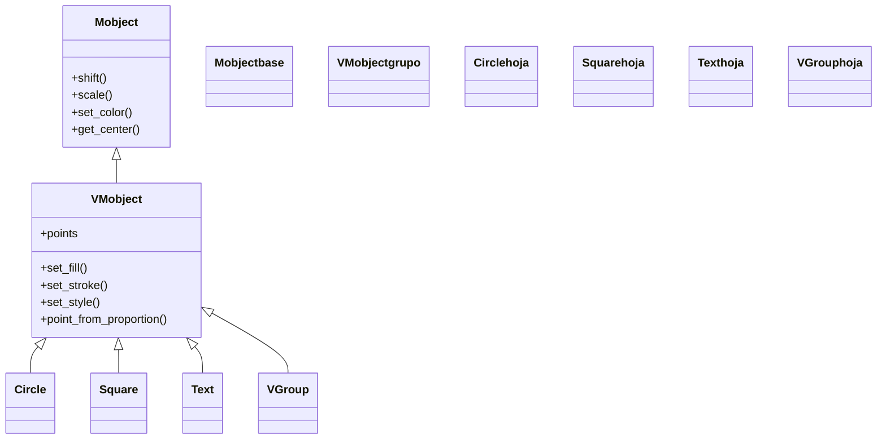

# VMobject — el objeto vectorizado (relleno y trazo con curvas de Bezier)

`VMobject` (de *Vectorized Mobject*) es la **base práctica de casi todo lo que dibujas** en Manim: un objeto cuya geometría se describe con **curvas de Bézier** y que, por eso mismo, entiende de **relleno** (`fill`) y de **trazo** (`stroke`). Donde [[Mobject]] aporta lo común a *cualquier* objeto dibujable (posición, escala, giro, árbol de hijos), `VMobject` añade encima la capa de **apariencia vectorial**: un borde con color y grosor, un interior con color y opacidad, y unos `points` que son nodos de Bézier en vez de píxeles. Casi todas las clases que usarás a diario —`Circle`, `Square`, `Text`, `Axes`, `VGroup`— heredan de `VMobject`, así que aprender a rellenar y trazar un `VMobject` es aprender a estilizar prácticamente toda la librería. Rara vez se instancia `VMobject()` "a pelo" (no tiene forma propia hasta que le das puntos); su valor está en ser el tronco del que cuelga el resto.

## Importacion

```python
from manim import VMobject
# o, como es habitual en todo ejemplo de Manim:
from manim import *
```

`from manim import *` trae `VMobject` junto con todas las figuras vectorizadas que heredan de él (`Circle`, `Text`, `Polygon`…), de modo que en la práctica casi nunca importas `VMobject` por su nombre: lo usas a través de sus subclases.

## Herencia

### La cadena

`VMobject` se sitúa **justo encima** de toda la geometría vectorizada: hereda de `Mobject` (lo común a todo lo dibujable) y de él descienden las figuras, el texto y los contenedores vectoriales. Lo que `VMobject` define —relleno y trazo— lo reciben gratis todas sus subclases.



### Que aporta cada ancestro

La división del trabajo es nítida: lo *general* viene de `Mobject`, lo *vectorial* lo pone `VMobject`. Por eso un `set_stroke` falla sobre un `Mobject` no vectorizado (como `ImageMobject`) pero funciona sobre cualquier `VMobject`.

| Ancestro | Qué aporta a un `VMobject` |
|----------|----------------------------|
| `Mobject` | posición (`shift`, `move_to`), tamaño (`scale`), giro (`rotate`), color global (`set_color`), el árbol de `submobjects` y los getters (`get_center`, `get_width`) |
| `VMobject` | el **relleno** (`set_fill`, `fill_opacity`), el **trazo** (`set_stroke`, `stroke_width`), el estilo combinado (`set_style`) y los `points` como **curvas de Bézier** |

El detalle del reparto entre clase base y vectorizada está en [[concepto_mobject]]; aquí se documenta la parte que añade `VMobject`.

## Constructor

`VMobject` se construye sobre todo con parámetros de **estilo**: como aún no tiene geometría propia, lo que defines al crearlo es cómo se verá su relleno y su trazo cuando le añadas puntos (o cuando lo use una subclase).

```python
VMobject(
    fill_color: ParsableManimColor | None = None,
    fill_opacity: float = 0.0,
    stroke_color: ParsableManimColor | None = None,
    stroke_width: float = 4.0,
    color: ParsableManimColor = WHITE,
    **kwargs,
)
```

### Parametros

| Parametro | Tipo | Defecto | Controla |
|-----------|------|---------|----------|
| `fill_color` | color \| None | `None` | color del **relleno** (interior); si es `None`, hereda de `color` |
| `fill_opacity` | float | `0.0` | opacidad del relleno (0 = transparente, 1 = sólido). **Por defecto 0**: un `VMobject` "en crudo" no tiene relleno visible |
| `stroke_color` | color \| None | `None` | color del **trazo** (borde); si es `None`, hereda de `color` |
| `stroke_width` | float | `4.0` | grosor del borde en píxeles |
| `color` | color | `WHITE` | color base que tiñe **a la vez** relleno y trazo cuando no se especifican por separado |
| `**kwargs` | — | — | resto de opciones heredadas de [[Mobject]] (p. ej. la posición) |

#### fill_opacity: el parámetro que más sorprende

El defecto es `0.0`, así que **un `VMobject` recién creado no muestra relleno** aunque le pongas `fill_color`: el color está, pero la opacidad lo hace invisible. Para ver el interior hay que subir la opacidad explícitamente.

```python
Circle(fill_color=BLUE)                    # solo borde: fill_opacity sigue en 0
Circle(fill_color=BLUE, fill_opacity=0.5)  # interior azul translucido
```

### Que construye

Devuelve una instancia de `VMobject` (o de la subclase) con su estilo de relleno y trazo ya fijado, lista para entrar en la escena con `self.add(...)` o para animarse con `self.play(Create(...))`. Un `VMobject` "puro" sin `points` no dibuja nada; el caso normal es que una subclase (`Circle`, `Square`…) rellene sus `points` en su propio `__init__` y use este constructor para el estilo.

## Metodos clave

Los métodos propios de `VMobject` se agrupan en dos familias: los que controlan **cómo se ve** (relleno y trazo) y los que controlan **qué forma tiene** (sus puntos de Bézier). Los métodos de posición y tamaño no están aquí: se heredan de [[Mobject]]. Para el detalle de color y apariencia, remite a [[estilo]].

### Relleno y trazo

Estos métodos modifican la apariencia **al instante** y devuelven `self`, así que se encadenan. Para **animar** el cambio se envuelven en `self.play(mob.animate.set_fill(...))`.

| Metodo | Firma | Que hace |
|--------|-------|----------|
| `set_fill` | `set_fill(color=None, opacity=None, family=True)` | fija el **relleno**: color y opacidad del interior |
| `set_stroke` | `set_stroke(color=None, width=None, opacity=None, family=True)` | fija el **trazo**: color, grosor y opacidad del borde |
| `set_style` | `set_style(fill_color=None, fill_opacity=None, stroke_color=None, stroke_width=None, **kwargs)` | fija relleno y trazo **de una vez**, en una sola llamada |

- `family=True` (por defecto) propaga el cambio a **todos los descendientes** del objeto; con `family=False` solo afecta al propio mobject, no a sus hijos.
- `set_color` (heredado de `Mobject`) tiñe relleno y trazo juntos; usa `set_fill` / `set_stroke` cuando quieras controlarlos por separado.

### Puntos/geometria

La geometría de un `VMobject` vive en `points`, un array de nodos de Bézier. Rara vez se manipula a mano (las subclases lo hacen por ti), pero estos métodos permiten leer la forma o construir una propia.

| Miembro | Firma | Que hace |
|---------|-------|----------|
| `points` | atributo | el array NumPy de puntos de Bézier que define la forma; su `shape` es `(n, 3)` |
| `set_points_as_corners` | `set_points_as_corners(puntos)` | construye la forma uniendo `puntos` con **segmentos rectos** (una polilínea); útil para un `VMobject` propio |
| `get_start` | `get_start()` | el primer punto del trazado (vector `[x, y, z]`) |
| `get_end` | `get_end()` | el último punto del trazado |
| `point_from_proportion` | `point_from_proportion(alpha)` | el punto al **`alpha`** del recorrido (`alpha` de 0 a 1: `0.5` = mitad del camino) |

`point_from_proportion(alpha)` es la base para animar algo que recorre una curva (mover un punto a lo largo de un círculo, por ejemplo): da la posición exacta a una fracción dada del trazado.

## Ejemplo

### Version minima

Un `VMobject` construido a mano: le damos su forma con `set_points_as_corners` (un triángulo) y un estilo de relleno y trazo. Es el caso raro en que se instancia `VMobject` directamente.

```python
from manim import *

class VMobjectMinimo(Scene):
    def construct(self):
        v = VMobject()
        v.set_points_as_corners([LEFT, UP, RIGHT, LEFT])  # 3 esquinas + cierre
        v.set_fill(BLUE, opacity=0.5)
        v.set_stroke(WHITE, width=6)
        self.add(v)
        self.wait()
```

```bash
manim -pql archivo.py VMobjectMinimo      # -p reproduce, -ql = calidad baja (rapido)
```

### Version completa

Aquí se ve lo que `VMobject` aporta de verdad: tomamos una subclase (`Circle`, que ES un `VMobject`) y jugamos con **`fill_opacity`** y **`stroke_width`** para distinguir interior y borde, usamos `set_style` para fijar todo de golpe, y `point_from_proportion` para colocar un punto a un cuarto del recorrido del círculo.

```python
from manim import *

class EstiloVectorial(Scene):
    def construct(self):
        # un VMobject (Circle) con relleno translucido y borde grueso
        c = Circle(radius=2)
        c.set_fill(BLUE, opacity=0.4)      # interior: color + opacidad
        c.set_stroke(YELLOW, width=10)     # borde: color + grosor

        # set_style hace lo mismo en una sola llamada, sobre un segundo objeto
        s = Square(side_length=1.5).next_to(c, RIGHT, buff=1)
        s.set_style(fill_color=GREEN, fill_opacity=0.6, stroke_color=WHITE, stroke_width=4)

        # un punto al 25% del recorrido del circulo (usa los points de Bezier)
        p = Dot(c.point_from_proportion(0.25), color=RED)

        self.play(Create(c), Create(s))
        self.play(FadeIn(p))
        # animar el estilo: el relleno se vuelve mas opaco
        self.play(c.animate.set_fill(BLUE, opacity=0.9))
        self.wait()
```

```bash
manim -pqh archivo.py EstiloVectorial     # -qh = calidad alta para el render final
```

## Errores comunes

| Error | Causa | Solución |
|-------|-------|----------|
| El relleno no se ve aunque pusiste `fill_color` | `fill_opacity` sigue en su defecto `0.0` | añade `fill_opacity=0.5` (o llama `set_fill(color, opacity=0.5)`) |
| `set_stroke` / `set_fill` "no existe" o no hace nada | el objeto es un `Mobject` no vectorizado (p. ej. `ImageMobject`) | esos métodos son de `VMobject`; usa un objeto vectorizado o `set_opacity` |
| Un `VMobject()` puro no dibuja nada | no tiene `points`: no le diste forma | dale geometría con `set_points_as_corners(...)` o usa una subclase (`Circle`, `Square`…) |
| `set_color` tiñe borde **y** relleno y solo querías uno | `set_color` toca ambos a la vez | separa con `set_fill(...)` y `set_stroke(...)` |
| El estilo cambia en los hijos sin querer (o no llega a ellos) | `family=True` propaga; `family=False` no | ajusta el flag `family` según quieras afectar o no a los `submobjects` |
| El objeto "salta" en vez de animar el estilo | llamaste `set_fill` fuera de `self.play` (es instantáneo) | envuélvelo: `self.play(mob.animate.set_fill(...))` |

## Notas relacionadas

- [[Mobject]] — la clase base de la que `VMobject` hereda lo común (posición, escala, color global)
- [[concepto_mobject]] — el modelo `Mobject` vs `VMobject` y el árbol de objetos
- [[VGroup]] — el contenedor que agrupa varios `VMobject` para tratarlos como uno
- [[estilo]] — color, gradientes y apariencia en detalle (`set_fill`, `set_stroke`, `set_style`)
- [[Manim/mobjects/geometria/index | geometria]] — las figuras que heredan de `VMobject` (`Circle`, `Square`…)
