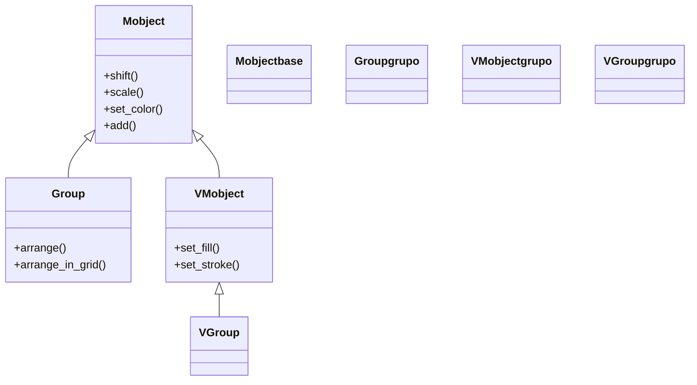

# Group — agrupa cualquier Mobject (mezcla tipos, no solo vectoriales)

`Group` es el contenedor **permisivo** de Manim: hace lo mismo que [[VGroup]] —reúne varios objetos en un padre que se posiciona, escala y anima como una sola pieza— pero acepta **cualquier [[Mobject]]**, no solo los vectorizados. Esa es toda su razón de ser: cuando necesitas agrupar tipos **mezclados** (una imagen `ImageMobject` junto a un `Circle`, por ejemplo) `VGroup` falla con `TypeError` porque exige VMobjects, y entonces recurres a `Group`. A cambio de esa flexibilidad, `Group` hereda directamente de `Mobject` y **no** de `VMobject`, así que carece de los métodos de relleno y trazo (`set_fill`, `set_stroke`): solo ofrece lo común a todo lo dibujable. La regla práctica: usa `VGroup` por defecto (es lo normal y trae más métodos), y reserva `Group` para cuando de verdad mezcles tipos no vectoriales.

## Importacion

```python
from manim import Group
# o, como es habitual:
from manim import *
```

## Herencia

### La cadena

`Group` cuelga **directamente de `Mobject`**, sin pasar por `VMobject`. Ahí está la diferencia clave con `VGroup`: no es vectorizado, por eso admite hijos no vectoriales pero pierde los métodos de estilo de borde y relleno.



### Que aporta cada ancestro

| Ancestro | Qué hereda el `Group` |
|----------|------------------------|
| `Mobject` | posición (`shift`, `move_to`), tamaño (`scale`), giro, `set_color`, el árbol de hijos y los métodos de distribución (`arrange`, `arrange_in_grid`) |
| (no hereda de `VMobject`) | por eso **no** tiene `set_fill` ni `set_stroke`: no es un objeto vectorizado |

## Constructor

Igual que `VGroup`, el constructor es **variádico**: los miembros van como argumentos sueltos. La única diferencia es el tipo admitido.

```python
Group(*mobjects: Mobject, **kwargs)
```

### Parametros

| Parametro | Tipo | Defecto | Controla |
|-----------|------|---------|----------|
| `*mobjects` | `Mobject` (varios) | — | los objetos a agrupar, sueltos: `Group(a, b, c)`. Admite **cualquier** Mobject |
| `**kwargs` | — | — | opciones heredadas de [[Mobject]] |

### Que construye

Devuelve un `Group`: un `Mobject` cuyos `submobjects` son los objetos dados, en el orden de construcción (que fija la indexación, como en `VGroup`). También es indexable (`grupo[0]`, `grupo[1:]`) y se distribuye con `arrange` / `arrange_in_grid`.

## Cuando usar Group vs VGroup

La decisión es casi siempre la misma: **VGroup por defecto, Group solo si mezclas tipos no vectoriales**.

| Criterio | `VGroup` | `Group` |
|----------|----------|---------|
| Tipos que admite | solo `VMobject` (figuras, texto, ejes…) | **cualquier** `Mobject` (incluye `ImageMobject`, cámaras…) |
| Hereda de | `VMobject` | `Mobject` |
| `set_fill` / `set_stroke` | sí | **no** (no es vectorizado) |
| Caso típico | el día a día: agrupar figuras y texto | mezclar una imagen ráster con figuras vectoriales |
| Regla | **úsalo por defecto** | reservado para tipos mezclados |

## Ejemplo

### Version minima

Agrupar y mover dos objetos como uno. Aunque aquí los dos sean figuras (también valdría un `VGroup`), `Group` se comporta idéntico para posicionar y animar el conjunto.

```python
from manim import *

class GroupMinimo(Scene):
    def construct(self):
        grupo = Group(Circle(), Square())
        grupo.arrange(RIGHT, buff=0.5)
        self.play(FadeIn(grupo))           # entra todo el grupo
        self.play(grupo.animate.shift(UP)) # se mueve como una pieza
        self.wait()
```

```bash
manim -pql archivo.py GroupMinimo      # -p reproduce, -ql = calidad baja (rapido)
```

> El sentido real de `Group` aparece cuando uno de los miembros es no vectorial, p. ej. `Group(ImageMobject("foto.png"), Circle())`: ahí `VGroup` daría `TypeError` y `Group` no.

## Errores comunes

| Error | Causa | Solución |
|-------|-------|----------|
| `grupo.set_fill(...)` no existe | `Group` no hereda de `VMobject` | usa `set_color`, o agrupa con [[VGroup]] si todos los miembros son vectoriales |
| Usaste `Group` cuando todo era vectorial | no hacía falta: pierdes `set_fill`/`set_stroke` | prefiere [[VGroup]] salvo que mezcles tipos no vectoriales |
| `Group(lista)` falla | pasaste una lista en vez de argumentos sueltos | desempaqueta: `Group(*lista)` |
| Los miembros aparecen amontonados | no los distribuiste | llama `arrange(...)` o `arrange_in_grid(...)` |

## Notas relacionadas

- [[VGroup]] — el grupo vectorial, la opción por defecto cuando todos los miembros son VMobjects
- [[Mobject]] — la clase base de la que `Group` hereda lo común
- [[concepto_mobject]] — el árbol de submobjects y la distinción Mobject vs VMobject
- [[Manim/mobjects/agrupacion/index | agrupacion]] — la carpeta de contenedores y cómo elegir entre ellos
