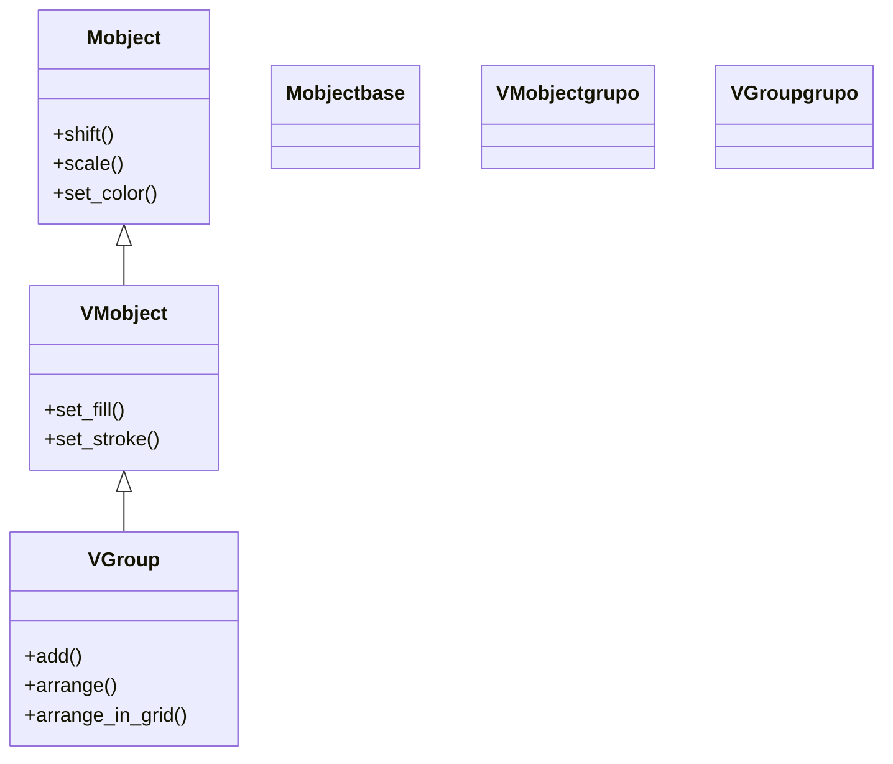

# VGroup — agrupa VMobjects para tratarlos como uno solo

`VGroup` (de *Vectorized Group*) es el **contenedor más usado de Manim**: agrupa varios [[VMobject]] en un único objeto que se **posiciona, anima y estiliza como una sola pieza**. Es la forma habitual de construir "a mano" el árbol de submobjects del que habla [[concepto_mobject]]: en vez de mover tres figuras una por una, las metes en un `VGroup` y mueves el grupo entero; al transformar el padre se transforman todos los hijos manteniendo su disposición relativa. Como es a su vez un `VMobject`, el grupo se comporta como cualquier figura (acepta `shift`, `scale`, `set_color`…) y además es **indexable** (`grupo[0]`, `grupo[1:]`), de modo que puedes alcanzar a un miembro concreto sin perder la comodidad de tratar al conjunto como uno. La regla a recordar: `VGroup` **solo admite VMobjects**; para mezclar tipos no vectorizados se usa [[Group]].

## Importacion

```python
from manim import VGroup
# o, como es habitual:
from manim import *
```

## Herencia

### La cadena

`VGroup` no es un objeto "aparte": ES un `VMobject` cuyos `points` están vacíos y cuyo contenido vive en sus `submobjects`. Por eso hereda todo el repertorio de [[VMobject]] (relleno, trazo) y de [[Mobject]] (posición, escala, giro), y puede usarse en cualquier sitio donde quepa un mobject.



### Que aporta cada ancestro

| Ancestro | Qué hereda el `VGroup` |
|----------|------------------------|
| `Mobject` | posición (`shift`, `move_to`), tamaño (`scale`), giro (`rotate`), el árbol de hijos |
| `VMobject` | relleno y trazo (`set_fill`, `set_stroke`): aplicarlos al grupo los propaga a todos sus miembros |
| `VGroup` | el agrupado en sí: `add`, `arrange`, `arrange_in_grid`, la indexación y el constructor variádico |

## Constructor

El constructor es **variádico**: recibe los mobjects a agrupar como argumentos sueltos, no como una lista.

```python
VGroup(*vmobjects: VMobject, **kwargs)
```

### Parametros

| Parametro | Tipo | Defecto | Controla |
|-----------|------|---------|----------|
| `*vmobjects` | `VMobject` (varios) | — | los objetos a agrupar, pasados sueltos: `VGroup(a, b, c)`. **Deben ser VMobjects** |
| `**kwargs` | — | — | opciones heredadas de [[VMobject]] (estilo, color…) aplicadas al grupo |

#### Pasar sueltos, no una lista

`VGroup` espera los miembros como argumentos separados. Si tienes una lista, desempáquetala con `*`:

```python
figuras = [Circle(), Square(), Triangle()]
grupo = VGroup(*figuras)     # OK: desempaquetado
# grupo = VGroup(figuras)    # ERROR: una lista no es un VMobject
```

### Que construye

Devuelve un `VGroup`: un `VMobject` cuyos `submobjects` son los objetos pasados, en el orden dado (ese orden fija la indexación). Recién creado, el grupo **no ordena** a sus miembros: aparecen donde cada uno estuviera; para distribuirlos se usa `arrange` o `arrange_in_grid`.

## Metodos clave

Además de todo lo que hereda (mover, escalar, colorear el grupo entero), `VGroup` aporta los métodos de **composición** y la **indexación**.

### Gestionar miembros

| Metodo | Firma | Que hace |
|--------|-------|----------|
| `add` | `add(*vmobjects)` | añade más VMobjects al grupo (al final); devuelve `self` |
| `remove` | `remove(*vmobjects)` | saca miembros del grupo |

### Distribuir en el espacio

Los dos métodos estrella: colocan a los miembros **unos respecto a otros** sin que tengas que posicionar cada uno a mano.

| Metodo | Firma | Que hace |
|--------|-------|----------|
| `arrange` | `arrange(direction=RIGHT, buff=0.25, center=True)` | alinea a los miembros en una **fila o columna** según `direction`, con separación `buff` |
| `arrange_in_grid` | `arrange_in_grid(rows=None, cols=None, buff=...)` | los distribuye en una **rejilla** de `rows`×`cols` |

### Indexar y estilizar el conjunto

| Operación | Forma | Que hace |
|-----------|-------|----------|
| indexado | `grupo[0]` | alcanza al miembro `i` (el orden es el de construcción) |
| slicing | `grupo[1:]` | un sub-`VGroup` con una porción de los miembros |
| `set_color` | `grupo.set_color(RED)` | **propaga** el color a **todos** los miembros a la vez |

> [!warning] VGroup solo acepta VMobjects
> Si intentas meter algo que no sea un `VMobject` (una imagen `ImageMobject`, una cámara…) obtienes un `TypeError`. Para agrupar **tipos mezclados** —vectoriales y no vectoriales juntos— usa [[Group]], que es más permisivo (a cambio de tener menos métodos vectoriales).

## Ejemplo

### Version minima

Tres figuras, un `VGroup`, un `arrange` para alinearlas y `Create` para dibujar el grupo entero de una vez.

```python
from manim import *

class GrupoMinimo(Scene):
    def construct(self):
        grupo = VGroup(Circle(), Square(), Triangle())
        grupo.arrange(RIGHT, buff=0.5)     # en fila, separadas 0.5
        self.play(Create(grupo))           # se dibuja todo el grupo
        self.wait()
```

```bash
manim -pql archivo.py GrupoMinimo      # -p reproduce, -ql = calidad baja (rapido)
```

### Version completa

El flujo típico: creamos tres figuras, las agrupamos, las ordenamos, **animamos y coloreamos el grupo entero** (un solo `.animate` mueve y escala a los tres juntos, un solo `set_color` los tiñe), y al final accedemos a **un miembro concreto por índice** (`grupo[1]`) para animarlo por separado sin sacarlo del grupo.

```python
from manim import *

class GrupoCompleto(Scene):
    def construct(self):
        # 1. tres VMobjects y su agrupacion
        a = Circle(fill_opacity=0.5)
        b = Square(fill_opacity=0.5)
        c = Triangle(fill_opacity=0.5)
        grupo = VGroup(a, b, c).arrange(RIGHT, buff=0.7)

        self.play(Create(grupo))

        # 2. transformar el PADRE arrastra a los tres hijos a la vez
        self.play(grupo.animate.scale(1.3).shift(UP))
        self.play(grupo.animate.set_color(YELLOW))    # set_color se propaga a todos

        # 3. alcanzar un miembro por indice y animarlo solo
        self.play(grupo[1].animate.set_color(RED).rotate(PI / 4))
        self.wait()
```

```bash
manim -pqh archivo.py GrupoCompleto    # -qh = calidad alta para el render final
```

### Variaciones

`arrange_in_grid` en vez de `arrange` cuando quieres una rejilla en lugar de una fila.

```python
from manim import *

class Rejilla(Scene):
    def construct(self):
        cuadros = VGroup(*[Square(side_length=0.8) for _ in range(6)])
        cuadros.arrange_in_grid(rows=2, cols=3, buff=0.3)
        self.play(Create(cuadros))
        self.wait()
```

```bash
manim -pql archivo.py Rejilla
```

## Errores comunes

| Error | Causa | Solución |
|-------|-------|----------|
| `TypeError` al construir el grupo | metiste algo que no es un `VMobject` (imagen, cámara…) | usa [[Group]] para mezclar tipos no vectoriales |
| `VGroup(lista)` no agrupa nada o falla | pasaste una **lista** en vez de argumentos sueltos | desempaqueta: `VGroup(*lista)` |
| Los miembros aparecen amontonados en el centro | no los ordenaste tras agrupar | llama `arrange(...)` o `arrange_in_grid(...)` |
| Mover un miembro suelto no mueve al grupo | la herencia del árbol va del **padre a los hijos**, no al revés | mueve el `VGroup`, o saca el miembro con `remove` |
| `grupo[5]` da `IndexError` | índice fuera de rango (hay menos miembros) | recuerda que el índice va de `0` a `len(grupo)-1` |
| El color no se aplica a todos | usaste `set_color` sobre un miembro, no sobre el grupo | aplícalo al `VGroup`: se propaga a todos |

## Notas relacionadas

- [[Group]] — el grupo permisivo que acepta **cualquier** Mobject (no solo VMobjects)
- [[VMobject]] — la clase de la que `VGroup` hereda (y el tipo que admite como miembro)
- [[concepto_mobject]] — el árbol de submobjects que `VGroup` construye a mano
- [[Manim/mobjects/agrupacion/index | agrupacion]] — la carpeta de contenedores y cómo elegir entre ellos
- [[arrange]] — el detalle de `arrange` y `arrange_in_grid` para distribuir un grupo
