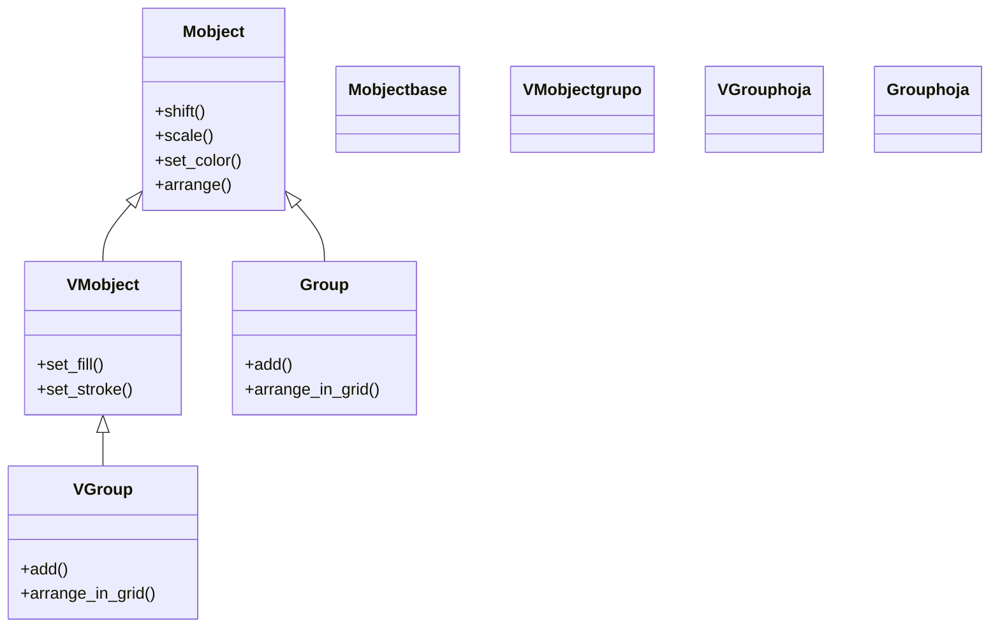
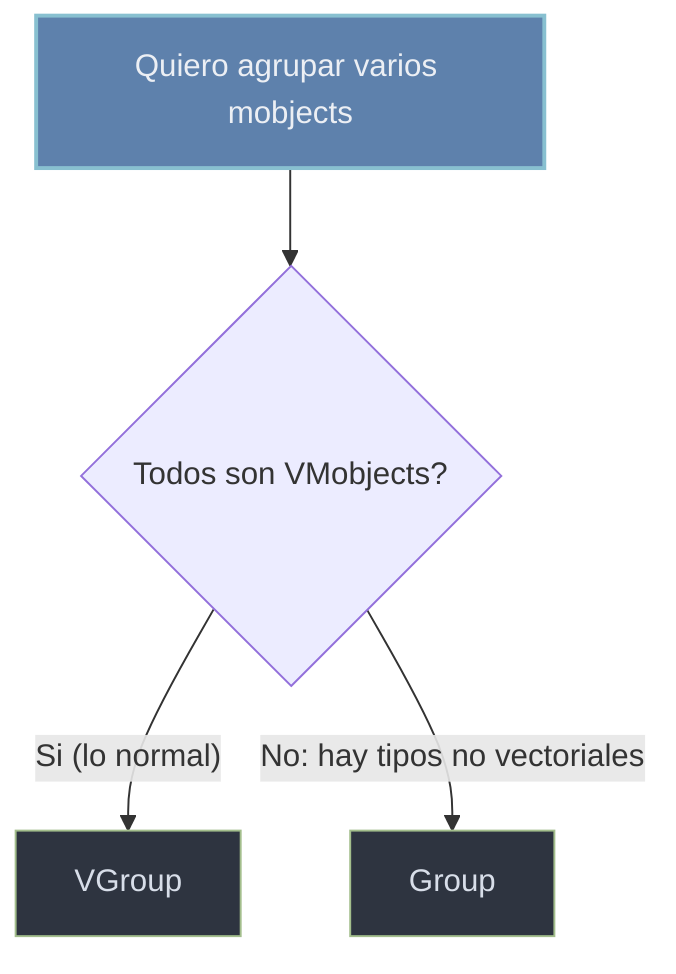

# agrupacion — contenedores que tratan varios Mobjects como uno

Esta carpeta documenta los **contenedores** de Manim: las clases que reúnen varios objetos en un único padre para **posicionarlos, animarlos y estilizarlos como una sola pieza**. Son la forma práctica de construir "a mano" el árbol de submobjects del que habla [[concepto_mobject]]: en vez de mover cinco figuras una por una, las metes en un grupo y mueves el grupo entero; al transformar el padre, todos los hijos lo siguen manteniendo su disposición relativa. Hay solo dos clases y la elección entre ellas es casi mecánica: [[VGroup]] —la habitual— agrupa **VMobjects** (figuras, texto, ejes…) y trae los métodos vectoriales; [[Group]] es el permisivo que acepta **cualquier Mobject** y se reserva para cuando mezclas tipos no vectoriales (como una imagen ráster junto a un círculo). Ambos son indexables (`grupo[0]`), variádicos (`Grupo(a, b, c)`) y se distribuyen con `arrange` y `arrange_in_grid`.

## En accion

Una escena que muestra el valor de agrupar: tres figuras entran en un `VGroup`, se ordenan en fila con `arrange`, y luego **el grupo entero** se escala, se mueve y se colorea con una sola animación cada vez. Mover el padre arrastra a los tres hijos a la vez.

```python
from manim import *

class GrupoEnAccion(Scene):
    def construct(self):
        # tres VMobjects agrupados y ordenados en fila
        figuras = VGroup(
            Circle(fill_opacity=0.5),
            Square(fill_opacity=0.5),
            Triangle(fill_opacity=0.5),
        ).arrange(RIGHT, buff=0.6)

        self.play(Create(figuras))
        # el grupo se transforma como UNA pieza:
        self.play(figuras.animate.scale(1.3).shift(UP))
        self.play(figuras.animate.set_color(YELLOW))   # set_color se propaga a todos
        # ...y aun asi puedes alcanzar un miembro por indice:
        self.play(figuras[1].animate.set_color(RED))
        self.wait()
```

```bash
manim -pql archivo.py GrupoEnAccion      # -p reproduce, -ql = calidad baja (rapido)
```

## Herencia

La clave para elegir entre los dos contenedores está en su herencia: [[VGroup]] desciende de [[VMobject]] (por eso solo admite VMobjects, pero hereda `set_fill`/`set_stroke`), mientras que [[Group]] cuelga directo de [[Mobject]] (por eso admite cualquier tipo, pero no tiene métodos vectoriales).



## Clases que aporta

| Clase | Hereda de | Para que |
|-------|-----------|----------|
| [[VGroup]] | `VMobject` | agrupar **VMobjects** (figuras, texto, ejes…) y tratarlos como uno; la opción **por defecto** |
| [[Group]] | `Mobject` | agrupar **cualquier** Mobject, incluso tipos no vectoriales mezclados (imágenes, cámaras) |

## Como elegir

La decisión cabe en una línea: **VGroup salvo que mezcles tipos no vectoriales**.

| Quiero agrupar… | Clase |
|-----------------|-------|
| Solo VMobjects (lo normal: figuras, texto, ejes) | `VGroup` |
| Tipos mezclados, alguno no vectorial (una `ImageMobject` con figuras) | `Group` |
| Y necesito `set_fill` / `set_stroke` sobre el grupo | `VGroup` (es el único vectorizado) |



## Patrones y recetas del grupo

Tres recetas que se repiten al trabajar con contenedores: alinear en fila, distribuir en rejilla y animar el grupo entero como una pieza.

### Alinear en fila o columna con arrange

Recién creado, un grupo **no ordena** a sus miembros: aparecen donde estuvieran. `arrange(direction, buff)` los alinea en una fila (`RIGHT`/`LEFT`) o columna (`UP`/`DOWN`) con una separación uniforme.

```python
from manim import *

class Arrange(Scene):
    def construct(self):
        fila = VGroup(Circle(), Square(), Triangle()).arrange(RIGHT, buff=0.5)
        columna = VGroup(Dot(), Dot(), Dot()).arrange(DOWN, buff=0.3).to_edge(LEFT)
        self.add(fila, columna)
        self.wait()
```

```bash
manim -pql archivo.py Arrange
```

### Distribuir en rejilla con arrange_in_grid

Cuando hay muchos elementos, `arrange_in_grid(rows, cols, buff)` los coloca en una cuadrícula en vez de una sola línea.

```python
from manim import *

class Grid(Scene):
    def construct(self):
        celdas = VGroup(*[Square(side_length=0.7) for _ in range(12)])
        celdas.arrange_in_grid(rows=3, cols=4, buff=0.2)
        self.play(Create(celdas))
        self.wait()
```

```bash
manim -pql archivo.py Grid
```

### Animar el grupo entero (y un miembro suelto)

El motivo de existir de los grupos: una sola animación sobre el padre transforma a todos los hijos a la vez. Y como el grupo es indexable, todavía puedes animar un miembro por separado sin sacarlo del grupo.

```python
from manim import *

class AnimarGrupo(Scene):
    def construct(self):
        g = VGroup(Circle(), Square(), Triangle()).arrange(RIGHT, buff=0.6)
        self.play(Create(g))
        self.play(g.animate.rotate(PI / 6).scale(1.2))  # el grupo entero gira y crece
        self.play(g[0].animate.set_color(RED))          # solo el primer miembro
        self.wait()
```

```bash
manim -pql archivo.py AnimarGrupo
```

## Notas relacionadas

- [[VGroup]] — el contenedor vectorial, la opción por defecto
- [[Group]] — el contenedor permisivo para tipos mezclados
- [[VMobject]] — la clase de la que `VGroup` hereda (y el tipo que admite como miembro)
- [[concepto_mobject]] — el árbol de submobjects que estos contenedores construyen
- [[arrange]] — el detalle de `arrange` y `arrange_in_grid` para distribuir los miembros
- [[Manim/mobjects/index | mobjects]] — el índice de todos los objetos dibujables
