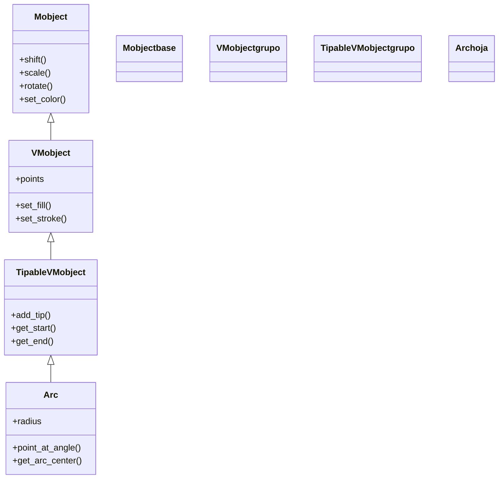

# Arc — un trozo de circunferencia (VMobject de geometria)

`Arc` es el Mobject que dibuja **un tramo de circunferencia**: un arco definido por su radio, el ángulo donde empieza (`start_angle`) y cuánto barre (`angle`). Es una pieza de geometría básica pero estructuralmente importante, porque es la **base de la que hereda [[Circle]]**: un círculo no es más que un `Arc` que recorre los `2*PI` radianes completos. Aparece siempre que necesitas algo curvo y no cerrado —un sector, una marca de ángulo, el redondeo de una esquina, la trayectoria curva de un objeto— y, por heredar de `TipableVMobject`, sabe llevar una **punta de flecha** en su extremo (de ahí que `Arrow` curvado, `CurvedArrow`, sea también un `Arc` con punta). Conceptualmente es un `VMobject` más: se crea, se posiciona, se colorea y se anima como cualquier otro [[concepto_mobject|Mobject]].

## Importacion

```python
from manim import Arc
# o, como es habitual en Manim:
from manim import *
```

Con `from manim import *` llegan también las constantes que usarás en su constructor: los ángulos (`PI`, `TAU`, `DEGREES`), las direcciones (`ORIGIN`, `UP`...) y los colores (`BLUE`, `YELLOW`...).

## Herencia

### La cadena

`Arc` cuelga de `TipableVMobject` (la rama de los `VMobject` que pueden llevar punta) y, a través de él, de `VMobject` y de `Mobject`. Esa es la razón de que un arco entienda de relleno y trazo (`VMobject`) y de que pueda recibir una flecha en su extremo (`TipableVMobject`).



### Que aporta cada ancestro

Casi todo lo que `Arc` "sabe hacer" no lo define él: lo hereda. `Arc` solo aporta **su geometría curva** (los puntos de Bézier que aproximan el tramo de circunferencia) y un par de consultas propias.

| Ancestro | Qué le aporta a `Arc` |
|----------|-----------------------|
| `Mobject` | posición (`shift`, `move_to`), tamaño (`scale`), giro (`rotate`), color (`set_color`), el árbol de hijos |
| `VMobject` | el relleno y el trazo (`set_fill`, `set_stroke`), los `points` como curvas de Bézier |
| `TipableVMobject` | la capacidad de llevar **punta** (`add_tip`, `get_tip`) y de consultar sus extremos (`get_start`, `get_end`) |
| `Arc` (propio) | el radio, el ángulo barrido y `point_at_angle()` |

## Constructor

```python
Arc(
    radius: float = 1.0,
    start_angle: float = 0,
    angle: float = PI / 2,
    num_components: int = 9,
    arc_center: np.ndarray = ORIGIN,
    **kwargs,
)
```

### Parametros principales

| Parametro | Tipo | Defecto | Controla |
|-----------|------|---------|----------|
| `radius` | `float` | `1.0` | el radio del arco (distancia del centro a la curva) |
| `start_angle` | `float` | `0` | el ángulo, en radianes, donde **empieza** el arco (0 = a la derecha, hacia +x) |
| `angle` | `float` | `PI/2` | cuánto **barre** el arco; positivo = sentido antihorario; `TAU` daría la vuelta completa |
| `num_components` | `int` | `9` | cuántas curvas de Bézier aproximan el arco (más = más suave, rara vez se toca) |
| `arc_center` | `np.ndarray` | `ORIGIN` | el **centro** de la circunferencia de la que el arco es un trozo |

#### start_angle y angle (la trampa de los dos angulos)

Es fácil confundirlos: `start_angle` es **dónde** arranca el arco, `angle` es **cuánto** gira desde ahí (no es el ángulo final). Un cuarto de circunferencia que vaya de las "3 en punto" a las "12 en punto" es `start_angle=0, angle=PI/2`. Para barrer en **sentido horario** se usa un `angle` negativo.

```python
Arc(start_angle=0, angle=PI/2)      # de la derecha hacia arriba (antihorario)
Arc(start_angle=0, angle=-PI/2)     # de la derecha hacia abajo (horario)
Arc(start_angle=PI, angle=PI)       # media circunferencia, mitad de arriba
```

### Parametros de estilo

Como todo `VMobject`, acepta vía `**kwargs` el estilo estándar: `color`, `stroke_width`, `fill_opacity`, `fill_color`. Un arco no está cerrado, así que su relleno conecta sus dos extremos por una cuerda recta (útil para dibujar un sector).

### Que construye

Devuelve un `Arc`: un VMobject cuyos `points` trazan el tramo de circunferencia de radio `radius` centrado en `arc_center`, desde `start_angle` y barriendo `angle` radianes. No es un objeto cerrado (a menos que `angle` valga `TAU`, en cuyo caso visualmente coincide con un [[Circle]]).

## Metodos clave

### Consultar

| Metodo | Devuelve | Para qué |
|--------|----------|----------|
| `point_at_angle(angle)` | el punto `[x, y, z]` del arco en ese ángulo absoluto | colocar algo (un [[Dot]], una etiqueta) sobre la curva |
| `get_arc_center()` | el centro de la circunferencia (no el centro de masa del arco) | medir radios, trazar líneas al centro |
| `get_start()` / `get_end()` | los extremos del arco | conectar el arco con otras figuras |

`point_at_angle` es el más característico: pasas un ángulo y te devuelve la posición exacta sobre la curva, lo que permite "clavar" objetos a lo largo del arco.

### Transformar y estilizar

Heredados de `Mobject`/`VMobject`, funcionan igual que en cualquier figura: `shift`, `move_to`, `scale`, `rotate`, `set_color`, `set_fill`, `set_stroke`. Para los detalles generales, ver [[concepto_mobject]].

## Ejemplo

### Version minima

El arco más corto posible: un cuarto de circunferencia que se dibuja.

```python
from manim import *

class ArcoMinimo(Scene):
    def construct(self):
        arco = Arc(radius=2, start_angle=0, angle=PI / 2, color=BLUE)
        self.play(Create(arco))
        self.wait()
```

```bash
manim -pql archivo.py ArcoMinimo      # -p reproduce, -ql = calidad baja (rapido)
```

### Version completa

Un **sector** ("porción de tarta"): un arco relleno más las dos líneas que van del centro a sus extremos, y un punto colocado sobre la curva con `point_at_angle`. Combina el constructor, las consultas y el estilo.

```python
from manim import *

class Sector(Scene):
    def construct(self):
        centro = ORIGIN
        arco = Arc(radius=2.5, start_angle=0, angle=PI / 3, arc_center=centro, color=YELLOW)

        # las dos lineas del centro a cada extremo cierran el sector
        l1 = Line(centro, arco.get_start(), color=YELLOW)
        l2 = Line(centro, arco.get_end(), color=YELLOW)
        sector = VGroup(l1, arco, l2).set_fill(YELLOW, opacity=0.3)

        # un punto sobre la curva, en la mitad del barrido (point_at_angle)
        marca = Dot(arco.point_at_angle(PI / 6), color=RED)

        self.play(Create(sector))
        self.play(FadeIn(marca))
        self.wait()
```

```bash
manim -pqh archivo.py Sector     # -qh = calidad alta para el render final
```

### Variaciones

Los kwargs más útiles en acción: barrido horario, media circunferencia y arco desplazado.

```python
from manim import *

class VariacionesArco(Scene):
    def construct(self):
        horario = Arc(radius=1, start_angle=0, angle=-PI / 2, color=GREEN).shift(LEFT * 4)
        media = Arc(radius=1, start_angle=PI, angle=PI, color=BLUE)
        completo = Arc(radius=1, start_angle=0, angle=TAU, color=RED).shift(RIGHT * 4)  # = Circle
        self.add(horario, media, completo)
        self.wait()
```

```bash
manim -pql archivo.py VariacionesArco
```

## Animarla

Al ser un `VMobject`, se anima con cualquier [[concepto_animation|Animation]]. `Create` lo traza siguiendo el sentido del barrido; `.animate` anima cambios de sus métodos heredados.

```python
from manim import *

class AnimarArco(Scene):
    def construct(self):
        arco = Arc(radius=2, angle=PI / 2, color=BLUE)
        self.play(Create(arco))                       # lo dibuja siguiendo la curva
        self.play(arco.animate.set_color(YELLOW))     # cambia el color animando
        self.play(Rotate(arco, PI, about_point=ORIGIN))  # lo gira en torno al origen
        self.wait()
```

```bash
manim -pql archivo.py AnimarArco
```

## Errores comunes

| Error | Causa | Solución |
|-------|-------|----------|
| El arco barre al revés de lo esperado | confundiste el signo de `angle`: positivo es antihorario | usa `angle` negativo para sentido horario |
| Pasas el ángulo **final** en `angle` y sale un arco enorme | `angle` es cuánto barre, no dónde termina | el final es `start_angle + angle`; resta si hace falta |
| `get_arc_center()` y el "centro" no coinciden | `get_center()` da el centro de masa del arco, no el de la circunferencia | usa `get_arc_center()` para el centro geométrico |
| El relleno cruza el arco por una recta rara | un arco no está cerrado: el `fill` conecta sus extremos con una cuerda | ciérralo a mano (líneas al centro) o usa una clase tipo sector |
| `NameError: name 'PI' is not defined` | faltó el import estrella | `from manim import *` al inicio |

## Notas relacionadas

- [[concepto_mobject]] — la clase base de todo lo dibujable; `Arc` es uno de sus `VMobject`.
- [[Circle]] — la circunferencia completa; hereda de `Arc` (es un `Arc` de `angle=TAU`).
- [[Line]] — el otro trozo elemental de geometría, para cerrar sectores o medir radios.
- [[Manim/mobjects/geometria/index | geometria]] — el grupo de figuras geométricas.
- [[concepto_animation]] — lo que `self.play` reproduce sobre el arco.
