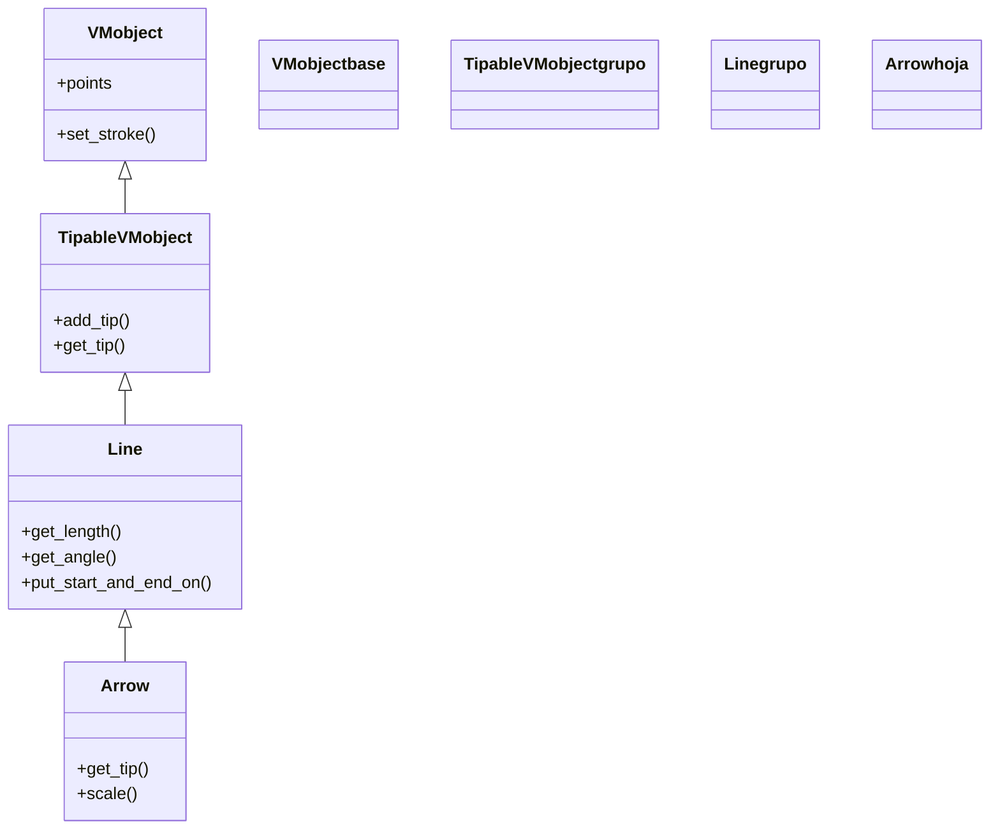

# Arrow — una linea con punta (VMobject de geometria)

`Arrow` es, literalmente, **una [[Line]] con una punta de flecha** en su extremo: hereda todo de `Line` y le añade la punta. Es la figura para indicar **dirección, sentido o relación dirigida** entre objetos: señalar algo, conectar dos cajas en un diagrama, mostrar el flujo de A hacia B. Comparte con `Line` la idea de engancharse a otros mobjects (sus extremos pueden ser `a.get_center()`, `b.get_left()`...), pero introduce dos comportamientos propios que son la fuente de casi todas las confusiones: el `buff` por defecto **separa la punta del objeto** al que apunta, y la punta **escala con la longitud** de la flecha. Por lo demás, es un [[concepto_mobject|Mobject]] normal: se crea, se posiciona, se colorea y se anima como cualquier otro.

## Importacion

```python
from manim import Arrow
# o, como es habitual en Manim:
from manim import *
```

Con `from manim import *` llegan las direcciones (`LEFT`, `RIGHT`...), los buffs estándar (`MED_SMALL_BUFF`...) y los colores que usarás al construirla.

## Herencia

### La cadena

`Arrow` extiende `Line`, que a su vez es un `TipableVMobject`. La punta no es magia: `TipableVMobject` ya sabía añadir punta (`add_tip`); `Arrow` simplemente nace con una y ajusta su tamaño automáticamente. Todo el comportamiento de segmento (`get_length`, `get_angle`, `put_start_and_end_on`) viene heredado de `Line` sin cambios.



### Que aporta cada ancestro

| Ancestro | Qué le aporta a `Arrow` |
|----------|-------------------------|
| `Mobject` / `VMobject` | posición, escala, giro, color y el trazo |
| `TipableVMobject` | la maquinaria de la punta (`add_tip`, `get_tip`) |
| `Line` | ser un segmento entre `start` y `end`, con `get_length`, `get_angle`, `put_start_and_end_on`, `buff` |
| `Arrow` (propio) | nacer con punta, y el escalado de la punta proporcional a la longitud |

## Constructor

```python
Arrow(
    start: np.ndarray = LEFT,
    end: np.ndarray = RIGHT,
    buff: float = MED_SMALL_BUFF,
    max_tip_length_to_length_ratio: float = 0.25,
    max_stroke_width_to_length_ratio: float = 5,
    stroke_width: float = 6,
    **kwargs,
)
```

### Parametros principales

| Parametro | Tipo | Defecto | Controla |
|-----------|------|---------|----------|
| `start` | `np.ndarray` | `LEFT` | el punto donde **nace** la flecha (la cola) |
| `end` | `np.ndarray` | `RIGHT` | el punto al que **apunta** (donde va la punta) |
| `buff` | `float` | `MED_SMALL_BUFF` | margen que **separa** la flecha de los objetos en ambos extremos (¡distinto de `Line`, que es `0`!) |
| `max_tip_length_to_length_ratio` | `float` | `0.25` | tope del tamaño de la punta **relativo a la longitud**: la punta nunca pasa de este porcentaje |
| `max_stroke_width_to_length_ratio` | `float` | `5` | tope del grosor del trazo relativo a la longitud (flechas cortas no engordan de más) |
| `stroke_width` | `float` | `6` | grosor del trazo deseado (limitado por el ratio anterior) |

#### buff: la trampa que separa la punta del objeto

A diferencia de `Line` (que trae `buff=0`), `Arrow` trae `buff=MED_SMALL_BUFF`: por defecto **deja un hueco** entre la punta y el punto `end`. Es lo que hace que una flecha hacia un círculo no se clave en su borde. Pero sorprende cuando esperas que la punta toque exactamente `end`: si la quieres pegada, pon `buff=0`.

```python
Arrow(a.get_center(), b.get_center())          # deja hueco en ambos extremos (defecto)
Arrow(a.get_center(), b.get_center(), buff=0)  # la punta llega justo a b
```

#### La punta escala con la longitud

El segundo comportamiento propio: el tamaño de la punta **no es fijo**, sino una fracción de la longitud (acotada por `max_tip_length_to_length_ratio`). Una flecha muy corta tiene una punta proporcionalmente pequeña; una larga, una punta grande. Por eso una flecha diminuta puede verse "sin punta" visible, y `scale()` sobre una `Arrow` puede no agrandar la punta como esperas (ver Errores).

### Parametros de estilo

Vía `**kwargs`: `color` tiñe línea y punta a la vez. El grosor lo controla `stroke_width`, pero siempre limitado por `max_stroke_width_to_length_ratio`.

### Que construye

Devuelve un `Arrow`: una `Line` de `start` a `end` (recortada por `buff`) con una punta triangular en el extremo `end`, dimensionada en proporción a la longitud de la flecha.

## Metodos clave

### La punta

| Metodo | Qué hace |
|--------|----------|
| `get_tip()` | devuelve el Mobject de la **punta** (para recolorearla o medir su posición) |
| `add_tip(...)` | añade otra punta (p. ej. en la cola, para una flecha bidireccional) |
| `get_start()` / `get_end()` | los extremos, igual que en `Line` |

### Heredados de Line

`get_length()`, `get_angle()`, `get_unit_vector()`, `put_start_and_end_on(start, end)` funcionan idénticos a [[Line]]: medir, orientar y recolocar la flecha por sus dos extremos.

## Ejemplo

### Version minima

La flecha más corta: de un punto a otro, que se dibuja.

```python
from manim import *

class FlechaMinima(Scene):
    def construct(self):
        flecha = Arrow(LEFT * 2, RIGHT * 2, color=WHITE)
        self.play(GrowArrow(flecha))   # animacion pensada para flechas: crece desde la cola
        self.wait()
```

```bash
manim -pql archivo.py FlechaMinima      # -p reproduce, -ql = calidad baja (rapido)
```

### Version completa

El uso característico: una flecha que **conecta dos objetos** apuntando de uno al otro, leyendo sus centros, con el `buff` por defecto que la separa de ambos bordes.

```python
from manim import *

class FlechaEntreObjetos(Scene):
    def construct(self):
        origen = Circle(color=BLUE, fill_opacity=0.5).shift(LEFT * 3)
        destino = Square(color=GREEN, fill_opacity=0.5).shift(RIGHT * 3)
        self.play(Create(origen), Create(destino))

        # apunta de un objeto al otro; el buff por defecto deja hueco en los dos extremos
        flecha = Arrow(origen.get_right(), destino.get_left(), buff=0.3, color=YELLOW)
        rotulo = Text("fluye").scale(0.5).next_to(flecha, UP)

        self.play(GrowArrow(flecha), FadeIn(rotulo))
        self.wait()
```

```bash
manim -pqh archivo.py FlechaEntreObjetos     # -qh = calidad alta para el render final
```

### Variaciones

`buff=0` para pegar la punta, una flecha doble con `add_tip`, y recolorear solo la punta con `get_tip`.

```python
from manim import *

class VariacionesFlecha(Scene):
    def construct(self):
        pegada = Arrow(LEFT * 2, RIGHT * 2, buff=0, color=WHITE).shift(UP * 2)
        doble = Arrow(LEFT * 2, RIGHT * 2, color=BLUE)
        doble.add_tip(at_start=True)                 # punta tambien en la cola
        resaltada = Arrow(LEFT * 2, RIGHT * 2, color=GREEN).shift(DOWN * 2)
        resaltada.get_tip().set_color(RED)           # solo la punta en rojo
        self.add(pegada, doble, resaltada)
        self.wait()
```

```bash
manim -pql archivo.py VariacionesFlecha
```

## Animarla

Lo idiomático es `GrowArrow`, que la hace crecer desde la cola hacia la punta. También funcionan `Create`, `FadeIn` y `.animate` sobre los métodos heredados.

```python
from manim import *

class AnimarFlecha(Scene):
    def construct(self):
        flecha = Arrow(LEFT * 3, RIGHT * 3, color=WHITE)
        self.play(GrowArrow(flecha))                              # crece desde la cola
        self.play(flecha.animate.set_color(YELLOW))
        self.play(Rotate(flecha, PI / 2, about_point=ORIGIN))     # la gira
        self.wait()
```

```bash
manim -pql archivo.py AnimarFlecha
```

## Errores comunes

| Error | Causa | Solución |
|-------|-------|----------|
| La punta no toca el objeto al que apunta | `buff=MED_SMALL_BUFF` por defecto deja hueco | pon `buff=0` si la quieres pegada |
| La punta sale enorme o minúscula | la punta escala con la longitud (limitada por `max_tip_length_to_length_ratio`) | ajusta ese ratio, o `tip_length=...` para fijarla |
| `scale(2)` no agranda la punta como esperabas | al escalar cambia la longitud y la punta se recalcula por proporción | usa `scale_tips=True` en `scale`, o fija `tip_length` |
| Una flecha muy corta parece "sin punta" | punta proporcional a una longitud diminuta | súbele `max_tip_length_to_length_ratio` o alárgala |
| El trazo no engorda aunque subas `stroke_width` | lo limita `max_stroke_width_to_length_ratio` | sube ese ratio además del `stroke_width` |
| `NameError: name 'MED_SMALL_BUFF' is not defined` | faltó el import estrella | `from manim import *` al inicio |

## Notas relacionadas

- [[concepto_mobject]] — la clase base de todo lo dibujable; `Arrow` es uno de sus `VMobject`.
- [[Line]] — la clase padre directa: una `Arrow` es una `Line` con punta.
- [[Vector]] — una `Arrow` desde el origen que representa un vector; hereda de `Arrow`.
- [[Manim/mobjects/geometria/index | geometria]] — el grupo de figuras geométricas.
- [[concepto_animation]] — `GrowArrow` y demás animaciones que reproduce `self.play`.
