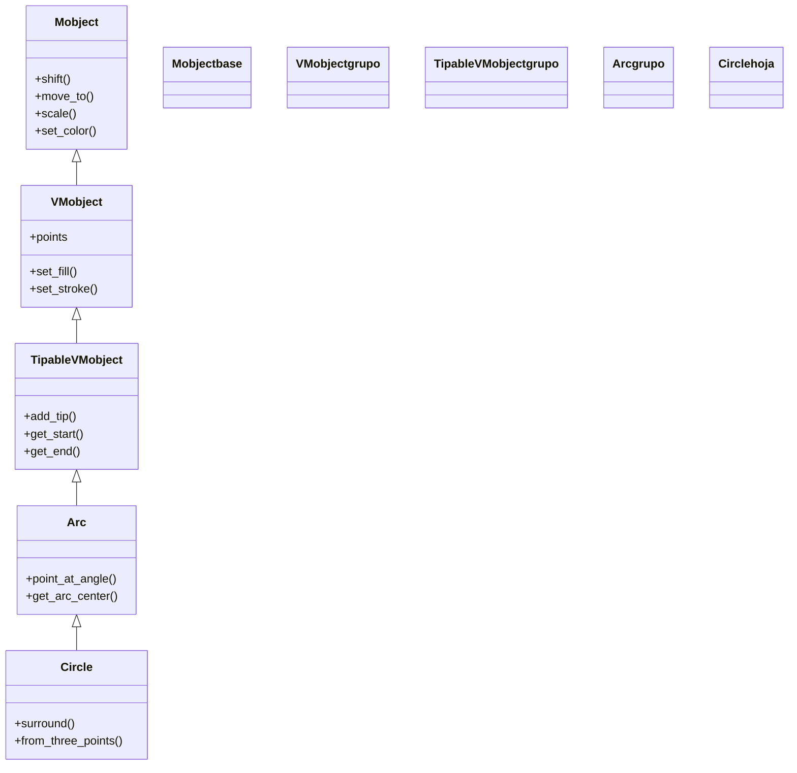

# Circle — circunferencia (VMobject de geometria)

`Circle` es el Mobject que dibuja una **circunferencia**: una figura redonda definida por su radio y centrada, por defecto, en el `ORIGIN`. Es uno de los objetos geométricos más usados de Manim, tanto por sí mismo como en su variante rellena [[Dot]] (un círculo diminuto). Por dentro **no es una primitiva especial**, sino un caso particular de [[Arc]] cuyo ángulo barre la vuelta completa (`TAU`); por eso hereda de él toda la maquinaria de arcos. Como cualquier [[concepto_mobject|Mobject]] vectorizado, no se "reproduce": se crea, se coloca y luego se **añade** (`self.add`) o se **anima** (`self.play(Create(...))`). Aporta además algunos métodos propios muy útiles para geometría: rodear a otro objeto, construirse a partir de tres puntos o devolver el punto de su contorno en un ángulo dado.

## Importacion

```python
from manim import Circle
# o, como es habitual en Manim:
from manim import *
```

## Herencia

### La jerarquia

`Circle` cuelga de [[Arc]], que a su vez es un `TipableVMobject` (un VMobject que admite puntas de flecha en sus extremos). La cadena completa hasta `Mobject` deja claro de dónde sale cada capacidad: la geometría de arco viene de `Arc`, el relleno y el trazo de `VMobject`, y la posición y la escala de `Mobject`.



### Que hereda

`Circle` solo define la geometría de la circunferencia (y un par de métodos propios); **todo lo demás lo hereda**. Conviene recordar de dónde sale cada cosa, porque colorear y posicionar un `Circle` es idéntico a colorear y posicionar cualquier otra figura.

| Capacidad | Método típico | Definido en |
|-----------|---------------|-------------|
| Posición (relativa/absoluta) | `shift`, `move_to`, `next_to`, `to_edge` | [[Mobject]] |
| Escala y giro | `scale`, `rotate` | [[Mobject]] |
| Color global | `set_color`, `set_opacity` | [[Mobject]] |
| Relleno y trazo | `set_fill`, `set_stroke` | [[VMobject]] |
| Punto del contorno por ángulo | `point_at_angle` | [[Arc]] |

El `color` que se pasa al constructor termina aplicándose por la maquinaria de `set_color` heredada; el posicionamiento (`shift`, `next_to`, `to_edge`) usa las constantes de [[posicionamiento]] (`UP`, `LEFT`, `ORIGIN`...).

## Constructor

```python
Circle(radius=1.0, color=WHITE, **kwargs)
```

### Parametros

| Parametro | Tipo | Defecto | Controla |
|-----------|------|---------|----------|
| `radius` | `float` | `1.0` | el radio de la circunferencia, en unidades de escena |
| `color` | `ManimColor` | `WHITE` | el color del trazo (y del relleno si se activa) |
| `**kwargs` | — | — | se pasan a [[Arc]]/[[VMobject]]: `fill_opacity`, `stroke_width`, `fill_color`... |

#### Parametros de estilo (via kwargs)

Como `Circle` no rellena por defecto (solo dibuja el borde), los kwargs de estilo son los que dan cuerpo a la figura.

| Kwarg | Defecto | Efecto |
|-------|---------|--------|
| `fill_opacity` | `0.0` | opacidad del relleno; súbelo (`0.5`, `1.0`) para que el círculo se vea macizo |
| `fill_color` | `color` | color del relleno si difiere del trazo |
| `stroke_width` | `4.0` | grosor del borde |

### Que construye

Devuelve un `Circle` (un VMobject) cuyos `points` son las curvas de Bézier que aproximan la circunferencia de radio `radius` centrada en el `ORIGIN`. Es un objeto **dibujable pero estático**: hay que añadirlo o animarlo para que aparezca.

## Metodos clave

Casi todo lo que se le hace a un `Circle` son métodos heredados de [[Mobject]]/[[VMobject]] (mover, colorear, escalar): para esos, remitir a [[posicionamiento]] y [[estilo]]. Lo **propio** de `Circle` (o de su padre [[Arc]]) son estos tres.

### Geometria propia

| Metodo | Firma | Que hace |
|--------|-------|----------|
| `surround` | `circle.surround(mobject, dim_to_match=0, stretch=False, buffer_factor=1.2)` | redimensiona y recoloca el círculo para que **rodee** a `mobject` con un pequeño margen |
| `point_at_angle` | `circle.point_at_angle(angle)` | devuelve el punto `[x, y, z]` del **contorno** en ese ángulo (heredado de [[Arc]]); útil para anclar otras cosas al borde |

### Constructor alternativo (classmethod)

| Metodo | Firma | Que hace |
|--------|-------|----------|
| `Circle.from_three_points` | `Circle.from_three_points(p1, p2, p3, **kwargs)` | crea el círculo **único** que pasa por los tres puntos dados (la circunferencia circunscrita) |

```python
# el circulo que pasa por tres puntos concretos:
c = Circle.from_three_points(LEFT, UP, RIGHT, color=YELLOW)
```

## Ejemplo

### Version minima

Un círculo azul que se dibuja y se queda en pantalla.

```python
from manim import *

class CirculoMinimo(Scene):
    def construct(self):
        c = Circle(radius=1.5, color=BLUE)
        self.play(Create(c))
        self.wait()
```

```bash
manim -pql archivo.py CirculoMinimo      # -p reproduce, -ql = calidad baja (rapido)
```

### Version completa

Un círculo relleno que **rodea** a otro objeto: primero aparece un cuadrado, luego un `Circle` con `fill_opacity` lo envuelve con `surround` y se marca su contorno con un punto en un ángulo concreto.

```python
from manim import *

class CirculoQueRodea(Scene):
    def construct(self):
        # 1. el objeto a rodear
        cuadro = Square(side_length=1.2, color=GREEN, fill_opacity=0.5)
        self.play(Create(cuadro))

        # 2. un circulo que lo envuelve con un pequeno margen
        anillo = Circle(color=YELLOW, stroke_width=6)
        anillo.surround(cuadro, buffer_factor=1.4)
        self.play(Create(anillo))

        # 3. un punto anclado al borde del circulo en 45 grados
        marca = Dot(anillo.point_at_angle(PI / 4), color=RED)
        self.play(FadeIn(marca))
        self.wait()
```

```bash
manim -pqh archivo.py CirculoQueRodea     # -qh = calidad alta para el render final
```

## Errores comunes

| Error | Causa | Solución |
|-------|-------|----------|
| El círculo se ve hueco (solo borde) | `fill_opacity` es `0.0` por defecto | pásalo: `Circle(fill_opacity=0.5)` o usa `set_fill` |
| `surround` no centra bien sobre el objeto | el objeto cambió de posición después de llamar a `surround` | llama a `surround` al final, o reanímalo si el objeto se mueve |
| Esperabas un círculo pequeño relleno y saliste con borde fino | querías el atajo de "punto" | usa [[Dot]], que ya es un círculo diminuto relleno |
| `point_at_angle` devuelve un punto raro | pasaste grados en vez de radianes | usa radianes (`PI/4`) o multiplica por `DEGREES` (`45*DEGREES`) |
| `NameError: name 'Circle' is not defined` | faltó el import | `from manim import *` al inicio |

## Notas relacionadas

- [[Arc]] — la clase padre; un `Circle` es un arco de vuelta completa
- [[Dot]] — un círculo diminuto y relleno, el punto-marca por excelencia
- [[Ellipse]] — la generalización: un círculo con dos semiejes distintos
- [[concepto_mobject]] — qué es un Mobject y los métodos que todos comparten
- [[posicionamiento]] — colocar el círculo en la escena (`shift`, `next_to`, `to_edge`)
- [[estilo]] — color, relleno y trazo (`set_fill`, `set_stroke`)
- [[Scene.play]] — reproducir la animación que lo crea
