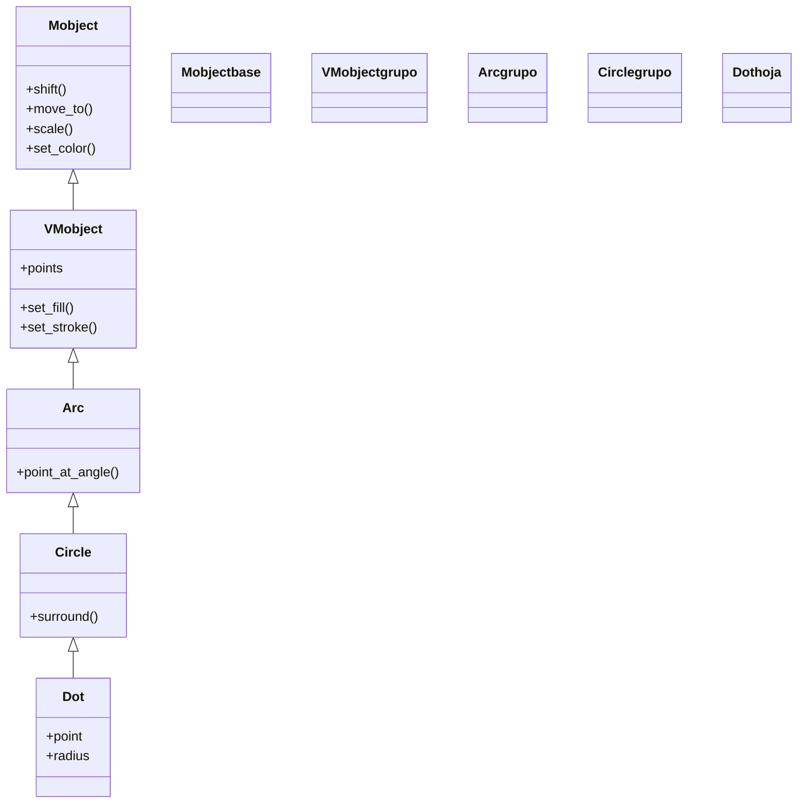

# Dot — punto (circulo diminuto relleno, VMobject de geometria)

`Dot` es el Mobject que dibuja un **punto**: un círculo muy pequeño y **relleno** que marca una posición concreta de la escena. Es el punto-marca por excelencia: señalar coordenadas, marcar el vértice de una figura, indicar el extremo de una línea o servir de "cabeza" que se mueve por una trayectoria. Por dentro es, literalmente, un [[Circle]] de radio diminuto (`0.08` por defecto) y opacidad de relleno total; de hecho hereda de `Circle`. Su rasgo distintivo frente a un círculo normal es que su constructor recibe directamente el `point` donde colocarse, sin tener que llamar a `move_to` después. Como cualquier [[concepto_mobject|Mobject]], se crea y se **añade** o se **anima**.

## Importacion

```python
from manim import Dot
# o, como es habitual en Manim:
from manim import *
```

## Herencia

### La jerarquia

`Dot` cuelga de [[Circle]], que es un [[Arc]] de vuelta completa; por eso comparte la cadena entera hasta `Mobject`. No aporta geometría nueva: solo fija un radio pequeño, un relleno opaco y un `point` de colocación directa.



> Entre `VMobject` y `Arc` está `TipableVMobject` (omitido aquí); la cadena completa de la circunferencia figura entera en [[Circle]].

### Que hereda

`Dot` casi no define nada propio: es un `Circle` con valores por defecto distintos. Su color y su posición, como en toda figura, se recalculan con métodos heredados de arriba; la diferencia es que el `point` del constructor ya hace el trabajo de `move_to`.

| Capacidad | Método típico | Definido en |
|-----------|---------------|-------------|
| Posición (relativa/absoluta) | `shift`, `move_to`, `next_to` | [[Mobject]] |
| Escala y giro | `scale`, `rotate` | [[Mobject]] |
| Color global | `set_color`, `set_opacity` | [[Mobject]] |
| Relleno y trazo | `set_fill`, `set_stroke` | [[VMobject]] |
| Rodear / punto del borde | `surround`, `point_at_angle` | [[Circle]] / [[Arc]] |

El `color` del constructor se aplica vía `set_color` heredado; el `point` se sitúa con las constantes de [[posicionamiento]] (`UP`, `LEFT`, `ORIGIN`, o un `[x, y, 0]`).

## Constructor

```python
Dot(point=ORIGIN, radius=0.08, color=WHITE, **kwargs)
```

### Parametros

| Parametro | Tipo | Defecto | Controla |
|-----------|------|---------|----------|
| `point` | `np.ndarray` | `ORIGIN` | la posición donde se coloca el centro del punto (un vector de dirección o `[x, y, 0]`) |
| `radius` | `float` | `0.08` | el radio del punto; súbelo para un punto más gordo |
| `color` | `ManimColor` | `WHITE` | el color del relleno (el `Dot` ya nace relleno y opaco) |
| `**kwargs` | — | — | se pasan a [[Circle]]/[[VMobject]]: `fill_opacity`, `stroke_width`... |

#### point

A diferencia de [[Circle]] (que nace en el `ORIGIN` y hay que mover con `move_to`), `Dot` acepta su posición **en el propio constructor**. Es lo que lo hace cómodo para marcar coordenadas concretas.

```python
# marcar tres posiciones de golpe, sin move_to:
a = Dot(LEFT * 2, color=RED)
b = Dot(ORIGIN, color=GREEN)
c = Dot([2, 1, 0], color=BLUE)   # coordenada cartesiana directa
```

### Que construye

Devuelve un `Dot` (un VMobject) que es un círculo de radio `radius`, relleno y opaco, centrado en `point`. A diferencia de un [[Circle]] normal, nace **macizo** (no hueco). Es estático hasta que se añade o se anima.

## Metodos clave

`Dot` no aporta métodos propios: todo es heredado. Mover, colorear y escalar se documentan en [[posicionamiento]] y [[estilo]]. Lo más característico de su uso son dos patrones, no métodos nuevos.

### Patrones de uso (con métodos heredados)

| Patrón | Cómo | Apoyado en |
|--------|------|------------|
| Marcar una posición | `Dot(punto, color=...)` y `self.add(...)` | el `point` del constructor |
| Anclar a otro objeto | `Dot().move_to(mob.get_center())` | `get_center` de [[Mobject]] |
| Mover el punto por la escena | `self.play(d.animate.shift(...))` o `MoveAlongPath(d, ruta)` | `.animate` / [[MoveAlongPath]] |

## Ejemplo

### Version minima

Un punto amarillo en una posición concreta, mostrado al instante.

```python
from manim import *

class PuntoMinimo(Scene):
    def construct(self):
        d = Dot([1, 1, 0], color=YELLOW)
        self.add(d)
        self.wait()
```

```bash
manim -pql archivo.py PuntoMinimo      # -p reproduce, -ql = calidad baja (rapido)
```

### Version completa

Un punto que **marca posiciones** y luego se **mueve**: primero aparecen marcas en varios sitios y después un punto rojo viaja entre ellas con `.animate`. Es el uso típico del `Dot` como cabeza móvil.

```python
from manim import *

class PuntoQueSeMueve(Scene):
    def construct(self):
        # 1. marcas fijas en tres posiciones
        marcas = VGroup(
            Dot(LEFT * 3, color=GREY),
            Dot(ORIGIN, color=GREY),
            Dot(RIGHT * 3, color=GREY),
        )
        self.add(marcas)

        # 2. un punto rojo que recorre las posiciones
        viajero = Dot(LEFT * 3, radius=0.12, color=RED)
        self.play(FadeIn(viajero))
        self.play(viajero.animate.move_to(ORIGIN))     # se desplaza al centro
        self.play(viajero.animate.move_to(RIGHT * 3))  # y al extremo derecho
        self.wait()
```

```bash
manim -pqh archivo.py PuntoQueSeMueve     # -qh = calidad alta para el render final
```

## Errores comunes

| Error | Causa | Solución |
|-------|-------|----------|
| El punto sale enorme | confundiste `radius` con el de [[Circle]] (`1.0`) | el `Dot` usa `0.08`; ajústalo con `radius=0.05`–`0.15` |
| Querías un círculo hueco grande | un `Dot` nace pequeño y relleno | usa [[Circle]] (hueco por defecto) |
| `Dot(LEFT)` no se ve donde esperabas | `LEFT` es un vector unitario; quizá querías `LEFT * 2` | escala la dirección o pasa una coordenada `[x, y, 0]` |
| El punto no se anima al moverse | usaste `d.move_to(...)` fuera de `self.play` (instantáneo) | envuélvelo: `self.play(d.animate.move_to(...))` |
| `NameError: name 'Dot' is not defined` | faltó el import | `from manim import *` al inicio |

## Notas relacionadas

- [[Circle]] — la clase padre; un `Dot` es un círculo diminuto y relleno
- [[Arc]] — el ancestro de la circunferencia, del que viene la geometría redonda
- [[MoveAlongPath]] — animar un `Dot` recorriendo una trayectoria
- [[concepto_mobject]] — qué es un Mobject y los métodos que todos comparten
- [[posicionamiento]] — colocar el punto (`move_to`, `next_to`, las constantes de dirección)
- [[estilo]] — color y relleno (`set_fill`, `set_color`)
- [[Scene.play]] — reproducir la animación que lo crea o lo mueve
