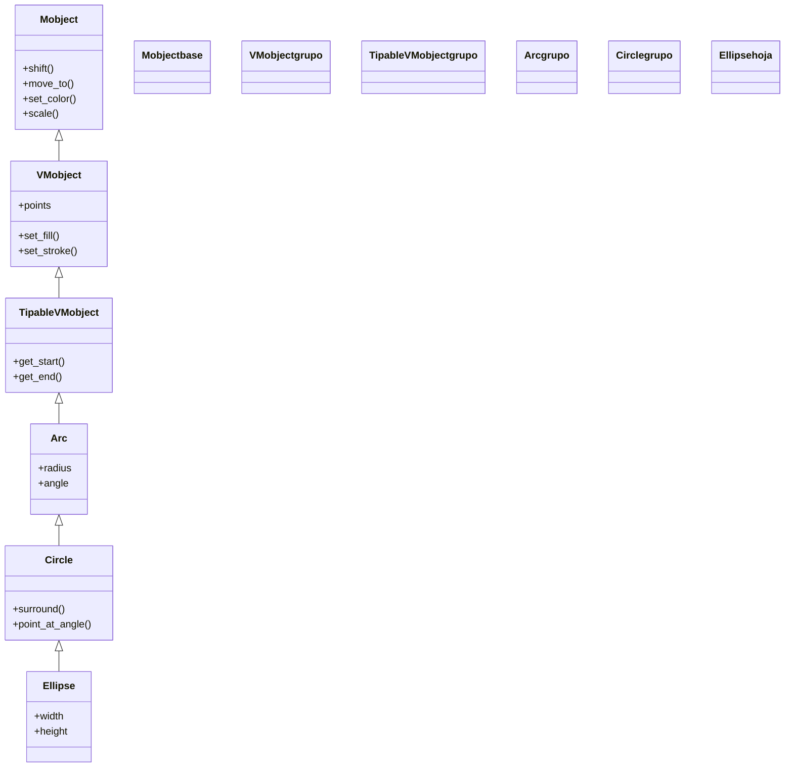

# Ellipse — la elipse (un círculo estirado, VMobject de geometria)

`Ellipse` es el Mobject de la **elipse**: un óvalo definido por un ancho y un alto independientes. Conceptualmente es un [[Circle]] al que se le ha roto la simetría —si `width == height` vuelve a ser un círculo—, y por eso en Manim **hereda directamente de `Circle`**: es un círculo cuyo eje horizontal y vertical pueden tener tamaños distintos. Es la figura que usas cuando necesitas un redondeado no perfecto: una órbita, una burbuja achatada, el contorno de un cuerpo ovalado. Como todo [[concepto_mobject|Mobject]] es solo el **qué se ve**: se crea, se posiciona y se anima con `self.play(Create(...))`; no se "reproduce" por sí mismo.

## Importacion

```python
from manim import Ellipse
# o, como es habitual en todo ejemplo de Manim:
from manim import *
```

`from manim import *` trae `Ellipse` junto con el resto de figuras (`Circle`, `Square`…), las animaciones (`Create`, `Write`…) y las constantes (`UP`, `BLUE`, `ORIGIN`…). En la práctica casi siempre se usa el import estrella.

## Herencia

### La cadena

`Ellipse` no define geometría nueva desde cero: parte de un `Circle` y solo cambia la proporción de sus ejes. Su cadena de herencia sube por la familia de los objetos "puntables" (`TipableVMobject`, los que pueden llevar punta de flecha) hasta `VMobject` y `Mobject`.



### Que aporta cada ancestro

`Ellipse` casi no escribe código propio: hereda la maquinaria de cada eslabón y solo fija el ancho y el alto.

| Ancestro | Qué aporta |
|----------|------------|
| `Mobject` | lo universal: `shift`, `move_to`, `scale`, `rotate`, `set_color`, el árbol de hijos |
| `VMobject` | el relleno y el trazo (`set_fill`, `set_stroke`) y los `points` como curvas de Bézier |
| `TipableVMobject` | la noción de inicio/fin del trazo (base para ponerle puntas, como en flechas) |
| `Arc` | la geometría de **arco**: la curva se genera a partir de un radio y un ángulo |
| `Circle` | el arco cerrado de 360°; `Ellipse` lo reescala para que ancho y alto difieran |

La consecuencia práctica: todo lo que sabes hacer con un `Circle` (colorear, mover, rodear otro objeto) funciona igual en una `Ellipse`.

## Constructor

```python
Ellipse(
    width: float = 2,
    height: float = 1,
    **kwargs,
)
```

Crea una elipse centrada en el origen, con un eje horizontal de longitud `width` y un eje vertical de longitud `height`. Internamente arranca de un círculo y lo **estira** a esas dos medidas. Los `**kwargs` se pasan hacia arriba (a `Circle`/`Arc`/`VMobject`): ahí entran el color, el relleno y el grosor del trazo.

### Parametros principales

| Parametro | Tipo | Defecto | Controla |
|-----------|------|---------|----------|
| `width` | `float` | `2` | la longitud del **eje horizontal** (ancho total, no semieje) |
| `height` | `float` | `1` | la longitud del **eje vertical** (alto total) |

#### width y height: son diámetros, no radios

`width` y `height` son las dimensiones **totales** de la figura, igual que el `width`/`height` de un `Rectangle`, no los semiejes. Una `Ellipse(width=4, height=2)` ocupa 4 unidades de ancho y 2 de alto. Si los igualas, recuperas un círculo:

```python
Ellipse(width=3, height=3)   # equivale a Circle(radius=1.5)
```

### Parametros de estilo

Llegan por `**kwargs` y se resuelven en `VMobject`; son los mismos de cualquier figura.

| Parametro | Tipo | Defecto | Controla |
|-----------|------|---------|----------|
| `color` | `ManimColor` | `WHITE` | el color del trazo (y del relleno si no se indica otro) |
| `fill_opacity` | `float` | `0` | opacidad del relleno (0 = solo contorno, 1 = lleno) |
| `fill_color` | `ManimColor` | `None` | color del relleno si difiere del trazo |
| `stroke_width` | `float` | `4` | grosor del borde |

### Que construye / devuelve

Devuelve un `Ellipse` (un `VMobject`): un objeto dibujable, todavía **fuera** de la escena, listo para `self.add(...)` o `self.play(Create(...))`.

## Metodos clave

`Ellipse` no añade métodos propios relevantes: usa los que hereda. Para los transversales (posicionar, estilizar, consultar) ver [[concepto_mobject]].

### Transformar

| Método | Qué hace |
|--------|----------|
| `shift(vector)` | desplaza la elipse una cantidad relativa |
| `scale(factor)` | la agranda o encoge **manteniendo** la proporción ancho/alto |
| `rotate(angulo)` | la gira (útil para inclinar el eje mayor) |
| `stretch(factor, dim)` | estira solo a lo ancho (`dim=0`) o a lo alto (`dim=1`) |

### Estilizar

| Método | Qué hace |
|--------|----------|
| `set_color(COLOR)` | tiñe trazo y relleno |
| `set_fill(COLOR, opacity)` | controla solo el relleno |
| `set_stroke(COLOR, width)` | controla solo el borde |

### Consultar

| Método | Devuelve |
|--------|----------|
| `get_center()` | el centro de la elipse |
| `get_width()` / `get_height()` | el ancho / alto actuales |

## Ejemplo

### Version minima

Una elipse achatada que se dibuja y se queda en pantalla.

```python
from manim import *

class ElipseMinima(Scene):
    def construct(self):
        e = Ellipse(width=4, height=2, color=BLUE)
        self.play(Create(e))
        self.wait()
```

```bash
manim -pql archivo.py ElipseMinima      # -p reproduce, -ql = calidad baja (rapido)
```

### Version completa

Una elipse rellena que representa una órbita: se crea, se inclina girándola y un punto la recorre. Combina creación, `.animate` y composición con otra figura.

```python
from manim import *

class Orbita(Scene):
    def construct(self):
        orbita = Ellipse(width=6, height=3, color=YELLOW)
        sol = Dot(color=RED).move_to(orbita.get_center())
        planeta = Dot(color=BLUE).move_to(orbita.get_right())

        self.play(Create(orbita), FadeIn(sol))
        self.play(FadeIn(planeta))
        self.play(orbita.animate.rotate(PI / 6))            # inclina el eje mayor
        self.play(MoveAlongPath(planeta, orbita), run_time=3)  # recorre la elipse
        self.wait()
```

```bash
manim -pqh archivo.py Orbita     # -qh = calidad alta para el render final
```

### Variaciones

Tres elipses con proporciones distintas, dispuestas en fila con un [[VGroup]]: vertical, círculo (ancho = alto) y horizontal.

```python
from manim import *

class VariacionesElipse(Scene):
    def construct(self):
        vertical = Ellipse(width=1.5, height=3, color=GREEN, fill_opacity=0.4)
        redonda = Ellipse(width=2.5, height=2.5, color=WHITE)   # un circulo
        horizontal = Ellipse(width=3, height=1.5, color=RED, fill_opacity=0.4)

        fila = VGroup(vertical, redonda, horizontal).arrange(RIGHT, buff=0.8)
        self.play(Create(fila))
        self.wait()
```

```bash
manim -pql archivo.py VariacionesElipse
```

## Animarla

`Ellipse` es un Mobject, así que se anima como cualquier otro: una Animation actúa **sobre** ella.

### Crear y transformar

| Forma | Qué hace |
|-------|----------|
| `self.play(Create(e))` | la dibuja trazando su contorno |
| `self.play(FadeIn(e))` | la hace aparecer por desvanecimiento |
| `self.play(Transform(c, e))` | morfa un círculo `c` en la elipse `e` |
| `self.play(e.animate.stretch(1.5, 0))` | **anima** un ensanchamiento (ver [[concepto_animate_syntax]]) |

### run_time y composicion

`self.play(Create(e), run_time=2)` alarga el trazado a 2 segundos. Para animar varias elipses a la vez se combinan en un mismo `self.play(...)` o con [[AnimationGroup]].

## Errores comunes

| Error | Causa | Solución |
|-------|-------|----------|
| La elipse sale como un círculo | pusiste `width == height` | dale dimensiones distintas (`Ellipse(width=4, height=2)`) |
| Esperabas pasar un radio | `Ellipse` no toma `radius`, sino `width` y `height` | usa esos dos parámetros (son diámetros, no radios) |
| El relleno no aparece | `fill_opacity` por defecto es `0` (solo contorno) | pasa `fill_opacity=...` o usa `set_fill(COLOR, 1)` |
| La elipse "salta" en vez de animarse | aplicaste `e.stretch(...)` fuera de `self.play` | envuélvelo: `self.play(e.animate.stretch(...))` |
| `NameError: name 'Ellipse' is not defined` | faltó el import | `from manim import *` al inicio |

## Notas relacionadas

- [[Circle]] — la clase padre directa: la elipse es un círculo con los ejes desiguales
- [[Arc]] — el ancestro que aporta la geometría de arco
- [[Manim/mobjects/geometria/index | geometria]] — la carpeta de figuras y su jerarquía
- [[concepto_mobject]] — qué es un Mobject y los métodos que hereda
- [[concepto_animate_syntax]] — la sintaxis `.animate` para animar un cambio
- [[VGroup]] — para disponer varias elipses como una sola pieza
