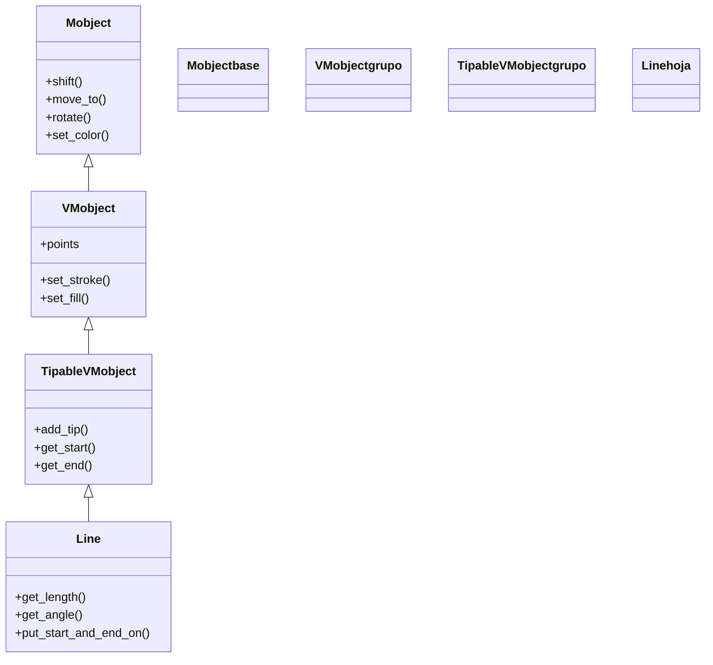

# Line — un segmento entre dos puntos (VMobject de geometria)

`Line` es el Mobject que dibuja un **segmento recto** entre un punto de inicio (`start`) y uno de fin (`end`). Es una de las figuras más usadas de toda la librería, no solo para trazar rectas: es la **base de [[Arrow]]** (una línea con punta) y la herramienta natural para **conectar dos objetos** entre sí, marcar ejes, radios, cuerdas o cualquier relación lineal en una escena. Lo que la hace especialmente útil es que sus extremos pueden ser **puntos fijos** (`LEFT`, `[1, 2, 0]`) o derivarse de **otros mobjects** (`a.get_center()`), de modo que una `Line` puede "engancharse" a las figuras que une. Por heredar de `TipableVMobject`, además sabe llevar una punta de flecha en su extremo. Como todo [[concepto_mobject|Mobject]], se crea, se posiciona, se colorea y se anima con el repertorio común.

## Importacion

```python
from manim import Line
# o, como es habitual en Manim:
from manim import *
```

Con `from manim import *` llegan las constantes de dirección (`LEFT`, `RIGHT`, `UP`, `ORIGIN`...) que sirven como extremos por defecto, además de los colores.

## Herencia

### La cadena

`Line` hereda de `TipableVMobject` (la rama "puede llevar punta") y, por encima, de `VMobject` y `Mobject`. De ahí saca el estilo (relleno/trazo), la capacidad de añadir flecha y todo el comportamiento universal de un Mobject. `Line` solo aporta su geometría (dos extremos y el segmento entre ellos) y los métodos para consultarla.



### Que aporta cada ancestro

| Ancestro | Qué le aporta a `Line` |
|----------|------------------------|
| `Mobject` | posición, escala, giro, color y el árbol de hijos |
| `VMobject` | el trazo (`set_stroke`, color y grosor) y los `points` |
| `TipableVMobject` | poder convertirse en flecha (`add_tip`) y consultar extremos (`get_start`, `get_end`) |
| `Line` (propio) | la longitud, el ángulo, el vector unitario y `put_start_and_end_on` |

## Constructor

```python
Line(
    start: np.ndarray = LEFT,
    end: np.ndarray = RIGHT,
    buff: float = 0,
    path_arc: float | None = None,
    **kwargs,
)
```

### Parametros principales

| Parametro | Tipo | Defecto | Controla |
|-----------|------|---------|----------|
| `start` | `np.ndarray` | `LEFT` | el punto donde **empieza** la línea (un punto o `mob.get_center()`) |
| `end` | `np.ndarray` | `RIGHT` | el punto donde **termina** |
| `buff` | `float` | `0` | un margen que **recorta** la línea por ambos extremos (separa la línea de los objetos que une) |
| `path_arc` | `float \| None` | `None` | si se da un ángulo, la línea se curva ese arco en vez de ir recta |

#### start y end pueden ser otros mobjects

El truco que hace a `Line` tan útil: en vez de coordenadas fijas, sus extremos pueden ser puntos **leídos de otras figuras**. Así la línea conecta objetos sin que calcules posiciones a mano.

```python
Line(a.get_center(), b.get_center())   # une los centros de a y b
Line(a.get_right(), b.get_left())      # del borde derecho de a al izquierdo de b
```

#### buff (separar la linea de lo que conecta)

`buff` recorta la línea por dentro en ambos extremos. Con `buff=0.2`, una línea entre dos círculos no toca sus bordes: deja un respiro. Es lo que evita que las flechas y conectores se "claven" dentro de los objetos.

### Parametros de estilo

Vía `**kwargs` acepta el estilo de trazo estándar: `color`, `stroke_width`. El relleno no aplica a una línea (no encierra área).

### Que construye

Devuelve un `Line`: un VMobject cuyos dos `points` extremos son `start` y `end` (recortados por `buff`), trazando el segmento entre ellos. Es un objeto vivo: puedes reorientarlo luego con `put_start_and_end_on`.

## Metodos clave

### Consultar la geometria

Estos son los métodos propios más usados; devuelven medidas del segmento.

| Metodo | Devuelve | Para qué |
|--------|----------|----------|
| `get_length()` | la longitud del segmento (`float`) | medir distancias, etiquetar |
| `get_angle()` | el ángulo respecto al eje +x (radianes) | saber su inclinación |
| `get_unit_vector()` | el vector unitario en su dirección | desplazar algo a lo largo de la línea |
| `get_start()` / `get_end()` | los puntos extremos | enganchar otras figuras a la línea |

### Reorientar y redimensionar

| Metodo | Qué hace |
|--------|----------|
| `put_start_and_end_on(start, end)` | **recoloca** los dos extremos a la vez (la forma de "mover" una línea entre dos puntos nuevos) |
| `set_length(longitud)` | cambia la longitud manteniendo el centro y el ángulo |

`put_start_and_end_on` es clave para los updaters: una línea que debe seguir a dos objetos en movimiento se redibuja llamándolo en cada frame (ver [[concepto_updaters]]).

## Ejemplo

### Version minima

La línea más corta: un segmento entre dos puntos fijos que se dibuja.

```python
from manim import *

class LineaMinima(Scene):
    def construct(self):
        linea = Line(LEFT * 3, RIGHT * 3, color=WHITE)
        self.play(Create(linea))
        self.wait()
```

```bash
manim -pql archivo.py LineaMinima      # -p reproduce, -ql = calidad baja (rapido)
```

### Version completa

El uso característico: una línea que **conecta dos mobjects** leyendo sus centros, con `buff` para no tocarlos, y una etiqueta con su longitud medida por `get_length`.

```python
from manim import *

class Conector(Scene):
    def construct(self):
        a = Circle(color=BLUE).shift(LEFT * 3)
        b = Square(color=GREEN).shift(RIGHT * 3)
        self.play(Create(a), Create(b))

        # la linea se engancha a los centros; buff la separa de los bordes
        conexion = Line(a.get_center(), b.get_center(), buff=0.5, color=YELLOW)
        etiqueta = Text(f"{conexion.get_length():.1f}").scale(0.6).next_to(conexion, UP)

        self.play(Create(conexion), FadeIn(etiqueta))
        self.wait()
```

```bash
manim -pqh archivo.py Conector     # -qh = calidad alta para el render final
```

### Variaciones

`put_start_and_end_on` para reorientar, `path_arc` para curvar y `get_angle` en acción.

```python
from manim import *

class VariacionesLinea(Scene):
    def construct(self):
        recta = Line(LEFT * 2, RIGHT * 2, color=WHITE).shift(UP * 2)
        curva = Line(LEFT * 2, RIGHT * 2, path_arc=PI / 2, color=BLUE)  # se arquea
        self.add(recta, curva)

        # reorientar una linea existente a dos puntos nuevos, animado:
        self.play(recta.animate.put_start_and_end_on(DL * 2, UR * 2))
        self.wait()
```

```bash
manim -pql archivo.py VariacionesLinea
```

## Animarla

Como `VMobject`, se anima con cualquier [[concepto_animation|Animation]]. `Create` la traza de inicio a fin; `.animate` con `put_start_and_end_on` la reorienta con suavidad.

```python
from manim import *

class AnimarLinea(Scene):
    def construct(self):
        linea = Line(LEFT * 3, RIGHT * 3, color=WHITE)
        self.play(Create(linea))                                  # la traza
        self.play(linea.animate.set_color(YELLOW))                # cambia color
        self.play(linea.animate.put_start_and_end_on(DOWN * 2, UP * 2))  # la reorienta
        self.wait()
```

```bash
manim -pql archivo.py AnimarLinea
```

## Errores comunes

| Error | Causa | Solución |
|-------|-------|----------|
| La línea se clava dentro de los objetos que une | `buff=0` por defecto: llega justo al punto pasado | dale `buff` (`Line(..., buff=0.3)`) |
| La línea no sigue a un mobject que se mueve | `start`/`end` se leyeron **una vez** al crearla, no se actualizan solos | redibújala con un updater (`always_redraw` + `put_start_and_end_on`) |
| `set_fill` no hace nada | una línea no encierra área; solo tiene trazo | usa `set_stroke`/`color`, no `set_fill` |
| `scale` la mueve raro al alargarla | `scale` escala respecto al centro; querías cambiar solo la longitud | usa `set_length(...)` o `put_start_and_end_on(...)` |
| `NameError: name 'LEFT' is not defined` | faltó el import estrella | `from manim import *` al inicio |

## Notas relacionadas

- [[concepto_mobject]] — la clase base de todo lo dibujable; `Line` es uno de sus `VMobject`.
- [[Arrow]] — una `Line` con punta; hereda directamente de `Line`.
- [[Arc]] — el otro trozo elemental de geometría (curvo en vez de recto).
- [[concepto_updaters]] — para que una línea siga a objetos en movimiento.
- [[Manim/mobjects/geometria/index | geometria]] — el grupo de figuras geométricas.
