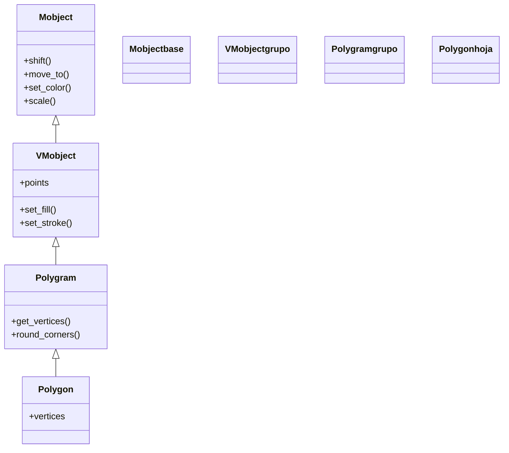

# Polygon — polígono por vértices (VMobject de geometria)

`Polygon` es el Mobject de un **polígono cerrado definido por sus vértices**: le pasas una lista de puntos y Manim los une con segmentos rectos, cerrando la figura del último al primero. Es la figura **general** de la geometría recta —cuando la forma no es un rectángulo, un cuadrado ni un polígono regular, la construyes con `Polygon` punto a punto—. A diferencia de [[Circle]] o [[Square]], que se definen por una medida, aquí defines la figura **por su contorno**: cada esquina es un punto 3D que tú sitúas. Como todo [[concepto_mobject|Mobject]] es el **qué se ve**: se crea, se posiciona y se anima con `self.play(Create(...))`.

## Importacion

```python
from manim import Polygon
# o, como es habitual en todo ejemplo de Manim:
from manim import *
```

Junto a `Polygon` conviene importar las constantes de dirección (`UP`, `RIGHT`, `ORIGIN`…), que son vectores numpy y sirven para construir los vértices. `from manim import *` lo trae todo.

## Herencia

### La cadena

`Polygon` cuelga de `Polygram`, la clase base de las figuras formadas por **uno o más caminos poligonales** (secuencias de vértices). `Polygram` ya sabe unir puntos con segmentos; `Polygon` es el caso de **un solo camino cerrado**. De `Polygram` también descienden `Rectangle`, `Square` y `RegularPolygon`.



### Que aporta cada ancestro

| Ancestro | Qué aporta |
|----------|------------|
| `Mobject` | lo universal: `shift`, `move_to`, `scale`, `rotate`, `set_color`, el árbol de hijos |
| `VMobject` | el relleno y el trazo (`set_fill`, `set_stroke`) y los `points` como curvas de Bézier |
| `Polygram` | la lógica de unir vértices con segmentos rectos; `get_vertices()` y `round_corners()` |
| `Polygon` | fija el caso de **un único camino cerrado** a partir de los vértices que pasas |

## Constructor

```python
Polygon(
    *vertices: Point3D,
    color: ManimColor = WHITE,
    **kwargs,
)
```

Recibe los vértices como **argumentos sueltos** (no una lista): cada uno es un punto 3D (un array de tres componentes, normalmente construido con las constantes de dirección o con `np.array([x, y, z])`). Manim los une en orden con segmentos rectos y **cierra** la figura uniendo el último con el primero; no hace falta repetir el primer punto al final. Los `**kwargs` se pasan a `VMobject` (relleno, grosor del trazo, etc.).

### Parametros principales

| Parametro | Tipo | Defecto | Controla |
|-----------|------|---------|----------|
| `*vertices` | `Point3D` (varios) | — (obligatorio) | los puntos esquina, en orden; cada uno es un array 3D |
| `color` | `ManimColor` | `WHITE` | el color del trazo |

#### Los vertices son puntos 3D, sueltos

Cada vértice es un punto en el plano (la `z` suele ser 0). Se pasan **uno a uno**, no en una lista. Las constantes de dirección son vectores, así que se combinan con `+`, `*` y `np.array`:

```python
# tres vertices sueltos -> un triangulo escaleno
Polygon(LEFT, UP, RIGHT * 2)

# con coordenadas explicitas
import numpy as np
Polygon(np.array([-2, -1, 0]), np.array([0, 2, 0]), np.array([2, -1, 0]))
```

Pasar **una lista** (`Polygon([p1, p2, p3])`) es el error típico: hay que desempaquetarla con `*` -> `Polygon(*[p1, p2, p3])`.

### Parametros de estilo

Llegan por `**kwargs` y los resuelve `VMobject`.

| Parametro | Tipo | Defecto | Controla |
|-----------|------|---------|----------|
| `fill_opacity` | `float` | `0` | opacidad del relleno (0 = solo contorno) |
| `fill_color` | `ManimColor` | `None` | color del relleno si difiere del trazo |
| `stroke_width` | `float` | `4` | grosor del borde |

### Que construye / devuelve

Devuelve un `Polygon` (un `VMobject`): un polígono cerrado, fuera de la escena, listo para `self.add(...)` o `self.play(Create(...))`.

## Metodos clave

Además de los heredados de [[concepto_mobject|Mobject]], `Polygram` aporta dos métodos muy útiles para los polígonos.

### Propios (via Polygram)

| Método | Firma | Qué hace |
|--------|-------|----------|
| `get_vertices` | `get_vertices() -> np.ndarray` | devuelve el array de los vértices actuales (en orden) |
| `round_corners` | `round_corners(radius=0.5) -> self` | **redondea** las esquinas con arcos de ese radio; modifica el objeto |

#### round_corners: esquinas redondeadas

`round_corners(radius)` sustituye cada esquina viva por un pequeño arco, convirtiendo el polígono anguloso en uno de esquinas suaves. Devuelve `self`, así que se encadena:

```python
hexagono = RegularPolygon(6).round_corners(0.3)
```

### Transformar y consultar (heredados)

| Método | Qué hace |
|--------|----------|
| `shift` / `move_to` | posiciona el polígono completo |
| `scale(factor)` | lo agranda o encoge respecto a su centro |
| `rotate(angulo)` | lo gira |
| `get_center()` | devuelve su centro |

## Ejemplo

### Version minima

Un pentágono construido a partir de cinco puntos sueltos.

```python
from manim import *
import numpy as np

class PentagonoMinimo(Scene):
    def construct(self):
        # cinco vertices en circulo: angulos 90, 162, 234, 306, 18 grados
        pts = [np.array([np.cos(a), np.sin(a), 0])
               for a in np.linspace(PI / 2, PI / 2 + TAU, 5, endpoint=False)]
        pentagono = Polygon(*pts, color=BLUE)   # desempaquetar con *
        self.play(Create(pentagono))
        self.wait()
```

```bash
manim -pql archivo.py PentagonoMinimo      # -p reproduce, -ql = calidad baja (rapido)
```

### Version completa

Una forma irregular (una "casa": cuadrado con tejado) rellena, que se dibuja, se gira y se redondean sus esquinas. Combina vértices a mano, `round_corners`, relleno y `.animate`.

```python
from manim import *

class Casa(Scene):
    def construct(self):
        casa = Polygon(
            LEFT + DOWN,            # esquina inferior izquierda
            RIGHT + DOWN,           # inferior derecha
            RIGHT + UP,             # superior derecha
            UP * 2,                 # vertice del tejado
            LEFT + UP,              # superior izquierda
            color=WHITE,
            fill_color=BLUE,
            fill_opacity=0.5,
        )
        self.play(Create(casa))
        self.wait(0.5)
        self.play(casa.animate.rotate(PI / 12))     # la inclina un poco
        self.play(casa.animate.round_corners(0.2))  # suaviza las esquinas
        self.wait()
```

```bash
manim -pqh archivo.py Casa     # -qh = calidad alta para el render final
```

### Variaciones

Un triángulo, una flecha (chevron) y una estrella de cuatro puntas, todos como `Polygon`, dispuestos en fila con un [[VGroup]]: demuestra que cualquier contorno recto cabe en esta clase.

```python
from manim import *

class FormasIrregulares(Scene):
    def construct(self):
        triangulo = Polygon(LEFT, UP, RIGHT, color=GREEN)
        flecha = Polygon(LEFT, ORIGIN, LEFT + UP * 0.01, UP, RIGHT, ORIGIN, color=YELLOW)
        estrella = Polygon(UP, RIGHT * 0.4, RIGHT, DOWN * 0.4 + RIGHT * 0.4,
                           DOWN, DOWN * 0.4 + LEFT * 0.4, LEFT, RIGHT * 0.0 + UP * 0.4 + LEFT * 0.4,
                           color=RED)

        fila = VGroup(triangulo, flecha, estrella).arrange(RIGHT, buff=1.0)
        self.play(Create(fila))
        self.wait()
```

```bash
manim -pql archivo.py FormasIrregulares
```

## Animarla

`Polygon` se anima como cualquier Mobject.

### Crear y transformar

| Forma | Qué hace |
|-------|----------|
| `self.play(Create(p))` | dibuja el contorno segmento a segmento |
| `self.play(DrawBorderThenFill(p))` | traza el borde y luego rellena |
| `self.play(Transform(p, q))` | morfa un polígono en otro (ideal si tienen vértices alineados) |
| `self.play(p.animate.scale(1.5))` | **anima** un escalado (ver [[concepto_animate_syntax]]) |

### Morfar entre poligonos

`Transform` entre dos `Polygon` con **el mismo número de vértices** produce una metamorfosis limpia (cada vértice viaja al correspondiente). Con número distinto, el emparejamiento es menos predecible; ahí conviene [[TransformMatchingShapes]].

## Errores comunes

| Error | Causa | Solución |
|-------|-------|----------|
| `Polygon` no acepta los vértices | los pasaste como **lista** (`Polygon([p1, p2])`) | desempaqueta con `*`: `Polygon(*lista)` o pásalos sueltos |
| La figura sale abierta o cruzada | el orden de los vértices no recorre el contorno | ordénalos siguiendo el perímetro (sentido horario o antihorario) |
| Repetiste el primer punto al final | `Polygon` ya cierra solo | no repitas el vértice inicial |
| El relleno no aparece | `fill_opacity` por defecto es `0` | pasa `fill_opacity=...` o `set_fill(COLOR, 1)` |
| `round_corners` no se ve | radio demasiado grande o lados muy cortos | usa un `radius` menor que la mitad del lado más corto |
| `NameError: name 'Polygon' is not defined` | faltó el import | `from manim import *` al inicio |

## Notas relacionadas

- [[Triangle]] — un polígono regular de 3 lados (caso particular ya hecho)
- [[Rectangle]] · [[Square]] — polígonos predefinidos que también descienden de `Polygram`
- [[Manim/mobjects/geometria/index | geometria]] — la carpeta de figuras y su jerarquía
- [[concepto_mobject]] — qué es un Mobject y los métodos que hereda
- [[concepto_sistema_coordenadas]] — las constantes (`UP`, `RIGHT`, `ORIGIN`) con que se arman los vértices
- [[VGroup]] — para componer varios polígonos como una sola pieza
