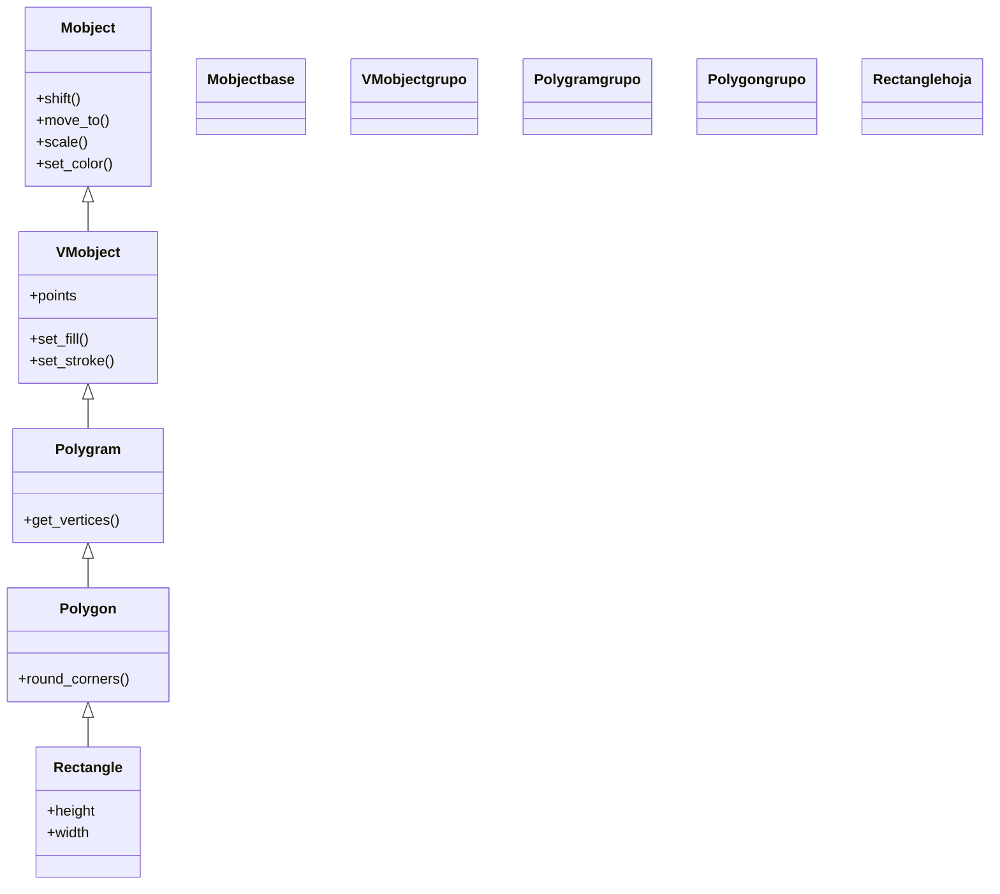

# Rectangle — rectangulo (VMobject de geometria)

`Rectangle` es el Mobject que dibuja un **rectángulo** a partir de su `height` (alto) y su `width` (ancho), centrado por defecto en el `ORIGIN`. Es la base de la que cuelga [[Square]] (un rectángulo de lados iguales) y un bloque habitual para encuadrar texto, construir tablas a mano o servir de fondo. Por dentro es un caso particular de [[Polygon]]: un polígono de cuatro vértices cuyos lados son paralelos a los ejes. Como cualquier [[concepto_mobject|Mobject]] vectorizado, se crea y luego se **añade** o se **anima**. Su rasgo más particular son los parámetros `grid_xstep`/`grid_ystep`, que dibujan una **rejilla interna** sin necesidad de superponer líneas a mano.

## Importacion

```python
from manim import Rectangle
# o, como es habitual en Manim:
from manim import *
```

## Herencia

### La jerarquia

`Rectangle` desciende de [[Polygon]], que a su vez es un `Polygram` (una o varias polilíneas cerradas). La cadena hasta `Mobject` muestra que la geometría de polígono viene de arriba, mientras que `Rectangle` solo aporta la conveniencia de construirse por alto/ancho.



### Que hereda

`Rectangle` define solo su forma (cuatro vértices a partir de alto y ancho); el resto es herencia. Como toda figura, su color y su posición se recalculan con métodos que vienen de arriba.

| Capacidad | Método típico | Definido en |
|-----------|---------------|-------------|
| Posición (relativa/absoluta) | `shift`, `move_to`, `next_to`, `to_edge` | [[Mobject]] |
| Escala y giro | `scale`, `rotate` | [[Mobject]] |
| Color global | `set_color`, `set_opacity` | [[Mobject]] |
| Relleno y trazo | `set_fill`, `set_stroke` | [[VMobject]] |
| Vértices del polígono | `get_vertices` | [[Polygon]] |

El `color` del constructor se aplica vía `set_color` heredado, y el posicionamiento usa las constantes de [[posicionamiento]] (`UP`, `LEFT`, `ORIGIN`...).

## Constructor

```python
Rectangle(color=WHITE, height=2.0, width=4.0, grid_xstep=None, grid_ystep=None, **kwargs)
```

### Parametros

| Parametro | Tipo | Defecto | Controla |
|-----------|------|---------|----------|
| `color` | `ManimColor` | `WHITE` | el color del trazo (y del relleno si se activa) |
| `height` | `float` | `2.0` | el alto del rectángulo, en unidades de escena |
| `width` | `float` | `4.0` | el ancho del rectángulo |
| `grid_xstep` | `float \| None` | `None` | si se da, dibuja líneas verticales internas cada `grid_xstep` unidades |
| `grid_ystep` | `float \| None` | `None` | si se da, dibuja líneas horizontales internas cada `grid_ystep` unidades |
| `**kwargs` | — | — | se pasan a [[Polygon]]/[[VMobject]]: `fill_opacity`, `stroke_width`... |

#### grid_xstep y grid_ystep

Estos dos parámetros convierten el rectángulo en una **rejilla** sin superponer líneas manualmente: cada paso traza una línea interna paralela al borde correspondiente. Útil para cuadrículas, tableros o el fondo de una tabla.

```python
# un rectangulo 6x4 con rejilla cada 1 unidad en ambos ejes:
rejilla = Rectangle(width=6, height=4, grid_xstep=1.0, grid_ystep=1.0)
```

### Que construye

Devuelve un `Rectangle` (un VMobject) con cuatro vértices y lados paralelos a los ejes, centrado en el `ORIGIN`. Si se dieron `grid_xstep`/`grid_ystep`, incluye además las líneas internas de la rejilla. Es estático hasta que se añade o se anima.

## Metodos clave

Mover, colorear y escalar un `Rectangle` son métodos heredados: remitir a [[posicionamiento]] y [[estilo]]. Lo más usado en la práctica son estos getters geométricos heredados, imprescindibles para encuadrar otros objetos.

### Consultar la geometria

| Metodo | Firma | Que hace |
|--------|-------|----------|
| `get_vertices` | `rect.get_vertices()` | devuelve la lista de los cuatro vértices (heredado de [[Polygon]]) |
| `get_width` / `get_height` | `rect.get_width()` | el ancho / alto actual (heredado de [[Mobject]]) |
| `get_corner` | `rect.get_corner(UR)` | el punto de una esquina (`UL`, `UR`, `DL`, `DR`) |

```python
# encuadrar texto: un rectangulo del tamano del texto + un margen
texto = Text("Hola")
caja = Rectangle(width=texto.get_width() + 0.4, height=texto.get_height() + 0.4)
```

## Ejemplo

### Version minima

Un rectángulo azul relleno que se dibuja y permanece.

```python
from manim import *

class RectanguloMinimo(Scene):
    def construct(self):
        r = Rectangle(width=4, height=2, color=BLUE, fill_opacity=0.5)
        self.play(Create(r))
        self.wait()
```

```bash
manim -pql archivo.py RectanguloMinimo      # -p reproduce, -ql = calidad baja (rapido)
```

### Version completa

Un rectángulo con **rejilla interna** que sirve de tablero, con una etiqueta encima colocada con `next_to`. Muestra cómo `grid_xstep`/`grid_ystep` evitan dibujar las líneas a mano.

```python
from manim import *

class TableroConRejilla(Scene):
    def construct(self):
        # 1. un rectangulo 6x4 con celdas de 1x1
        tablero = Rectangle(
            width=6, height=4,
            grid_xstep=1.0, grid_ystep=1.0,
            color=WHITE, stroke_width=2,
        )
        self.play(Create(tablero))

        # 2. una etiqueta colocada justo encima del tablero
        titulo = Text("Cuadricula 6x4").scale(0.6)
        titulo.next_to(tablero, UP)
        self.play(Write(titulo))

        # 3. resaltar el borde dandole color
        self.play(tablero.animate.set_stroke(YELLOW, width=4))
        self.wait()
```

```bash
manim -pqh archivo.py TableroConRejilla     # -qh = calidad alta para el render final
```

## Errores comunes

| Error | Causa | Solución |
|-------|-------|----------|
| El rectángulo se ve hueco (solo borde) | `fill_opacity` es `0.0` por defecto | pásalo: `Rectangle(fill_opacity=0.5)` o usa `set_fill` |
| Querías un cuadrado y pasaste `height == width` | es más claro usar la subclase | usa [[Square]] con `side_length` |
| La rejilla no aparece | dejaste `grid_xstep`/`grid_ystep` en `None` | pásales un paso numérico (`grid_xstep=1.0`) |
| Confundes `height`/`width` con `scale` | `height`/`width` fijan el tamaño absoluto; `scale` multiplica | usa el constructor para el tamaño y `scale` para reescalar luego |
| `NameError: name 'Rectangle' is not defined` | faltó el import | `from manim import *` al inicio |

## Notas relacionadas

- [[Square]] — la subclase de lados iguales (`side_length`)
- [[Polygon]] — la clase padre; un rectángulo es un polígono de cuatro vértices
- [[SurroundingRectangle]] — el rectángulo que se ajusta solo alrededor de otro mobject
- [[concepto_mobject]] — qué es un Mobject y los métodos que todos comparten
- [[posicionamiento]] — colocar el rectángulo (`shift`, `next_to`, `to_edge`)
- [[estilo]] — color, relleno y trazo (`set_fill`, `set_stroke`)
- [[Scene.play]] — reproducir la animación que lo crea
