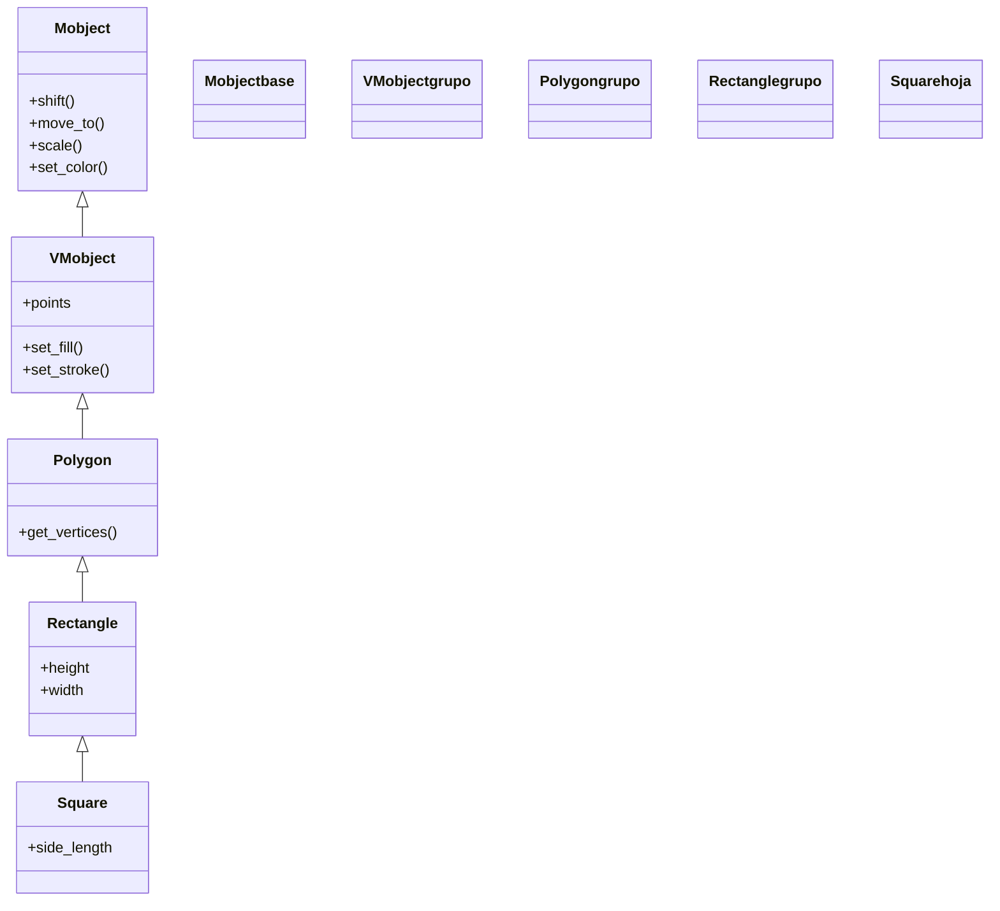

# Square — cuadrado (VMobject de geometria)

`Square` es el Mobject que dibuja un **cuadrado** a partir de un único dato, `side_length` (la longitud del lado), centrado por defecto en el `ORIGIN`. Es, literalmente, el caso simple de [[Rectangle]] en el que alto y ancho coinciden: hereda de él toda la maquinaria y solo cambia el constructor para pedir un lado en vez de dos medidas. Aparece en muchísimos ejemplos de Manim como figura de prueba, junto a [[Circle]] y [[Triangle]]. Como cualquier [[concepto_mobject|Mobject]] vectorizado, se crea y luego se **añade** (`self.add`) o se **anima** (`self.play(Create(...))`); no se "reproduce" por sí solo.

## Importacion

```python
from manim import Square
# o, como es habitual en Manim:
from manim import *
```

## Herencia

### La jerarquia

`Square` cuelga directamente de [[Rectangle]], y por tanto comparte toda su cadena hasta `Mobject`. No añade geometría nueva: solo restringe el rectángulo a lados iguales. Por eso un `Square` acepta exactamente los mismos métodos y kwargs que un `Rectangle`.



> La cadena de [[Polygon]] hasta `Mobject` pasa por `Polygram`; aquí se resume para no repetir el diagrama completo de [[Rectangle]], donde figura entero.

### Que hereda

`Square` no define prácticamente nada propio: hasta su tamaño lo traduce a `height`/`width` de [[Rectangle]]. Su color y su posición, como en toda figura, se recalculan con métodos heredados de arriba.

| Capacidad | Método típico | Definido en |
|-----------|---------------|-------------|
| Posición (relativa/absoluta) | `shift`, `move_to`, `next_to`, `to_edge` | [[Mobject]] |
| Escala y giro | `scale`, `rotate` | [[Mobject]] |
| Color global | `set_color`, `set_opacity` | [[Mobject]] |
| Relleno y trazo | `set_fill`, `set_stroke` | [[VMobject]] |
| Vértices y rejilla | `get_vertices`, `grid_xstep` | [[Rectangle]] / [[Polygon]] |

El `color` del constructor se aplica vía `set_color` heredado; el posicionamiento usa las constantes de [[posicionamiento]] (`UP`, `LEFT`, `ORIGIN`...).

## Constructor

```python
Square(side_length=2.0, **kwargs)
```

### Parametros

| Parametro | Tipo | Defecto | Controla |
|-----------|------|---------|----------|
| `side_length` | `float` | `2.0` | la longitud del lado, en unidades de escena (alto = ancho = `side_length`) |
| `**kwargs` | — | — | se pasan a [[Rectangle]]/[[VMobject]]: `color`, `fill_opacity`, `stroke_width`, `grid_xstep`... |

#### Relación con Rectangle

`Square(side_length=L)` equivale exactamente a `Rectangle(height=L, width=L)`. Todo lo que acepta `Rectangle` (incluida la rejilla `grid_xstep`/`grid_ystep` o el `color`) llega por `**kwargs`.

```python
# estas dos lineas producen la misma figura:
a = Square(side_length=3, color=BLUE)
b = Rectangle(height=3, width=3, color=BLUE)
```

### Que construye

Devuelve un `Square` (un VMobject) con cuatro lados iguales de longitud `side_length`, paralelos a los ejes y centrado en el `ORIGIN`. Es estático hasta que se añade o se anima.

## Metodos clave

`Square` no aporta métodos propios: mover, colorear, escalar y consultar son todos heredados. Remitir a [[posicionamiento]] y [[estilo]] para esos; lo más habitual es usar los getters de [[Rectangle]]/[[Mobject]].

### Consultar la geometria

| Metodo | Firma | Que hace |
|--------|-------|----------|
| `get_vertices` | `sq.get_vertices()` | los cuatro vértices del cuadrado (heredado de [[Polygon]]) |
| `get_center` | `sq.get_center()` | el punto central (heredado de [[Mobject]]) |
| `get_corner` | `sq.get_corner(UR)` | una de las cuatro esquinas (`UL`, `UR`, `DL`, `DR`) |

## Ejemplo

### Version minima

Un cuadrado verde relleno que se dibuja y permanece.

```python
from manim import *

class CuadradoMinimo(Scene):
    def construct(self):
        s = Square(side_length=2, color=GREEN, fill_opacity=0.5)
        self.play(Create(s))
        self.wait()
```

```bash
manim -pql archivo.py CuadradoMinimo      # -p reproduce, -ql = calidad baja (rapido)
```

### Version completa

Un cuadrado que se posiciona, se gira con la sintaxis `.animate` y se transforma en un [[Circle]], la demostración clásica de Manim. Muestra que los métodos heredados (`shift`, `rotate`) funcionan igual sobre el cuadrado que sobre cualquier figura.

```python
from manim import *

class CuadradoEnAccion(Scene):
    def construct(self):
        s = Square(side_length=2, color=BLUE, fill_opacity=0.5)

        self.play(Create(s))
        self.play(s.animate.to_edge(LEFT))            # posicionar (heredado de Mobject)
        self.play(s.animate.rotate(PI / 4))           # girar 45 grados con .animate
        self.play(Transform(s, Circle(color=YELLOW, fill_opacity=0.5)))  # morfa a circulo
        self.wait()
```

```bash
manim -pqh archivo.py CuadradoEnAccion     # -qh = calidad alta para el render final
```

## Errores comunes

| Error | Causa | Solución |
|-------|-------|----------|
| El cuadrado se ve hueco (solo borde) | `fill_opacity` es `0.0` por defecto | pásalo: `Square(fill_opacity=0.5)` o usa `set_fill` |
| Pasaste `width`/`height` a `Square` | `Square` solo entiende `side_length` | usa `Square(side_length=L)` o cambia a [[Rectangle]] |
| Querías un rectángulo (lados distintos) | `Square` fuerza lados iguales | usa [[Rectangle]] con `height` y `width` |
| El cuadrado "salta" en vez de animarse | usaste `s.rotate(...)` fuera de `self.play` (es instantáneo) | envuélvelo: `self.play(s.animate.rotate(...))` |
| `NameError: name 'Square' is not defined` | faltó el import | `from manim import *` al inicio |

## Notas relacionadas

- [[Rectangle]] — la clase padre; `Square` es su caso de lados iguales
- [[Circle]] — la otra figura de prueba por excelencia (el `Transform` clásico)
- [[Triangle]] — el polígono regular de tres lados, hermano geométrico
- [[concepto_mobject]] — qué es un Mobject y los métodos que todos comparten
- [[posicionamiento]] — colocar el cuadrado (`shift`, `next_to`, `to_edge`)
- [[estilo]] — color, relleno y trazo (`set_fill`, `set_stroke`)
- [[Scene.play]] — reproducir la animación que lo crea
