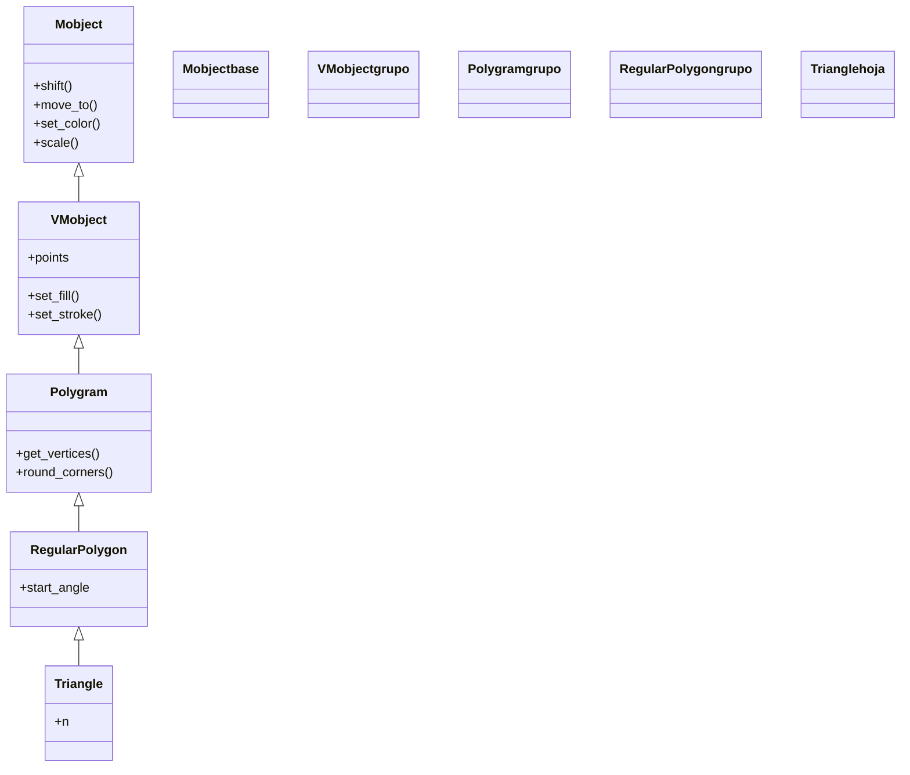

# Triangle — triángulo equilátero (VMobject de geometria)

`Triangle` es el Mobject del **triángulo equilátero**: la figura recta cerrada más simple, con tres lados iguales y la punta hacia arriba. No es más que un **polígono regular de 3 lados**, y por eso en Manim **hereda de `RegularPolygon`**: es el caso `n = 3` con un nombre propio para que sea cómodo de escribir. Lo usas cuando necesitas un triángulo "de manual" sin colocar vértices a mano; si quieres un triángulo cualquiera (escaleno, rectángulo), se construye con [[Polygon]]. Como todo [[concepto_mobject|Mobject]] es el **qué se ve**: se crea, se posiciona y se anima con `self.play(Create(...))`.

## Importacion

```python
from manim import Triangle
# o, como es habitual en todo ejemplo de Manim:
from manim import *
```

`from manim import *` trae `Triangle` junto al resto de figuras, animaciones y constantes. En la práctica casi siempre se usa el import estrella.

## Herencia

### La cadena

`Triangle` hereda de `RegularPolygon` (polígono de `n` lados iguales), que a su vez hereda de `RegularPolygram` y de `Polygon`/`Polygram`. La cadena nace en `VMobject`: `Triangle` es la hoja que fija `n = 3`.



### Que aporta cada ancestro

| Ancestro | Qué aporta |
|----------|------------|
| `Mobject` | lo universal: `shift`, `move_to`, `scale`, `rotate`, `set_color`, el árbol de hijos |
| `VMobject` | el relleno y el trazo (`set_fill`, `set_stroke`) y los `points` como Bézier |
| `Polygram` | unir vértices con segmentos; `get_vertices()`, `round_corners()` |
| `RegularPolygon` | genera `n` vértices equidistantes en un círculo; controla `start_angle` (giro inicial) |
| `Triangle` | fija `n = 3`: el equilátero con la punta arriba |

## Constructor

```python
Triangle(
    **kwargs,
)
```

No toma parámetros de forma propios: construye siempre un triángulo equilátero centrado en el origen, inscrito en un círculo de radio 1, con un vértice apuntando hacia arriba. Todo lo demás llega por `**kwargs`, que suben por `RegularPolygon` y `VMobject`: ahí entran el color, el relleno, el grosor del trazo y `start_angle` (heredado de `RegularPolygon`) para girar la orientación inicial.

### Parametros principales

`Triangle` no define parámetros de geometría; los útiles vienen de `RegularPolygon`.

| Parametro | Tipo | Defecto | Controla |
|-----------|------|---------|----------|
| `start_angle` | `float` | `PI/2` (vía RegularPolygon) | el ángulo del primer vértice; cambia la orientación |

#### Cambiar el tamano y la orientacion

El tamaño no se pasa al constructor: se ajusta después con `scale`. La orientación, con `rotate` o con `start_angle`:

```python
Triangle().scale(2)                 # el doble de grande
Triangle().rotate(PI)               # punta hacia abajo
Triangle(start_angle=-PI / 2)       # nace ya con la punta abajo
```

### Parametros de estilo

Llegan por `**kwargs` y los resuelve `VMobject`.

| Parametro | Tipo | Defecto | Controla |
|-----------|------|---------|----------|
| `color` | `ManimColor` | `WHITE` | el color del trazo |
| `fill_opacity` | `float` | `0` | opacidad del relleno (0 = solo contorno) |
| `fill_color` | `ManimColor` | `None` | color del relleno si difiere del trazo |
| `stroke_width` | `float` | `4` | grosor del borde |

### Que construye / devuelve

Devuelve un `Triangle` (un `VMobject`): un triángulo equilátero fuera de la escena, listo para `self.add(...)` o `self.play(Create(...))`.

## Metodos clave

`Triangle` usa los métodos heredados; no añade ninguno propio. Hereda de [[Polygon]]/`Polygram` `get_vertices()` y `round_corners()`, y de [[concepto_mobject|Mobject]] todo el repertorio universal.

### Transformar

| Método | Qué hace |
|--------|----------|
| `scale(factor)` | ajusta el tamaño (no hay parámetro de tamaño en el constructor) |
| `rotate(angulo)` | lo gira (`rotate(PI)` deja la punta abajo) |
| `shift` / `move_to` | lo posiciona |

### Consultar y suavizar

| Método | Qué hace |
|--------|----------|
| `get_vertices()` | devuelve los 3 vértices (útil para anclar otros objetos) |
| `round_corners(radius)` | redondea las tres esquinas |

## Ejemplo

### Version minima

Un triángulo equilátero que se dibuja y se queda en pantalla.

```python
from manim import *

class TrianguloMinimo(Scene):
    def construct(self):
        t = Triangle(color=GREEN)
        self.play(Create(t))
        self.wait()
```

```bash
manim -pql archivo.py TrianguloMinimo      # -p reproduce, -ql = calidad baja (rapido)
```

### Version completa

Un triángulo relleno que crece, gira para apuntar hacia abajo y termina con las esquinas redondeadas. Combina `scale`, `rotate`, `round_corners` y `.animate`.

```python
from manim import *

class TrianguloAnimado(Scene):
    def construct(self):
        t = Triangle(color=YELLOW, fill_color=ORANGE, fill_opacity=0.6).scale(1.5)

        self.play(Create(t))
        self.wait(0.5)
        self.play(t.animate.rotate(PI))            # punta hacia abajo
        self.play(t.animate.round_corners(0.3))    # esquinas suaves
        self.wait()
```

```bash
manim -pqh archivo.py TrianguloAnimado     # -qh = calidad alta para el render final
```

### Variaciones

Tres triángulos con orientaciones distintas, dispuestos en fila con un [[VGroup]]: el normal, uno invertido y uno girado un cuarto de vuelta.

```python
from manim import *

class VariacionesTriangulo(Scene):
    def construct(self):
        normal = Triangle(color=GREEN)
        invertido = Triangle(color=RED).rotate(PI)
        ladeado = Triangle(color=BLUE, fill_opacity=0.4).rotate(PI / 2)

        fila = VGroup(normal, invertido, ladeado).arrange(RIGHT, buff=1.0)
        self.play(Create(fila))
        self.wait()
```

```bash
manim -pql archivo.py VariacionesTriangulo
```

## Animarla

`Triangle` se anima como cualquier Mobject.

### Crear y transformar

| Forma | Qué hace |
|-------|----------|
| `self.play(Create(t))` | dibuja sus tres lados |
| `self.play(GrowFromCenter(t))` | lo hace crecer desde el centro |
| `self.play(Transform(t, Square()))` | morfa el triángulo en otra figura |
| `self.play(t.animate.rotate(PI))` | **anima** el giro (ver [[concepto_animate_syntax]]) |

### run_time y composicion

`self.play(Create(t), run_time=2)` alarga el trazado. Varias figuras a la vez se combinan en un mismo `self.play(...)` o con [[AnimationGroup]].

## Errores comunes

| Error | Causa | Solución |
|-------|-------|----------|
| Querías un triángulo de cierto tamaño y no hay parámetro | `Triangle` no toma tamaño en el constructor | ajústalo después con `.scale(factor)` |
| Querías un triángulo no equilátero | `Triangle` es siempre equilátero | usa [[Polygon]] con tus tres vértices |
| El triángulo apunta al revés de lo esperado | la orientación por defecto es punta arriba | `rotate(PI)` o `start_angle=-PI/2` |
| El relleno no aparece | `fill_opacity` por defecto es `0` | pasa `fill_opacity=...` o `set_fill(COLOR, 1)` |
| `NameError: name 'Triangle' is not defined` | faltó el import | `from manim import *` al inicio |

## Notas relacionadas

- [[Polygon]] — para triángulos no equiláteros (vértices a mano); el ancestro que une los puntos
- [[Square]] · [[Rectangle]] — otras figuras rectas cerradas de la familia `Polygram`
- [[Manim/mobjects/geometria/index | geometria]] — la carpeta de figuras y su jerarquía
- [[concepto_mobject]] — qué es un Mobject y los métodos que hereda
- [[concepto_animate_syntax]] — la sintaxis `.animate` para animar un cambio
- [[VGroup]] — para componer varios triángulos como una sola pieza
