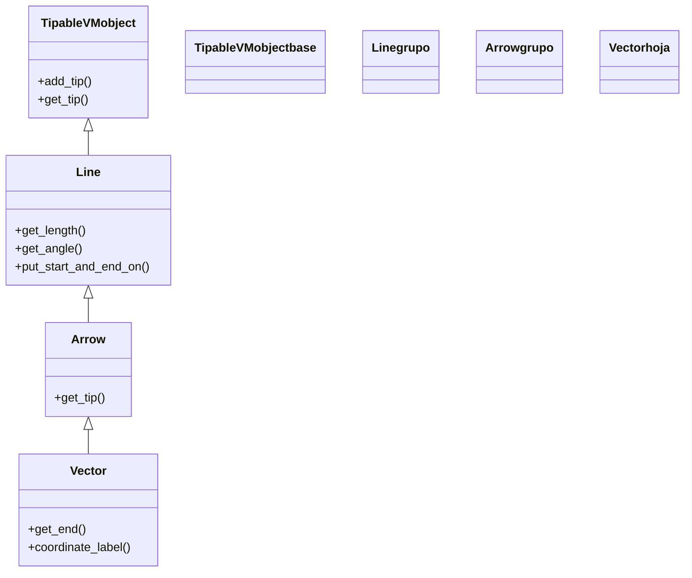

# Vector — una flecha desde el origen que representa un vector (VMobject de geometria)

`Vector` es una [[Arrow]] especializada para representar **un vector matemático**: una flecha que, por defecto, **nace en el `ORIGIN`** y apunta en una `direction` dada. Su razón de ser es semántica más que geométrica: en vez de pensar en "una flecha de tal punto a tal punto", piensas en "el vector `[2, 1]`", y `Vector([2, 1])` lo dibuja desde el origen hasta esas coordenadas. Es la figura natural para enseñar álgebra lineal en Manim —suma de vectores, combinaciones lineales, campos vectoriales, bases— y encaja directamente en un [[Axes]] o un [[NumberPlane]], donde las coordenadas del vector se corresponden con el sistema de ejes. Al heredar de `Arrow`, lo es **todo** lo que es una flecha (punta proporcional, `buff`, `get_length`, `get_angle`...); solo cambia cómo se construye. Como cualquier [[concepto_mobject|Mobject]], se posiciona, colorea y anima con el repertorio común.

## Importacion

```python
from manim import Vector
# o, como es habitual en Manim:
from manim import *
```

Con `from manim import *` llegan las direcciones (`RIGHT`, `UP`...) y los colores; las coordenadas del vector se pasan como lista o array (`[2, 1]`, `np.array([2, 1, 0])`).

## Herencia

### La cadena

`Vector` es la hoja de la rama: hereda de `Arrow`, que hereda de `Line`, que es un `TipableVMobject`. No aporta geometría nueva —sigue siendo una flecha— sino un **constructor distinto**: en vez de `start`/`end`, recibe una `direction` y la dibuja desde el origen. Todo lo demás (la punta, los métodos de medida, el estilo) viene heredado tal cual.



### Que aporta cada ancestro

| Ancestro | Qué le aporta a `Vector` |
|----------|--------------------------|
| `Mobject` / `VMobject` | posición, escala, giro, color y trazo |
| `Line` | ser un segmento medible (`get_length`, `get_angle`, `put_start_and_end_on`) |
| `Arrow` | la punta proporcional a la longitud, el `buff`, `get_tip` |
| `Vector` (propio) | construirse desde el origen a partir de una `direction`, y `coordinate_label()` |

## Constructor

```python
Vector(
    direction: np.ndarray = RIGHT,
    buff: float = 0,
    **kwargs,
)
```

### Parametros principales

| Parametro | Tipo | Defecto | Controla |
|-----------|------|---------|----------|
| `direction` | `np.ndarray` | `RIGHT` | las **coordenadas** del vector: la punta cae en `direction` y la cola en el origen |
| `buff` | `float` | `0` | margen en los extremos; aquí es `0` (a diferencia de `Arrow`, que es `MED_SMALL_BUFF`) para que la punta caiga **exactamente** en `direction` |

#### direction son coordenadas, no una dirección normalizada

El nombre engaña: `direction` no se normaliza a longitud 1. Es el **punto final** del vector. `Vector([3, 2])` va del origen a `(3, 2)`; su longitud es `sqrt(13)`, no 1. Para un vector unitario pasa tú las coordenadas unitarias. Acepta 2D (`[x, y]`, se asume `z=0`) o 3D (`[x, y, z]`).

```python
Vector([2, 1])        # del origen a (2, 1)
Vector(UP * 2)        # del origen a (0, 2): equivale a Vector([0, 2])
Vector([1, 1, 0])     # forma 3D explicita
```

#### buff=0: la punta cae en el punto exacto

Heredar de `Arrow` traería `buff=MED_SMALL_BUFF`, pero `Vector` lo fuerza a `0`: un vector debe terminar **justo** en sus coordenadas, sin hueco, para que coincida con la rejilla de un [[NumberPlane]] o un [[Axes]].

### Parametros de estilo

Vía `**kwargs`: `color` (toda la flecha), `stroke_width`, y los topes de punta/trazo heredados de `Arrow`. Es habitual darle un color vistoso (`YELLOW`, `GREEN`) para distinguir varios vectores.

### Que construye

Devuelve un `Vector` (una `Arrow`) con la cola en `ORIGIN` y la punta en `direction`. Para colocarlo en otro origen (encadenar vectores) se desplaza con `shift` o se reorienta con `put_start_and_end_on` heredado de `Line`.

## Metodos clave

### Propios y heredados de Arrow/Line

| Metodo | Qué hace |
|--------|----------|
| `get_end()` | el punto de la punta = las coordenadas del vector (heredado, muy usado) |
| `get_length()` | el **módulo** del vector (heredado de `Line`) |
| `get_angle()` | el **ángulo** del vector respecto al eje +x (heredado de `Line`) |
| `coordinate_label(...)` | crea una etiqueta con las coordenadas del vector, lista para colocar junto a él |
| `put_start_and_end_on(s, e)` | recoloca cola y punta: la forma de **encadenar** vectores (poner la cola de uno en la punta de otro) |

## Ejemplo

### Version minima

El vector más corto: del origen a unas coordenadas, que se dibuja.

```python
from manim import *

class VectorMinimo(Scene):
    def construct(self):
        v = Vector([2, 1], color=YELLOW)
        self.play(GrowArrow(v))     # crece desde el origen hacia la punta
        self.wait()
```

```bash
manim -pql archivo.py VectorMinimo      # -p reproduce, -ql = calidad baja (rapido)
```

### Version completa

El ejemplo clásico de álgebra lineal: **dibujar dos vectores y su suma** sobre un plano. La suma se construye colocando `b` con la cola en la punta de `a` (regla del paralelogramo) y trazando el vector resultante del origen a esa punta.

```python
from manim import *

class SumaDeVectores(Scene):
    def construct(self):
        plano = NumberPlane()
        self.add(plano)

        a = Vector([3, 0], color=GREEN)
        b = Vector([1, 2], color=BLUE)

        # b' = b colocado con la cola en la punta de a (encadenar con put_start_and_end_on)
        b_desplazado = Vector([1, 2], color=BLUE)
        b_desplazado.put_start_and_end_on(a.get_end(), a.get_end() + np.array([1, 2, 0]))

        suma = Vector([4, 2], color=YELLOW)   # a + b = (4, 2)

        self.play(GrowArrow(a))
        self.play(GrowArrow(b))
        self.play(Transform(b, b_desplazado))   # b se desliza a la punta de a
        self.play(GrowArrow(suma))              # la resultante del origen a (4, 2)
        self.wait()
```

```bash
manim -pqh archivo.py SumaDeVectores     # -qh = calidad alta para el render final
```

### Variaciones

Un vector con su etiqueta de coordenadas, y un vector unitario explícito.

```python
from manim import *

class VariacionesVector(Scene):
    def construct(self):
        plano = NumberPlane()
        v = Vector([2, 3], color=YELLOW)
        etiqueta = v.coordinate_label()          # etiqueta "[2, 3]" pegada a la punta
        unitario = Vector([1, 0], color=RED)     # modulo 1 (coordenadas unitarias)
        self.add(plano, v, etiqueta, unitario)
        self.wait()
```

```bash
manim -pql archivo.py VariacionesVector
```

## Animarla

Lo idiomático es `GrowArrow` (crece desde el origen). `Transform` sirve para "mover" un vector a otra posición o convertirlo en otro; `.animate` para cambios de estilo o giro.

```python
from manim import *

class AnimarVector(Scene):
    def construct(self):
        plano = NumberPlane()
        v = Vector([2, 1], color=YELLOW)
        self.add(plano)
        self.play(GrowArrow(v))                          # aparece desde el origen
        self.play(Transform(v, Vector([-1, 2], color=GREEN)))  # se transforma en otro vector
        self.play(Rotate(v, PI / 2, about_point=ORIGIN))       # lo gira en torno al origen
        self.wait()
```

```bash
manim -pql archivo.py AnimarVector
```

## Errores comunes

| Error | Causa | Solución |
|-------|-------|----------|
| El vector no tiene módulo 1 al pasar una "dirección" | `direction` son coordenadas, no se normaliza | pasa tú las coordenadas unitarias para un vector unitario |
| El vector no coincide con la rejilla del plano | lo creaste sin un `NumberPlane`/`Axes`, o lo posicionaste con coordenadas de pantalla | añade el plano; las coordenadas del vector usan las unidades del frame |
| La suma de vectores no cierra el triángulo | no encadenaste: pusiste ambos desde el origen | desplaza el segundo a la punta del primero (`put_start_and_end_on` / `shift`) |
| `Vector([2, 1])` da error de forma | pasaste algo que no es 2D/3D coherente | usa `[x, y]` o `[x, y, z]` (o `np.array(...)`) |
| `NameError: name 'np' is not defined` al sumar arrays | usaste numpy sin importarlo aparte | `from manim import *` ya trae `np`; asegúrate del import |

## Notas relacionadas

- [[concepto_mobject]] — la clase base de todo lo dibujable; `Vector` es uno de sus `VMobject`.
- [[Arrow]] — la clase padre directa: un `Vector` es una `Arrow` que nace en el origen.
- [[Line]] — de donde vienen `get_length` (módulo) y `get_angle` (ángulo) del vector.
- [[Manim/mobjects/geometria/index | geometria]] — el grupo de figuras geométricas.
- [[concepto_animation]] — `GrowArrow`, `Transform` y demás animaciones que reproduce `self.play`.
