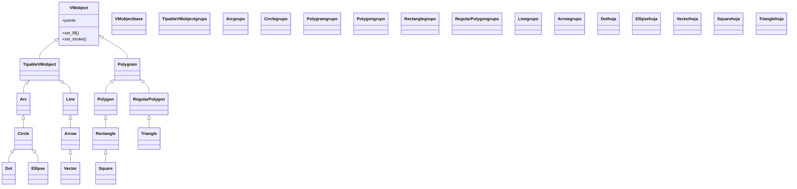

# geometria — las figuras básicas (círculos, líneas, polígonos)

Esta carpeta reúne las **figuras geométricas básicas** de Manim: los círculos y arcos, las líneas y flechas, los rectángulos y polígonos. Son los Mobjects más elementales, los ladrillos con que se construye casi cualquier escena —un diagrama, un esquema, el contorno de algo más complejo—. Lo que las une es que **todas son [[concepto_mobject|VMobject]]**: comparten exactamente el mismo repertorio de color, posición, escala y animación, así que aprender a mover y colorear un [[Circle]] es aprender a mover y colorear *cualquiera* de ellas. Lo único que cambia entre una y otra es su **geometría** (cómo nacen sus puntos); el resto lo heredan del tronco común. Por eso esta carpeta se lee como una familia: eliges la figura por su forma y la manejas siempre igual.

## En accion

Una escena que crea cuatro figuras distintas y las dispone en fila con `VGroup.arrange`: todas se crean igual (`self.play(Create(...))`) porque todas son VMobjects. La fila se mueve como una sola pieza.

```python
from manim import *

class Galeria(Scene):
    def construct(self):
        c = Circle(color=BLUE, fill_opacity=0.4)
        s = Square(color=GREEN, fill_opacity=0.4)
        t = Triangle(color=YELLOW, fill_opacity=0.4)
        e = Ellipse(width=2, height=1, color=RED, fill_opacity=0.4)

        fila = VGroup(c, s, t, e).arrange(RIGHT, buff=0.6)   # las ordena en fila
        self.play(Create(fila))
        self.play(fila.animate.shift(UP))                    # se mueven juntas
        self.wait()
```

```bash
manim -pql archivo.py Galeria      # -p reproduce, -ql = calidad baja (rapido)
```

## Herencia

Todas las figuras cuelgan de `VMobject`. Se separan en tres ramas según su geometría: la **redonda** (`Arc` -> `Circle` -> `Ellipse`/`Dot`), la de **segmentos** (`TipableVMobject` -> `Line` -> `Arrow` -> `Vector`) y la **poligonal** (`Polygram` -> `Polygon`/`RegularPolygon` y sus casos `Rectangle`, `Square`, `Triangle`).



## Clases que aporta

Las once figuras de la carpeta, con su padre directo y su uso. Las que ya tienen nota se enlazan.

| Clase | Hereda de | Para que |
|-------|-----------|----------|
| [[Circle]] | `Arc` | una circunferencia; rodear o marcar algo redondo |
| [[Dot]] | `Circle` | un punto pequeño relleno; marcar una posición |
| [[Ellipse]] | `Circle` | un óvalo (círculo con ancho y alto distintos): órbitas, burbujas |
| [[Arc]] | `TipableVMobject` | un trozo de circunferencia (un ángulo, una curva abierta) |
| [[Line]] | `TipableVMobject` | un segmento recto entre dos puntos; conectar objetos |
| [[Arrow]] | `Line` | un segmento con punta; indicar dirección o flujo |
| [[Vector]] | `Arrow` | una flecha que parte del origen; representar un vector |
| [[Polygon]] | `Polygram` | un polígono cualquiera definido por sus vértices |
| [[Rectangle]] | `Polygon` | un rectángulo por ancho y alto |
| [[Square]] | `Rectangle` | un cuadrado (rectángulo de lados iguales) |
| [[Triangle]] | `RegularPolygon` | un triángulo equilátero listo para usar |

## Como elegir

Primero decides la **familia** por la forma; dentro de ella, la clase concreta.

| Necesito… | Familia | Clase |
|-----------|---------|-------|
| Algo redondo cerrado | redonda | `Circle` (perfecto) · `Ellipse` (achatado) |
| Un trozo de curva / un ángulo | redonda | `Arc` |
| Una marca o un punto | redonda | `Dot` |
| Un segmento recto | segmentos | `Line` |
| Una flecha con dirección | segmentos | `Arrow` · `Vector` (desde el origen) |
| Un rectángulo o cuadrado | poligonal | `Rectangle` · `Square` |
| Un triángulo equilátero | poligonal | `Triangle` |
| Cualquier forma recta cerrada (a medida) | poligonal | `Polygon` |

## Patrones y recetas del grupo

Tres recetas que se repiten al combinar las figuras de esta carpeta: conectar, rodear y componer.

### Conectar dos objetos con una Line o una Arrow

Una `Line` o `Arrow` se "ancla" entre dos Mobjects pasando sus centros (o usando `get_left`/`get_right`). Es la base de cualquier diagrama de cajas y flechas.

```python
from manim import *

class Conectar(Scene):
    def construct(self):
        a = Square(color=BLUE).shift(LEFT * 3)
        b = Circle(color=GREEN).shift(RIGHT * 3)

        flecha = Arrow(start=a.get_right(), end=b.get_left(), color=YELLOW)

        self.play(Create(a), Create(b))
        self.play(GrowArrow(flecha))     # animacion propia de las flechas
        self.wait()
```

```bash
manim -pql archivo.py Conectar
```

### Rodear un objeto con un Circle

Para destacar algo, se crea un `Circle` y se le dice `surround(obj)` (o se ajusta su tamaño al del objeto). El círculo abraza al Mobject sin importar dónde esté.

```python
from manim import *

class Rodear(Scene):
    def construct(self):
        formula = Text("x = 42")
        marca = Circle(color=RED).surround(formula)   # ajusta el circulo al objeto

        self.play(Write(formula))
        self.play(Create(marca))
        self.wait()
```

```bash
manim -pql archivo.py Rodear
```

### Componer varias figuras en un VGroup

Cuando varias figuras forman una unidad, se agrupan en un [[VGroup]]: se ordenan con `.arrange` y se animan y mueven como un solo objeto, manteniendo su disposición relativa.

```python
from manim import *

class Componer(Scene):
    def construct(self):
        figuras = VGroup(
            Circle(color=BLUE),
            Square(color=GREEN),
            Triangle(color=YELLOW),
        ).arrange(RIGHT, buff=0.5)      # en fila, separadas 0.5

        self.play(Create(figuras))
        self.play(figuras.animate.scale(1.3).rotate(PI / 6))  # el grupo entero
        self.wait()
```

```bash
manim -pql archivo.py Componer
```

## Notas relacionadas

- [[concepto_mobject]] — qué es un Mobject/VMobject y los métodos que todas las figuras comparten
- [[concepto_sistema_coordenadas]] — las constantes (`UP`, `RIGHT`, `ORIGIN`) con que se posicionan
- [[concepto_animate_syntax]] — la sintaxis `.animate` para animar un cambio
- [[VGroup]] — el contenedor para componer y mover varias figuras juntas
- [[Manim/mobjects/index | mobjects]] — la carpeta padre con todos los objetos dibujables
- [[Manim/index | Manim]] — el índice raíz con el `classDiagram` global
