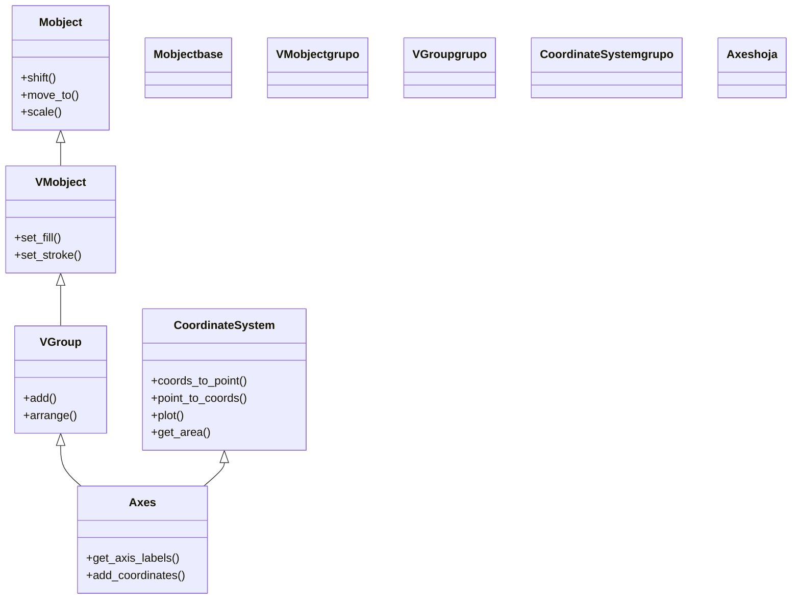

# Axes — sistema de ejes cartesianos (el plano matematico de Manim)

`Axes` es el Mobject que dibuja un **par de ejes cartesianos** (un eje x y un eje y) y, con ellos, abre un **sistema de coordenadas matemático** propio sobre la escena: el sitio donde graficas funciones, colocas puntos por sus coordenadas `(x, y)` y construyes todo lo que tenga que ver con cálculo o análisis (curvas, áreas, rectángulos de Riemann, rectas tangentes). Es la nota **central** de los gráficos: [[NumberPlane]], [[NumberLine]] y los ejes 3D giran a su alrededor. Por dentro `Axes` es a la vez dos cosas: un [[VGroup]] (un grupo de VMobjects: contiene los dos ejes como hijos, por eso se mueve y se anima como un todo) y un **`CoordinateSystem`** (un mixin que le da toda la maquinaria de coordenadas: `c2p`, `plot`, `get_area`...). La idea que **no** puedes saltarte: los ejes viven escalados y posicionados dentro de la escena, así que el punto matemático `(2, 4)` **no** está en la coordenada de escena `(2, 4)`; para pasar de un mundo al otro se usa `axes.c2p(2, 4)`. Esa conversión es el corazón de esta clase y de [[concepto_sistema_coordenadas]].

## Importacion

```python
from manim import Axes
# o, como es habitual en Manim:
from manim import *
```

## Herencia

### La jerarquia

`Axes` hereda de [[VGroup]] (de ahí que sea un **contenedor** de sus dos ejes y se comporte como un grupo: moverlo mueve ambos ejes) y, a la vez, mezcla el mixin `CoordinateSystem`, que es de donde salen los métodos estrella (`coords_to_point`/`c2p`, `point_to_coords`/`p2c`, `plot`, `get_area`, `get_riemann_rectangles`). La cadena de VMobject deja claro de dónde sale cada capacidad: el dibujo vectorizado de [[VMobject]], la posición y la escala de [[Mobject]], el agrupar de [[VGroup]] y la aritmética de coordenadas del mixin.



### Que hereda

`Axes` define la disposición de los dos ejes y delega casi todo lo demás: el posicionamiento en la escena viene de [[Mobject]], el comportamiento de grupo de [[VGroup]] y la conversión de coordenadas y el graficado del mixin `CoordinateSystem`.

| Capacidad | Método típico | Definido en |
|-----------|---------------|-------------|
| Posición y escala en la escena | `shift`, `move_to`, `scale`, `to_edge` | [[Mobject]] |
| Comportarse como grupo de sus ejes | `add`, indexar `axes[0]` (eje x), `axes[1]` (eje y) | [[VGroup]] |
| Convertir coordenadas matemáticas ↔ escena | `c2p` / `coords_to_point`, `p2c` / `point_to_coords` | `CoordinateSystem` |
| Graficar funciones y cálculo | `plot`, `get_area`, `get_riemann_rectangles` | `CoordinateSystem` |
| Anotar los ejes | `get_axis_labels`, `add_coordinates` | `Axes` |

## Constructor

```python
Axes(
    x_range: list = [-1, 10, 1],   # [min, max, step] del eje x (en coords MATEMATICAS)
    y_range: list = [-1, 10, 1],   # [min, max, step] del eje y
    x_length: float | None = None, # ancho del eje x en unidades de ESCENA (None = auto)
    y_length: float | None = None, # alto del eje y en unidades de escena
    axis_config: dict = {},        # estilo comun a ambos ejes
    x_axis_config: dict = {},      # estilo solo del eje x
    y_axis_config: dict = {},      # estilo solo del eje y
    tips: bool = True,             # dibujar puntas de flecha en los extremos
    **kwargs,
) -> Axes
```

### Parametros principales

| Parametro | Tipo | Defecto | Controla |
|-----------|------|---------|----------|
| `x_range` | `list` | `[-1, 10, 1]` | el rango del eje x como `[min, max, step]`: empieza en `min`, llega hasta `max` y marca una división cada `step` |
| `y_range` | `list` | `[-1, 10, 1]` | lo mismo para el eje y |
| `x_length` | `float \| None` | `None` | el ancho **físico** del eje en unidades de escena; si es `None`, Manim lo ajusta para que quepa en el frame |
| `y_length` | `float \| None` | `None` | el alto físico del eje y en unidades de escena |
| `tips` | `bool` | `True` | si dibuja la punta de flecha al final de cada eje |

#### x_range = [min, max, step] (la trampa de los tres números)

`x_range` (y `y_range`) **no** es `[min, max]`: es `[min, max, step]`, donde el tercer número es el **paso entre marcas**. Es el error más común al empezar. La diferencia entre el rango **matemático** (`x_range`, en unidades del gráfico) y la **longitud física** (`x_length`, en unidades de escena) es justo lo que hace que `(2, 4)` matemático no caiga en `(2, 4)` de la escena: los ejes están escalados.

```python
Axes(x_range=[0, 10, 2])          # x va de 0 a 10, una marca cada 2 unidades
Axes(x_range=[-3, 3, 0.5])        # x va de -3 a 3, marcas cada media unidad
Axes(x_range=[0, 5])              # CUIDADO: sin step, toma 1 por defecto; explicito es mejor
```

### Parametros de estilo

El aspecto de los ejes se controla con los tres diccionarios `*_config`, que se reenvían a los [[NumberLine]] internos de cada eje.

| Parametro | Tipo | Para que |
|-----------|------|----------|
| `axis_config` | `dict` | estilo **común** a los dos ejes: `{"color": BLUE, "stroke_width": 2, "include_numbers": True}` |
| `x_axis_config` | `dict` | sobreescribe solo el eje x (p. ej. `{"numbers_to_include": [1, 2, 3]}`) |
| `y_axis_config` | `dict` | sobreescribe solo el eje y |

### Que construye

Devuelve un `Axes`: un [[VGroup]] cuyos dos hijos son los ejes (`axes[0]` el x, `axes[1]` el y), ya escalados y centrados para caber en el frame. Es un objeto **dibujable y estático**: hay que añadirlo (`self.add(axes)`) o animarlo (`self.play(Create(axes))`). Lo importante: a partir de tenerlo, **todo dato del gráfico se coloca a través de `axes.c2p(...)`**.

## c2p — el puente entre el gráfico y la escena (lo más importante)

> [!important] Todo lo que pongas sobre los ejes pasa por `c2p`
> Los ejes viven **escalados y posicionados** dentro de la escena. Por eso el punto matemático `(2, 4)` **NO** está en la coordenada de escena `(2, 4)`. Si colocas un `Dot` en `(2, 4)` a pelo, cae en el sitio equivocado (a menudo casi fuera de cuadro). La regla sin excepción: **un `Dot`, una etiqueta, una recta o cualquier cosa que deba alinearse con los ejes se posiciona con `axes.c2p(x, y)`**.

`c2p` (alias de `coords_to_point`) traduce **coordenadas del gráfico → punto de la escena**. Su inverso es `p2c` (`point_to_coords`), que va de un punto de escena a las coordenadas matemáticas que representa.

```python
from manim import *

class PuntoSobreEjes(Scene):
    def construct(self):
        ejes = Axes(x_range=[0, 5, 1], y_range=[0, 8, 2])

        # MAL: Dot([2, 4, 0]) usaria coordenadas de ESCENA -> cae fuera de los ejes
        # BIEN: traducir el punto matematico (2, 4) a la escena con c2p:
        punto = Dot(ejes.c2p(2, 4), color=YELLOW)

        self.add(ejes, punto)
        self.wait()
```

```bash
manim -pql archivo.py PuntoSobreEjes      # -p reproduce, -ql = calidad baja (rapido)
```

La distinción completa (coordenadas de escena `UP`/`RIGHT`/`ORIGIN` frente a coordenadas matemáticas del `Axes`) vive en [[concepto_sistema_coordenadas]]; aquí basta la regla: **si hay ejes, todo punto del gráfico pasa por `c2p` antes de colocarse**.

## Metodos clave

`Axes` apenas tiene métodos propios; casi todos son del mixin `CoordinateSystem` y son lo que de verdad usarás. Para mover o colorear los ejes como un todo, valen los heredados de [[Mobject]] (`shift`, `scale`, `set_color`).

### Convertir coordenadas

El puente entre los dos mundos. Es lo que hace que un `Axes` sea más que dos líneas dibujadas.

| Metodo | Firma | Que hace |
|--------|-------|----------|
| `c2p` | `axes.c2p(*coords) -> np.ndarray` | **coords → punto**: convierte `(x, y)` matemáticos al punto `[x, y, z]` de la escena (alias de `coords_to_point`) |
| `p2c` | `axes.p2c(point) -> np.ndarray` | **punto → coords**: el inverso, de un punto de escena a las coordenadas del gráfico (alias de `point_to_coords`) |

### Graficar

Dibujan curvas **respetando la escala de los ejes** (no hay que llamar a `c2p` a mano: `plot` ya lo hace por dentro para cada punto de la función).

| Metodo | Firma | Que hace |
|--------|-------|----------|
| `plot` | `axes.plot(function, x_range=None, color=WHITE, **kwargs) -> ParametricFunction` | dibuja la curva `y = f(x)` sobre los ejes; recibe una función de Python (antes se llamaba `get_graph`) |
| `plot_parametric_curve` | `axes.plot_parametric_curve(function, t_range=..., **kwargs)` | dibuja una curva paramétrica `(x(t), y(t))` |
| `input_to_graph_point` | `axes.input_to_graph_point(x, graph) -> np.ndarray` | devuelve el punto de **escena** de la curva `graph` en la abscisa `x` (útil para anclar un punto sobre la curva) |

```python
parabola = axes.plot(lambda x: x**2, x_range=[-2, 2], color=BLUE)   # y = x^2
```

### Anotar

Etiquetas de los ejes, números en las marcas y rótulos sobre las curvas.

| Metodo | Firma | Que hace |
|--------|-------|----------|
| `get_axis_labels` | `axes.get_axis_labels(x_label="x", y_label="y") -> VGroup` | crea las etiquetas de los dos ejes (acepta texto o `MathTex`) |
| `add_coordinates` | `axes.add_coordinates(*values) -> Self` | escribe los números en las marcas de los ejes |
| `get_graph_label` | `axes.get_graph_label(graph, label, x_val=None, direction=UR) -> Mobject` | coloca un rótulo (p. ej. `f(x)`) pegado a una curva |

### Calculo

Lo que hace de `Axes` la herramienta para visualizar análisis: área bajo la curva, sumas de Riemann y rectas secantes/tangentes.

| Metodo | Firma | Que hace |
|--------|-------|----------|
| `get_area` | `axes.get_area(graph, x_range=None, color=..., opacity=0.3) -> Polygon` | sombrea el **área bajo** (o entre) curvas en un tramo |
| `get_riemann_rectangles` | `axes.get_riemann_rectangles(graph, x_range=None, dx=0.1, **kwargs) -> VGroup` | dibuja los **rectángulos de Riemann** que aproximan esa área |
| `get_secant_slope_group` | `axes.get_secant_slope_group(x, graph, dx=..., **kwargs) -> VGroup` | construye la recta secante (y, con `dx → 0`, la tangente) en un punto |

## Ejemplo

### Version minima

Unos ejes y una parábola graficada encima. `plot` se encarga solo de respetar la escala: no hay un solo `c2p` a la vista porque lo aplica por dentro.

```python
from manim import *

class EjesMinimos(Scene):
    def construct(self):
        ejes = Axes(x_range=[-3, 3, 1], y_range=[0, 9, 1])
        parabola = ejes.plot(lambda x: x**2, color=BLUE)
        self.play(Create(ejes), Create(parabola))
        self.wait()
```

```bash
manim -pql archivo.py EjesMinimos      # -p reproduce, -ql = calidad baja (rapido)
```

### Version completa

El caso realista que junta casi todo: graficar `sin(x)`, etiquetar los ejes y la curva, anclar un `Dot` **sobre** la curva con `c2p`, y sombrear el área bajo ella. Nótese cómo el punto en `(PI/2, 1)` se coloca con `ejes.c2p(...)`: a pelo caería en el sitio equivocado.

```python
from manim import *
import numpy as np

class SenoCompleto(Scene):
    def construct(self):
        # 1. los ejes, con numeros en las marcas
        ejes = Axes(
            x_range=[0, 2 * np.pi, np.pi / 2],
            y_range=[-1.5, 1.5, 0.5],
            axis_config={"include_numbers": False},
        )
        etiquetas = ejes.get_axis_labels(x_label="x", y_label="\\sin x")

        # 2. la curva, respetando la escala de los ejes
        curva = ejes.plot(lambda x: np.sin(x), color=YELLOW)
        rotulo = ejes.get_graph_label(curva, label="\\sin(x)")

        # 3. un punto ANCLADO sobre la curva: el maximo en (PI/2, 1)
        #    OBLIGATORIO c2p: a pelo, (PI/2, 1) caeria fuera de los ejes
        maximo = Dot(ejes.c2p(np.pi / 2, 1), color=RED)

        # 4. el area bajo la curva en el primer arco
        area = ejes.get_area(curva, x_range=[0, np.pi], color=BLUE, opacity=0.4)

        self.play(Create(ejes), Write(etiquetas))
        self.play(Create(curva), Write(rotulo))
        self.play(FadeIn(maximo), FadeIn(area))
        self.wait()
```

```bash
manim -pqh archivo.py SenoCompleto     # -qh = calidad alta para el render final
```

### Variaciones

Los **rectángulos de Riemann**: la aproximación del área que `get_area` sombrea. Bajar `dx` los hace más finos y la aproximación mejor.

```python
from manim import *

class RiemannDemo(Scene):
    def construct(self):
        ejes = Axes(x_range=[0, 4, 1], y_range=[0, 16, 4])
        curva = ejes.plot(lambda x: x**2, x_range=[0, 4], color=BLUE)

        # rectangulos que aproximan el area bajo y = x^2 entre 0 y 4
        rects = ejes.get_riemann_rectangles(
            curva, x_range=[0, 4], dx=0.5, color=[BLUE, GREEN], fill_opacity=0.6
        )

        self.play(Create(ejes), Create(curva))
        self.play(Create(rects))
        self.wait()
```

```bash
manim -pql archivo.py RiemannDemo
```

## Errores comunes

| Error | Causa | Solución |
|-------|-------|----------|
| El `Dot`/etiqueta cae fuera de los ejes o en mal sitio | lo colocaste con coordenadas de escena, sin traducir | usa `axes.c2p(x, y)`: todo punto del gráfico pasa por `c2p` |
| Los ejes salen con marcas espaciadas raro | confundiste `x_range=[min, max]` con `[min, max, step]` | el tercer número es el paso entre marcas: `x_range=[0, 10, 2]` |
| `plot` corta la curva o la dibuja fuera | la función crece más allá del `y_range` definido | amplía `y_range`, o limita `x_range` en `plot(..., x_range=[a, b])` |
| `axes.plot(...)` no existe / `AttributeError: get_graph` | usas un nombre antiguo o ManimGL | en ManimCE es `plot` (antes `get_graph`); revisa que sea Community Edition |
| El área/Riemann no encaja con la curva | pasaste un `x_range` distinto al de la curva | usa el mismo tramo en `get_area`/`get_riemann_rectangles` que en `plot` |
| `NameError: name 'Axes' is not defined` | faltó el import | `from manim import *` al inicio |

## Notas relacionadas

- [[NumberPlane]] — un `Axes` con rejilla de fondo completa; hereda `c2p`, `plot` y todo lo de aquí
- [[NumberLine]] — el eje individual del que `Axes` construye sus dos ejes
- [[FunctionGraph]] — la curva que `plot` devuelve, vista como clase
- [[ParametricFunction]] — curvas paramétricas `(x(t), y(t))`
- [[concepto_sistema_coordenadas]] — coordenadas de escena vs matemáticas y el porqué de `c2p`
- [[Mobject]] — los métodos heredados para mover y escalar los ejes
- [[VGroup]] — la clase padre: por qué los ejes se comportan como un grupo
- [[Manim/mobjects/graficos/index | graficos]] — la carpeta de gráficos
