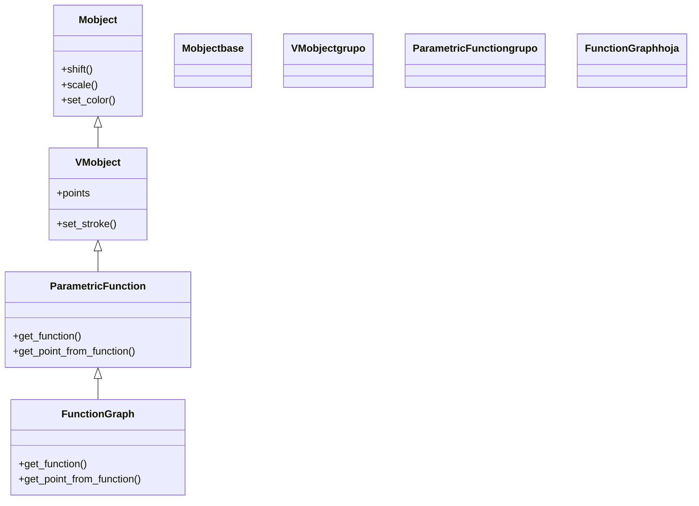

# FunctionGraph — graficar y = f(x) suelto, sin ejes (VMobject de graficos)

`FunctionGraph` es el atajo para graficar una función `y = f(x)` **suelta**: le pasas una `function(x)` que devuelve el escalar `y`, y dibuja su curva. Es el caso particular más común de [[ParametricFunction]] —tan común que tiene su propia clase— donde el parámetro **es** la `x` y el punto es `(x, f(x), 0)`. La diferencia capital, y la razón de tener esta nota aparte, está en **dónde** dibuja: `FunctionGraph` traza la curva en **unidades de escena directas**, sin ningún sistema de ejes detrás —el `(0, 0)` de la función cae en el `ORIGIN` de la escena y una unidad de `x` mide una unidad de pantalla—. Es la opción cuando quieres "una curva bonita" como elemento visual (un seno decorativo, una parábola de fondo) sin la parafernalia de un [[Axes]]. Cuando lo que quieres es una **gráfica de verdad**, con ejes etiquetados y escalas propias, **no** uses `FunctionGraph`: usa `axes.plot(f)`, que respeta el sistema del [[Axes]]. Esta distinción es la clave de la nota. Como todo [[concepto_mobject|Mobject]], se crea, posiciona y anima con el repertorio común.

## Importacion

```python
from manim import FunctionGraph
# o, como es habitual en todo ejemplo de Manim:
from manim import *
import numpy as np   # casi siempre, para np.sin, np.exp...
```

## Herencia

### La cadena

`FunctionGraph` hereda de [[ParametricFunction]]: es esa misma maquinaria de muestreo, pero **especializada** para que el parámetro sea `x` y el punto sea `(x, f(x), 0)`. Por encima viene `VMobject` (el trazo) y `Mobject` (lo universal). No añade casi nada propio: su trabajo es **traducir** tu `function(x)` escalar en la `function(t) -> punto` que `ParametricFunction` espera.



### Que aporta cada ancestro

| Viene de | Qué aporta a la gráfica |
|----------|-------------------------|
| `Mobject` | posición, escala, color, animación |
| `VMobject` | el trazo de la curva (`stroke_width`, `stroke_color`) |
| `ParametricFunction` | el **muestreo** sobre el rango y la generación de la polilínea de Bézier |
| `FunctionGraph` (propio) | envolver tu `f(x)` escalar como `x -> (x, f(x), 0)` y usar `x_range` en vez de `t_range` |

## Constructor

```python
FunctionGraph(
    function,          # x -> y   (un escalar, NO un punto)
    x_range=None,      # [x_min, x_max, paso]; None = todo el ancho del frame
    color=YELLOW,      # color del trazo
    **kwargs,          # stroke_width... -> a ParametricFunction/VMobject
) -> FunctionGraph
```

### Parametros principales

| Parametro | Tipo | Defecto | Controla |
|-----------|------|---------|----------|
| `function` | `callable` | — (obligatorio) | la función `x -> y`; **devuelve el escalar** `y`, no un punto |
| `x_range` | `[float, float, float] \| None` | `None` | el intervalo de `x`: `[x_min, x_max, paso]`; `None` = ancho del frame |
| `color` | `ManimColor` | `YELLOW` | color del trazo |

#### function: devuelve y (escalar), no un punto

Aquí está la diferencia con [[ParametricFunction]]: la función de `FunctionGraph` devuelve **el número `y`**, no `np.array([x, y, 0])`. La clase se encarga de armar el punto:

```python
FunctionGraph(lambda x: np.sin(x))          # bien: devuelve el escalar sin(x)
FunctionGraph(lambda x: x**2 - 3)           # bien: una parabola
# MAL: lambda x: np.array([x, np.sin(x), 0])  <- eso es ParametricFunction
```

#### x_range: el dominio en unidades de escena

`x_range` es `[x_min, x_max, paso]` en **coordenadas de escena**: como no hay ejes, `x` va medido en unidades de pantalla. Si lo dejas en `None`, Manim grafica de borde a borde del frame (de `x ≈ -7.11` a `7.11`). El paso es el muestreo; bájalo para curvas muy onduladas.

### Parametros de estilo

Por `**kwargs`: `stroke_width`, `stroke_opacity` (de `VMobject`). El `color` es parámetro propio.

### Que construye

Devuelve un `FunctionGraph`: un `VMobject` con la curva de `y = f(x)` **dibujada directamente sobre la escena**, sin ejes. El origen de la función coincide con el `ORIGIN`; una unidad de `x` = una unidad de escena. Se anima con `Create(grafica)` (la traza de izquierda a derecha).

## FunctionGraph vs axes.plot — la distincion que importa

Las dos formas de graficar `y = f(x)` en Manim, y cuándo usar cada una:

| | `FunctionGraph(f)` | `axes.plot(f)` (con [[Axes]]) |
|--|--------------------|-------------------------------|
| **Dónde dibuja** | en **coordenadas de escena** directas | en las **coordenadas matemáticas** del `Axes` |
| **Ejes** | ninguno (curva suelta) | dibujados, etiquetados, con su escala |
| **Escala** | 1 unidad de `x` = 1 unidad de pantalla (fija) | la que tú definas en el `Axes` (`x_range`, `y_range`) |
| **Origen** | en el `ORIGIN` de la escena | donde el `Axes` ponga su `(0, 0)` |
| **Colocar puntos** | `grafica.point_from_proportion` / a mano | `axes.c2p(x, y)` (el método del eje) |
| **Cuándo** | curva decorativa o ilustrativa, sin medir nada | una **gráfica de verdad**: con ejes, valores, áreas |

> [!important] La regla de decisión
> Si te importa la **escala** (que el `y` llegue a 100, que el `x` vaya de 0 a 5) o quieres ejes visibles, usa un [[Axes]] y `axes.plot(f)`. `FunctionGraph` es para cuando la curva es un **elemento gráfico suelto** y la escala 1:1 de la escena te vale. La pista: si vas a necesitar `c2p` para colocar etiquetas o áreas, ya estás en territorio de `Axes`, no de `FunctionGraph`.

## Metodos clave

Hereda de [[ParametricFunction]] y [[VMobject]]; lo propio es marginal. Lo más usado:

| Metodo | Firma | Que hace |
|--------|-------|----------|
| `get_function` | `get_function() -> callable` | la `f(x)` original |
| `get_point_from_function` | `get_point_from_function(x) -> np.ndarray` | el punto de escena para una `x` dada |
| `point_from_proportion` | `point_from_proportion(alpha) -> np.ndarray` | (heredado) el punto al `alpha` (0..1) de la curva |

## Ejemplo

### Version minima

Un seno suelto, sin ejes, de borde a borde del frame.

```python
from manim import *
import numpy as np

class SenoSuelto(Scene):
    def construct(self):
        grafica = FunctionGraph(lambda x: np.sin(x), x_range=[-PI, PI], color=YELLOW)
        self.play(Create(grafica))
        self.wait()
```

```bash
manim -pql archivo.py SenoSuelto      # -p reproduce, -ql = calidad baja (rapido)
```

### Version completa: suelto vs sobre ejes

El contraste que define la clase. A la izquierda, el **mismo** seno como `FunctionGraph` (suelto, en unidades de escena); a la derecha, graficado con `axes.plot` **sobre un Axes** (con ejes y escala propia). Se ve que son dos mundos distintos de coordenadas.

```python
from manim import *
import numpy as np

class SueltoVsEjes(Scene):
    def construct(self):
        # IZQUIERDA: FunctionGraph suelto, sin ejes, coords de escena
        suelto = FunctionGraph(
            lambda x: np.sin(x),
            x_range=[-PI, PI],
            color=YELLOW,
        ).to_edge(LEFT, buff=1)
        et_suelto = Text("FunctionGraph (suelto)", font_size=24).next_to(suelto, UP)

        # DERECHA: el mismo seno, pero sobre un Axes con su propia escala
        ejes = Axes(
            x_range=[-PI, PI, PI / 2],
            y_range=[-1, 1, 0.5],
            x_length=5,
            y_length=3,
        ).to_edge(RIGHT, buff=1)
        sobre_ejes = ejes.plot(lambda x: np.sin(x), color=GREEN)   # respeta el Axes
        et_ejes = Text("axes.plot (sobre ejes)", font_size=24).next_to(ejes, UP)

        self.play(Create(suelto), Write(et_suelto))
        self.play(Create(ejes), Create(sobre_ejes), Write(et_ejes))
        self.wait()
```

```bash
manim -pqh archivo.py SueltoVsEjes     # -qh = calidad alta para el render final
```

### Variaciones

Una parábola y una exponencial sueltas, recortando el dominio con `x_range` para que no se salgan del frame:

```python
from manim import *
import numpy as np

class CurvasSueltas(Scene):
    def construct(self):
        parabola = FunctionGraph(lambda x: 0.4 * x**2 - 2, x_range=[-3, 3], color=BLUE)
        expo = FunctionGraph(lambda x: np.exp(0.5 * x) - 3, x_range=[-3, 2.5], color=RED)
        self.play(Create(parabola))
        self.play(Create(expo))
        self.wait()
```

```bash
manim -pql archivo.py CurvasSueltas
```

## Errores comunes

| Error | Causa | Solución |
|-------|-------|----------|
| `setting an array element with a sequence` | tu `function` devuelve un punto, no un escalar | devuelve solo `y`; el punto lo arma la clase |
| La curva se sale del frame (picos enormes) | una función que crece rápido sin recortar `x_range` | acota `x_range` para que `y` quede en `\|y\| < 4` |
| "No veo los ejes" | `FunctionGraph` **no dibuja ejes**, nunca | usa un [[Axes]] + `axes.plot(f)` si los quieres |
| Las coordenadas no cuadran con un `Axes` cercano | mezclaste una curva suelta con un sistema de ejes | grafica todo con `axes.plot` para compartir escala |
| Quería marcar el punto `(2, f(2))` y no cae bien | en `FunctionGraph` no hay `c2p`; es escena directa | grafica sobre `Axes` y usa `axes.c2p(2, f(2))` |
| La curva se ve angulosa | el paso de muestreo (`x_range[2]`) es grande | añade un 3.º valor pequeño: `[-3, 3, 0.05]` |

## Notas relacionadas

- [[ParametricFunction]] — la clase padre: el caso general `t -> punto` (círculos, espirales, Lissajous)
- [[Axes]] — el sistema de ejes; usa `axes.plot(f)` cuando quieras una gráfica con escala real
- [[concepto_sistema_coordenadas]] — coordenadas de escena vs matemáticas: el porqué de la distinción con `axes.plot`
- [[Manim/mobjects/graficos/index | graficos]] — la carpeta de sistemas de coordenadas y curvas
- [[VMobject]] — el trazo que la curva hereda
- [[concepto_mobject]] — el modelo de objeto dibujable
