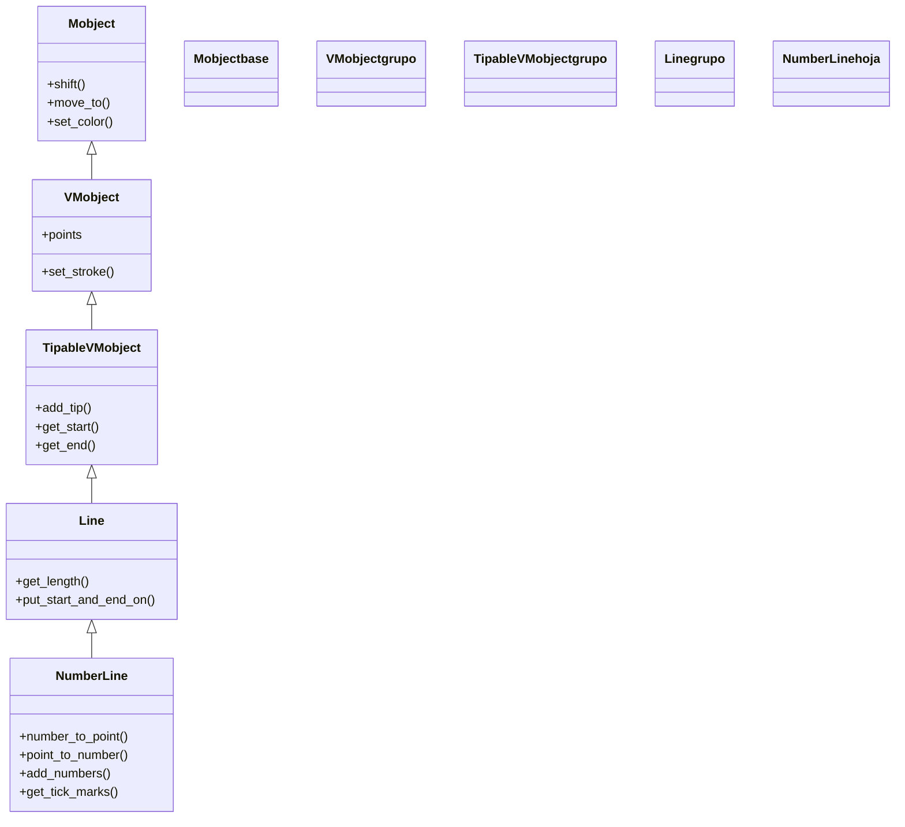

# NumberLine — la recta numérica con marcas y números (VMobject de graficos)

`NumberLine` es una **recta numérica**: un segmento recto al que Manim le añade **marcas** (ticks) regulares y, opcionalmente, los **números** debajo de cada marca. Es la pieza de graficado más simple —un eje suelto, de una sola dimensión— y a la vez el ladrillo conceptual del que están hechos los ejes 2D: un [[Axes]] no es más que dos `NumberLine` cruzadas. Se usa para ilustrar magnitudes lineales (una escala, un intervalo, una variable que se mueve), para marcar puntos sobre una recta o para construir tu propio sistema de coordenadas a mano. Su valor práctico está en que, como cualquier sistema de coordenadas de Manim, **traduce un número en un punto de la escena** con `number_to_point` (`n2p`) y al revés con `point_to_number` (`p2n`): así colocas un objeto "sobre el 3" sin calcular a mano dónde cae ese 3 en pantalla. Como todo [[concepto_mobject|Mobject]], se posiciona, se colorea y se anima con el repertorio común.

## Importacion

```python
from manim import NumberLine
# o, como es habitual en todo ejemplo de Manim:
from manim import *
```

Con `from manim import *` llegan también las constantes de dirección (`DOWN`, `UP`, `LEFT`...) que `NumberLine` usa para colocar las etiquetas de los números, además de los colores.

## Herencia

### La cadena

`NumberLine` hereda de [[Line]] (un segmento entre dos puntos) y, por encima, de `TipableVMobject`, `VMobject` y `Mobject`. De la cadena saca todo: el trazo del eje (de `VMobject`), la posibilidad de llevar punta de flecha en los extremos (de `TipableVMobject`), la geometría de segmento (de `Line`) y el comportamiento universal de Mobject (posición, escala, animación). Lo único que `NumberLine` añade encima es la **maquinaria de la escala**: las marcas, los números y la conversión número ↔ punto.



### Que aporta cada ancestro

Casi nada de lo que usas de una `NumberLine` lo define ella misma: lo recibe heredado.

| Viene de | Qué aporta a la recta |
|----------|-----------------------|
| `Mobject` | posición (`shift`, `move_to`), color (`set_color`), escala y la capacidad de animarse |
| `VMobject` | el **trazo** del eje (`stroke_width`, `stroke_color`) y los puntos de Bézier |
| `TipableVMobject` | poder llevar **punta de flecha** en un extremo (`add_tip`, `include_tip`) |
| `Line` | la geometría de **segmento recto** y su longitud |
| `NumberLine` (propio) | las **marcas**, los **números** y la conversión **número ↔ punto** (`n2p`/`p2n`) |

## Constructor

```python
NumberLine(
    x_range=[-8, 8, 1],          # [min, max, paso] de la recta
    length=None,                 # longitud en unidades de ESCENA (None = la deduce de x_range)
    unit_size=1,                 # unidades de escena por cada unidad numerica (si length es None)
    include_ticks=True,          # dibujar las marcas
    include_numbers=False,       # escribir los numeros bajo las marcas
    numbers_to_include=None,     # lista de numeros concretos a etiquetar
    label_direction=DOWN,        # hacia donde caen las etiquetas respecto al eje
    font_size=36,                # tamaño de los numeros
    include_tip=False,           # punta de flecha en el extremo
    **kwargs,                    # color, stroke_width... -> a VMobject/Mobject
) -> NumberLine
```

### Parametros principales

| Parametro | Tipo | Defecto | Controla |
|-----------|------|---------|----------|
| `x_range` | `[float, float, float]` | `[-8, 8, 1]` | el intervalo y el paso: `[min, max, paso_entre_marcas]` |
| `length` | `float \| None` | `None` | la longitud **en pantalla**; si la fijas, la recta se estira para medir eso |
| `unit_size` | `float` | `1` | unidades de escena por unidad numérica (se usa cuando `length` es `None`) |
| `include_ticks` | `bool` | `True` | si dibuja las marcas regulares |
| `include_numbers` | `bool` | `False` | si escribe los números debajo (cada marca según `x_range`) |
| `numbers_to_include` | `list \| None` | `None` | etiquetar **solo** esos números concretos en vez de todos |
| `label_direction` | vector | `DOWN` | hacia dónde caen los números respecto al eje (`DOWN`, `UP`...) |
| `font_size` | `float` | `36` | tamaño de las etiquetas numéricas |

#### x_range: el trío [min, max, paso]

El parámetro que más confunde. `x_range` es **siempre** una terna `[min, max, paso]`, no dos valores: el tercer número fija la **separación entre marcas**, no la cantidad de marcas. `x_range=[0, 10, 2]` dibuja marcas en 0, 2, 4, 6, 8, 10; `x_range=[0, 10, 1]` las dibuja en cada entero. Si omites el paso, Manim asume 1.

#### length vs unit_size: dos formas de fijar el tamaño

Hay dos maneras de decidir cuánto mide la recta en pantalla, y son **excluyentes**: o fijas `length` (la longitud total en unidades de escena, y Manim reparte el `x_range` dentro) o fijas `unit_size` (cuántas unidades de escena vale cada unidad numérica, y la longitud sale de multiplicar). Si pasas `length`, `unit_size` se ignora. Usa `length` cuando quieras que la recta quepa en un hueco concreto; usa `unit_size` cuando te importe la escala exacta (que el "1" mida lo mismo aquí que en otro eje).

### Parametros de estilo

Heredados de `VMobject`/`Mobject`, llegan por `**kwargs`: `color` (tiñe eje, marcas y números), `stroke_width` (grosor del eje). El tamaño de los números va aparte en `font_size`.

### Que construye

Devuelve un `NumberLine`: un `VMobject` cuya geometría es el segmento del eje, con las marcas y (si lo pides) los números como **submobjects**. Nace centrado en el `ORIGIN` de la escena salvo que lo muevas. Como es un solo Mobject con su familia, se anima entero con `Create(recta)` y se desplaza con `recta.animate.shift(...)`.

## Metodos clave

### Convertir numero <-> punto

El corazón de la clase: el puente entre el **número** sobre la recta y el **punto de escena** donde cae. Es el análogo 1D de `c2p`/`p2c` de un [[Axes]].

| Metodo | Alias | Firma | Que hace |
|--------|-------|-------|----------|
| `number_to_point` | `n2p` | `n2p(number) -> np.ndarray` | dado un número, devuelve su punto `[x, y, z]` **en la escena** |
| `point_to_number` | `p2n` | `p2n(point) -> float` | dado un punto de escena, devuelve a qué número de la recta corresponde |

> [!tip] n2p es como colocas cosas "sobre el 3"
> Nunca calcules a mano dónde cae un número: `recta.n2p(3)` te da el punto exacto, respetando el `x_range`, el `length` y la posición de la recta. Un `Dot(recta.n2p(3))` queda clavado sobre el 3 aunque luego muevas la recta de sitio (si lo recalculas).

### Añadir y consultar

| Metodo | Firma | Que hace |
|--------|-------|----------|
| `add_numbers` | `add_numbers(x_values=None, **kwargs) -> Self` | escribe los números a posteriori (si no usaste `include_numbers`) |
| `get_tick_marks` | `get_tick_marks() -> VGroup` | devuelve el grupo de las marcas, para estilizarlas aparte |
| `get_number_mobject` | `get_number_mobject(x) -> Mobject` | el Mobject del número en esa posición |

El resto (posicionar, colorear, escalar, animar) son los métodos universales heredados de [[Mobject]].

## Ejemplo

### Version minima

La recta más corta útil: un intervalo con números y nada más.

```python
from manim import *

class RectaMinima(Scene):
    def construct(self):
        recta = NumberLine(x_range=[0, 10, 1], include_numbers=True)
        self.play(Create(recta))
        self.wait()
```

```bash
manim -pql archivo.py RectaMinima      # -p reproduce, -ql = calidad baja (rapido)
```

### Version completa

Una recta con números y un `Dot` que viaja **a una posición concreta** usando `n2p`: el punto se coloca sobre el 2 y luego se anima hasta el 7, siempre traduciendo el número al punto de escena. Así no hay un solo número mágico de pantalla.

```python
from manim import *

class PuntoSobreLaRecta(Scene):
    def construct(self):
        # una recta de -1 a 8, marcas cada 1, con numeros debajo
        recta = NumberLine(
            x_range=[-1, 8, 1],
            length=10,
            include_numbers=True,
            include_tip=True,
            color=BLUE,
        )
        self.play(Create(recta))

        # un punto colocado EXACTAMENTE sobre el 2 via n2p:
        punto = Dot(recta.n2p(2), color=YELLOW, radius=0.12)
        etiqueta = MathTex("x = 2").next_to(punto, UP)
        self.play(FadeIn(punto), Write(etiqueta))
        self.wait(0.5)

        # animarlo hasta el 7, de nuevo traduciendo el numero a punto:
        self.play(
            punto.animate.move_to(recta.n2p(7)),
            etiqueta.animate.become(MathTex("x = 7").next_to(recta.n2p(7), UP)),
        )
        self.wait()
```

```bash
manim -pqh archivo.py PuntoSobreLaRecta     # -qh = calidad alta para el render final
```

### Variaciones

Etiquetar **solo** algunos números con `numbers_to_include`, y poner las etiquetas arriba con `label_direction`:

```python
from manim import *

class RectaEtiquetada(Scene):
    def construct(self):
        recta = NumberLine(
            x_range=[0, 100, 10],            # marcas cada 10
            length=12,
            numbers_to_include=[0, 50, 100],  # pero solo etiqueta 0, 50, 100
            label_direction=UP,               # numeros ARRIBA del eje
            font_size=28,
        )
        self.add(recta)
        self.wait()
```

```bash
manim -pql archivo.py RectaEtiquetada
```

## Errores comunes

| Error | Causa | Solución |
|-------|-------|----------|
| No aparece ningún número | `include_numbers` por defecto es `False` | pásalo `True` o llama a `add_numbers()` después |
| Hay muchísimas marcas / van apretadas | el **paso** (3.º valor de `x_range`) es muy pequeño para el rango | sube el paso: `[0, 100, 10]`, no `[0, 100, 1]` |
| La recta se sale del cuadro | el `x_range` es enorme y `unit_size` ≥ 1 | fija `length` (p. ej. `length=12`) para que quepa |
| `x_range=[0, 10]` ignora el paso esperado | falta el tercer valor; asume paso 1 | escribe siempre la terna `[min, max, paso]` |
| Un `Dot` no cae sobre el número que quería | lo colocaste con coords de escena, no con `n2p` | usa `Dot(recta.n2p(3))`, no `Dot([3, 0, 0])` |
| Cambiar `unit_size` no hace nada | pasaste también `length`, que tiene prioridad | quita `length` para que mande `unit_size` |

## Notas relacionadas

- [[Axes]] — dos `NumberLine` cruzadas: el sistema de coordenadas 2D y su `c2p`/`p2c`
- [[concepto_sistema_coordenadas]] — coordenadas de escena vs coordenadas matemáticas; el porqué de `n2p`
- [[Line]] — la clase padre: el segmento del que `NumberLine` saca su geometría
- [[Manim/mobjects/graficos/index | graficos]] — la carpeta de sistemas de coordenadas y curvas
- [[Mobject]] — el repertorio universal (posición, color, animación) que la recta hereda
- [[concepto_mobject]] — el modelo de objeto dibujable
