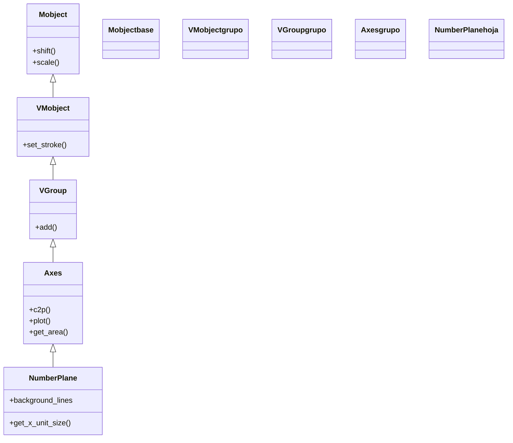

# NumberPlane — plano cartesiano con rejilla de fondo

`NumberPlane` es un [[Axes]] que, además de los dos ejes, dibuja una **rejilla completa de líneas de fondo**: el plano cuadriculado clásico. Es lo que usas cuando quieres un **fondo cartesiano** sobre el que pasen cosas (un campo vectorial, una transformación lineal del plano, una trayectoria) y no solo un par de ejes desnudos. Todo lo importante lo **hereda de `Axes`**: convierte coordenadas con `c2p`, grafica con `plot`, calcula áreas y rectángulos de Riemann. Lo único que añade es la cuadrícula y su estilo. La misma regla de oro de su padre sigue mandando: el plano vive escalado en la escena, así que **todo punto matemático `(x, y)` se coloca con `plane.c2p(x, y)`**, nunca a pelo (ver [[concepto_sistema_coordenadas]]).

## Importacion

```python
from manim import NumberPlane
# o, como es habitual en Manim:
from manim import *
```

## Herencia

### La jerarquia

`NumberPlane` hereda **directamente de [[Axes]]**: es un `Axes` con líneas de fondo. Por tanto arrastra toda la cadena de su padre (el mixin `CoordinateSystem` con `c2p`/`plot`, el comportamiento de grupo de [[VGroup]] y la posición de [[Mobject]]) y solo le suma la rejilla.



### Que hereda

Prácticamente **todo** viene de [[Axes]]. Conviene tenerlo claro: cualquier método que uses sobre un `NumberPlane` (graficar, convertir coordenadas, sombrear áreas) es exactamente el mismo de su padre.

| Capacidad | Método típico | Definido en |
|-----------|---------------|-------------|
| Convertir coordenadas matemáticas ↔ escena | `c2p` / `p2c` | [[Axes]] (mixin `CoordinateSystem`) |
| Graficar funciones | `plot`, `plot_parametric_curve` | [[Axes]] |
| Cálculo (área, Riemann, tangentes) | `get_area`, `get_riemann_rectangles` | [[Axes]] |
| Anotar | `get_axis_labels`, `add_coordinates` | [[Axes]] |
| Posición y escala | `shift`, `move_to`, `scale` | [[Mobject]] |
| **La rejilla de fondo** | (se configura en el constructor) | `NumberPlane` |

## Constructor

```python
NumberPlane(
    x_range: list = [-7.111, 7.111, 1],   # [min, max, step] del eje x
    y_range: list = [-4.0, 4.0, 1],       # [min, max, step] del eje y
    x_length: float | None = None,
    y_length: float | None = None,
    background_line_style: dict = {},     # estilo de las lineas PRINCIPALES de la rejilla
    faded_line_style: dict | None = None, # estilo de las lineas SECUNDARIAS (mas tenues)
    faded_line_ratio: int = 1,            # cuantas lineas tenues entre dos principales
    **kwargs,                             # se reenvian a Axes (axis_config, tips, ...)
) -> NumberPlane
```

### Parametros principales

Hereda `x_range`, `y_range`, `x_length`, `y_length` de [[Axes]] con el mismo significado (recuerda: `x_range` es `[min, max, step]`). Los defectos cambian: por defecto el plano **llena el frame** (`x` de `-7.111` a `7.111`, `y` de `-4` a `4`). Lo **propio** de `NumberPlane` es el control de la cuadrícula.

| Parametro | Tipo | Defecto | Controla |
|-----------|------|---------|----------|
| `background_line_style` | `dict` | `{}` | el estilo de las **líneas principales** de la rejilla: `{"stroke_color": BLUE_D, "stroke_width": 2, "stroke_opacity": 0.6}` |
| `faded_line_style` | `dict \| None` | `None` | el estilo de las **líneas secundarias** (las tenues entre principales) |
| `faded_line_ratio` | `int` | `1` | cuántas líneas tenues se intercalan entre dos principales (`2` = una subdivisión extra) |

#### faded_line_ratio (las subdivisiones tenues)

`faded_line_ratio` añade líneas de rejilla **más claras** entre las principales, para dar sensación de subdivisión sin saturar. Con `0` no hay líneas tenues; con `2` hay dos por celda.

```python
NumberPlane(faded_line_ratio=2)   # dos lineas tenues entre cada par de principales
NumberPlane(faded_line_ratio=0)   # solo la rejilla principal, sin subdivisiones tenues
```

### Parametros de estilo

Además de los dos `*_line_style`, sigue aceptando los `axis_config`/`x_axis_config`/`y_axis_config` de [[Axes]] para el estilo de los **ejes** (que son distintos de las líneas de fondo).

| Parametro | Tipo | Para que |
|-----------|------|----------|
| `background_line_style` | `dict` | color, grosor y opacidad de la cuadrícula principal |
| `axis_config` | `dict` | estilo de los **dos ejes** (heredado de `Axes`), independiente de la rejilla |

### Que construye

Devuelve un `NumberPlane`: un [[VGroup]] que contiene los dos ejes **más** el grupo de líneas de la rejilla. Como su padre, es dibujable y estático (hay que añadirlo o animarlo) y todo dato del gráfico se coloca con `plane.c2p(...)`.

## Metodos clave

Son **los mismos de [[Axes]]** (no hay que reaprenderlos): `c2p`/`p2c` para convertir coordenadas, `plot` para graficar, `get_area`/`get_riemann_rectangles` para cálculo, `get_axis_labels` para anotar. La única diferencia frente a `Axes` es visual: el fondo cuadriculado. Para el detalle de cada método, ver [[Axes]].

| Metodo | Firma | Que hace |
|--------|-------|----------|
| `c2p` | `plane.c2p(*coords) -> np.ndarray` | convierte coordenadas matemáticas al punto de escena (heredado) |
| `plot` | `plane.plot(function, x_range=None, color=WHITE) -> ParametricFunction` | grafica `y = f(x)` sobre el plano (heredado) |
| `get_axis_labels` | `plane.get_axis_labels(x_label="x", y_label="y") -> VGroup` | etiquetas de los ejes (heredado) |

## Ejemplo

### Version minima

Un plano con su rejilla y una función graficada encima. El `plot` es idéntico al de [[Axes]]: la cuadrícula es solo el fondo.

```python
from manim import *
import numpy as np

class PlanoMinimo(Scene):
    def construct(self):
        plano = NumberPlane(x_range=[-5, 5, 1], y_range=[-3, 3, 1])
        curva = plano.plot(lambda x: np.sin(x), color=YELLOW)
        self.play(Create(plano))
        self.play(Create(curva))
        self.wait()
```

```bash
manim -pql archivo.py PlanoMinimo      # -p reproduce, -ql = calidad baja (rapido)
```

### Version completa

Un plano con la rejilla estilizada, etiquetas en los ejes y un **punto móvil** que recorre la parábola: el `Dot` se ancla a la curva con `c2p` y se desplaza de `(-2, 4)` a `(2, 4)`, siempre traduciendo cada coordenada matemática al punto de escena.

```python
from manim import *

class PlanoConPuntoMovil(Scene):
    def construct(self):
        # 1. el plano, con la rejilla principal y subdivisiones tenues
        plano = NumberPlane(
            x_range=[-3, 3, 1],
            y_range=[0, 9, 1],
            background_line_style={"stroke_color": BLUE_D, "stroke_width": 1, "stroke_opacity": 0.5},
            faded_line_ratio=2,
        )
        etiquetas = plano.get_axis_labels(x_label="x", y_label="y")

        # 2. la parabola y = x^2 graficada sobre el plano
        parabola = plano.plot(lambda x: x**2, x_range=[-2.8, 2.8], color=YELLOW)

        # 3. un punto que arranca sobre la curva (c2p OBLIGATORIO)
        punto = Dot(plano.c2p(-2, 4), color=RED)

        self.play(Create(plano), Write(etiquetas))
        self.play(Create(parabola), FadeIn(punto))
        # 4. moverlo al otro extremo de la curva, de nuevo via c2p
        self.play(punto.animate.move_to(plano.c2p(2, 4)), run_time=2)
        self.wait()
```

```bash
manim -pqh archivo.py PlanoConPuntoMovil     # -qh = calidad alta para el render final
```

## Errores comunes

| Error | Causa | Solución |
|-------|-------|----------|
| El punto/curva no encaja con la rejilla | lo colocaste con coordenadas de escena, sin traducir | usa `plane.c2p(x, y)`: igual que en [[Axes]], todo dato del gráfico pasa por `c2p` |
| La rejilla satura / hay demasiadas líneas | `faded_line_ratio` alto o un `step` muy pequeño en `x_range`/`y_range` | baja `faded_line_ratio` (0 ó 1) o sube el `step` del rango |
| Esperabas solo ejes y salió cuadriculado | confundiste `NumberPlane` con [[Axes]] | usa [[Axes]] si no quieres rejilla; `NumberPlane` siempre la dibuja |
| El plano se sale del frame | dejaste los `x_range`/`y_range` por defecto y encima escalaste | ajusta los rangos o usa `x_length`/`y_length` para fijar el tamaño físico |
| `NameError: name 'NumberPlane' is not defined` | faltó el import | `from manim import *` al inicio |

## Notas relacionadas

- [[Axes]] — la clase padre; aquí está el detalle de `c2p`, `plot`, `get_area` y todo lo que `NumberPlane` hereda
- [[NumberLine]] — el eje individual que compone la rejilla
- [[FunctionGraph]] — la curva que `plot` devuelve, vista como clase
- [[concepto_sistema_coordenadas]] — coordenadas de escena vs matemáticas y el porqué de `c2p`
- [[Mobject]] — los métodos heredados para mover y escalar el plano
- [[Manim/mobjects/graficos/index | graficos]] — la carpeta de gráficos
