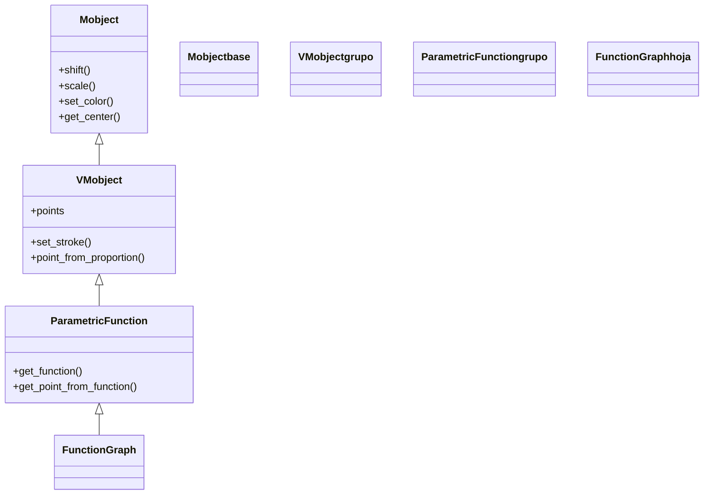

# ParametricFunction — una curva paramétrica t -> punto (VMobject de graficos)

`ParametricFunction` dibuja una **curva paramétrica**: una curva definida no por `y = f(x)`, sino por una función `function(t)` que, para cada valor del parámetro `t`, devuelve un **punto 3D** `np.array([x, y, z])`. Es la herramienta general para todo lo que una función `y = f(x)` no puede expresar: círculos, espirales, figuras de Lissajous, lemniscatas, hélices, cualquier trayectoria donde tanto `x` como `y` dependen de un mismo parámetro. Conceptualmente es "un punto que se mueve según `t`, y la curva es el rastro que deja". Manim muestrea `t` a lo largo de un rango (`t_range`), evalúa la función en cada muestra y une los puntos con curvas suaves de Bézier. Es además la **clase base de [[FunctionGraph]]** (el caso particular `y = f(x)`), así que entender la paramétrica es entender el motor de graficado de curvas sueltas. Como todo [[concepto_mobject|Mobject]], se crea, posiciona, colorea y anima con el repertorio común.

## Importacion

```python
from manim import ParametricFunction
# o, como es habitual en todo ejemplo de Manim:
from manim import *
import numpy as np   # casi siempre hace falta np para construir los puntos
```

La función que pasas suele construir el punto con numpy (`np.array([...])`, `np.cos`, `np.sin`), así que `import numpy as np` acompaña casi siempre a esta clase.

## Herencia

### La cadena

`ParametricFunction` hereda **directamente** de [[VMobject]] (no pasa por la geometría de figuras): es un objeto vectorizado cuya geometría son los puntos muestreados de la función. De `VMobject` saca el trazo (`stroke`) con que se dibuja la curva; de `Mobject`, todo lo universal. Lo que añade es el **muestreo del parámetro**: tomar `function`, recorrer `t_range` y generar los puntos de Bézier.



### Que aporta cada ancestro

| Viene de | Qué aporta a la curva |
|----------|-----------------------|
| `Mobject` | posición, escala, giro, color y la capacidad de animarse |
| `VMobject` | el **trazo** (`stroke_width`, `stroke_color`), los puntos de Bézier y `point_from_proportion` (recorrer la curva) |
| `ParametricFunction` (propio) | el **muestreo** de `function` sobre `t_range` que genera la geometría |

`FunctionGraph` es su única subclase relevante: el atajo para el caso `y = f(x)`.

## Constructor

```python
ParametricFunction(
    function,                    # t -> np.array([x, y, z])   (la curva)
    t_range=[0, 1],              # [t_min, t_max, paso]  del parametro
    color=YELLOW,                # color del trazo
    use_smoothing=True,          # suavizar la curva con Bezier
    **kwargs,                    # stroke_width... -> a VMobject
) -> ParametricFunction
```

### Parametros principales

| Parametro | Tipo | Defecto | Controla |
|-----------|------|---------|----------|
| `function` | `callable` | — (obligatorio) | la función `t -> punto`; **debe devolver** `np.array([x, y, z])` |
| `t_range` | `[float, float, float]` | `[0, 1]` | el rango del parámetro: `[t_min, t_max, paso_de_muestreo]` |
| `color` | `ManimColor` | `YELLOW` | el color del trazo de la curva |
| `use_smoothing` | `bool` | `True` | suavizar con Bézier; ponlo `False` para curvas con esquinas reales |

#### function: debe devolver un punto 3D, no un número

El error clásico. `function(t)` tiene que devolver un **punto entero** `np.array([x, y, z])`, no el escalar `y`. Para una curva en el plano, la `z` es 0:

```python
# circulo de radio 2: para cada angulo t, el punto (2cos t, 2sin t, 0)
lambda t: np.array([2 * np.cos(t), 2 * np.sin(t), 0])
```

Si solo tienes `y = f(x)` (un escalar), **no** uses `ParametricFunction`: usa su subclase [[FunctionGraph]], que envuelve esto por ti.

#### t_range: el rango del parametro, no de x

`t_range` recorre el **parámetro `t`**, no el eje x. Para un círculo completo, `t` va de 0 a `2*PI` (una vuelta entera); para media espiral, de 0 a `PI`. El tercer valor es el **paso de muestreo**: más pequeño = más puntos = curva más fiel (y más lenta). Para curvas con mucho detalle (Lissajous densas) conviene bajarlo, p. ej. `[0, TAU, 0.01]`.

### Parametros de estilo

Por `**kwargs` llegan los de `VMobject`: `stroke_width` (grosor de la curva), `stroke_opacity`. El `color` ya está expuesto como parámetro propio.

### Que construye

Devuelve un `ParametricFunction`: un `VMobject` cuya geometría es la **polilínea suavizada** que une los puntos `function(t)` para `t` en `t_range`. No tiene relleno por defecto (es una curva, no una región). Se anima entero con `Create(curva)` —que la traza de un extremo a otro siguiendo el parámetro— y se transforma como cualquier Mobject.

## Metodos clave

La mayoría de lo que harás con una `ParametricFunction` son métodos heredados de [[VMobject]]/[[Mobject]]: `set_stroke`, `set_color`, `shift`, `scale`. Los propios y más útiles:

| Metodo | Firma | Que hace |
|--------|-------|----------|
| `get_function` | `get_function() -> callable` | devuelve la `function` original que define la curva |
| `get_point_from_function` | `get_point_from_function(t) -> np.ndarray` | evalúa la curva en un `t` concreto (el punto) |
| `point_from_proportion` | `point_from_proportion(alpha) -> np.ndarray` | (heredado) el punto al `alpha` (0..1) del recorrido; útil para mover algo **sobre** la curva |

## Ejemplo

### Version minima

Una espiral: el radio crece con `t` mientras el punto gira. La curva sale de un único `lambda t`.

```python
from manim import *
import numpy as np

class Espiral(Scene):
    def construct(self):
        espiral = ParametricFunction(
            lambda t: np.array([0.3 * t * np.cos(t), 0.3 * t * np.sin(t), 0]),
            t_range=[0, 4 * PI, 0.05],
            color=TEAL,
        )
        self.play(Create(espiral), run_time=3)   # Create la traza siguiendo t
        self.wait()
```

```bash
manim -pql archivo.py Espiral      # -p reproduce, -ql = calidad baja (rapido)
```

### Version completa

Una **figura de Lissajous**: `x = sin(a·t)`, `y = sin(b·t)`. Cambiar la razón `a:b` cambia la forma. Añadimos un punto que recorre la curva con `point_from_proportion` para subrayar que la curva es la trayectoria de un punto.

```python
from manim import *
import numpy as np

class Lissajous(Scene):
    def construct(self):
        a, b = 3, 2     # la razon de frecuencias define la figura
        curva = ParametricFunction(
            lambda t: np.array([2 * np.sin(a * t), 2 * np.sin(b * t), 0]),
            t_range=[0, TAU, 0.01],   # TAU = 2*PI; paso fino para que quede limpia
            color=YELLOW,
            stroke_width=3,
        )
        titulo = MathTex(r"x=\sin 3t,\ \ y=\sin 2t").to_edge(UP)

        self.play(Write(titulo))
        self.play(Create(curva), run_time=4)

        # un punto que viaja SOBRE la curva (0..1 del recorrido):
        viajero = Dot(color=RED).move_to(curva.point_from_proportion(0))
        self.add(viajero)
        self.play(
            MoveAlongPath(viajero, curva),   # lo arrastra a lo largo de la curva
            run_time=3,
        )
        self.wait()
```

```bash
manim -pqh archivo.py Lissajous     # -qh = calidad alta para el render final
```

### Variaciones

Un círculo perfecto (el caso paramétrico más básico) y la misma curva sin suavizado para ver el efecto de `use_smoothing`:

```python
from manim import *
import numpy as np

class CirculoParametrico(Scene):
    def construct(self):
        circulo = ParametricFunction(
            lambda t: np.array([2 * np.cos(t), 2 * np.sin(t), 0]),
            t_range=[0, TAU, 0.05],
            color=BLUE,
        )
        self.play(Create(circulo))
        self.wait()
```

```bash
manim -pql archivo.py CirculoParametrico
```

## Errores comunes

| Error | Causa | Solución |
|-------|-------|----------|
| `could not broadcast` / forma rara | `function` devuelve un número, no `np.array([x, y, z])` | devuelve un punto 3D; si es `y = f(x)`, usa [[FunctionGraph]] |
| La curva sale incompleta (no cierra) | el `t_range` no cubre toda la vuelta | para un círculo, `t` de 0 a `TAU`, no a `PI` |
| La curva se ve angulosa / con picos | el paso de muestreo es muy grande | baja el 3.º valor de `t_range` (p. ej. `0.01`) |
| Tarda muchísimo en renderizar | el paso es minúsculo y `t_range` enorme | sube el paso; rara vez hace falta menos de `0.01` |
| Confundí el rango de `t` con el de `x` | `t_range` es el del **parámetro**, no del eje | piensa en `t` como el "tiempo" que recorre la curva |
| `NameError: name 'np' is not defined` | faltó `import numpy as np` | añádelo junto a `from manim import *` |

## Notas relacionadas

- [[FunctionGraph]] — su subclase: el atajo para el caso particular `y = f(x)` suelto
- [[Axes]] — para graficar una paramétrica **respetando** un sistema de ejes, usa `axes.plot_parametric_curve`
- [[concepto_sistema_coordenadas]] — la curva se dibuja en coordenadas de escena (salvo que la pongas sobre ejes)
- [[VMobject]] — la clase padre: de ahí salen el trazo y `point_from_proportion`
- [[Manim/mobjects/graficos/index | graficos]] — la carpeta de sistemas de coordenadas y curvas
- [[concepto_mobject]] — el modelo de objeto dibujable
