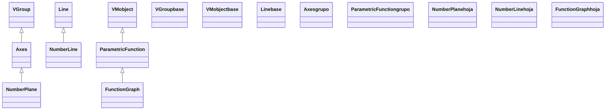
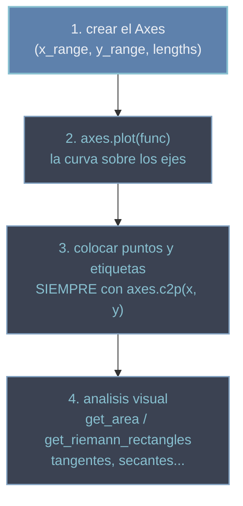

# graficos — sistemas de coordenadas y curvas (graficar en Manim)

Esta carpeta reúne todo lo necesario para **graficar** en Manim: por un lado los **sistemas de coordenadas** —los ejes [[Axes]], la malla [[NumberPlane]] y la recta [[NumberLine]]— que dan el "papel milimetrado" donde medir; por otro las **curvas** —[[ParametricFunction]] (cualquier `t -> punto`) y [[FunctionGraph]] (el atajo para `y = f(x)` suelto)— que dibujas encima o por libre. La idea que vertebra la carpeta es la distinción entre **dos mundos de coordenadas**: las de la escena (píxeles lógicos, `ORIGIN`, `RIGHT`) y las matemáticas (las del `Axes`, donde `(3, 5)` es un punto del gráfico). El puente entre ambos es `c2p`, y dominarlo es dominar el graficado: casi todo error al graficar es haber colocado algo en coordenadas de escena cuando debía ir en matemáticas. Todas estas clases son [[concepto_mobject|VMobject]], así que se crean, colorean y animan con el repertorio común; lo único que cambia es qué dibuja cada una.

## En accion

Una gráfica completa de verdad: unos `Axes` etiquetados, la parábola `y = x²` con `axes.plot`, y un `Dot` clavado sobre la curva mediante `c2p` (la traducción de coordenadas matemáticas a punto de escena). Fíjate en que **ningún número de pantalla aparece a mano**: todo punto del gráfico pasa por el `Axes`.

```python
from manim import *

class GraficaEnAccion(Scene):
    def construct(self):
        ejes = Axes(
            x_range=[-3, 3, 1],
            y_range=[0, 9, 1],
            x_length=7,
            y_length=4.5,
            axis_config={"include_numbers": True},
        )
        etiquetas = ejes.get_axis_labels(x_label="x", y_label="y")
        curva = ejes.plot(lambda x: x**2, color=YELLOW)            # respeta el Axes
        et_curva = MathTex("y = x^2").next_to(curva, UR, buff=0.2)

        # un punto sobre la curva en x=2: (2, 4) matematico -> punto de escena via c2p
        punto = Dot(ejes.c2p(2, 4), color=RED)
        rotulo = MathTex("(2, 4)").next_to(punto, RIGHT)

        self.play(Create(ejes), Write(etiquetas))
        self.play(Create(curva), Write(et_curva))
        self.play(FadeIn(punto), Write(rotulo))
        self.wait()
```

```bash
manim -pql archivo.py GraficaEnAccion      # -p reproduce, -ql = calidad baja (rapido)
```

## Herencia

Tres ramas distintas convergen en esta carpeta. Los **sistemas de coordenadas** cuelgan de los contenedores (`VGroup` -> `Axes` -> `NumberPlane`); la **recta** viene de la geometría (`Line` -> `NumberLine`); las **curvas** son objetos vectorizados directos (`VMobject` -> `ParametricFunction` -> `FunctionGraph`). No comparten una raíz común más allá de `VMobject`/`Mobject`.



## Clases que aporta

| Clase | Hereda de | Para que |
|-------|-----------|----------|
| [[Axes]] | `VGroup` | el sistema de **ejes 2D** (dos `NumberLine` cruzadas); graficar con escala y `c2p` |
| [[NumberPlane]] | `Axes` | un `Axes` con la **malla** de fondo (papel milimetrado) |
| [[NumberLine]] | `Line` | una **recta numérica** 1D con marcas y números (`n2p`/`p2n`) |
| [[ParametricFunction]] | `VMobject` | una curva **paramétrica** `t -> punto` (círculos, espirales, Lissajous) |
| [[FunctionGraph]] | `ParametricFunction` | el atajo para `y = f(x)` **suelto**, en coordenadas de escena |

## Como elegir

Lo primero que decides es si quieres **medir** (necesitas ejes) o solo **dibujar una curva**.

| Quiero… | Clase |
|---------|-------|
| Graficar `y = f(x)` con ejes, escala y valores | [[Axes]] + `axes.plot(f)` |
| Lo mismo, pero con cuadrícula de fondo | [[NumberPlane]] + `plane.plot(f)` |
| Una escala / intervalo de una sola dimensión | [[NumberLine]] |
| Una curva paramétrica (círculo, espiral, Lissajous) | [[ParametricFunction]] |
| Una curva `y = f(x)` decorativa, sin ejes ni escala | [[FunctionGraph]] |

> [!important] Suelto vs sobre ejes
> `FunctionGraph(f)` dibuja en **coordenadas de escena** (1 unidad = 1 unidad de pantalla, sin ejes); `axes.plot(f)` dibuja en las **coordenadas del Axes** (con su escala y sus ejes). Si vas a colocar puntos, etiquetas o áreas con valores concretos, estás en territorio de `Axes`.

## El flujo de graficar

Graficar "de verdad" (con ejes) sigue casi siempre los mismos cuatro pasos. El paso 3 es el que evita el 90 % de los errores.



1. **Crear el `Axes`** con su `x_range`/`y_range` (los intervalos **matemáticos**) y sus `x_length`/`y_length` (cuánto miden en **pantalla**). Aquí decides la escala.
2. **`axes.plot(func)`** dibuja la curva *dentro* del sistema de ejes, respetando esa escala (no es lo mismo que un `FunctionGraph` suelto).
3. **Colocar puntos y etiquetas con `axes.c2p(x, y)`**. Este es el paso crítico: un punto del gráfico, p. ej. `(2, 4)`, **no** se coloca con `Dot([2, 4, 0])` (eso sería coordenadas de escena, casi fuera de cuadro), sino con `Dot(axes.c2p(2, 4))`, que traduce el punto matemático a su punto de escena. El inverso es `axes.p2c(punto)`. La distinción completa entre los dos sistemas de coordenadas vive en [[concepto_sistema_coordenadas]].
4. **Análisis visual** sobre la curva: `axes.get_area(curva, x_range=...)` para el área bajo ella, `axes.get_riemann_rectangles(curva, ...)` para las sumas de Riemann, tangentes y secantes. Todos trabajan en coordenadas del `Axes`.

> [!tip] c2p es la regla de oro del graficado
> En cuanto haya un `Axes` en escena, **todo dato del gráfico pasa por `c2p` antes de colocarse**. Las constantes `UP`/`RIGHT`/`ORIGIN` siguen siendo de la escena; los valores del gráfico (un valor de `x`, una coordenada `(x, y)`) van por `c2p`. Mezclarlos es el error número uno al graficar.

## Patrones y recetas

Tres recetas que cubren la mayoría de los gráficos de clase: graficar una función con etiquetas, marcar un punto con su recta tangente, y sombrear el área bajo la curva.

### Graficar una funcion sobre ejes con etiquetas

El patrón base: `Axes`, `plot`, etiquetas de ejes y de la curva. Todo encadenado desde el `Axes`.

```python
from manim import *
import numpy as np

class GraficarConEtiquetas(Scene):
    def construct(self):
        ejes = Axes(x_range=[0, TAU, PI / 2], y_range=[-1.5, 1.5, 1], x_length=9, y_length=4)
        etiquetas = ejes.get_axis_labels(x_label="x", y_label="y")
        seno = ejes.plot(lambda x: np.sin(x), color=YELLOW)
        et_seno = ejes.get_graph_label(seno, label=MathTex(r"\sin x"))

        self.play(Create(ejes), Write(etiquetas))
        self.play(Create(seno), Write(et_seno))
        self.wait()
```

```bash
manim -pql archivo.py GraficarConEtiquetas
```

### Marcar un punto y su recta tangente

Un punto sobre la curva con `c2p`, y la tangente que el propio `Axes` sabe construir con `get_secant_slope_group` (en su límite, la tangente en un punto).

```python
from manim import *

class PuntoYTangente(Scene):
    def construct(self):
        ejes = Axes(x_range=[-3, 3, 1], y_range=[0, 9, 2], x_length=7, y_length=4.5)
        curva = ejes.plot(lambda x: x**2, color=BLUE)

        x0 = 1.5
        punto = Dot(ejes.c2p(x0, x0**2), color=YELLOW)        # (x0, f(x0)) via c2p
        tangente = ejes.get_secant_slope_group(
            x=x0, graph=curva, dx=0.01,                       # dx pequeño -> tangente
            secant_line_color=RED, secant_line_length=4,
        )

        self.play(Create(ejes), Create(curva))
        self.play(FadeIn(punto), Create(tangente))
        self.wait()
```

```bash
manim -pql archivo.py PuntoYTangente
```

### El area bajo la curva

`axes.get_area` sombrea la región entre la curva y el eje en un intervalo: el gesto típico de una nota de cálculo integral.

```python
from manim import *
import numpy as np

class AreaBajoLaCurva(Scene):
    def construct(self):
        ejes = Axes(x_range=[0, 4, 1], y_range=[0, 4, 1], x_length=7, y_length=4.5)
        curva = ejes.plot(lambda x: np.sqrt(x) + 0.5, color=YELLOW)
        area = ejes.get_area(curva, x_range=[1, 3], color=BLUE, opacity=0.5)  # entre x=1 y x=3

        self.play(Create(ejes), Create(curva))
        self.play(FadeIn(area))
        self.wait()
```

```bash
manim -pql archivo.py AreaBajoLaCurva
```

## Notas relacionadas

- [[Axes]] · [[NumberPlane]] · [[NumberLine]] — los sistemas de coordenadas
- [[ParametricFunction]] · [[FunctionGraph]] — las curvas
- [[concepto_sistema_coordenadas]] — coordenadas de escena vs matemáticas y el puente `c2p`/`p2c`
- [[Mobject]] · [[VMobject]] — el repertorio común que todas estas clases heredan
- [[Manim/mobjects/index | mobjects]] — la carpeta madre de todos los objetos dibujables
- [[Manim/escena/index | escena]] — la `Scene` donde estas gráficas se añaden y se animan
