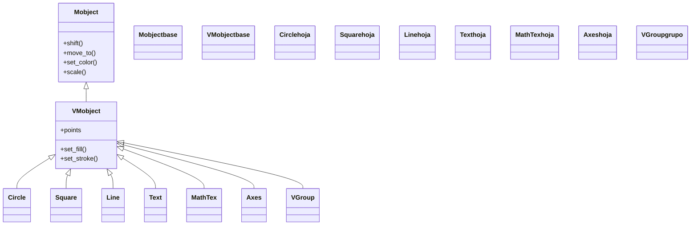

# mobjects — el árbol de objetos dibujables (lo que se ve)

Esta carpeta documenta **todo lo que aparece en pantalla**: un círculo, una fórmula, un texto, un par de ejes o un grupo entero de cosas son, en el fondo, la misma clase de pieza —un [[concepto_mobject|Mobject]]—. Si la [[concepto_scene_construct|Scene]] es el lienzo y el guion, el Mobject es el **actor**: la pieza concreta que se posiciona, se colorea y se anima. La idea que gobierna toda la carpeta es la **herencia**: casi todo lo dibujable hereda de [[Mobject]] (y, en la práctica, de [[VMobject]], su versión vectorizada con relleno y trazo), así que **todos los objetos comparten el mismo repertorio**: el mismo `shift` que mueve un `Circle` mueve un `MathTex`, el mismo `set_color` los tiñe a ambos, y la misma `Create` los dibuja. Aprender a manipular una figura es, literalmente, aprender a manipular *cualquier* cosa de Manim; lo único que cada familia aporta es **su geometría**. Las subcarpetas de aquí parten esa fauna en familias (geometría, texto, gráficos, 3D, agrupación...), pero el tronco —posición, color, animación— es común a todas y vive en [[Mobject]].

## En accion

Una escena que combina **tres familias distintas** en una sola pantalla —una figura de geometría, un texto y todo agrupado en un [[VGroup]]— para que se vea que conviven como iguales: se crean, se posicionan y se animan con los mismos métodos sin importar de qué tipo sean.

```python
from manim import *

class Familias(Scene):
    def construct(self):
        figura = Circle(color=BLUE, fill_opacity=0.4)   # familia geometria
        etiqueta = Text("un Mobject")                   # familia texto
        etiqueta.next_to(figura, DOWN)                  # posicionar (heredado)

        grupo = VGroup(figura, etiqueta)                # familia agrupacion: un padre con dos hijos
        self.play(Create(figura))                       # animar la figura
        self.play(Write(etiqueta))                      # animar el texto
        self.play(grupo.animate.shift(RIGHT * 2))       # mover el GRUPO entero
        self.wait()
```

```bash
manim -pql archivo.py Familias      # -p reproduce, -ql = calidad baja (rapido)
```

El `VGroup` no es un tipo aparte: es otro Mobject cuyos hijos son la figura y el texto, y por eso `grupo.animate.shift(...)` arrastra a los dos a la vez.

## El arbol de objetos

Toda la fauna de esta carpeta cuelga de `Mobject` y, salvo casos rasterizados, de `VMobject`. Geometría, texto, gráficos y contenedores son ramas de un mismo árbol; lo que comparten lo heredan del tronco.



## Las familias

Cada familia es una subcarpeta con su propio `index.md`. La base ([[Mobject]]/[[VMobject]]) no es una familia más: es el tronco del que el resto hereda lo común, y por eso conviene leerla primero.

| Familia | Que agrupa | Entrada |
|---------|------------|---------|
| **base** | el tronco común: posición, color, escala, árbol de hijos | [[Mobject]] / [[VMobject]] |
| **agrupacion** | contenedores que tratan varios objetos como uno (`VGroup`, `Group`) | [[Manim/mobjects/agrupacion/index\|agrupacion]] |
| **geometria** | figuras vectoriales: `Circle`, `Square`, `Line`, `Polygon`, `Arrow`... | [[Manim/mobjects/geometria/index\|geometria]] |
| **texto** | texto plano y LaTeX: `Text`, `MathTex`, `Tex` | [[Manim/mobjects/texto/index\|texto]] |
| **graficos** | sistemas de coordenadas y curvas: `Axes`, `NumberPlane`, `NumberLine` | [[Manim/mobjects/graficos/index\|graficos]] |
| **3d** | objetos tridimensionales: `Sphere`, `Cube`, `Surface`, `ThreeDAxes` | [[Manim/mobjects/3d/index\|3d]] |
| **tablas_extras** | piezas sueltas: `Table`, `Brace`, `ImageMobject`, `SVGMobject` | [[Manim/mobjects/tablas_extras/index\|tablas_extras]] |

## Lo que todos comparten

Como **todo** lo de arriba es un Mobject, todo objeto comparte el mismo vocabulario sin importar la familia. No hace falta memorizarlo por tipo; el catálogo completo (con tablas de métodos) vive en [[Mobject]], pero el resumen es de tres verbos:

| Verbo | Métodos típicos | Idea |
|-------|-----------------|------|
| **posicionar** | `shift`, `move_to`, `next_to`, `to_edge` | colocar el objeto en el espacio con las constantes `UP`, `DOWN`, `LEFT`, `RIGHT`, `ORIGIN` |
| **estilizar** | `set_color`, `set_fill`, `set_stroke` | teñir relleno y trazo (las dos últimas solo en un `VMobject`) |
| **animar** | `Create`, `Write`, `FadeIn`, `.animate.<metodo>()` | dibujarlo o transformarlo dentro de `self.play(...)` |

La distinción clave: `mob.shift(...)` aplica el cambio **al instante**, mientras que `self.play(mob.animate.shift(...))` lo **anima**. Lo demás (escala, giro, getters como `get_center`) se hereda igual; remite a [[Mobject]] para el catálogo y a [[VGroup]] para construir el árbol de hijos.

## Patrones y recetas

Dos recetas que destilan la carpeta: cómo crear y agrupar objetos de familias distintas, y la demostración de que la herencia hace que un mismo método se comporte idéntico sobre tipos muy diferentes.

### Crear y agrupar varios objetos

El flujo habitual: instanciar piezas de distintas familias, ordenarlas con `.arrange(...)` y meterlas en un `VGroup` para tratarlas como una sola unidad. El grupo se anima de golpe.

```python
from manim import *

class CrearYAgrupar(Scene):
    def construct(self):
        c = Circle(color=RED)
        s = Square(color=GREEN)
        t = Triangle(color=BLUE)

        fila = VGroup(c, s, t).arrange(RIGHT, buff=0.6)   # tres hijos en fila
        self.play(Create(fila))
        self.play(fila.animate.scale(1.3).to_edge(UP))    # transformar el padre = todos a la vez
        self.wait()
```

```bash
manim -pql archivo.py CrearYAgrupar
```

### El mismo método sobre tipos distintos

La prueba de la herencia: `set_color` y `to_edge` se aplican exactamente igual a una figura de geometría, a un texto y a una fórmula LaTeX, porque las tres heredan de `Mobject`. El `MathTex` requiere una instalación de LaTeX.

```python
from manim import *

class MismaApi(Scene):
    def construct(self):
        figura = Circle()
        texto = Text("igual para todos")
        formula = MathTex("e^{i\\pi} + 1 = 0")

        # EXACTAMENTE los mismos metodos sobre tres familias distintas:
        figura.set_color(YELLOW).to_edge(LEFT)
        texto.set_color(YELLOW)
        formula.set_color(YELLOW).to_edge(RIGHT)

        self.add(figura, texto, formula)
        self.wait()
```

```bash
manim -pql archivo.py MismaApi
```

## Notas relacionadas

- [[concepto_mobject]] — qué es un Mobject y por qué todo hereda de él
- [[Mobject]] — el catálogo completo de métodos comunes (posición, color, árbol)
- [[VGroup]] — el contenedor más usado para construir el árbol de hijos
- [[concepto_animate_syntax]] — la sintaxis `.animate` que convierte un método en animación
- [[Manim/index\|Manim]] — el índice raíz con el `classDiagram` global y la tríada
- [[Manim/animaciones/index\|animaciones]] — cómo se transforman estos objetos en el tiempo
