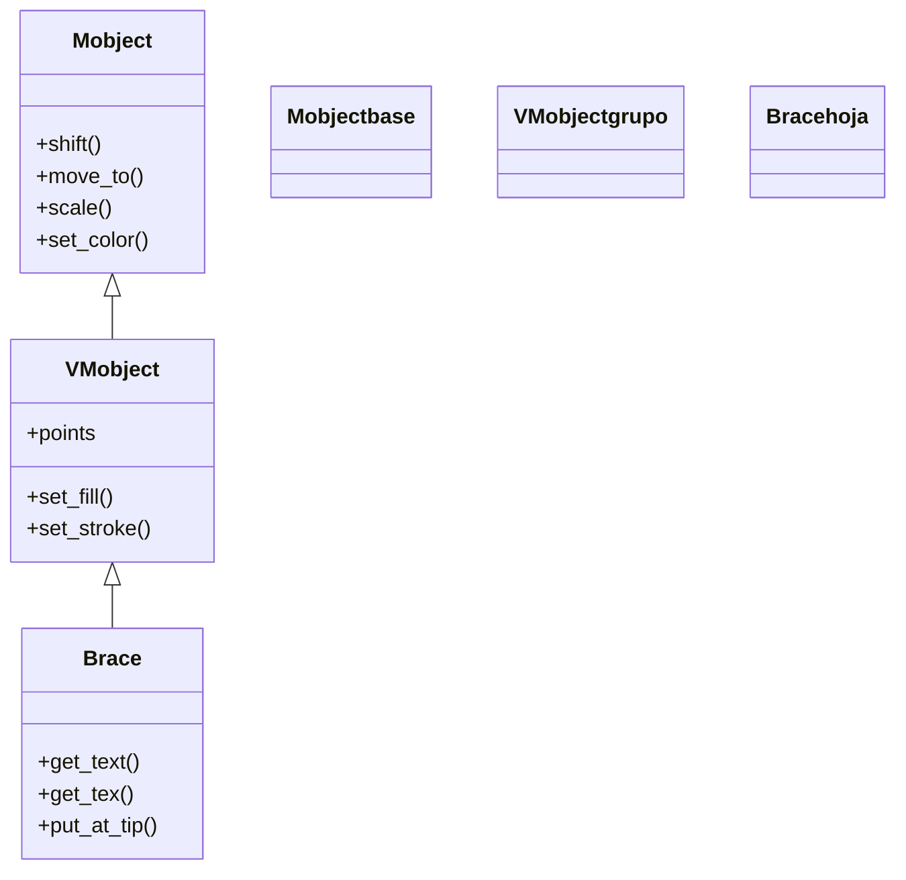

# Brace — una llave que abarca y anota un mobject (VMobject de anotacion)

`Brace` dibuja una **llave** (`{` o `}`) que abarca la anchura de un mobject a lo largo de una dirección, pensada para **medir, marcar o anotar** una parte de la escena: "este tramo mide X", "este grupo es Y". No es una figura geométrica más: se construye **a partir de otro mobject** y se ajusta automáticamente a su tamaño, de modo que la llave siempre cubre exactamente lo que quieres señalar. Su valor real está en los métodos que cuelgan una etiqueta de la propia llave (`get_text`, `get_tex`, `put_at_tip`): la llave abarca y la etiqueta explica. Para abarcar el hueco entre dos puntos arbitrarios (en vez de un mobject entero) está su hermana [[BraceBetweenPoints]]. Como todo [[concepto_mobject|Mobject]] vectorizado, se crea y luego se **añade** (`self.add`) o se **anima** (`self.play(...)`).

## Importacion

```python
from manim import Brace, BraceBetweenPoints
# o, como es habitual en Manim:
from manim import *
```

## Herencia

### La cadena

`Brace` es un VMobject: su trazo es la curva de la llave, generada a partir del ancho del mobject de referencia. No desciende de la familia de polígonos (no es un `Rectangle` ni un `Polygon`); toda su geometría la calcula en el constructor a partir de la referencia.



### Que hereda

`Brace` solo aporta la forma de la llave y los métodos de etiqueta; el resto del comportamiento (mover, colorear, escalar, animar) lo hereda como cualquier VMobject.

| Capacidad | Método típico | Definido en |
|-----------|---------------|-------------|
| Posición (relativa/absoluta) | `shift`, `move_to`, `next_to` | [[Mobject]] |
| Escala y giro | `scale`, `rotate` | [[Mobject]] |
| Color global | `set_color`, `set_opacity` | [[Mobject]] |
| Relleno y trazo | `set_fill`, `set_stroke` | [[VMobject]] |

La llave se posiciona sola respecto a su mobject de referencia, pero después puedes reubicarla con los métodos heredados de [[posicionamiento]].

## Constructor

```python
Brace(mobject, direction=DOWN, buff=0.2, sharpness=2, **kwargs)
```

### Parametros principales

| Parametro | Tipo | Defecto | Controla |
|-----------|------|---------|----------|
| `mobject` | `Mobject` | — (obligatorio) | el objeto que la llave abarca; la llave toma su anchura a lo largo de `direction` |
| `direction` | `np.ndarray` | `DOWN` | hacia qué lado se coloca la llave (`DOWN`, `UP`, `LEFT`, `RIGHT`); fija también qué dimensión del mobject se mide |
| `buff` | `float` | `0.2` | separación entre la llave y el mobject que abarca |
| `sharpness` | `float` | `2` | cuán puntiagudo es el pico central de la llave |
| `**kwargs` | — | — | se pasan a [[VMobject]]: `color`, `stroke_width`, `fill_opacity`... |

#### direction: qué dimensión se mide

`direction` no es solo "dónde se dibuja la llave": determina **qué lado del mobject se mide**. Con `DOWN` o `UP` la llave abarca el **ancho** (y queda horizontal, debajo/encima); con `LEFT` o `RIGHT` abarca el **alto** (y queda vertical, al lado). Es el error típico: pedir una llave horizontal pasando `LEFT`.

```python
ancho = Brace(grupo, direction=DOWN)    # llave horizontal, mide el ancho
alto  = Brace(grupo, direction=LEFT)    # llave vertical, mide el alto
```

### Que construye

Devuelve un `Brace` (un VMobject) con la forma de la llave ya ajustada al ancho del mobject de referencia y separada de él por `buff`. Es estático hasta que se añade o se anima; su pico apunta hacia el mobject que abarca.

## Metodos clave

Lo propio de `Brace` no es transformarse (eso es herencia), sino **producir su etiqueta**. Estos tres métodos devuelven un nuevo mobject ya colocado respecto a la llave, listo para añadir o animar.

### Etiquetar la llave

| Metodo | Firma | Que hace |
|--------|-------|----------|
| `get_text` | `brace.get_text(*text)` | crea un [[Text]] colocado en el pico de la llave; útil para una etiqueta en lenguaje normal |
| `get_tex` | `brace.get_tex(*tex)` | igual pero crea un [[MathTex]] (fórmula LaTeX) en el pico; requiere LaTeX instalado |
| `put_at_tip` | `brace.put_at_tip(mobject)` | coloca un mobject **cualquiera** (ya creado) en el pico de la llave, sin crear texto |

```python
brace = Brace(objeto, DOWN)
etiqueta = brace.get_text("ancho")        # un Text en el pico
formula  = brace.get_tex("x = 2a")        # un MathTex en el pico (LaTeX)
```

`get_text` y `get_tex` **crean y devuelven** el mobject de etiqueta (no lo añaden); recuerda añadirlo o animarlo aparte. `put_at_tip` sirve cuando ya tienes el mobject y solo quieres anclarlo al pico.

## Ejemplo

### Version minima

Una llave debajo de un cuadrado, con una etiqueta de texto colgada de su pico.

```python
from manim import *

class LlaveMinima(Scene):
    def construct(self):
        cuadro = Square(color=BLUE, fill_opacity=0.5)
        llave = Brace(cuadro, direction=DOWN)        # llave horizontal bajo el cuadro
        etiqueta = llave.get_text("ancho")           # un Text en el pico de la llave
        self.add(cuadro)
        self.play(GrowFromCenter(llave))
        self.play(Write(etiqueta))
        self.wait()
```

```bash
manim -pql archivo.py LlaveMinima      # -p reproduce, -ql = calidad baja (rapido)
```

### Version completa

Medir un grupo en dos direcciones a la vez: una llave abajo que mide el ancho y otra a la izquierda que mide el alto, cada una con su etiqueta. Muestra cómo `direction` decide qué dimensión se abarca.

```python
from manim import *

class MedirGrupo(Scene):
    def construct(self):
        # 1. el objeto a medir
        grupo = VGroup(
            Circle(color=BLUE, fill_opacity=0.4),
            Square(color=GREEN, fill_opacity=0.4),
        ).arrange(RIGHT, buff=0.5)
        self.play(Create(grupo))

        # 2. una llave abajo (mide el ancho) con etiqueta de texto
        ancho = Brace(grupo, direction=DOWN)
        et_ancho = ancho.get_text("ancho total")
        self.play(GrowFromCenter(ancho), Write(et_ancho))

        # 3. una llave a la izquierda (mide el alto) con etiqueta LaTeX
        alto = Brace(grupo, direction=LEFT)
        et_alto = alto.get_tex("h")
        self.play(GrowFromCenter(alto), Write(et_alto))
        self.wait()
```

```bash
manim -pqh archivo.py MedirGrupo     # -qh = calidad alta para el render final
```

### Variaciones

`BraceBetweenPoints` abarca el hueco **entre dos puntos** arbitrarios, sin necesidad de un mobject de referencia. Útil para medir distancias entre vértices o extremos de líneas.

```python
from manim import *

class EntrePuntos(Scene):
    def construct(self):
        a, b = LEFT * 2, RIGHT * 2
        linea = Line(a, b)
        llave = BraceBetweenPoints(a, b, direction=DOWN)   # llave entre dos puntos
        et = llave.get_tex("d")
        self.play(Create(linea))
        self.play(GrowFromCenter(llave), Write(et))
        self.wait()
```

```bash
manim -pql archivo.py EntrePuntos
```

## Animarla

### Crear y transformar

La animación natural para una llave es `GrowFromCenter`, que la "abre" desde el centro hacia los extremos imitando el gesto de dibujarla; `Create` también vale. La etiqueta suele entrar con `Write`. Como todo Mobject, acepta la sintaxis `.animate`.

```python
self.play(GrowFromCenter(llave))               # la llave se abre desde el centro
self.play(Write(llave.get_text("aqui")))       # la etiqueta se escribe
self.play(llave.animate.set_color(YELLOW))     # recolorear con .animate
```

### Mantenerla pegada a un objeto que se mueve

Una llave se calcula **una vez** a partir del mobject en su posición de ese instante: si luego mueves el objeto, la llave **no** lo sigue sola. Para que la siga, usa un `always_redraw` que la reconstruya cada fotograma (ver [[concepto_updaters]]).

```python
llave = always_redraw(lambda: Brace(objeto, DOWN))   # se recalcula cada frame
```

## Errores comunes

| Error | Causa | Solución |
|-------|-------|----------|
| La llave queda vertical cuando la querías horizontal | pasaste `direction=LEFT`/`RIGHT` (miden el alto) | usa `direction=DOWN` o `UP` para medir el ancho |
| La etiqueta no aparece | `get_text`/`get_tex` **devuelven** el mobject pero no lo añaden | añade o anima el resultado: `self.add(llave.get_text(...))` |
| `get_tex` falla o tarda | requiere una instalación de LaTeX | instala LaTeX, o usa `get_text` para etiquetas sin fórmula |
| La llave no sigue al objeto al moverlo | se calculó una sola vez | envuélvela en `always_redraw(lambda: Brace(obj, DOWN))` |
| La llave se solapa con el objeto | `buff` demasiado pequeño | sube `buff` (p. ej. `buff=0.3`) |
| `NameError: name 'Brace' is not defined` | faltó el import | `from manim import *` al inicio |

## Notas relacionadas

- [[BraceBetweenPoints]] — la hermana que abarca el hueco entre dos puntos
- [[SurroundingRectangle]] — la otra anotación de esta carpeta: recuadrar en vez de medir
- [[Manim/mobjects/tablas_extras/index | tablas_extras]] — el índice de tablas y anotaciones
- [[Text]] · [[MathTex]] — los mobjects que producen `get_text` y `get_tex`
- [[concepto_mobject]] — qué es un Mobject y los métodos que todos comparten
- [[posicionamiento]] — colocar la llave (`shift`, `next_to`)
- [[Scene.play]] — reproducir la animación que la crea (`GrowFromCenter`)
