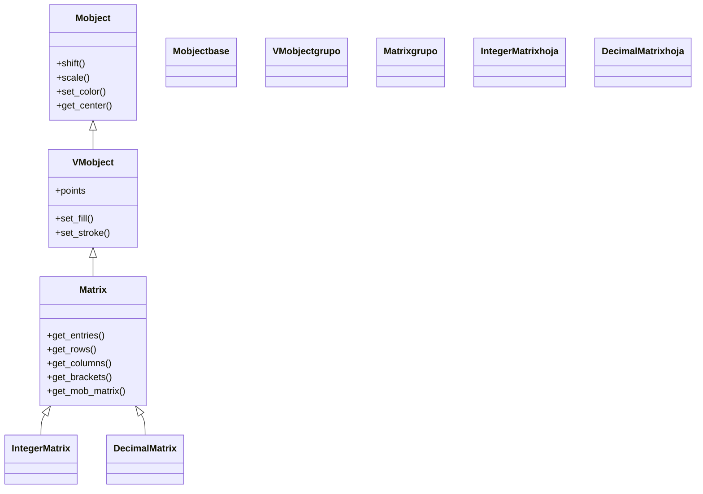

# Matrix — matriz con corchetes para algebra lineal

`Matrix` es el Mobject que dibuja una **matriz matemática**: una rejilla de entradas encerrada entre **corchetes**, tal y como se escribe en álgebra lineal. A diferencia de [[Table]] —pensada para datos tabulados con líneas y etiquetas—, `Matrix` está optimizada para el **uso matemático**: sus entradas son por defecto `MathTex` (LaTeX), no lleva líneas separadoras, y aporta los corchetes como pieza propia. Su construcción parte de una **lista de listas** (las filas de la matriz). Su valor real aparece al **animar operaciones**: como las entradas, las filas, las columnas y los corchetes son submobjects accesibles, puedes colorear una fila, desplazar una columna, intercambiar filas o iluminar la diagonal para ilustrar visualmente una transformación lineal, una multiplicación o una eliminación gaussiana. Tiene dos hermanas (`IntegerMatrix`, `DecimalMatrix`) que solo cambian cómo se convierte cada entrada. El modelo del árbol de submobjects vive en [[concepto_mobject]]; aquí se documenta la clase, su jerarquía, su constructor, sus getters y los ejemplos.

## Importacion

```python
from manim import Matrix
# o, como es habitual en todo ejemplo de Manim:
from manim import *
```

`from manim import *` trae `Matrix` junto con sus hermanas (`IntegerMatrix`, `DecimalMatrix`), las clases de entrada (`MathTex`, `Integer`) y las constantes (`UP`, `BLUE`, `ORIGIN`…). En la práctica casi siempre se usa el import estrella.

## Herencia

### La cadena

`Matrix` hereda directamente de [[VMobject]] (el objeto vectorizado), que a su vez hereda de [[Mobject]]. No pasa por [[VGroup]] como hace [[Table]], aunque internamente organiza sus entradas y corchetes en submobjects. Sus hermanas solo cambian el `element_to_mobject` por defecto.



### Que aporta cada ancestro

`Matrix` apoya su parte matemática sobre lo común a todo Mobject y la capa vectorial.

| Ancestro | Qué aporta a una `Matrix` |
|----------|---------------------------|
| `Mobject` | posición (`shift`, `move_to`, `next_to`), tamaño (`scale`), giro y los getters (`get_center`, `get_width`) |
| `VMobject` | el relleno y el trazo (`set_fill`, `set_stroke`) que usan las entradas y los corchetes |
| `Matrix` | la **rejilla con corchetes**: convierte la lista de listas en `MathTex` alineados, dibuja los `[ ]` y ofrece los getters de fila/columna/entrada/corchete |

### Las hermanas: que cambia cada una

Igual que en [[Table]], las subclases solo cambian el conversor por defecto de cada entrada.

| Clase | Cada entrada se convierte en | Cuándo usarla |
|-------|------------------------------|---------------|
| `Matrix` | `MathTex` (LaTeX) | matrices simbólicas o numéricas escritas en LaTeX (requiere LaTeX) |
| `IntegerMatrix` | `Integer` | matrices de enteros (no necesita LaTeX para los números) |
| `DecimalMatrix` | `DecimalNumber` | matrices con decimales y precisión controlada |

## Constructor

La matriz se construye a partir de una **lista de listas** (las filas); el resto de parámetros ajusta el espaciado entre entradas, el hueco de los corchetes y cómo se convierte cada entrada en Mobject.

```python
Matrix(
    matrix: Iterable[Iterable],          # la matriz: lista de filas (lista de listas)
    v_buff: float = 0.8,                  # separacion vertical entre entradas
    h_buff: float = 1.3,                  # separacion horizontal entre entradas
    bracket_h_buff: float = MED_SMALL_BUFF,  # hueco horizontal entre corchete y entradas
    bracket_v_buff: float = MED_SMALL_BUFF,  # hueco vertical (margen alto/bajo del corchete)
    add_background_rectangles_to_entries: bool = False,  # fondo opaco por entrada
    include_background_rectangle: bool = False,          # fondo opaco para toda la matriz
    element_to_mobject: Callable = MathTex,  # como convertir cada entrada en Mobject
    element_to_mobject_config: dict = {},    # kwargs para esa conversion
    element_alignment_corner: np.ndarray = DR,  # esquina por la que se alinean las entradas
    left_bracket: str = "[",              # simbolo del corchete izquierdo
    right_bracket: str = "]",             # simbolo del corchete derecho
    **kwargs,                             # se reenvian a VMobject
) -> Matrix
```

### Parametros principales

| Parametro | Tipo | Defecto | Controla |
|-----------|------|---------|----------|
| `matrix` | `Iterable[Iterable]` | (obligatorio) | la **lista de filas**; cada fila una lista de entradas (números o strings LaTeX) |
| `v_buff` | `float` | `0.8` | la separación **vertical** entre filas de entradas |
| `h_buff` | `float` | `1.3` | la separación **horizontal** entre columnas de entradas |
| `bracket_h_buff` | `float` | `MED_SMALL_BUFF` | el hueco horizontal entre los corchetes y las entradas |
| `bracket_v_buff` | `float` | `MED_SMALL_BUFF` | cuánto sobresalen los corchetes por arriba y por abajo |
| `element_to_mobject` | `Callable` | `MathTex` | la función que convierte cada entrada en Mobject |
| `left_bracket` / `right_bracket` | `str` | `"["` / `"]"` | el símbolo de los corchetes (p. ej. `"("`, `")"` para paréntesis) |

#### `matrix` — la lista de listas

La entrada es una **matriz como lista de filas**, exactamente como la escribirías a mano. Cada string se interpreta como LaTeX por defecto, así que `"\\alpha"` o `"x_1"` funcionan. Para datos numéricos puros suele ser más cómodo `IntegerMatrix`/`DecimalMatrix`, que no obligan a escribir LaTeX.

```python
# matriz simbolica 2x2 (cada entrada es MathTex):
Matrix([["a", "b"], ["c", "d"]])

# matriz numerica 2x3 con numpy o listas:
Matrix([[1, 2, 3], [4, 5, 6]])
```

### Parametros de estilo

El espaciado y el tipo de corchete se fijan al construir; el color de entradas, filas o corchetes se ajusta después con los getters.

| Parametro | Tipo | Defecto | Controla |
|-----------|------|---------|----------|
| `v_buff` / `h_buff` | `float` | `0.8` / `1.3` | separación vertical / horizontal entre entradas |
| `bracket_h_buff` / `bracket_v_buff` | `float` | `MED_SMALL_BUFF` | el ajuste de los corchetes alrededor de las entradas |
| `element_alignment_corner` | `np.ndarray` | `DR` | por qué esquina se alinean las entradas (útil si tienen anchos distintos) |

### Que construye

Devuelve un `Matrix` ([[VMobject]]) cuyos submobjects son las **entradas** (los `MathTex`/números, agrupados por filas) y los dos **corchetes**. Ya está colocado y alineado al instante; lo añades con `self.add(m)` o lo animas entrando con `self.play(Create(m))` / `self.play(Write(m))`.

## Metodos clave

El patrón de uso es el mismo que en [[Table]]: la matriz ya creada se **descompone** en partes (entradas, filas, columnas, corchetes) que luego coloreas o animas con los métodos heredados de [[Mobject]]. Aquí los índices son **0-indexados** (al revés que `Table`).

### Consultar partes

| Metodo | Firma | Que devuelve |
|--------|-------|--------------|
| `get_entries` | `get_entries() -> VGroup` | **todas** las entradas en un solo `VGroup` (recorrido por filas) |
| `get_rows` | `get_rows() -> VGroup` | un `VGroup` por cada fila de entradas |
| `get_columns` | `get_columns() -> VGroup` | un `VGroup` por cada columna de entradas |
| `get_brackets` | `get_brackets() -> VGroup` | los dos corchetes `[ ]` (para colorearlos o animarlos aparte) |
| `get_mob_matrix` | `get_mob_matrix() -> list[list]` | la matriz de Mobjects en bruto (acceso `[i][j]` directo) |

> [!nota] Índices 0-indexados (distinto de `Table`)
> En `Matrix`, `get_rows()[0]` es la **primera** fila y `get_columns()[0]` la primera columna; no hay etiquetas que descuenten como en [[Table]]. Para una entrada concreta: `m.get_entries()[k]` (orden por filas) o `m.get_rows()[i][j]`.

### Decorar el fondo

| Metodo | Firma | Que hace |
|--------|-------|----------|
| `add_background_to_entries` | `add_background_to_entries(color=BLACK) -> Matrix` | pone un rectángulo opaco bajo cada entrada |
| `set_column_colors` | `set_column_colors(*colors) -> Matrix` | tiñe cada columna con un color sucesivo |
| `set_row_colors` | `set_row_colors(*colors) -> Matrix` | tiñe cada fila con un color sucesivo |

## Ejemplo

### Version minima

Una matriz 2x2 dibujada en pantalla. Requiere LaTeX instalado (las entradas son `MathTex`).

```python
from manim import *

class MatrizMinima(Scene):
    def construct(self):
        m = Matrix([["a", "b"], ["c", "d"]])
        self.play(Write(m))
        self.wait()
```

```bash
manim -pql archivo.py MatrizMinima      # -p reproduce, -ql = calidad baja (rapido)
```

### Version completa

Una matriz 2x2 numérica donde se colorea una fila completa y se resalta la diagonal, el patrón típico para explicar una operación sobre filas. Combina los getters (`get_rows`, `get_entries`, `get_brackets`) con los métodos de animación heredados.

```python
from manim import *

class MatrizCompleta(Scene):
    def construct(self):
        m = Matrix([[2, 0], [1, 3]]).scale(1.2)
        self.play(Write(m))
        self.wait(0.5)

        # 1. colorear la primera fila (0-indexada)
        fila0 = m.get_rows()[0]
        self.play(fila0.animate.set_color(YELLOW))

        # 2. resaltar la diagonal: entradas (0,0) y (1,1)
        diag = VGroup(m.get_rows()[0][0], m.get_rows()[1][1])
        self.play(Indicate(diag, color=GREEN))

        # 3. teñir los corchetes para enmarcar la matriz
        self.play(m.get_brackets().animate.set_color(BLUE))
        self.wait()
```

```bash
manim -pqh archivo.py MatrizCompleta     # -qh = calidad alta para el render final
```

### Variaciones

#### Multiplicación visual de matrices

Animar una columna desplazándose sobre una fila es la base de explicar el producto matricial. Aquí se ilustra colocando dos matrices y moviendo una columna sobre una fila.

```python
from manim import *

class ProductoVisual(Scene):
    def construct(self):
        A = Matrix([[1, 2], [3, 4]]).shift(LEFT * 3)
        B = Matrix([[5, 6], [7, 8]])
        por = MathTex(r"\times").next_to(A, RIGHT)
        B.next_to(por, RIGHT)
        self.play(Write(A), Write(por), Write(B))

        # resaltar la fila de A y la columna de B que se combinan
        fila = A.get_rows()[0]
        col = B.get_columns()[0]
        self.play(fila.animate.set_color(YELLOW), col.animate.set_color(YELLOW))
        self.play(col.animate.move_to(fila).set_opacity(0.4))  # la columna "barre" la fila
        self.wait()
```

```bash
manim -pql archivo.py ProductoVisual
```

#### `IntegerMatrix` (entradas como enteros, sin LaTeX)

Para matrices de números enteros, la hermana `IntegerMatrix` evita escribir LaTeX y no necesita una instalación de LaTeX.

```python
from manim import *

class MatrizEntera(Scene):
    def construct(self):
        m = IntegerMatrix([[1, 0, 0], [0, 1, 0], [0, 0, 1]])  # la identidad 3x3
        self.play(Create(m))
        self.play(m.get_columns().animate.set_color_by_gradient(RED, BLUE))
        self.wait()
```

```bash
manim -pql archivo.py MatrizEntera
```

## Errores comunes

| Error | Causa | Solución |
|-------|-------|----------|
| Las entradas salen como texto literal con `\` visible | escribiste mal el LaTeX o esperabas texto plano | en Python escapa la barra (`"\\alpha"`) o usa una raw string `r"\alpha"` |
| `get_rows()[1]` no es la fila que esperabas | índices **0-indexados** (la primera fila es `[0]`) | a diferencia de [[Table]] (1-indexada), aquí cuenta desde 0 |
| `RuntimeError`/`latex failed` al renderizar | las entradas son `MathTex` y falta LaTeX instalado | instala LaTeX, o usa `IntegerMatrix`/`DecimalMatrix` para números |
| Las entradas se montan o quedan muy separadas | `h_buff`/`v_buff` mal dimensionados para el contenido | ajusta `h_buff`/`v_buff`, o aplica `.scale(...)` a la matriz |
| Quiero paréntesis en vez de corchetes | el defecto es `[ ]` | pasa `left_bracket="("`, `right_bracket=")"` |
| `set_color` sobre la matriz tiñe también los corchetes | `set_color` afecta a toda la familia | colorea solo `m.get_entries()` o `m.get_rows()[i]`, no la matriz entera |
| `NameError: name 'Matrix' is not defined` | faltó el import | `from manim import *` al inicio |

## Notas relacionadas

- [[Table]] — la otra tabla especializada: rejilla con líneas y etiquetas (índices 1-indexados)
- [[VMobject]] — la clase padre directa: de donde vienen `set_fill`, `set_stroke` y los `points`
- [[Mobject]] — de donde vienen `shift`, `scale`, `set_color` que aplicas a filas y columnas
- [[MathTex]] — el conversor de entrada por defecto (cada celda es LaTeX)
- [[concepto_mobject]] — el árbol de submobjects que hace la matriz seleccionable por partes
- [[Manim/mobjects/tablas_extras/index | tablas_extras]] — la carpeta de tablas y matrices
