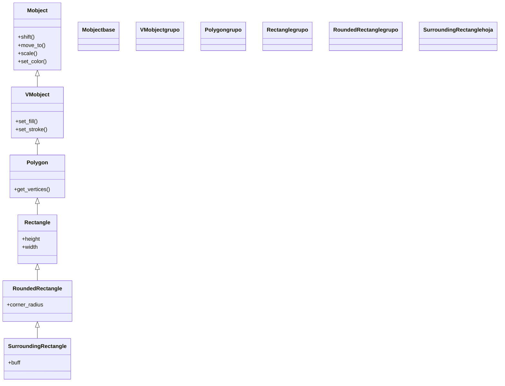

# SurroundingRectangle — un recuadro que rodea y resalta otro mobject (RoundedRectangle de anotacion)

`SurroundingRectangle` dibuja un **rectángulo que se ajusta automáticamente alrededor de otro mobject** para **resaltarlo**: recuadrar una palabra, encerrar una fórmula, marcar el resultado importante. A diferencia de [[Rectangle]] —donde tú das `height` y `width`— este se construye **a partir del objeto que quieres rodear** y calcula su tamaño solo, dejando un margen (`buff`) alrededor. Por dentro es un [[RoundedRectangle]] (por eso admite esquinas redondeadas con `corner_radius`), que a su vez es un `Rectangle`. Su uso típico es animarlo con `Create` para que el recuadro "aparezca dibujándose" sobre lo que se quiere destacar. Para un fondo opaco detrás del objeto (en vez de un borde) está su hermana [[BackgroundRectangle]]. Como todo [[concepto_mobject|Mobject]], se crea y luego se **añade** o se **anima**.

## Importacion

```python
from manim import SurroundingRectangle, BackgroundRectangle
# o, como es habitual en Manim:
from manim import *
```

## Herencia

### La cadena

`SurroundingRectangle` cuelga de [[RoundedRectangle]] (de ahí `corner_radius`), que es un [[Rectangle]], que es un [[Polygon]]. Lo único que añade respecto a un `RoundedRectangle` normal es construirse **a partir de otro mobject**: toma su caja envolvente y se dimensiona solo.



### Que hereda

Toda la geometría rectangular y el redondeo de esquinas vienen de arriba; `SurroundingRectangle` solo añade el ajuste automático al mobject de referencia. Mover, colorear, escalar y animar son herencia de VMobject/Mobject.

| Capacidad | Método típico | Definido en |
|-----------|---------------|-------------|
| Esquinas redondeadas | `corner_radius` | [[RoundedRectangle]] |
| Alto/ancho del rectángulo | `height`, `width`, `get_corner` | [[Rectangle]] |
| Vértices del polígono | `get_vertices` | [[Polygon]] |
| Relleno y trazo | `set_fill`, `set_stroke` | [[VMobject]] |
| Posición y escala | `shift`, `move_to`, `scale` | [[Mobject]] |

## Constructor

```python
SurroundingRectangle(mobject, color=YELLOW, buff=0.1, corner_radius=0.0, **kwargs)
```

### Parametros principales

| Parametro | Tipo | Defecto | Controla |
|-----------|------|---------|----------|
| `mobject` | `Mobject` | — (obligatorio) | el objeto que el recuadro rodea; de él toma el tamaño y la posición |
| `color` | `ManimColor` | `YELLOW` | el color del borde (por defecto amarillo, el color de resaltado) |
| `buff` | `float` | `0.1` | margen entre el recuadro y el objeto que rodea; a mayor `buff`, recuadro más holgado |
| `corner_radius` | `float` | `0.0` | radio de las esquinas; `0.0` da esquinas rectas, un valor positivo las redondea |
| `**kwargs` | — | — | se pasan a [[RoundedRectangle]]/[[VMobject]]: `stroke_width`, `fill_opacity`... |

#### buff: el margen del resaltado

`buff` es lo que hace que el recuadro "respire" alrededor del objeto en vez de cortarlo. Con `buff=0` el borde queda pegado a la caja envolvente del mobject; subirlo separa el recuadro para que se vea limpio. Es el parámetro que más se ajusta en la práctica.

```python
ceñido = SurroundingRectangle(texto, buff=0.0)    # borde pegado al texto
holgado = SurroundingRectangle(texto, buff=0.25)  # recuadro con aire
```

### Parametros de estilo

Como cualquier VMobject, acepta `stroke_width` (grosor del borde) y `fill_opacity` (relleno). Por defecto el recuadro es **solo borde** (sin relleno); si quieres un panel translúcido por detrás, dale `fill_opacity` y un `fill_color`, o usa directamente [[BackgroundRectangle]].

### Que construye

Devuelve un `SurroundingRectangle` (un VMobject) ya dimensionado y centrado sobre el mobject de referencia, con el margen `buff` alrededor y, si se pidió, las esquinas redondeadas. Es estático hasta que se añade o se anima.

## Metodos clave

Casi todo lo útil es herencia (mover, colorear, escalar): remitir a [[posicionamiento]] y [[estilo]]. Lo específico es que el recuadro **no sigue** al objeto si este se mueve después; para reencuadrar hay que reconstruirlo.

### Reencuadrar un objeto que se mueve

Igual que [[Brace]], un `SurroundingRectangle` se calcula una sola vez. Si el objeto rodeado se desplaza, el recuadro se queda donde estaba; envuélvelo en `always_redraw` para que lo siga (ver [[concepto_updaters]]).

```python
caja = always_redraw(lambda: SurroundingRectangle(objeto, color=YELLOW))
```

## Ejemplo

### Version minima

Resaltar una palabra dentro de un texto: el recuadro aparece dibujándose con `Create`.

```python
from manim import *

class ResaltarMinimo(Scene):
    def construct(self):
        texto = Text("Resalta esta palabra")
        self.add(texto)
        caja = SurroundingRectangle(texto, color=YELLOW, buff=0.15)
        self.play(Create(caja))      # el recuadro se dibuja alrededor del texto
        self.wait()
```

```bash
manim -pql archivo.py ResaltarMinimo      # -p reproduce, -ql = calidad baja (rapido)
```

### Version completa

Resaltar un término concreto dentro de una fórmula LaTeX, con esquinas redondeadas, y luego desplazar el recuadro a otro término. Muestra `corner_radius`, `buff` y cómo se recuadra una subparte de un `MathTex`.

```python
from manim import *

class ResaltarFormula(Scene):
    def construct(self):
        # 1. una formula; aislamos los terminos para poder recuadrarlos
        formula = MathTex("a^2", "+", "b^2", "=", "c^2").scale(1.5)
        self.play(Write(formula))

        # 2. recuadrar el primer termino con esquinas redondeadas
        caja = SurroundingRectangle(
            formula[0], color=YELLOW, buff=0.1, corner_radius=0.1,
        )
        self.play(Create(caja))
        self.wait(0.5)

        # 3. mover el recuadro al ultimo termino (reconstruyendolo)
        caja2 = SurroundingRectangle(
            formula[4], color=GREEN, buff=0.1, corner_radius=0.1,
        )
        self.play(ReplacementTransform(caja, caja2))
        self.wait()
```

```bash
manim -pqh archivo.py ResaltarFormula     # -qh = calidad alta para el render final
```

### Variaciones

`BackgroundRectangle` rellena un **panel opaco por detrás** del objeto en vez de un borde; sirve para dar contraste a un texto sobre un fondo cargado.

```python
from manim import *

class FondoOpaco(Scene):
    def construct(self):
        fondo = NumberPlane()                       # un fondo cargado
        texto = Text("Legible sobre el fondo")
        panel = BackgroundRectangle(texto, color=BLACK, fill_opacity=0.8, buff=0.2)
        self.add(fondo)
        self.play(FadeIn(panel), Write(texto))      # el panel da contraste al texto
        self.wait()
```

```bash
manim -pql archivo.py FondoOpaco
```

## Animarla

### Crear y transformar

La animación natural es `Create`, que dibuja el recuadro trazándolo; para saltar de un objeto resaltado a otro se usa `ReplacementTransform` entre dos recuadros, o `Transform`. La sintaxis `.animate` sirve para recolorear o engrosar el borde.

```python
self.play(Create(caja))                              # el recuadro se dibuja
self.play(ReplacementTransform(caja, caja_nueva))    # salta a otro objeto
self.play(caja.animate.set_stroke(RED, width=6))     # engrosar/recolorear con .animate
```

## Errores comunes

| Error | Causa | Solución |
|-------|-------|----------|
| El recuadro corta el objeto | `buff` demasiado pequeño (o `0.0`) | sube `buff` (p. ej. `buff=0.15`) |
| Querías un recuadro de tamaño fijo, no ajustado | usaste la clase equivocada | usa [[Rectangle]] con `height`/`width` para tamaño manual |
| El recuadro no sigue al objeto al moverlo | se calculó una sola vez | envuélvelo en `always_redraw(lambda: SurroundingRectangle(obj))` |
| Querías un fondo de relleno, no un borde | `SurroundingRectangle` es solo borde por defecto | usa [[BackgroundRectangle]] o dale `fill_opacity` |
| Las esquinas no se redondean | dejaste `corner_radius=0.0` | pásale un radio positivo (`corner_radius=0.1`) |
| `NameError: name 'SurroundingRectangle' is not defined` | faltó el import | `from manim import *` al inicio |

## Notas relacionadas

- [[BackgroundRectangle]] — la hermana de fondo opaco (panel, no borde)
- [[RoundedRectangle]] — la clase padre directa (de ahí `corner_radius`)
- [[Rectangle]] — el rectángulo de tamaño manual (`height`/`width`)
- [[Brace]] — la otra anotación de esta carpeta: medir/abarcar en vez de recuadrar
- [[Manim/mobjects/tablas_extras/index | tablas_extras]] — el índice de tablas y anotaciones
- [[concepto_mobject]] — qué es un Mobject y los métodos que todos comparten
- [[estilo]] — color, relleno y grosor del borde (`set_stroke`, `set_fill`)
- [[Scene.play]] — reproducir la animación que lo crea (`Create`)
