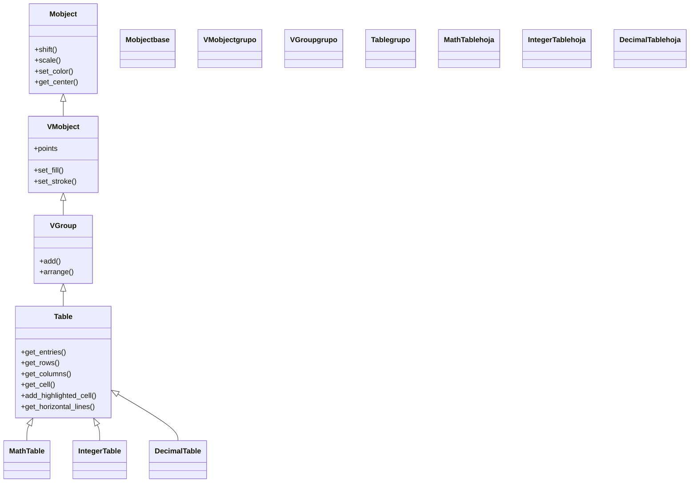

# Table — tabla de celdas con filas, columnas y lineas

`Table` es el Mobject que dibuja una **tabla**: una rejilla de celdas organizada en filas y columnas, con sus líneas separadoras, etiquetas opcionales de fila y de columna, y una celda de esquina superior-izquierda. Su rasgo más potente es que **cada celda puede ser cualquier Mobject**, no solo texto: por defecto cada entrada se convierte con [[Paragraph]], pero puedes pasarle figuras, fórmulas o imágenes y `Table` se encarga de alinearlas en la rejilla. Es la clase base de una pequeña familia (`MathTable`, `IntegerTable`, `DecimalTable`) que solo cambia **cómo se convierte cada celda** en Mobject. Como hereda de [[VGroup]], una `Table` no es un objeto monolítico sino un **grupo de submobjects** (las entradas, las líneas y las etiquetas), lo que permite animar y estilizar la tabla pieza a pieza: resaltar una celda, escribir una fila, colorear una columna. El detalle conceptual del árbol de submobjects vive en [[concepto_mobject]]; aquí se documenta la clase, su jerarquía, su constructor, sus métodos de consulta y los ejemplos.

## Importacion

```python
from manim import Table
# o, como es habitual en todo ejemplo de Manim:
from manim import *
```

`from manim import *` trae `Table` junto con sus hermanas (`MathTable`, `IntegerTable`, `DecimalTable`), las clases de celda que usarás dentro (`Text`, `MathTex`, `Paragraph`) y las constantes (`UP`, `BLUE`, `ORIGIN`…). En la práctica casi siempre se usa el import estrella.

## Herencia

### La cadena

`Table` desciende de [[VGroup]], que a su vez desciende de [[VMobject]] y de [[Mobject]]. Por eso una tabla **es un grupo**: sus celdas, líneas y etiquetas son submobjects que viven dentro de ella, y mover o escalar la `Table` arrastra a toda la rejilla a la vez. Sus hermanas no añaden estructura nueva: solo cambian el `element_to_mobject` por defecto (cómo se convierte cada celda).



### Que aporta cada ancestro

La tabla apila tres capas: lo *general* de `Mobject`, lo *vectorial* de `VMobject`, lo *de grupo* de `VGroup`, y encima la rejilla propia de `Table`.

| Ancestro | Qué aporta a una `Table` |
|----------|--------------------------|
| `Mobject` | posición (`shift`, `move_to`, `to_edge`), tamaño (`scale`), giro y los getters (`get_center`, `get_width`) |
| `VMobject` | el relleno y el trazo (`set_fill`, `set_stroke`) que usan las celdas y las líneas |
| `VGroup` | el ser un **grupo de submobjects**: las entradas y líneas son hijos, y `Table[i]` o iterar la indexa como una lista |
| `Table` | la **rejilla**: convierte una matriz de datos en celdas alineadas, dibuja las líneas, coloca las etiquetas y ofrece los getters de fila/columna/celda |

### Las hermanas: que cambia cada una

Las tres subclases son `Table` con un `element_to_mobject` distinto fijado por defecto; el resto (etiquetas, líneas, getters) es idéntico.

| Clase | Cada celda se convierte en | Cuándo usarla |
|-------|----------------------------|---------------|
| `Table` | [[Paragraph]] (texto plano) | celdas de texto general |
| `MathTable` | `MathTex` (LaTeX matemático) | fórmulas, símbolos, expresiones (requiere LaTeX) |
| `IntegerTable` | `Integer` (número entero) | tablas de enteros sin decimales |
| `DecimalTable` | `DecimalNumber` (número con decimales) | tablas numéricas con decimales controlados |

## Constructor

La tabla se construye a partir de una **lista de listas** (las filas de datos); el resto de parámetros decora la rejilla: etiquetas, líneas exteriores, estilo de las líneas y cómo se convierte cada dato en Mobject.

```python
Table(
    table: Iterable[Iterable[float | str | VMobject]],  # la matriz de datos (lista de filas)
    row_labels: Iterable[VMobject] | None = None,       # etiquetas de cada fila
    col_labels: Iterable[VMobject] | None = None,       # etiquetas de cada columna
    top_left_entry: VMobject | None = None,             # celda de la esquina superior-izquierda
    v_buff: float = 0.8,                                 # separacion vertical entre celdas
    h_buff: float = 1.3,                                 # separacion horizontal entre celdas
    include_outer_lines: bool = False,                   # dibujar tambien el borde exterior
    add_background_rectangles_to_entries: bool = False,  # fondo opaco detras de cada celda
    include_background_rectangle: bool = False,          # fondo opaco detras de toda la tabla
    element_to_mobject: Callable = Paragraph,            # como convertir cada dato en Mobject
    element_to_mobject_config: dict = {},                # kwargs para esa conversion
    arrange_in_grid_config: dict = {},                   # kwargs de la rejilla interna
    line_config: dict = {},                              # estilo de las lineas (color, grosor)
    **kwargs,                                             # se reenvian a VGroup/VMobject
) -> Table
```

### Parametros principales

| Parametro | Tipo | Defecto | Controla |
|-----------|------|---------|----------|
| `table` | `Iterable[Iterable]` | (obligatorio) | la matriz de datos: una **lista de filas**, cada fila una lista de celdas |
| `row_labels` | `list[VMobject] \| None` | `None` | etiquetas a la izquierda, una por fila (p. ej. `[Text("R1"), Text("R2")]`) |
| `col_labels` | `list[VMobject] \| None` | `None` | etiquetas arriba, una por columna |
| `top_left_entry` | `VMobject \| None` | `None` | qué poner en la esquina cuando hay etiquetas de fila **y** de columna |
| `include_outer_lines` | `bool` | `False` | si `True`, dibuja también el marco exterior además de las líneas internas |
| `element_to_mobject` | `Callable` | `Paragraph` | la función que transforma cada dato de `table` en un Mobject |
| `line_config` | `dict` | `{}` | estilo de las líneas separadoras: `{"stroke_width": 2, "color": BLUE}` |

#### `element_to_mobject` — la pieza que define a las hermanas

Es el parámetro clave: cambia **cómo se interpreta cada celda**. Con el defecto `Paragraph`, los datos se tratan como texto. Si pasas `element_to_mobject=MathTex`, cada celda se renderiza como LaTeX —que es exactamente lo que hace `MathTable` por dentro—. Es también la vía para celdas a medida: cualquier `Callable` que reciba el dato y devuelva un Mobject sirve.

```python
# una tabla cuyas celdas son formulas LaTeX, equivalente a MathTable:
Table(
    [["x^2", "x^3"], ["\\sqrt{x}", "\\frac{1}{x}"]],
    element_to_mobject=MathTex,
)
```

### Parametros de estilo

El borde, los fondos y el espaciado se controlan al construir; el color individual de celdas y líneas se ajusta después con los métodos (`add_highlighted_cell`, `set_color` sobre una fila…).

| Parametro | Tipo | Defecto | Controla |
|-----------|------|---------|----------|
| `v_buff` / `h_buff` | `float` | `0.8` / `1.3` | la separación vertical / horizontal entre celdas |
| `include_outer_lines` | `bool` | `False` | el marco exterior |
| `add_background_rectangles_to_entries` | `bool` | `False` | un rectángulo de fondo detrás de cada celda |
| `line_config` | `dict` | `{}` | `color`, `stroke_width` de las líneas separadoras |

### Que construye

Devuelve un `Table` que es un [[VGroup]] con tres familias de submobjects: las **entradas** (las celdas convertidas a Mobject, incluidas las etiquetas y la esquina), las **líneas** horizontales y verticales, y —si lo pediste— los rectángulos de fondo. Como es un grupo, ya está colocado y alineado al instante de crearlo; lo añades con `self.add(tabla)` o lo animas entrando con `self.play(Create(tabla))` / `self.play(Write(tabla))`.

## Metodos clave

Casi todo lo que harás con una tabla ya creada es **seleccionar partes** de ella (una celda, una fila, una columna) para colorearlas, resaltarlas o animarlas. Estos getters devuelven Mobjects (o [[VGroup]]s) que luego transformas con los métodos heredados de [[Mobject]].

### Consultar partes

Devuelven sub-piezas de la tabla. Las coordenadas de celda son **1-indexadas** e **incluyen** las filas/columnas de etiquetas.

| Metodo | Firma | Que devuelve |
|--------|-------|--------------|
| `get_entries` | `get_entries(pos=None) -> VGroup \| VMobject` | todas las celdas (sin líneas); con `pos=(i, j)` la celda concreta |
| `get_rows` | `get_rows() -> VGroup` | un `VGroup` por cada fila (útil para animar fila a fila) |
| `get_columns` | `get_columns() -> VGroup` | un `VGroup` por cada columna |
| `get_cell` | `get_cell((i, j), **kwargs) -> Polygon` | el **polígono** (rectángulo) que enmarca esa celda, no su contenido |
| `get_horizontal_lines` | `get_horizontal_lines() -> VGroup` | las líneas horizontales separadoras |
| `get_vertical_lines` | `get_vertical_lines() -> VGroup` | las líneas verticales separadoras |
| `get_row_labels` / `get_col_labels` | `-> VGroup` | las etiquetas de fila / columna |

> [!nota] `get_entries` vs `get_cell`
> `get_entries((i, j))` te da el **contenido** de la celda (el `Text`/`MathTex` de dentro), que es lo que coloreas o animas. `get_cell((i, j))` te da el **marco rectangular** de esa posición, útil para dibujar un borde o un fondo a medida. No confundirlos: colorear la celda es sobre `get_entries`; enmarcarla es sobre `get_cell`.

### Resaltar y decorar

| Metodo | Firma | Que hace |
|--------|-------|----------|
| `add_highlighted_cell` | `add_highlighted_cell((i, j), color=YELLOW, **kwargs) -> Table` | añade un rectángulo de fondo coloreado **detrás** de esa celda |
| `add_background_to_entries` | `add_background_to_entries(color=BLACK) -> Table` | pone un fondo opaco bajo cada celda (legibilidad sobre fondos) |
| `set_row_colors` / `set_column_colors` | `set_row_colors(*colors) -> Table` | tiñe filas / columnas completas con colores sucesivos |

## Ejemplo

### Version minima

La tabla más corta: una matriz de texto de 2x2 que se dibuja en pantalla.

```python
from manim import *

class TablaMinima(Scene):
    def construct(self):
        tabla = Table([["a", "b"], ["c", "d"]])
        self.add(tabla)
        self.wait()
```

```bash
manim -pql archivo.py TablaMinima      # -p reproduce, -ql = calidad baja (rapido)
```

### Version completa

Una tabla con etiquetas de fila y de columna, esquina superior-izquierda, líneas exteriores, y una celda resaltada que se anima al final. Muestra el flujo típico: construir con etiquetas, escribir la tabla, y luego seleccionar partes para colorear o resaltar.

```python
from manim import *

class TablaCompleta(Scene):
    def construct(self):
        tabla = Table(
            [["10", "8"], ["3", "12"]],
            row_labels=[Text("Lun"), Text("Mar")],
            col_labels=[Text("Manana"), Text("Tarde")],
            top_left_entry=Text("Dia"),
            include_outer_lines=True,
            line_config={"stroke_width": 2, "color": GREY},
        ).scale(0.8)

        # 1. escribir la tabla entera
        self.play(Write(tabla))
        self.wait(0.5)

        # 2. colorear una columna completa (get_columns devuelve un VGroup por columna)
        col = tabla.get_columns()[1]            # la primera columna de DATOS (tras las etiquetas)
        self.play(col.animate.set_color(YELLOW))

        # 3. resaltar la celda con el valor maximo (1-indexada, contando etiquetas)
        self.play(Indicate(tabla.get_entries((3, 3))))   # fila 3, columna 3 = el "12"
        tabla.add_highlighted_cell((3, 3), color=GREEN)
        self.play(Create(tabla.get_cell((3, 3), color=GREEN)))
        self.wait()
```

```bash
manim -pqh archivo.py TablaCompleta     # -qh = calidad alta para el render final
```

### Variaciones

#### Una `MathTable` (celdas como `MathTex`)

Cuando las celdas son fórmulas, usas la hermana `MathTable`: cada entrada se interpreta como LaTeX en lugar de texto plano. Requiere LaTeX instalado.

```python
from manim import *

class TablaMatematica(Scene):
    def construct(self):
        tabla = MathTable(
            [["x", "x^2", "x^3"],
             ["1", "1", "1"],
             ["2", "4", "8"],
             ["3", "9", "27"]],
            include_outer_lines=True,
        ).scale(0.7)
        self.play(Create(tabla.get_horizontal_lines()), Create(tabla.get_vertical_lines()))
        self.play(Write(tabla.get_entries()))
        self.wait()
```

```bash
manim -pql archivo.py TablaMatematica
```

#### Animar fila por fila

`get_rows()` devuelve un `VGroup` por fila, ideal para escribirlas escalonadas con [[LaggedStart]].

```python
from manim import *

class TablaPorFilas(Scene):
    def construct(self):
        tabla = IntegerTable([[1, 2, 3], [4, 5, 6], [7, 8, 9]]).scale(0.8)
        self.add(tabla.get_horizontal_lines(), tabla.get_vertical_lines())
        self.play(LaggedStart(*[Write(fila) for fila in tabla.get_rows()], lag_ratio=0.5))
        self.wait()
```

```bash
manim -pql archivo.py TablaPorFilas
```

## Errores comunes

| Error | Causa | Solución |
|-------|-------|----------|
| La celda `(1, 1)` no es la que esperabas | las coordenadas son **1-indexadas** y cuentan las filas/columnas de **etiquetas** | recuerda que con `row_labels`/`col_labels`, los datos empiezan en `(2, 2)` |
| `get_entries((i, j))` no colorea el fondo, solo el texto | devuelve el **contenido**, no el marco | para el fondo usa `add_highlighted_cell((i, j))` o colorea `get_cell((i, j))` |
| Las fórmulas salen como texto literal `x^2` | usaste `Table` (celdas con `Paragraph`) en vez de fórmulas | usa `MathTable` o `element_to_mobject=MathTex` (requiere LaTeX) |
| `len(row_labels)` no coincide con las filas | hay menos/más etiquetas que filas de datos | una etiqueta por fila exactamente; igual para `col_labels` |
| La tabla se sale del marco | demasiadas celdas o `h_buff`/`v_buff` grandes | aplica `.scale(0.7)` o reduce los buffs |
| `Create(tabla)` tarda mucho o se ve raro | `Create` traza cada glifo de cada celda | prefiere `Write(tabla)` o anima las líneas y las entradas por separado |
| `NameError: name 'Table' is not defined` | faltó el import | `from manim import *` al inicio |

## Notas relacionadas

- [[Matrix]] — la otra tabla especializada: una matriz con corchetes para álgebra lineal
- [[VGroup]] — la clase padre: por qué una `Table` es un grupo de submobjects indexable
- [[Mobject]] — de donde vienen `shift`, `scale`, `set_color` que aplicas a filas y columnas
- [[Paragraph]] — el conversor de celda por defecto (texto plano multilínea)
- [[MathTex]] — las celdas de una `MathTable`
- [[concepto_mobject]] — el árbol de submobjects que hace la tabla seleccionable por partes
- [[LaggedStart]] — para animar filas o columnas escalonadas
- [[Manim/mobjects/tablas_extras/index | tablas_extras]] — la carpeta de tablas y matrices
