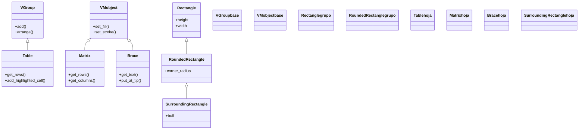

# tablas_extras — datos en rejilla y anotaciones sobre la escena

Esta carpeta reúne las **utilidades de presentación y anotación** de Manim: por un lado, los mobjects que organizan **datos en rejilla** —tablas de valores con [[Table]] y matrices algebraicas con [[Matrix]]—; por otro, los que **anotan o señalan otros objetos** ya presentes en la escena —una llave que mide o abarca con [[Brace]] y un recuadro que resalta con [[SurroundingRectangle]]—. No son figuras geométricas básicas ni texto suelto: son las piezas que convierten una escena en una **explicación** (esto mide tanto, fíjate en esto, estos datos van juntos). Todas son VMobjects, así que se crean y luego se añaden o se animan como cualquier otro objeto.

## En accion

Una `Matrix` con una de sus filas resaltada por un `SurroundingRectangle` y una `Brace` que mide su anchura con una etiqueta. Combina las dos vertientes de la carpeta: presentar datos y anotarlos.

```python
from manim import *

class DatosAnotados(Scene):
    def construct(self):
        # 1. una matriz de datos
        m = Matrix([[1, 2, 3], [4, 5, 6], [7, 8, 9]])
        self.play(Write(m))

        # 2. resaltar la primera fila con un recuadro
        fila = m.get_rows()[0]
        caja = SurroundingRectangle(fila, color=YELLOW, buff=0.1)
        self.play(Create(caja))

        # 3. una llave bajo la matriz que mide su ancho, con etiqueta
        llave = Brace(m, direction=DOWN)
        etiqueta = llave.get_text("3 columnas")
        self.play(GrowFromCenter(llave), Write(etiqueta))
        self.wait()
```

```bash
manim -pql archivo.py DatosAnotados      # -p reproduce, -ql = calidad baja (rapido)
```

## Herencia

Las cuatro clases son VMobjects, pero por caminos distintos: `Table` agrupa celdas (es un [[VGroup]]); `Matrix` y `Brace` cuelgan directo de `VMobject`; y `SurroundingRectangle` hereda toda la geometría rectangular pasando por `RoundedRectangle` y `Rectangle`.



## Clases que aporta

| Clase | Hereda de | Para que |
|-------|-----------|----------|
| [[Table]] | `VGroup` | datos en rejilla: filas y columnas de texto o mobjects, con cabeceras y líneas |
| [[Matrix]] | `VMobject` | una matriz algebraica con corchetes (`[ ]`), para álgebra lineal |
| [[Brace]] | `VMobject` | una llave (`{`) que abarca y mide un objeto, con etiqueta colgada del pico |
| [[SurroundingRectangle]] | `RoundedRectangle` | un recuadro que se ajusta solo alrededor de un objeto para resaltarlo |

## Como elegir

Primero decide si presentas **datos** o si **anotas** algo que ya está en la escena.

| Quiero… | Clase |
|---------|-------|
| Mostrar datos en una rejilla (tabla de valores, con cabeceras) | `Table` |
| Mostrar una matriz algebraica con corchetes para álgebra lineal | `Matrix` |
| Medir o abarcar un objeto/tramo y ponerle una etiqueta | `Brace` |
| Resaltar (encerrar en un recuadro) una palabra, fórmula o fila | `SurroundingRectangle` |

La regla rápida: si la pieza **contiene** la información, es `Table` o `Matrix`; si **señala** información que ya existe, es `Brace` o `SurroundingRectangle`.

## Patrones y recetas

Dos recetas que se repiten al anotar una escena: encerrar una fórmula para resaltarla y colgar una llave con etiqueta bajo un grupo.

### Resaltar una formula con SurroundingRectangle

El gesto clásico de "mira este término": se escribe la fórmula y, al destacar, aparece un recuadro dibujándose con `Create` alrededor de la parte que importa. Recuadrar una subparte concreta exige aislar los términos en el `MathTex` (por eso van como argumentos separados).

```python
from manim import *

class ResaltaFormula(Scene):
    def construct(self):
        formula = MathTex("E", "=", "m", "c^2").scale(1.6)
        self.play(Write(formula))
        caja = SurroundingRectangle(formula[3], color=YELLOW, buff=0.1)  # recuadra c^2
        self.play(Create(caja))
        self.wait()
```

```bash
manim -pql archivo.py ResaltaFormula
```

### Poner una llave con etiqueta bajo un grupo

Para decir "todo esto junto mide/es X": se agrupan los objetos con [[VGroup]], se cuelga una `Brace` debajo (`direction=DOWN` mide el ancho) y se le pone una etiqueta con `get_text`. La llave entra bien con `GrowFromCenter`.

```python
from manim import *

class LlaveBajoGrupo(Scene):
    def construct(self):
        grupo = VGroup(
            Circle(color=BLUE), Square(color=GREEN), Triangle(color=RED),
        ).arrange(RIGHT, buff=0.4)
        self.play(Create(grupo))
        llave = Brace(grupo, direction=DOWN)
        etiqueta = llave.get_text("tres figuras")
        self.play(GrowFromCenter(llave), Write(etiqueta))
        self.wait()
```

```bash
manim -pql archivo.py LlaveBajoGrupo
```

## Notas relacionadas

- [[Table]] — datos en rejilla (filas y columnas)
- [[Matrix]] — una matriz algebraica con corchetes
- [[Brace]] — la llave que abarca y mide, con etiqueta
- [[SurroundingRectangle]] — el recuadro que resalta otro objeto
- [[Manim/mobjects/index | mobjects]] — el índice de todos los objetos dibujables
- [[Manim/mobjects/geometria/index | geometria]] — las figuras básicas ([[Rectangle]], [[Square]]...)
- [[Manim/mobjects/texto/index | texto]] — el texto y las fórmulas que llenan tablas y etiquetas
- [[Manim/index | Manim]] — el índice raíz con el `classDiagram` global
