# MarkupText — texto con etiquetas de formato de Pango

`MarkupText` es el hermano "con formato" de [[Text]]: dibuja texto con **fuentes del sistema** (también **via Pango, sin LaTeX**), pero acepta **etiquetas de marcado tipo HTML** dentro de la cadena para dar formato **fino por trozos** —color, negrita, cursiva, subrayado, tamaño— **sin tener que trocear el objeto a mano**. Donde con `Text` colorearías una palabra con `t2c` o indexando glifos, con `MarkupText` escribes el formato directamente en la cadena: `'<span foreground="red">rojo</span> y <b>negrita</b>'`. Es la herramienta idónea cuando una sola frase mezcla varios estilos y quieres declararlos en línea, igual que en HTML. Comparte todo el resto de comportamiento con `Text` (es un Mobject vectorizado que se anima con [[Write]], se posiciona y se colorea igual); lo único que cambia es **cómo se especifica el formato**: con etiquetas en vez de con diccionarios. Para fórmulas matemáticas sigue sin servir: eso es territorio de [[MathTex]].

## Importacion

```python
from manim import MarkupText
# o, como es habitual en Manim:
from manim import *
```

## Herencia

### La cadena

Igual que [[Text]], `MarkupText` cuelga de `SVGMobject`: Pango interpreta el marcado, lo convierte en un dibujo vectorial y `SVGMobject` lo carga como curvas de Bézier. Por eso es un [[VMobject]] normal y corriente, con todo el repertorio de color, posición y animación heredado.

```mermaid
classDiagram
    class Mobject {
        +shift()
        +move_to()
        +scale()
        +set_color()
    }
    class VMobject {
        +set_fill()
        +set_stroke()
        +points
    }
    class SVGMobject {
        +path_to_mobject()
    }
    class MarkupText {
        +parse_markup()
    }
    Mobject <|-- VMobject
    VMobject <|-- SVGMobject
    SVGMobject <|-- MarkupText

    classDef base fill:#5e81ac,stroke:#88c0d0,stroke-width:2px,color:#eceff4;
    classDef grupo fill:#3b4252,stroke:#81a1c1,stroke-width:1.5px,color:#88c0d0;
    classDef hoja fill:#2e3440,stroke:#a3be8c,color:#d8dee9;
    class Mobject base
    class VMobject grupo
    class SVGMobject grupo
    class MarkupText hoja
```



### Que hereda

`MarkupText` solo aporta el **parseo del marcado de Pango**; el resto lo hereda igual que [[Text]].

| Capacidad | Método típico | Definido en |
|-----------|---------------|-------------|
| Posición y escala | `shift`, `move_to`, `to_edge`, `scale` | [[Mobject]] |
| Color global y opacidad | `set_color`, `set_opacity` | [[Mobject]] |
| Relleno y trazo | `set_fill`, `set_stroke` | [[VMobject]] |
| Cada glifo es un submobject | indexado `texto[i]` | [[VMobject]] (familia de hijos) |

El formato lo dictan las etiquetas; el color global del constructor solo se aplica a los trozos que **no** llevan su propia etiqueta de color.

## Constructor

```python
MarkupText(
    text: str,                       # la cadena CON etiquetas de marcado Pango
    font_size: float = 48,           # tamano de la fuente (en puntos)
    color: ManimColor = WHITE,       # color base (de los trozos sin etiqueta)
    font: str = "",                  # fuente del sistema ("" = la por defecto)
    **kwargs,                        # se reenvian a SVGMobject/VMobject
) -> MarkupText
```

### Parametros principales

| Parametro | Tipo | Defecto | Controla |
|-----------|------|---------|----------|
| `text` | `str` | — | la cadena con **etiquetas de marcado de Pango** (`<b>`, `<i>`, `<span ...>`...) |
| `font_size` | `float` | `48` | el tamaño base de la fuente en puntos |
| `color` | `ManimColor` | `WHITE` | el color de los trozos que **no** llevan su propia etiqueta de color |
| `font` | `str` | `""` | una fuente instalada en el sistema; `""` usa la por defecto |
| `**kwargs` | — | — | se pasan a `SVGMobject`/[[VMobject]]: `fill_opacity`, `stroke_width`... |

#### El marcado de Pango (las etiquetas)

El marcado de Pango es **parecido al HTML** pero no idéntico. Las etiquetas más usadas:

| Etiqueta | Efecto | Ejemplo |
|----------|--------|---------|
| `<b>...</b>` | negrita | `<b>importante</b>` |
| `<i>...</i>` | cursiva | `<i>enfasis</i>` |
| `<u>...</u>` | subrayado | `<u>subrayado</u>` |
| `<span foreground="...">...</span>` | color del texto | `<span foreground="red">rojo</span>` |
| `<span size="...">...</span>` | tamaño (en miles de pt) | `<span size="x-large">grande</span>` |

El color va en `foreground` (no `color`), y admite nombres (`"red"`) o hex (`"#ff0000"`). Para escribir un `<`, `>` o `&` literales hay que escaparlos (`&lt;`, `&gt;`, `&amp;`).

### Que construye

Devuelve un `MarkupText` (un VMobject) cuyos `submobjects` son los **glifos** con el formato ya aplicado según las etiquetas, centrado por defecto en el `ORIGIN`. Como todo Mobject, hay que **añadirlo o animarlo** para que aparezca.

## Metodos clave

`MarkupText` no añade métodos propios relevantes sobre [[Text]]: se mueve, colorea, escala e indexa por carácter exactamente igual (ver [[posicionamiento]] y [[estilo]]). La diferencia vive **en la cadena**, no en la API. El indexado por glifo (`texto[0:4]`) sigue disponible para animar trozos por su posición.

## Ejemplo

### Version minima

Una frase con dos formatos declarados en línea: una palabra en rojo y otra en negrita, sin trocear nada a mano.

```python
from manim import *

class MarkupMinimo(Scene):
    def construct(self):
        t = MarkupText('<span foreground="red">rojo</span> y <b>negrita</b>')
        self.play(Write(t))
        self.wait()
```

```bash
manim -pql archivo.py MarkupMinimo      # -p reproduce, -ql = calidad baja (rapido)
```

### Version completa

Una frase que mezcla **varios** estilos a la vez —color, negrita, cursiva, subrayado y tamaño— todo declarado con etiquetas dentro de una única cadena; el mismo resultado con [[Text]] exigiría varios `t2c`/`t2w` y trocear por índice.

```python
from manim import *

class MarkupCompleto(Scene):
    def construct(self):
        frase = MarkupText(
            'Manim es <b>potente</b>, '
            '<span foreground="yellow">flexible</span> e '
            '<i>elegante</i>, y <u>sin LaTeX</u>.',
            font_size=42,
        ).to_edge(UP)

        self.play(Write(frase))
        self.wait()
```

```bash
manim -pqh archivo.py MarkupCompleto     # -qh = calidad alta para el render final
```

## Errores comunes

| Error | Causa | Solución |
|-------|-------|----------|
| Las etiquetas se ven como texto literal (`<b>` aparece dibujado) | usaste [[Text]] en vez de `MarkupText` | usa `MarkupText`, que es el que parsea el marcado |
| `color="red"` dentro de `<span>` no colorea | en Pango el atributo es `foreground`, no `color` | `<span foreground="red">...</span>` |
| Error de parseo / la cadena no renderiza | hay un `<`, `>` o `&` literal sin escapar, o una etiqueta sin cerrar | escapa con `&lt;` `&gt;` `&amp;` y cierra todas las etiquetas |
| Quiero una fórmula con superíndices y no sale | `MarkupText` no compone matemáticas | usa [[MathTex]] (requiere LaTeX) |
| Aparece de golpe | usaste `self.add` (instantáneo) | anímalo con `self.play(Write(...))` |
| `NameError: name 'MarkupText' is not defined` | faltó el import | `from manim import *` al inicio |

## Notas relacionadas

- [[Text]] — el texto Pango sin marcado; usa `t2c`/`t2w` en vez de etiquetas para el formato
- [[MathTex]] — para **fórmulas** matemáticas (requiere LaTeX)
- [[Tex]] — texto en prosa con fragmentos matemáticos en línea (requiere LaTeX)
- [[Write]] — la animación habitual para hacer aparecer el texto trazo a trazo
- [[concepto_mobject]] — qué es un Mobject y los métodos que todos comparten
- [[posicionamiento]] — colocar el texto en la escena (`to_edge`, `next_to`, `shift`)
- [[Manim/mobjects/texto/index | texto]] — la carpeta de texto y las dos familias (Pango y LaTeX)
