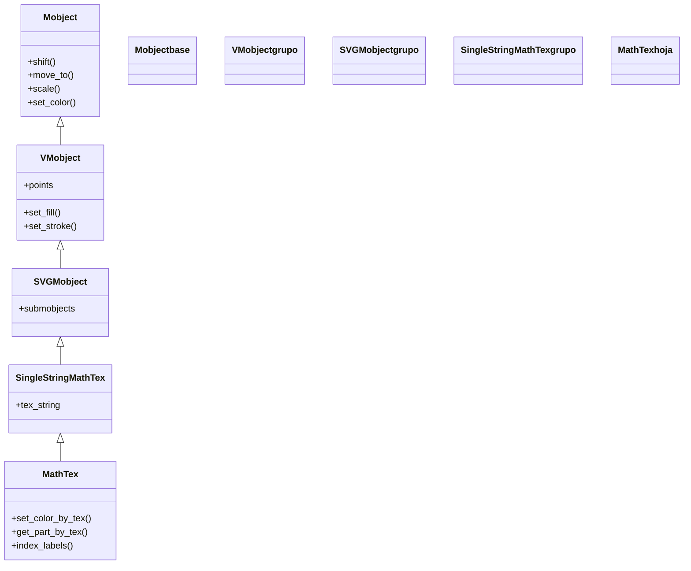

# MathTex — formulas LaTeX en modo matematico (VMobject de texto)

`MathTex` es el Mobject que renderiza **LaTeX en modo matemático** y es la herramienta estándar para poner **fórmulas** en una animación: `MathTex(r"x^2 + y^2 = r^2")` dibuja la ecuación ya compuesta, sin que tengas que escribir los `$...$` (Manim envuelve el texto en un entorno matemático por ti). Como cualquier [[concepto_mobject|Mobject]] vectorizado no se "reproduce": se crea, se coloca y luego se **añade** (`self.add`) o se **anima** (`self.play(Write(...))`). Lo que de verdad distingue a `MathTex` de un texto normal —y la razón de usarlo aun para una sola fórmula— es que **trocea la expresión en sub-mobjects indexables**: puedes pasarle la fórmula partida en pedazos (`MathTex("a^2", "+", "b^2")`) y luego colorear, mover o transformar cada pedazo por separado. Para texto corriente sin matemáticas (párrafos, títulos) lo natural es [[Text]] (que usa Pango y no necesita LaTeX); `MathTex` es para lo que lleva símbolos matemáticos.

> [!important] MathTex REQUIERE una instalacion de LaTeX en el sistema
> A diferencia de [[Text]] (que usa Pango y no depende de LaTeX), `MathTex` compila su entrada con una distribución de **LaTeX** real instalada en tu máquina (por ejemplo TeX Live en Linux/Mac o MiKTeX en Windows), más `dvisvgm` para pasar el resultado a vectores. Si LaTeX no está instalado, el render **falla con un error de compilación** (no se genera el vídeo). Para texto que no necesite matemáticas, usa [[Text]], que no tiene esta dependencia.

## Importacion

```python
from manim import MathTex
# o, como es habitual en Manim:
from manim import *
```

## Herencia

### La cadena

`MathTex` hereda de `SingleStringMathTex` (la pieza que compila **una sola** cadena LaTeX a un SVG), que a su vez es un `SVGMobject` (un VMobject construido a partir de un SVG). La cadena completa hasta `Mobject` deja claro de dónde sale cada capacidad: la composición de la fórmula viene de `SingleStringMathTex`, la conversión del SVG a curvas de `SVGMobject`, el relleno y el trazo de `VMobject`, y la posición y la escala de `Mobject`. `MathTex` añade por encima la capacidad de **trocear** la expresión en varias sub-partes.



### Que hereda

`MathTex` solo aporta la lógica de modo matemático y el troceo en partes; **todo el comportamiento de Mobject lo hereda**. Colorear y posicionar una fórmula es idéntico a colorear y posicionar cualquier otra figura.

| Capacidad | Método típico | Definido en |
|-----------|---------------|-------------|
| Posición (relativa/absoluta) | `shift`, `move_to`, `next_to`, `to_edge` | [[Mobject]] |
| Escala y giro | `scale`, `rotate` | [[Mobject]] |
| Color global | `set_color`, `set_opacity` | [[Mobject]] |
| Relleno y trazo | `set_fill`, `set_stroke` | [[VMobject]] |
| Árbol de sub-partes | `submobjects`, indexado `formula[i]` | [[Mobject]] / [[VMobject]] |

El `font_size` y el `color` que pasas al constructor terminan aplicándose por la maquinaria heredada; el posicionamiento (`shift`, `next_to`, `to_edge`) usa las constantes de [[posicionamiento]] (`UP`, `LEFT`, `ORIGIN`...).

## Constructor

```python
MathTex(
    *tex_strings,                 # una o varias cadenas LaTeX; cada una sera una sub-parte
    arg_separator=" ",            # texto LaTeX que se intercala entre las cadenas
    substrings_to_isolate=[],     # subcadenas que se aislan como sub-mobjects propios
    tex_to_color_map={},          # {subcadena: COLOR} para colorear partes al construir
    tex_template=None,            # plantilla LaTeX (paquetes, preambulo) a usar
    font_size=48,                 # tamano de la fuente
    color=WHITE,                  # color base de toda la formula
    **kwargs,                     # se reenvian a SingleStringMathTex / VMobject
) -> MathTex
```

### Parametros principales

| Parametro | Tipo | Defecto | Controla |
|-----------|------|---------|----------|
| `*tex_strings` | `str` | — | una o varias cadenas LaTeX; **cada argumento se convierte en una sub-parte** indexable de la fórmula |
| `arg_separator` | `str` | `" "` | el LaTeX que se inserta **entre** cadenas consecutivas (un espacio por defecto) |
| `substrings_to_isolate` | `list[str]` | `[]` | subcadenas que Manim **aísla** como sub-mobjects aunque la fórmula sea una sola cadena |
| `tex_to_color_map` | `dict` | `{}` | mapa `{subcadena: COLOR}` que colorea esas subcadenas al construir (y las aísla) |
| `tex_template` | `TexTemplate \| None` | `None` | plantilla con paquetes/preámbulo LaTeX; útil si la fórmula usa comandos de un paquete concreto |

#### `*tex_strings` — el troceo es lo importante

El número de argumentos posicionales decide en cuántas **sub-partes** se divide la fórmula. `MathTex(r"a^2+b^2")` es **una** sola pieza; `MathTex("a^2", "+", "b^2")` es la **misma** fórmula visible pero partida en **tres** sub-mobjects (`formula[0]`, `formula[1]`, `formula[2]`), lo que permite colorear o animar cada trozo por separado. Ver el apartado [[#La division en sub-partes (lo mas importante)]].

### Parametros de estilo

| Parametro | Tipo | Defecto | Controla |
|-----------|------|---------|----------|
| `font_size` | `float` | `48` | el tamaño de la fórmula (equivale a escalarla; `72` la hace más grande) |
| `color` | `ManimColor` | `WHITE` | el color base de **toda** la fórmula (para colorear solo una parte, ver más abajo) |
| `**kwargs` | — | — | se reenvían a `SingleStringMathTex`/[[VMobject]]: `fill_opacity`, `stroke_width`... |

### Que construye

Devuelve un `MathTex` (un VMobject) cuyos `submobjects` son las sub-partes en que se troceó la entrada (una sola si pasaste una cadena), y cada sub-parte contiene a su vez los glifos de la fórmula ya vectorizados. Es un objeto **dibujable pero estático**: hay que añadirlo (`self.add`) o animarlo (`self.play(Write(...))`) para que aparezca.

## La division en sub-partes (lo mas importante)

Esta es la razón de ser de `MathTex` frente a un texto plano: una fórmula no es una mancha única, sino un **árbol de sub-mobjects** que puedes direccionar uno a uno. Hay dos formas de decidir el troceo, y tres métodos para colorear partes por su contenido LaTeX.

### Trocear por argumentos posicionales

Cada argumento que pasas es una sub-parte indexable. Es la forma más explícita y la que más control da:

```python
from manim import *

class FormulaPorPartes(Scene):
    def construct(self):
        # la MISMA formula, pero partida en 3 sub-mobjects:
        formula = MathTex("a^2", "+", "b^2", "=", "c^2")
        formula[0].set_color(RED)     # a^2  -> rojo
        formula[2].set_color(BLUE)    # b^2  -> azul
        formula[4].set_color(GREEN)   # c^2  -> verde
        self.add(formula)
        self.wait()
```

```bash
manim -pql archivo.py FormulaPorPartes      # -p reproduce, -ql = calidad baja (rapido)
```

`formula[0]` es `"a^2"`, `formula[1]` es `"+"`, etc. El indexado funciona porque `MathTex` es un Mobject con varios `submobjects` (la idea del árbol de [[concepto_mobject]]).

### Colorear por contenido LaTeX

Cuando no quieres contar índices a mano, puedes pedirle a `MathTex` que localice una subcadena por su texto LaTeX y la coloree:

| Metodo | Firma | Que hace |
|--------|-------|----------|
| `set_color_by_tex` | `formula.set_color_by_tex(tex, color)` | colorea todas las partes que **contienen** la subcadena `tex` |
| `get_part_by_tex` | `formula.get_part_by_tex(tex)` | devuelve el sub-mobject que contiene `tex` (para animarlo o anclar algo) |
| `index_labels` | `index_labels(formula)` | (utilidad) superpone los índices de cada sub-parte; ayuda a depurar el troceo |

```python
# colorear "x" sin saber su indice:
formula = MathTex(r"x^2 + y^2 = r^2")
formula.set_color_by_tex("x", RED)
```

> [!tip] Si `set_color_by_tex` no encuentra la parte, aíslala
> `set_color_by_tex("x", RED)` solo puede colorear `x` si `x` quedó como una sub-parte separable. Si la fórmula es una sola cadena y el corte no cae donde quieres, usa `substrings_to_isolate=["x"]` (o `tex_to_color_map={"x": RED}`) al construir, o pasa la fórmula partida en argumentos. Para **ver** los índices reales, llama a `index_labels(formula)`.

### Para que sirve el troceo

El troceo no es decorativo: es lo que habilita [[TransformMatchingTex]], que **empareja las sub-partes con el mismo LaTeX** entre dos fórmulas y solo anima lo que cambia (ver el apartado [[#Animarla]]). Sin partes, `TransformMatchingTex` no tendría nada que emparejar.

## Metodos clave

Casi todo lo que se le hace a un `MathTex` son métodos heredados de [[Mobject]]/[[VMobject]] (mover, colorear, escalar): para esos, remitir a [[posicionamiento]] y [[estilo]]. Lo **propio** de `MathTex` es el manejo de partes.

### Manejar las partes

| Metodo | Firma | Que hace |
|--------|-------|----------|
| `set_color_by_tex` | `set_color_by_tex(tex, color)` | tiñe las sub-partes que contienen `tex` |
| `set_color_by_tex_to_color_map` | `set_color_by_tex_to_color_map(dict)` | colorea varias subcadenas a la vez con un mapa `{tex: color}` |
| `get_part_by_tex` | `get_part_by_tex(tex)` | devuelve la sub-parte que contiene `tex` |
| `get_parts_by_tex` | `get_parts_by_tex(tex)` | devuelve **todas** las sub-partes que contienen `tex` (un `VGroup`) |

### Indexado directo

| Forma | Que hace |
|-------|----------|
| `formula[i]` | la sub-parte número `i` (en el orden de los argumentos) |
| `formula[i][j]` | el glifo `j` dentro de la sub-parte `i` (cada parte es a su vez un árbol) |
| `len(formula)` | cuántas sub-partes tiene |

## Ejemplo

### Version minima

Una fórmula simple que se escribe con [[Write]] y se queda en pantalla. No hace falta poner `$...$`: `MathTex` ya está en modo matemático.

```python
from manim import *

class FormulaMinima(Scene):
    def construct(self):
        formula = MathTex(r"x^2 + y^2 = r^2")
        self.play(Write(formula))
        self.wait()
```

```bash
manim -pql archivo.py FormulaMinima      # -p reproduce, -ql = calidad baja (rapido)
```

### Version completa

Una fórmula dividida en partes coloreadas, escalada y con una de sus partes localizada por contenido para marcarla con un recuadro. Demuestra el troceo, el indexado y `get_part_by_tex` juntos.

```python
from manim import *

class TeoremaColoreado(Scene):
    def construct(self):
        # la formula partida en sub-partes indexables
        formula = MathTex("a^2", "+", "b^2", "=", "c^2", font_size=72)

        # colorear por indice
        formula[0].set_color(BLUE)    # a^2
        formula[2].set_color(GREEN)   # b^2
        formula[4].set_color(YELLOW)  # c^2

        self.play(Write(formula))
        self.wait(0.5)

        # localizar una parte por su LaTeX y enmarcarla
        hipotenusa = formula.get_part_by_tex("c^2")
        marco = SurroundingRectangle(hipotenusa, color=YELLOW, buff=0.1)
        self.play(Create(marco))
        self.wait()
```

```bash
manim -pqh archivo.py TeoremaColoreado     # -qh = calidad alta para el render final
```

### Variaciones

Tres usos frecuentes, cada uno en su mini-Scene.

`tex_to_color_map` colorea subcadenas al construir, sin contar índices:

```python
from manim import *

class ConColorMap(Scene):
    def construct(self):
        formula = MathTex(
            r"\sin^2(x) + \cos^2(x) = 1",
            tex_to_color_map={r"\sin": BLUE, r"\cos": RED},
        )
        self.play(Write(formula))
        self.wait()
```

```bash
manim -pql archivo.py ConColorMap
```

`index_labels` superpone los índices para depurar el troceo:

```python
from manim import *

class VerIndices(Scene):
    def construct(self):
        formula = MathTex(r"\frac{d}{dx} x^2 = 2x")
        self.add(formula)
        self.add(index_labels(formula[0]))   # numera los glifos de la parte 0
        self.wait()
```

```bash
manim -pql archivo.py VerIndices
```

Una fracción grande, centrada y con `substrings_to_isolate` para poder colorear el numerador:

```python
from manim import *

class FraccionAislada(Scene):
    def construct(self):
        f = MathTex(r"\frac{a + b}{c}", substrings_to_isolate=["a", "b", "c"])
        f.set_color_by_tex("a", RED)
        f.set_color_by_tex("b", GREEN)
        self.play(Write(f))
        self.wait()
```

```bash
manim -pql archivo.py FraccionAislada
```

## Animarla

Una fórmula es un Mobject, así que admite todas las animaciones; pero hay dos que son **propias del texto LaTeX** y conviene conocer.

### Crear y escribir

| Animación | Qué hace |
|-----------|----------|
| `Write(formula)` | la **escribe** trazo a trazo, como a mano; es la entrada natural de una fórmula ([[Write]]) |
| `Create(formula)` | dibuja el contorno de los glifos; alternativa más "geométrica" |
| `FadeIn(formula)` | la hace aparecer con un fundido (sin trazado) |

```python
from manim import *

class EscribirFormula(Scene):
    def construct(self):
        self.play(Write(MathTex(r"\int_0^1 x^2 \, dx = \frac{1}{3}")))
        self.wait()
```

```bash
manim -pql archivo.py EscribirFormula
```

### Transformar una formula en otra

Aquí brilla el troceo: [[TransformMatchingTex]] empareja las sub-partes con el **mismo** LaTeX entre la fórmula vieja y la nueva, y solo anima lo que cambia (lo demás se queda quieto). Es la animación de "paso de despeje" por excelencia.

```python
from manim import *

class PasoDeDespeje(Scene):
    def construct(self):
        antes = MathTex("a", "+", "b", "=", "c")
        despues = MathTex("a", "=", "c", "-", "b")
        self.play(Write(antes))
        self.wait(0.5)
        # empareja "a", "b", "c", "=" y solo mueve lo que cambia de sitio
        self.play(TransformMatchingTex(antes, despues))
        self.wait()
```

```bash
manim -pql archivo.py PasoDeDespeje
```

Para combinar varias animaciones a la vez (escribir y mover) se usan los grupos de [[AnimationGroup]]/[[LaggedStart]]; el detalle de `run_time` y `rate_func` vive en [[concepto_animation]].

## Errores comunes

| Error | Causa | Solución |
|-------|-------|----------|
| El render falla con un error de compilación LaTeX | no hay LaTeX instalado, o la fórmula tiene un comando inválido | instala TeX Live/MiKTeX; revisa la sintaxis LaTeX (llaves, comandos) |
| `\` produce errores o caracteres raros | la cadena no es *raw* y Python interpreta `\n`, `\f`... | usa cadenas *raw*: `MathTex(r"\frac{a}{b}")` |
| `set_color_by_tex("x", RED)` no colorea nada | `x` no quedó como una sub-parte separable | usa `substrings_to_isolate=["x"]`, `tex_to_color_map`, o parte la fórmula en argumentos |
| `formula[3]` da `IndexError` o colorea lo que no es | el troceo no coincide con lo que crees | llama a `index_labels(formula)` para ver los índices reales |
| Salió en modo texto (con espacios raros entre letras) | usaste [[Tex]] para una fórmula | para matemáticas usa `MathTex` (modo matemático por defecto) |
| `NameError: name 'MathTex' is not defined` | faltó el import | `from manim import *` al inicio |

## Notas relacionadas

- [[Tex]] — el hermano en **modo texto** (párrafos y palabras); `MathTex` hereda su troceo de aquí, al revés
- [[Text]] — texto sin LaTeX (Pango); úsalo cuando no haya matemáticas y no quieras la dependencia
- [[concepto_mobject]] — qué es un Mobject y el árbol de submobjects que hace posible el indexado
- [[Write]] — la animación natural para escribir una fórmula trazo a trazo
- [[TransformMatchingTex]] — transforma una fórmula en otra emparejando sus sub-partes
- [[posicionamiento]] — colocar la fórmula en la escena (`shift`, `next_to`, `to_edge`)
- [[estilo]] — color, relleno y trazo de la fórmula
- [[Manim/mobjects/texto/index | texto]] — la carpeta de Mobjects de texto
