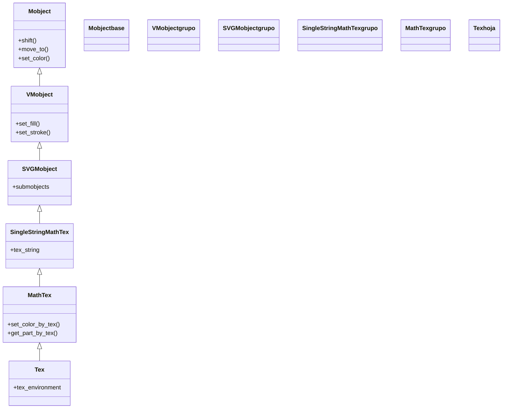

# Tex — texto LaTeX en modo texto (VMobject de texto)

`Tex` es el Mobject que renderiza **LaTeX en modo texto**: pensado para **párrafos, frases y palabras** compuestas con la tipografía de LaTeX, con la opción de intercalar matemáticas en línea usando `$...$`. Donde [[MathTex]] asume que **todo** es una fórmula (modo matemático), `Tex` asume que todo es **texto** y solo trata como matemáticas lo que pongas explícitamente entre signos de dólar: `Tex("El area es ", "$\\pi r^2$")`. Es la clase indicada para etiquetas, enunciados o cualquier rótulo que mezcle prosa y símbolos. Como `Tex` **hereda de** [[MathTex]], dispone de la misma maquinaria de **troceo en sub-partes** (pasar varias cadenas crea sub-mobjects indexables) y de los métodos `set_color_by_tex` / `get_part_by_tex`. Como cualquier [[concepto_mobject|Mobject]] no se "reproduce": se crea, se coloca y luego se **añade** (`self.add`) o se **anima** (`self.play(Write(...))`). Para texto sin ninguna pretensión tipográfica de LaTeX (y sin su dependencia), la alternativa es [[Text]] (Pango).

> [!important] Tex REQUIERE una instalacion de LaTeX en el sistema
> Igual que [[MathTex]], `Tex` compila su entrada con una distribución de **LaTeX** instalada en tu máquina (TeX Live en Linux/Mac, MiKTeX en Windows), más `dvisvgm` para vectorizar el resultado. Si LaTeX no está instalado, el render **falla con un error de compilación** y no se genera el vídeo. Para texto que no necesite LaTeX, usa [[Text]], que se apoya en Pango y no tiene esta dependencia.

## Importacion

```python
from manim import Tex
# o, como es habitual en Manim:
from manim import *
```

## Herencia

### La cadena

`Tex` hereda de [[MathTex]] (de quien toma todo el troceo en partes y el coloreado por contenido) y se diferencia solo en que **envuelve su entrada en un entorno de texto** en lugar de uno matemático. La cadena completa hasta `Mobject` muestra de dónde viene cada capa: el modo texto y los métodos de partes de `MathTex`, la compilación de una cadena de `SingleStringMathTex`, el SVG de `SVGMobject`, el relleno y trazo de `VMobject`, y la posición y escala de `Mobject`.



### Que hereda

`Tex` apenas aporta su propio comportamiento: cambia el modo a texto y hereda **todo** lo demás de [[MathTex]] y, más arriba, de [[Mobject]]. Por eso colorear, posicionar y trocear un `Tex` funciona exactamente igual que en `MathTex`.

| Capacidad | Método típico | Definido en |
|-----------|---------------|-------------|
| Troceo en sub-partes y coloreado por contenido | `set_color_by_tex`, `get_part_by_tex`, `formula[i]` | [[MathTex]] |
| Posición (relativa/absoluta) | `shift`, `move_to`, `next_to`, `to_edge` | [[Mobject]] |
| Escala y giro | `scale`, `rotate` | [[Mobject]] |
| Color global | `set_color`, `set_opacity` | [[Mobject]] |
| Relleno y trazo | `set_fill`, `set_stroke` | [[VMobject]] |

## Constructor

```python
Tex(
    *tex_strings,                 # una o varias cadenas; cada una sera una sub-parte
    arg_separator="",             # texto que se intercala entre cadenas (vacio, NO un espacio)
    tex_environment="center",     # entorno LaTeX en el que se envuelve el texto
    **kwargs,                     # se reenvian a MathTex: font_size, color, tex_to_color_map...
) -> Tex
```

### Parametros principales

| Parametro | Tipo | Defecto | Controla |
|-----------|------|---------|----------|
| `*tex_strings` | `str` | — | una o varias cadenas; **cada argumento es una sub-parte** indexable (igual que en [[MathTex]]) |
| `arg_separator` | `str` | `""` | el texto que se inserta **entre** cadenas; en `Tex` es **vacío** por defecto (no un espacio como en `MathTex`) |
| `tex_environment` | `str` | `"center"` | el entorno LaTeX que envuelve el contenido (`"center"`, `"flushleft"`, `"align*"`...) |

#### `arg_separator` — el cambio respecto a MathTex

Es la trampa más común al venir de [[MathTex]]: allí el separador por defecto es un espacio (`" "`), aquí es **cadena vacía** (`""`). Por eso `Tex("El area es ", "$\\pi r^2$")` deja el espacio que **tú** escribes al final de la primera cadena, sin añadir otro; si olvidas ese espacio, las dos partes saldrán pegadas (`El area es$\pi r^2$` -> `El area es πr²` sin separación). Si quieres separación automática entre todas las partes, pasa `arg_separator=" "`.

#### `tex_environment` — el entorno

Controla cómo se maqueta el bloque. `"center"` (el defecto) centra cada línea; `"flushleft"` lo alinea a la izquierda; `"align*"` permite ecuaciones alineadas por `&`. Para varias líneas, se usa `\\` dentro de la cadena como salto de línea de LaTeX.

### Parametros heredados de MathTex

Todo lo de [[MathTex]] sigue disponible vía `**kwargs`:

| Parametro | Tipo | Defecto | Controla |
|-----------|------|---------|----------|
| `font_size` | `float` | `48` | el tamaño del texto |
| `color` | `ManimColor` | `WHITE` | el color base de todo el bloque |
| `tex_to_color_map` | `dict` | `{}` | mapa `{subcadena: COLOR}` para colorear palabras al construir |

### Que construye

Devuelve un `Tex` (un VMobject) cuyos `submobjects` son las sub-partes en que se troceó la entrada, con el texto ya compuesto por LaTeX y vectorizado. Es **dibujable pero estático**: hay que añadirlo (`self.add`) o animarlo (`self.play(Write(...))`) para que aparezca.

## Tex vs MathTex — cual usar

La diferencia es **el modo en que LaTeX interpreta tu cadena**, y se nota en cómo tratas las matemáticas:

| | `Tex` (modo texto) | `MathTex` (modo matemático) |
|---|---|---|
| Modo LaTeX por defecto | **texto** (como prosa normal) | **matemático** (como dentro de `$...$`) |
| Para qué | párrafos, frases, rótulos, enunciados | fórmulas y expresiones matemáticas |
| Matemáticas en la cadena | hay que envolverlas en `$...$` | directas, **sin** `$...$` |
| `arg_separator` por defecto | `""` (vacío) | `" "` (un espacio) |
| Ejemplo típico | `Tex("El area vale ", "$\\pi r^2$")` | `MathTex(r"\pi r^2")` |

Regla mental: **si es una fórmula, [[MathTex]]; si es texto que puede llevar algo de matemáticas en línea, `Tex`; si no hay LaTeX de por medio, [[Text]]**.

## Metodos clave

`Tex` no añade métodos propios relevantes: usa los de [[MathTex]] para manejar partes y los de [[Mobject]]/[[VMobject]] para mover y colorear.

### Manejar las partes (heredados de MathTex)

| Metodo | Firma | Que hace |
|--------|-------|----------|
| `set_color_by_tex` | `texto.set_color_by_tex(tex, color)` | tiñe las sub-partes que contienen `tex` |
| `get_part_by_tex` | `texto.get_part_by_tex(tex)` | devuelve la sub-parte que contiene `tex` |
| `formula[i]` | indexado | la sub-parte número `i` (en el orden de los argumentos) |

## Ejemplo

### Version minima

Una frase con una fórmula **en línea** (entre `$...$`): el texto va en modo texto y solo `$\pi r^2$` se compone como matemáticas.

```python
from manim import *

class TextoMinimo(Scene):
    def construct(self):
        linea = Tex("El area del circulo es ", "$\\pi r^2$")
        self.play(Write(linea))
        self.wait()
```

```bash
manim -pql archivo.py TextoMinimo      # -p reproduce, -ql = calidad baja (rapido)
```

### Version completa

Combina texto y matemáticas, trocea el `Tex` en partes para colorear la fórmula en línea, y lo posiciona como un rótulo bajo una figura. Demuestra el modo texto, el `$...$` en línea y el troceo heredado de [[MathTex]].

```python
from manim import *

class RotuloConFormula(Scene):
    def construct(self):
        circulo = Circle(radius=1.5, color=BLUE, fill_opacity=0.4)

        # texto + math en linea, partido para colorear la formula:
        rotulo = Tex("Area: ", "$\\pi r^2$", font_size=48)
        rotulo[1].set_color(YELLOW)              # solo la formula, en amarillo
        rotulo.next_to(circulo, DOWN, buff=0.4)  # debajo del circulo

        self.play(Create(circulo))
        self.play(Write(rotulo))
        self.wait()
```

```bash
manim -pqh archivo.py RotuloConFormula     # -qh = calidad alta para el render final
```

### Variaciones

Dos usos frecuentes, cada uno en su mini-Scene.

Varias líneas con `\\` y alineación a la izquierda con `tex_environment`:

```python
from manim import *

class VariasLineas(Scene):
    def construct(self):
        parrafo = Tex(
            r"Primera linea \\ Segunda linea \\ Tercera linea",
            tex_environment="flushleft",
        )
        self.play(Write(parrafo))
        self.wait()
```

```bash
manim -pql archivo.py VariasLineas
```

Colorear palabras al construir con `tex_to_color_map` (heredado de [[MathTex]]):

```python
from manim import *

class PalabrasColoreadas(Scene):
    def construct(self):
        frase = Tex(
            "El gato y el perro",
            tex_to_color_map={"gato": YELLOW, "perro": RED},
        )
        self.play(Write(frase))
        self.wait()
```

```bash
manim -pql archivo.py PalabrasColoreadas
```

## Animarla

`Tex` es un Mobject de texto LaTeX, así que comparte las animaciones de [[MathTex]].

### Crear y escribir

| Animación | Qué hace |
|-----------|----------|
| `Write(texto)` | lo **escribe** trazo a trazo, como a mano; es la entrada natural del texto ([[Write]]) |
| `FadeIn(texto)` | lo hace aparecer con un fundido |
| `Create(texto)` | dibuja el contorno de los glifos |

```python
from manim import *

class EscribirTexto(Scene):
    def construct(self):
        self.play(Write(Tex("Hola, ", "$e^{i\\pi} = -1$")))
        self.wait()
```

```bash
manim -pql archivo.py EscribirTexto
```

### Transformar un texto en otro

Como hereda el troceo de [[MathTex]], también funciona con [[TransformMatchingTex]], que empareja las sub-partes con el mismo contenido entre dos `Tex` y solo anima lo que cambia.

```python
from manim import *

class CambiarRotulo(Scene):
    def construct(self):
        antes = Tex("Area", " ", "del circulo")
        despues = Tex("Area", " ", "del cuadrado")
        self.play(Write(antes))
        self.wait(0.5)
        self.play(TransformMatchingTex(antes, despues))  # "Area" se queda; cambia el resto
        self.wait()
```

```bash
manim -pql archivo.py CambiarRotulo
```

Para componer varias animaciones a la vez se usan los grupos de [[AnimationGroup]]/[[LaggedStart]]; el detalle de `run_time` y `rate_func` vive en [[concepto_animation]].

## Errores comunes

| Error | Causa | Solución |
|-------|-------|----------|
| El render falla con un error de compilación LaTeX | no hay LaTeX instalado, o sintaxis LaTeX inválida | instala TeX Live/MiKTeX; revisa llaves y comandos |
| Una fórmula sale como texto plano (letras separadas, sin símbolos) | olvidaste los `$...$` alrededor de la matemática | envuélvela: `Tex("vale ", "$x^2$")`, o usa [[MathTex]] si todo es fórmula |
| Dos partes salen pegadas sin espacio | `arg_separator` es `""` por defecto en `Tex` | añade el espacio al final de la cadena, o pasa `arg_separator=" "` |
| `\` produce errores o caracteres raros | la cadena no es *raw* y Python interpreta `\n`, `\f`... | usa cadenas *raw* (`r"..."`) o duplica las barras (`"\\pi"`) |
| El salto de línea `\n` no funciona | en LaTeX el salto de línea es `\\`, no `\n` | usa `\\` dentro de una cadena *raw*: `r"linea uno \\ linea dos"` |
| `NameError: name 'Tex' is not defined` | faltó el import | `from manim import *` al inicio |

## Notas relacionadas

- [[MathTex]] — la clase **padre** (modo matemático); `Tex` solo cambia el modo a texto y hereda el resto
- [[Text]] — texto sin LaTeX (Pango); úsalo cuando no haya matemáticas y no quieras la dependencia
- [[concepto_mobject]] — qué es un Mobject y el árbol de submobjects que permite el indexado
- [[Write]] — la animación natural para escribir el texto trazo a trazo
- [[TransformMatchingTex]] — transforma un texto en otro emparejando sus sub-partes
- [[posicionamiento]] — colocar el texto en la escena (`next_to`, `to_edge`, `shift`)
- [[estilo]] — color, relleno y trazo del texto
- [[Manim/mobjects/texto/index | texto]] — la carpeta de Mobjects de texto
