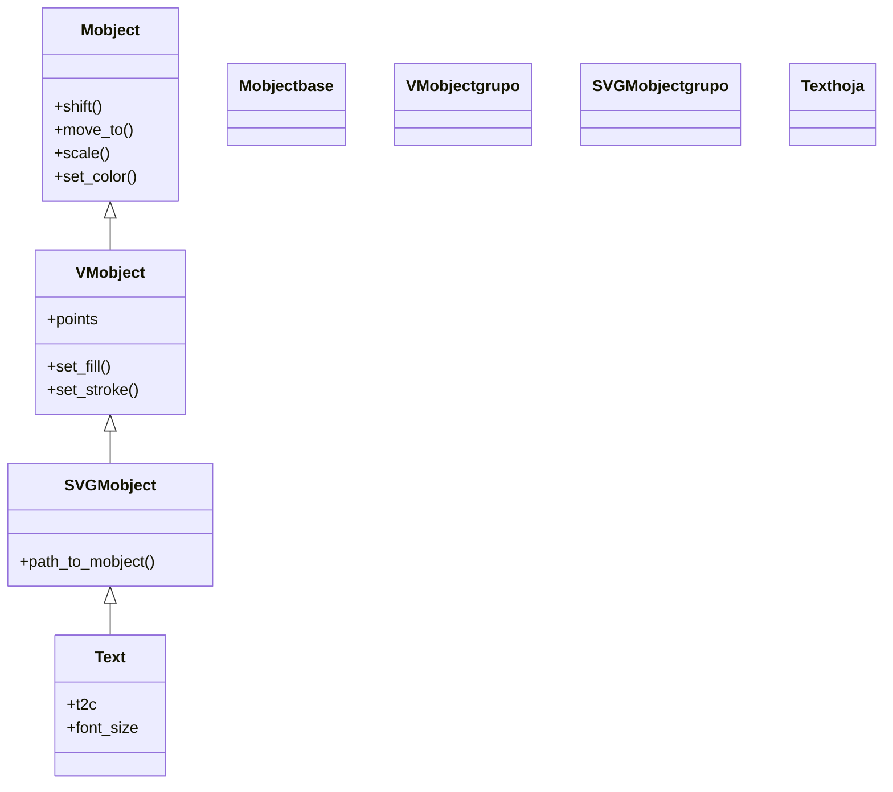

# Text — texto con fuentes del sistema (via Pango, sin LaTeX)

`Text` es el Mobject para escribir **texto normal** en una escena —un rótulo, una etiqueta de UI, un nombre, una leyenda— usando las **fuentes instaladas en el sistema**. Su gran ventaja frente a la familia LaTeX ([[MathTex]]/[[Tex]]) es que **NO necesita una instalación de LaTeX**: renderiza a través de **Pango** (la librería de tipografía de GNOME), así que funciona de inmediato con cualquier fuente que tengas (`Arial`, `Sans`, `DejaVu Serif`...). A cambio, no sabe componer fórmulas matemáticas: para eso está [[MathTex]]. Como cualquier [[concepto_mobject|Mobject]] vectorizado, un `Text` no se "reproduce" solo: se crea, se coloca y se **añade** (`self.add`) o se **anima** (lo habitual es [[Write]], que lo escribe trazo a trazo). Aporta además dos capacidades muy cómodas: **colorear palabras o trozos sueltos** sin partir el objeto (`t2c`, *text-to-color*) y **acceder a sus caracteres por índice** (`texto[0:4]`) para animarlos por separado.

## Importacion

```python
from manim import Text
# o, como es habitual en Manim:
from manim import *
```

## Herencia

### La cadena

`Text` cuelga de `SVGMobject`: por dentro, Pango convierte el texto en un dibujo vectorial (un SVG) y `SVGMobject` lo carga como curvas de Bézier. Por eso un `Text` es, a todos los efectos, un [[VMobject]] más: se colorea, se posiciona y se anima exactamente igual que un [[Circle]]. La cadena completa hasta `Mobject` deja claro de dónde sale cada capacidad.



### Que hereda

`Text` solo aporta la conversión de una cadena en glifos vectoriales (y los atajos de color/peso por trozos); **todo lo demás lo hereda**. Colorear y posicionar un `Text` es idéntico a hacerlo con cualquier otra figura.

| Capacidad | Método típico | Definido en |
|-----------|---------------|-------------|
| Posición (relativa/absoluta) | `shift`, `move_to`, `next_to`, `to_edge` | [[Mobject]] |
| Escala y giro | `scale`, `rotate` | [[Mobject]] |
| Color global | `set_color`, `set_opacity` | [[Mobject]] |
| Relleno y trazo | `set_fill`, `set_stroke` | [[VMobject]] |
| Cada carácter es un submobject | indexado `texto[i]`, `texto[a:b]` | [[VMobject]] (familia de hijos) |

Cada glifo del texto es un **submobject** independiente, por eso `texto[0]` es la primera letra y puedes animar letras sueltas. El posicionamiento usa las constantes de [[posicionamiento]] (`UP`, `LEFT`, `ORIGIN`...).

## Constructor

```python
Text(
    text: str,                       # la cadena a mostrar
    font_size: float = 48,           # tamano de la fuente (en puntos)
    color: ManimColor = WHITE,       # color base del texto
    font: str = "",                  # fuente del sistema ("" = la por defecto)
    weight: str = NORMAL,            # grosor: NORMAL | BOLD | ...
    slant: str = NORMAL,             # inclinacion: NORMAL | ITALIC | OBLIQUE
    t2c: dict = {},                  # text-to-color: {"palabra": COLOR}
    t2w: dict = {},                  # text-to-weight: {"palabra": BOLD}
    gradient: tuple = None,          # degradado (color_inicial, color_final)
    **kwargs,                        # se reenvian a SVGMobject/VMobject
) -> Text
```

### Parametros principales

| Parametro | Tipo | Defecto | Controla |
|-----------|------|---------|----------|
| `text` | `str` | — | la cadena que se dibuja; acepta tildes y ñ sin problema (es Unicode) |
| `font_size` | `float` | `48` | el tamaño de la fuente en puntos; sube/baja todo el rótulo |
| `color` | `ManimColor` | `WHITE` | el color base de todo el texto (constantes en MAYÚSCULAS: `RED`, `BLUE`...) |
| `font` | `str` | `""` | el nombre de una fuente **instalada en el sistema** (`"Arial"`, `"DejaVu Serif"`); `""` usa la por defecto |
| `weight` | `str` | `NORMAL` | el grosor del trazo: `BOLD` para negrita |
| `slant` | `str` | `NORMAL` | la inclinación: `ITALIC` para cursiva |
| `**kwargs` | — | — | se pasan a `SVGMobject`/[[VMobject]]: `fill_opacity`, `stroke_width`... |

#### t2c — colorear palabras o trozos (text-to-color)

El parámetro estrella de `Text`: un diccionario que **colorea trozos de la cadena sin partir el objeto a mano**. Las claves pueden ser **subcadenas** (`{"hola": RED}` tiñe la palabra "hola") o **rangos por índice** con la sintaxis `"[a:b]"` (`{"[0:4]": YELLOW}` tiñe los cuatro primeros caracteres). Es la forma idiomática de resaltar palabras en un rótulo.

```python
# colorea las palabras "rojo" y "azul" dentro de la frase:
t = Text("texto rojo y azul", t2c={"rojo": RED, "azul": BLUE})
```

#### t2w y gradient — peso por trozos y degradado

`t2w` (*text-to-weight*) es el gemelo de `t2c` pero para el **grosor**: `t2w={"importante": BOLD}` pone en negrita solo esa palabra. `gradient` aplica un **degradado** de color a lo largo de todo el texto pasándole una tupla de colores: `gradient=(BLUE, GREEN, YELLOW)` lo tiñe del primero al último.

### Que construye

Devuelve un `Text` (un VMobject) cuyos `submobjects` son los **glifos** del texto, ya posicionados como una línea (o varias, si la cadena lleva `\n`), centrada por defecto en el `ORIGIN`. Es un objeto **dibujable pero estático**: hay que añadirlo (`self.add`) o animarlo (`self.play(Write(...))`) para que aparezca.

## Metodos clave

Casi todo lo que se le hace a un `Text` son métodos heredados de [[Mobject]]/[[VMobject]] (mover, colorear, escalar): para esos, remitir a [[posicionamiento]] y [[estilo]]. Lo característico de `Text` es el **indexado por carácter**, que permite tratar letras o trozos como sub-objetos.

### Acceso por indice (cada caracter es un submobject)

| Expresión | Devuelve | Para que |
|-----------|----------|----------|
| `texto[0]` | el primer glifo | colorear o animar una sola letra |
| `texto[0:4]` | los cuatro primeros glifos (un sub-grupo) | resaltar o transformar un trozo |
| `texto[-1]` | el último glifo | anclar algo al final del rótulo |

```python
t = Text("Manim")
t[0:1].set_color(RED)     # tine solo la "M"
```

> [!nota] El índice cuenta glifos, no necesariamente caracteres de la cadena
> Los espacios no producen glifo, y algunas fuentes combinan signos; cuando un rango por índice no caiga donde esperas, prefiere `t2c` con la **subcadena** (`t2c={"Man": RED}`), que empareja por texto y es más robusto.

## Ejemplo

### Version minima

Un rótulo simple que se escribe trazo a trazo con [[Write]] y se queda en pantalla.

```python
from manim import *

class RotuloMinimo(Scene):
    def construct(self):
        t = Text("Hola, Manim", font_size=60, color=BLUE)
        self.play(Write(t))
        self.wait()
```

```bash
manim -pql archivo.py RotuloMinimo      # -p reproduce, -ql = calidad baja (rapido)
```

### Version completa

Un rótulo realista que combina varias capacidades propias de `Text`: palabras coloreadas con `t2c`, una palabra en negrita con `t2w`, posicionado con `to_edge`, y una letra suelta animada por su índice.

```python
from manim import *

class RotuloCompleto(Scene):
    def construct(self):
        titulo = Text(
            "Animacion con Manim",
            font_size=54,
            t2c={"Manim": YELLOW},      # colorea solo la palabra "Manim"
            t2w={"Animacion": BOLD},    # pone "Animacion" en negrita
        ).to_edge(UP)

        self.play(Write(titulo))                       # se escribe trazo a trazo
        self.play(titulo[-5:].animate.set_color(RED))  # tine las ultimas letras
        self.wait()
```

```bash
manim -pqh archivo.py RotuloCompleto     # -qh = calidad alta para el render final
```

### Variaciones

Las opciones de estilo más útiles, cada una en su mini-escena.

Texto en negrita y cursiva con `weight` y `slant`:

```python
from manim import *

class TextoEstilo(Scene):
    def construct(self):
        t = Text("negrita e italica", weight=BOLD, slant=ITALIC, font_size=48)
        self.play(Write(t))
        self.wait()
```

```bash
manim -pql archivo.py TextoEstilo
```

Texto con un degradado de color de extremo a extremo con `gradient`:

```python
from manim import *

class TextoGradiente(Scene):
    def construct(self):
        t = Text("degradado", font_size=96, gradient=(BLUE, GREEN, YELLOW))
        self.play(Write(t))
        self.wait()
```

```bash
manim -pql archivo.py TextoGradiente
```

## Errores comunes

| Error | Causa | Solución |
|-------|-------|----------|
| La fórmula matemática se ve "plana" (no hay superíndices, fracciones...) | `Text` NO compone matemáticas, solo dibuja la cadena literal | usa [[MathTex]] (modo matemático) o [[Tex]] (texto + math) |
| `font="MiFuente"` no cambia nada | esa fuente **no está instalada** en el sistema | usa una fuente instalada; lista las disponibles o deja `font=""` |
| Un rango `texto[a:b]` no tiñe lo que esperabas | el índice cuenta **glifos**, no caracteres de la cadena (espacios, ligaduras) | usa `t2c` con la subcadena: `t2c={"palabra": COLOR}` |
| Aparece de golpe en vez de escribirse | usaste `self.add(texto)` (instantáneo) | anímalo con `self.play(Write(texto))` |
| Tarda mucho o falla al renderizar mucho texto | cada glifo es un submobject; textos enormes son pesados | parte el texto o usa [[MarkupText]] para formato fino |
| `NameError: name 'Text' is not defined` | faltó el import | `from manim import *` al inicio |

## Notas relacionadas

- [[MarkupText]] — como `Text` pero con etiquetas de formato de Pango (negrita, color por trozos) sin partir a mano
- [[MathTex]] — para **fórmulas** matemáticas (requiere LaTeX); la alternativa cuando `Text` no basta
- [[Tex]] — texto en prosa con fragmentos matemáticos en línea (requiere LaTeX)
- [[Write]] — la animación habitual para hacer aparecer un `Text` trazo a trazo
- [[concepto_mobject]] — qué es un Mobject y los métodos que todos comparten
- [[posicionamiento]] — colocar el rótulo (`to_edge`, `next_to`, `shift`)
- [[Manim/mobjects/texto/index | texto]] — la carpeta de texto y las dos familias (Pango y LaTeX)
