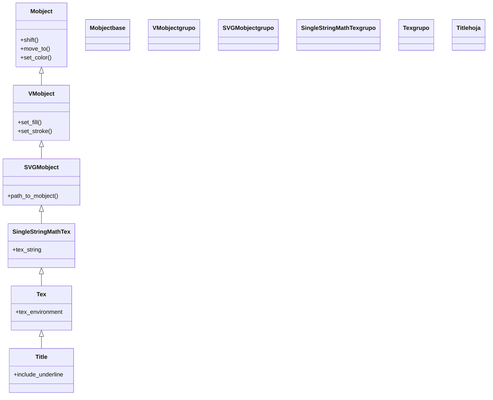

# Title — un titulo LaTeX con linea de subrayado

`Title` es un Mobject de conveniencia para poner un **título** a una escena: compone el texto y le añade automáticamente una **línea de subrayado** del ancho del texto justo debajo, el típico encabezado de una lámina. Es, en esencia, un [[Tex]] (texto LaTeX) ya estilizado como título y con el subrayado incluido. **OJO: hereda de [[Tex]], así que REQUIERE una instalación de LaTeX** (a diferencia de [[Text]]/[[MarkupText]], que renderizan via Pango sin LaTeX). Por eso, si solo quieres un rótulo y no tienes LaTeX, un `Text(...).to_edge(UP)` puede bastar; `Title` tiene sentido cuando ya estás trabajando con LaTeX en la escena (fórmulas, prosa matemática) y quieres un encabezado coherente con ese tipo de letra. Suele colocarse en la parte superior con `to_edge(UP)`.

## Importacion

```python
from manim import Title
# o, como es habitual en Manim:
from manim import *
```

## Herencia

### La cadena

`Title` cuelga de [[Tex]], que a su vez es un `SingleStringMathTex` (un trozo de LaTeX renderizado) y termina, como todo, en `Mobject`. Heredar de `Tex` es lo que le da el motor de LaTeX —y también el **requisito** de tenerlo instalado—. El subrayado es un [[Line]] que `Title` añade como submobject sobre esa base.



### Que hereda

`Title` solo aporta el estilo de título y el subrayado; el renderizado de LaTeX y todo lo demás lo hereda.

| Capacidad | Método típico | Definido en |
|-----------|---------------|-------------|
| Renderizado de LaTeX | composición del `tex_string` | [[Tex]] / `SingleStringMathTex` |
| Posición y escala | `shift`, `move_to`, `to_edge`, `scale` | [[Mobject]] |
| Color global | `set_color`, `set_opacity` | [[Mobject]] |
| Relleno y trazo | `set_fill`, `set_stroke` | [[VMobject]] |

## Constructor

```python
Title(
    *text_parts: str,                # uno o varios trozos LaTeX que forman el titulo
    include_underline: bool = True,  # dibujar la linea de subrayado debajo
    match_underline_width_to_text: bool = False,  # ancho del subrayado = ancho del texto
    underline_buff: float = MED_SMALL_BUFF,       # separacion texto-subrayado
    **kwargs,                        # se reenvian a Tex (color, font_size...)
) -> Title
```

### Parametros principales

| Parametro | Tipo | Defecto | Controla |
|-----------|------|---------|----------|
| `*text_parts` | `str` | — | uno o varios trozos de **LaTeX** que, concatenados, forman el título |
| `include_underline` | `bool` | `True` | si se dibuja (o no) la línea de subrayado bajo el texto |
| `match_underline_width_to_text` | `bool` | `False` | si `True`, el subrayado mide lo que el texto; si `False`, ocupa el ancho del marco |
| `underline_buff` | `float` | `MED_SMALL_BUFF` | la distancia vertical entre el texto y el subrayado |
| `**kwargs` | — | — | se pasan a [[Tex]]: `color`, `font_size`, `tex_template`... |

#### include_underline y el ancho del subrayado

Por defecto el subrayado se extiende a lo ancho del marco; con `match_underline_width_to_text=True` se ciñe al ancho del texto, que suele quedar más limpio para títulos cortos. Para un título **sin** raya, basta `include_underline=False`.

```python
# titulo sin subrayado, cenido y rojo:
t = Title("Resumen", include_underline=False, color=RED)
```

### Que construye

Devuelve un `Title` (un VMobject) que agrupa **el texto LaTeX y, opcionalmente, la línea de subrayado** como submobjects, ya colocado en la parte superior del marco. Como cualquier Mobject, hay que **añadirlo o animarlo** para que aparezca; lo habitual es escribirlo con [[Write]].

## Metodos clave

`Title` no añade métodos propios de interés: se posiciona, colorea y anima como cualquier [[Tex]]/[[Mobject]] (ver [[posicionamiento]] y [[estilo]]). Por defecto ya nace arriba, pero suele reafirmarse con `.to_edge(UP)`.

## Ejemplo

### Version minima

Un título en la parte superior de la escena, escrito trazo a trazo. Requiere LaTeX instalado.

```python
from manim import *

class TituloMinimo(Scene):
    def construct(self):
        titulo = Title("Teorema de Pitagoras")
        self.play(Write(titulo))
        self.wait()
```

```bash
manim -pql archivo.py TituloMinimo      # -p reproduce, -ql = calidad baja (rapido)
```

### Version completa

Un título con LaTeX matemático en línea y subrayado ceñido al texto, sobre el que luego aparece el contenido de la lámina. Muestra el uso típico: encabezado arriba, cuerpo debajo. Requiere LaTeX.

```python
from manim import *

class LaminaConTitulo(Scene):
    def construct(self):
        titulo = Title(
            "La identidad de Euler: $e^{i\\pi}+1=0$",
            match_underline_width_to_text=True,
        )
        formula = MathTex("e^{i\\pi} + 1 = 0").scale(2)

        self.play(Write(titulo))            # 1. aparece el encabezado
        self.play(FadeIn(formula, shift=UP))  # 2. el cuerpo de la lamina
        self.wait()
```

```bash
manim -pqh archivo.py LaminaConTitulo     # -qh = calidad alta para el render final
```

## Errores comunes

| Error | Causa | Solución |
|-------|-------|----------|
| `LaTeX Error` / no renderiza nada | `Title` **requiere LaTeX** (hereda de [[Tex]]) y no está instalado | instala una distribución LaTeX, o usa `Text(...).to_edge(UP)` si no necesitas math |
| El subrayado es demasiado ancho | por defecto ocupa el ancho del marco | pon `match_underline_width_to_text=True` |
| No quiero la raya de subrayado | está activada por defecto | `include_underline=False` |
| Un carácter LaTeX (`%`, `_`, `&`) rompe el render | son caracteres especiales de LaTeX | escápalos (`\%`, `\_`, `\&`) en la cadena |
| Aparece de golpe | usaste `self.add` (instantáneo) | anímalo con `self.play(Write(...))` |
| `NameError: name 'Title' is not defined` | faltó el import | `from manim import *` al inicio |

## Notas relacionadas

- [[Tex]] — la clase padre: texto LaTeX (prosa + math en línea); `Title` es un `Tex` con estilo de encabezado
- [[MathTex]] — para el cuerpo matemático de la lámina (fórmulas), también LaTeX
- [[Text]] — la alternativa **sin LaTeX** para un rótulo de encabezado (`Text(...).to_edge(UP)`)
- [[Write]] — la animación habitual para hacer aparecer el título
- [[concepto_mobject]] — qué es un Mobject y los métodos que todos comparten
- [[posicionamiento]] — colocar el título (`to_edge(UP)`)
- [[Manim/mobjects/texto/index | texto]] — la carpeta de texto y las dos familias (Pango y LaTeX)
